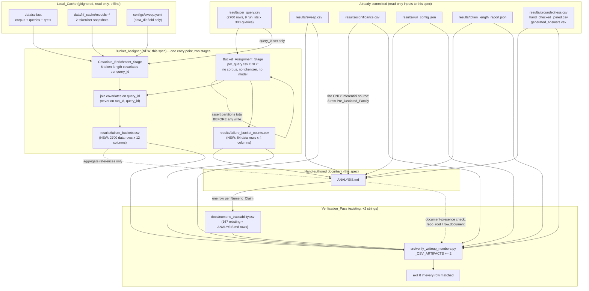
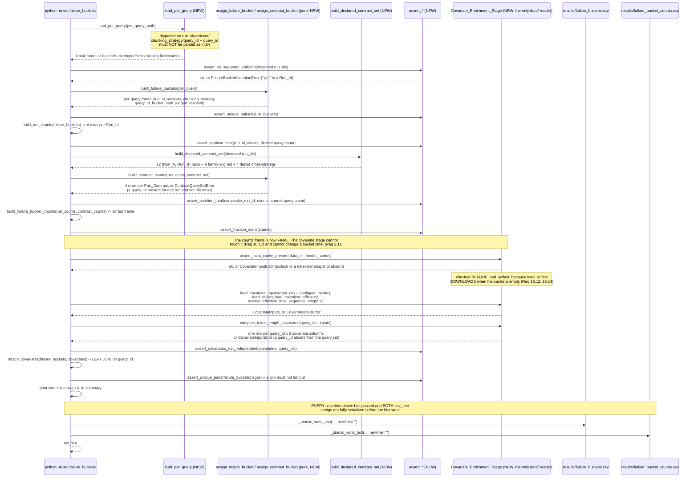

# Design Document: Analysis Writeup

## Overview

This design covers three things, all in service of `requirements.md`'s
16 requirements:

1. **One new module** — `src/failure_buckets.py` (the Bucket_Assigner) —
   with **two separately specified stages behind one entry point**:

   - the **Bucket_Assignment_Stage**, which reads the committed
     `results/per_query.csv` and nothing else, and applies the fixed
     Failure_Bucket and Contrast_Bucket taxonomies declared in this
     document (Requirements 2.1, 3, 4);
   - the **Covariate_Enrichment_Stage**, which loads the
     already-cached BEIR SciFact corpus, its Qrels, and each
     Dense_Model's tokenizer from `data/`, read-only and offline, and
     computes the six per-query Token_Length_Covariate columns
     (Requirements 2.8, 16).

   Both stages complete, and both artifacts are fully serialized,
   before the first byte is written. The module then writes two new
   committed artifacts: `results/failure_buckets.csv` (one row per
   (Run_Id, `query_id`), carrying the bucket label **and** the six
   covariate columns) and `results/failure_bucket_counts.csv` (one row
   per (`run_id`, `bucket`)). This is the only new *code* this spec
   introduces (Requirement 2), plus its test module
   `tests/test_failure_buckets.py` (Requirement 15).

   **The two-stage split is the whole point of the module's shape.** The
   taxonomy is corpus-free, model-free and tokenizer-free — not by
   convention but structurally, because the stage that assigns a bucket
   is handed a frame and never handed a corpus, a tokenizer, or a limit
   (Requirement 2.1). The covariates are *not* corpus-free, and are
   confined to the other stage. Nothing in the assignment stage can
   observe a token count, so no bucket label can depend on one.
2. **One hand-authored markdown document at the repository root** —
   `ANALYSIS.md` (Requirement 1.1) — the mechanism / failure-bucket
   analysis named in `.kiro/steering/structure.md`'s definition of
   done. Every Numeric_Claim in it is read from a committed artifact:
   the two new ones above, or one of `results/sweep.csv`,
   `results/per_query.csv`, `results/significance.csv`,
   `results/run_config.json`, `results/token_length_report.json`,
   `results/groundedness.csv`, `results/hand_checked_joined.csv`, and
   `results/generated_answers.csv` (Requirement 9.2).
3. **A two-string extension of the existing Verification_Pass**
   (Requirement 8) — `failure_buckets.csv` and
   `failure_bucket_counts.csv` appended to
   `src/verify_writeup_numbers.py`'s `_CSV_ARTIFACTS` tuple, plus a
   docstring and an argparse `description` that name `ANALYSIS.md` —
   together with the new `docs/numeric_traceability.csv` rows whose
   `document` value is `ANALYSIS.md` (Requirement 9). No resolver
   function changes, no new `_ALLOWED_COMPUTATIONS` member, no document
   allowlist (Requirement 8.2, 8.5).

The design is organized around one constraint that shapes everything
else: **the failure partition must be reproducible from a committed
artifact by committed code, on a clean checkout, with no corpus, no
model, and no network** (Requirements 2.1, 2.2, 15.6). That is why the
Bucket_Assignment_Stage's only input is `results/per_query.csv` — a
2,701-line committed CSV — rather than the SciFact corpus, the qrels, or
a re-scored ranked list. It is why the taxonomy is a set of module-level
constants rather than a `configs/` entry (Requirement 3.4). And it is
why the counts artifact exists at all: the existing Verifier's
`_resolve_csv_reference` errors when a row selector matches anything
other than exactly one row, so a bucket *count* needs its own one-row
home before `ANALYSIS.md` can cite it (Requirement 7.4).

The Covariate_Enrichment_Stage is the one deliberate exception, and its
boundary is drawn tightly rather than loosely. It reads `data/`
read-only and offline; it downloads nothing; it never reaches the
network; it runs CPU-only; and it produces *committed columns*, so that
everything downstream of it — `ANALYSIS.md`, the Traceability_Ledger,
the Verification_Pass, and the whole test suite — stays corpus-free,
model-free and `data/`-free by reading a committed CSV instead
(Requirements 15.10, 15.11, 16.11, 16.12). A clean checkout can still
regenerate `results/failure_bucket_counts.csv` byte-identically and
still verify every number in `ANALYSIS.md`; what a clean checkout cannot
do is regenerate the six covariate columns, because those need the
gitignored cache. That asymmetry is the price of having a query-level
truncation receipt at all, and it is paid once, in one stage, rather
than spread across the module.

### What is new, what is edited, what is strictly read-only

**New (created by this spec):**

| Path | Kind | Requirement |
|---|---|---|
| `src/failure_buckets.py` | new module + CLI entry point, both stages | 2.3, 2.8, 16 |
| `tests/test_failure_buckets.py` | new test module | 15.1–15.11 |
| `results/failure_buckets.csv` | new committed artifact (12 columns: bucket + 6 covariates) | 1.2, 6, 16 |
| `results/failure_bucket_counts.csv` | new committed artifact | 1.2, 7 |
| `ANALYSIS.md` | new documentation deliverable (repo root) | 1.1 |
| `docs/numeric_traceability.csv` rows | appended rows, `document == "ANALYSIS.md"` | 9.1, 9.4 |

**Edited (minimally):**

| Path | Edit | Requirement |
|---|---|---|
| `src/errors.py` | five new exception classes appended (`FailureBucketInputError`, `CovariateInputError`, `ContrastQuerySetError`, `FailureBucketAssertionError`, `FailureBucketWriteError`), no existing class touched — see "the folding rule" in Components and Interfaces for which candidate types were merged away and why | 2.5, 4.6, 5.5, 7.6, 16.13, 16.15 |
| `src/verify_writeup_numbers.py` | two strings appended to `_CSV_ARTIFACTS`; module-docstring first paragraph and argparse `description` reworded to name `ANALYSIS.md` | 8.1, 8.3, 8.4 |
| `README.md` **or** `SPEC.md` | one edit whose sole effect is to reference `ANALYSIS.md` by filename (e.g. extending README.md's existing "See `SPEC.md` for the full design and threats to validity" pointer) | 1.4 |
| `docs/numeric_traceability.csv` | append-only; the existing 167 rows keep their content and relative order | 9.4 |

**Strictly read-only (opened for reading only, never written, never
regenerated, byte-for-byte unchanged):**

`results/per_query.csv`, `results/sweep.csv`,
`results/significance.csv`, `results/run_config.json`,
`results/token_length_report.json`, `results/groundedness.csv`,
`results/generated_answers.csv`, `results/hand_checked_sample.csv`,
`results/hand_checked_joined.csv`,
`results/hand_checked_sample_context.md`, `configs/sweep.yaml`,
`configs/significance.yaml`, `configs/groundedness.yaml`,
`docs/claim_assertion_classification.csv`,
`.github/workflows/ci.yml`, and everything under `data/`
(Requirements 1.3, 1.7, 15.7).

Two of those entries need their access pattern stated precisely,
because the Covariate_Enrichment_Stage changes it from "never opened"
to "opened for reading":

- **`configs/sweep.yaml` is now read**, by `load_sweep_config`, for one
  field: `data_dir` (Requirement 16.10). Nothing else in it is
  consulted. It supplies a cache path, never a predicate, a threshold,
  a bucket name, or a sequence-length limit — Requirement 3.4 keeps the
  taxonomy in source and Requirement 16.6 keeps each limit in the
  model's own cached configuration. It is never written.
  `configs/significance.yaml` and `configs/groundedness.yaml` remain
  unread as well as unwritten.
- **`data/` is now read, read-only and offline.** The
  Covariate_Enrichment_Stage opens `data/scifact` (through
  `load_scifact`) and the two tokenizer snapshot directories under
  `data/hf_cache` (through `load_tokenizer_offline`). It writes nothing
  under `data/`, downloads nothing into it, and — because of the
  pre-flight presence check below — fails rather than populating it.
  The **tests** still read nothing under `data/` and load no real
  corpus, tokenizer or model (Requirements 15.6, 15.10), and the
  **Verification_Pass** still reads nothing under `data/` either
  (Requirement 15.11).

Nothing in this design *modifies* `src/corpus_loader.py`,
`src/metrics.py`, `src/config.py`, `src/token_length_analysis.py`,
`src/sweep_runner.py`, `src/significance.py`, `src/chunking.py`,
`src/per_query_report.py`, any module under `src/retrievers/`, or any of
the groundedness-gate modules. `src/failure_buckets.py` *imports* from
several of them — every covariate primitive is reused rather than
reimplemented (see "Reuse, not reimplementation" below) — and modifies
none of them.

### Deviation from `.kiro/steering/structure.md`, recorded deliberately

`structure.md` says "the failure bucket is a column in
`results/sweep.csv`". This design does not put it there.
`results/sweep.csv` is keyed by (`run_id`, `k`) and holds 36 rows with
no per-query dimension; a per-query label has no home in one of those
rows without either collapsing 300 labels into one cell or multiplying
the file by the query count — and Requirement 1.3 forbids editing
`results/sweep.csv` at all. The property `structure.md` is protecting —
that the failure analysis is reproducible from a committed artifact
rather than from ad hoc notes — is satisfied more directly here,
because the partition itself becomes a committed artifact with its own
schema, its own writer, and its own tests. `ANALYSIS.md` states this
deviation and its reason in prose (Requirement 1.6), so a reader
comparing the repo against its own steering documents finds the
discrepancy explained rather than unremarked.

### Descriptive-only discipline

Every contrast this spec introduces — every Failure_Bucket count,
every Contrast_Bucket count, every fraction, every
Judged_Relevant_Count description, and every Token_Length_Covariate
description — is **descriptive**. The complete
set of inferential results available to `ANALYSIS.md` is the
Pre_Declared_Family: the 8 rows of `results/significance.csv` whose
`metric` is `ndcg_at_10` and whose `is_primary` is true, already
Holm-Bonferroni-corrected by the significance-testing spec. This
design introduces no p-value, no confidence interval, no test
statistic, and no correction — not because none could be computed, but
because computing one after seeing the bucket counts would be a
post-hoc test outside the pre-declared family, which
`.kiro/steering/evaluation-integrity.md` and Requirement 12.3 both
forbid. The Bucket_Assigner has no statistical function in it at all;
that absence is the enforcement mechanism.

**The covariate columns do not relax this by one inch.** Requirements
11.2 and 12.9 together mean a covariate column licenses a *description*
of a set of queries and never a *mechanism* for a comparison the study
could not distinguish from noise. The four comparisons whose
Pre_Declared_Family `verdict` is `indistinguishable` — the three
`all-MiniLM-L6-v2` runs and `bm25__fixed_window`, each against the
Reference_Run — are exactly as unexplainable with the covariates present
as they were without them. This is stated again, at length, under
"Design decisions and rationale", because it is the one place where a
new capability could quietly erode an existing prohibition.

## Architecture

### Module layout

```
configs/
  sweep.yaml                        # unchanged; READ for its `data_dir`
                                     #   field only, via load_sweep_config
                                     #   (Req 16.10). Supplies a cache path,
                                     #   never a predicate/threshold/limit.
  significance.yaml                 # unchanged, and NOT read by this spec
  groundedness.yaml                 # unchanged, and NOT read by this spec

docs/
  PROJECT_BRIEF.md                  # unchanged
  numeric_traceability.csv          # APPEND-ONLY: gains ANALYSIS.md rows
                                     # after the existing 167 (Req 9.1, 9.4)
  claim_assertion_classification.csv # unchanged

src/
  __init__.py
  errors.py                         # gains 5 new exception classes (append-only)
  config.py                         # unchanged; REUSED (load_sweep_config,
                                     #   for data_dir only -- Req 16.10)
  seeding.py                        # unchanged, not imported (Req 2.7, 16.16:
                                     #   no RNG and no seed anywhere here)
  corpus_loader.py                  # unchanged; REUSED (configure_caches,
                                     #   load_scifact -- Req 16.10, 16.12)
  metrics.py                        # unchanged; REUSED (judged_relevant_docs
                                     #   -- Req 16.7)
  report.py                         # unchanged; REUSED (_atomic_write_text,
                                     #   MISSING -- Req 6.8, 16.8)
  per_query_report.py               # unchanged, not imported (the schema it
                                     #   writes is this spec's input, read from
                                     #   the committed CSV, not from the module)
  significance.py                   # unchanged, not imported
  sweep_runner.py                   # unchanged, not imported
  chunking.py                       # unchanged, not imported directly (pulled
                                     #   in transitively by token_length_analysis)
  token_length_analysis.py          # unchanged; REUSED, lazily
                                     #   (load_tokenizer_offline,
                                     #   resolve_effective_max_sequence_length,
                                     #   count_tokens -- Req 16.4, 16.6, 16.11)
  retrievers/dense_retriever.py     # unchanged; REUSED, lazily
                                     #   (format_document_text -- Req 16.5)
  failure_buckets.py                # NEW: Bucket_Assigner entry point, both
                                     #   stages (Req 2-7, 16)
  verify_writeup_numbers.py         # EDITED: +2 _CSV_ARTIFACTS entries,
                                     #   docstring + argparse description
                                     #   (Req 8.1, 8.3, 8.4). No other change.
  groundedness_*.py, judge_model.py, generator_model.py,
  claim_segmenter.py, quarantine_rule.py, hand_checked_*.py,
  retrieval_replay.py, claim_assertion_classification.py,
  significance_config.py, retrievers/                 # all unchanged, none imported

tests/
  test_metrics.py                   # unchanged
  test_orchestration.py             # unchanged
  test_data_layer.py                # unchanged
  test_significance.py              # unchanged
  test_chunking.py                  # unchanged
  test_claim_segmenter.py           # unchanged
  test_quarantine_rule.py           # unchanged
  test_token_length_analysis.py     # unchanged
  test_verify_writeup_numbers.py    # unchanged (it pins the ten Verifier
                                     #   functions Req 8.2 requires unchanged)
  test_failure_buckets.py           # NEW (Req 15.1-15.11). Stub corpus, stub
                                     #   qrels, stub tokenizer -- no real
                                     #   model, no data/ read, no new
                                     #   skip-gated test (Req 15.10)

results/
  sweep.csv                         # unchanged (read-only)
  per_query.csv                     # unchanged (read-only) -- the ONLY input
  significance.csv                  # unchanged (read-only)
  run_config.json                   # unchanged (read-only, NOT merged into)
  token_length_report.json          # unchanged (read-only)
  groundedness.csv                  # unchanged (read-only)
  generated_answers.csv             # unchanged (read-only)
  hand_checked_sample.csv           # unchanged (read-only)
  hand_checked_joined.csv           # unchanged (read-only)
  hand_checked_sample_context.md    # unchanged (read-only)
  failure_buckets.csv               # NEW artifact, 12 columns: the bucket
                                     #   label plus the 6 Token_Length_Covariate
                                     #   columns (Req 6, 16) -- NOT a third file
  failure_bucket_counts.csv         # NEW artifact, 4 columns, unchanged by the
                                     #   covariate stage (Req 7, 16.17)

ANALYSIS.md                          # NEW deliverable (repo root, Req 1.1)
README.md                            # one filename reference added (Req 1.4)
SPEC.md                              # unchanged, or the same one-line pointer

.github/workflows/ci.yml             # unchanged (Req 15.7)
data/                                # unchanged, and never written; READ
  scifact/                            #   read-only by the covariate stage,
  hf_cache/                           #   offline, after a pre-flight presence
    models--sentence-transformers--all-MiniLM-L6-v2/   #   check (Req 16.12)
    models--BAAI--bge-small-en-v1.5/
```

All four of those `data/` paths were confirmed present in this working
tree before this design was written; the pre-flight check below tests
exactly them.

Note the absence of a `run_config.json` merge. Both the
significance-testing and groundedness-gate specs merged a sibling key
into `results/run_config.json` to record their own configuration.
This spec has no configuration to record — no seed (Requirements 2.7,
16.16), no threshold, and no sampling parameter. The one thing it does
read from a config file is `configs/sweep.yaml`'s `data_dir`, which is
a *path to a cache*, not a parameter that could change a number: point
it at a different populated cache and the covariates are identical,
point it at an empty one and the run fails rather than producing a
different answer. So Requirement 1.3's "byte-for-byte identical" applies
to `run_config.json` without exception, and the module contains no merge
path at all.

### Component diagram



`results/per_query.csv` is the Bucket_Assignment_Stage's only input, and
the only thing the Covariate_Enrichment_Stage takes from it is the set of
`query_id` values whose covariates to compute — no metric, no bucket, no
`run_id` crosses from the assignment stage into the covariate stage or
back. It is also the only artifact from which any per-query metric
quantity in `ANALYSIS.md` derives — and it derives through the two new
artifacts, not directly, so a bucket count has exactly one committed home
and exactly one selector that reaches it. `ANALYSIS.md` never recomputes
a statistic `results/significance.csv` already holds (Requirement 12.4),
and never computes a token count that
`results/failure_buckets.csv` does not already carry (Requirements 1.8,
13.1).

Note what the diagram does **not** contain: no arrow from `data/`, from a
tokenizer, or from `configs/sweep.yaml` reaches the
Bucket_Assignment_Stage, and no arrow from the Covariate_Enrichment_Stage
reaches `results/failure_bucket_counts.csv`. The first absence is
Requirement 2.1's corpus-free taxonomy; the second is Requirement
16.17's untouched four-column counts schema. Both are visible in the
call graph rather than promised in prose.

### Sequence: one Bucket_Assigner run



The ordering in that diagram is load-bearing, not incidental. Every
validation — including all four of the covariate stage's Requirement
16.13 conditions — and both serializations complete before the first
`_atomic_write_text` call, which is what makes Requirements 2.5, 4.6,
5.5, 7.6 and 16.13's shared "SHALL write neither report" clause true by
construction rather than by careful cleanup after the fact. **The
covariate stage was placed after the counts frame is final and before
the first write specifically to preserve that guarantee**: a missing
`data/scifact` now halts a run that had already computed a valid
partition, having written nothing, rather than leaving
`results/failure_bucket_counts.csv` written and
`results/failure_buckets.csv` covariate-less.

The one ordering subtlety worth naming: `assert_local_cache_present`
runs *before* `load_scifact`, not after. `load_scifact`'s own docstring
says it "Downloads (if not already cached under `data_dir`)" and its
first action is `beir_util.download_and_unzip(url, str(data_dir))`, so
calling it against an empty cache would reach the network and populate
`data/` — precisely what Requirements 16.12 and 16.14 forbid. Detecting
the absence afterwards would be detecting it too late.

### Sequence: Verification_Pass over `ANALYSIS.md`

```mermaid
sequenceDiagram
    participant Author as Document author (human)
    participant BA as python -m src.failure_buckets
    participant Ledger as docs/numeric_traceability.csv
    participant VWN as python -m src.verify_writeup_numbers
    participant Doc as ANALYSIS.md (repo_root)
    participant Art as results/*.csv, results/*.json

    Author->>BA: run once; commit both new artifacts
    BA-->>Author: failure_buckets.csv + failure_bucket_counts.csv
    Author->>Doc: write a Numeric_Claim, reading it from an artifact
    Author->>Ledger: append one row: claim_id, document="ANALYSIS.md",<br/>location, stated_value, stated_precision,<br/>source_artifact, source_fields, computation
    Note over Author: repeated per Numeric_Claim (Req 9.1)
    Author->>VWN: python -m src.verify_writeup_numbers --repo-root .
    VWN->>Ledger: load_ledger (unchanged) -- all 167 + new rows
    loop each row, in file order
        VWN->>Doc: stated_value must appear verbatim in repo_root/ANALYSIS.md
        VWN->>Art: load_artifact_values -> apply_computation -> round_half_up
    end
    VWN-->>Author: MATCH/MISMATCH per row; exit 0 iff all matched (Req 9.5)
    Author->>Author: manual completeness read: every number in ANALYSIS.md<br/>has a row (Req 9.1; automation deliberately declined --<br/>see repo-writeup design.md)
```

`verify_row` resolves the document as `repo_root / row.document` with
no enumeration of legal document names, so `ANALYSIS.md` is reachable
the moment a ledger row names it — no Verifier change is needed for
the *document* side at all (Requirement 8.5). Only the *artifact* side
needs the two-string `_CSV_ARTIFACTS` extension (Requirement 8.1).

## Components and Interfaces

### `src/errors.py` — five appended exception classes, and the folding rule

Follows the established pattern: one class per distinguishable failure
tier, each named for the condition rather than the module, appended
under a spec-scoped comment banner exactly as the significance-testing,
repo-writeup, groundedness-gate, and full-grid-chunking-sweep specs
each did.

**The folding rule applied here:** an exception type exists only if it
corresponds to a distinct failure this design actually raises. Any two
candidates that could only ever be raised from the same place are folded
into one. Requirement 16.15 states the same rule from the other
direction for the covariate tier: the four conditions of Requirement
16.13 are one distinguishable failure — an unavailable or unresolvable
covariate input — served by one error type.

Two candidate types were considered and merged away:

- **`CompositeRunIdCollisionError` is folded into
  `FailureBucketAssertionError`.** Its only raise site is
  `assert_no_separator_collision`, one of four `assert_*` helpers that
  check a pre-write invariant over the loaded frame; the other three
  (`assert_unique_pairs`, `assert_partition_total`,
  `assert_fraction_sums`) already share `FailureBucketAssertionError`.
  Giving one of the four its own type and the other three a shared one
  is an inconsistency, not a distinction: the type carried nothing the
  message does not already name (the offending Run_Id), and no caller
  can act differently on it — `main` prints and returns 1 for all four
  identically. Requirement 7.6 asks for "an error naming that Run_Id",
  which any type satisfies.
- **A separate `CovariateCacheMissingError` /
  `CovariateQueryCoverageError` split is folded into one
  `CovariateInputError`**, as Requirement 16.15 requires directly.

Two candidate folds were considered and **rejected**, with reasons:

- **`CovariateInputError` is *not* folded into
  `FailureBucketInputError`**, even though both are "a required input is
  absent, detected before anything is written". They are raised from
  different places (`load_per_query` versus the covariate loader) and
  they have different remedies a maintainer acts on: a
  `FailureBucketInputError` means a *committed* artifact in `results/` is
  broken and must be fixed or restored, while a `CovariateInputError`
  means the *gitignored* `data/` cache is unpopulated and the sweep or
  the token-length analysis must be run first to populate it. Collapsing
  them would hand a clean-checkout user the wrong instruction.
- **`ContrastQuerySetError` is *not* folded into
  `FailureBucketAssertionError`.** It has two distinct raise sites
  (`build_declared_contrast_set` for an absent Run_Id,
  `build_contrast_counts` for an asymmetric query set), and it reports a
  different kind of fault: the *input* does not support a declared
  contrast, which is a data-coverage problem, whereas every
  `FailureBucketAssertionError` reports a violated internal invariant,
  which is a bug in this module's own arithmetic. Those two diagnoses
  send a maintainer to different places.

```python
# --- analysis-writeup spec: extends the hierarchy above ---


class FailureBucketInputError(Exception):
    """results/per_query.csv is absent, cannot be parsed as a CSV, or
    lacks one of the columns the Bucket_Assigner requires -- run_id,
    retriever, chunking_strategy, query_id, recall_at_1, recall_at_20,
    ndcg_at_10, num_judged_relevant (Requirement 2.5). The
    analysis-writeup analogue of SignificanceInputError: halts before
    either report is written.

    Raised from exactly one place: load_per_query. Concerns a COMMITTED
    artifact under results/ -- distinct from CovariateInputError, which
    concerns the gitignored data/ cache."""


class CovariateInputError(Exception):
    """A Covariate_Enrichment_Stage input is unavailable or
    unresolvable: the BEIR SciFact dataset directory is absent from the
    Local_Cache, the loaded Qrels are absent or empty, a Dense_Model's
    tokenizer snapshot directory is absent from the Local_Cache, or a
    query_id present in results/per_query.csv is absent from the loaded
    query set (Requirement 16.13).

    Requirement 16.15 requires these four conditions to share ONE error
    type: they are one distinguishable failure -- "the covariate inputs
    are not available" -- with one remedy (populate data/ by running the
    sweep, then re-run), and no caller can usefully branch between them.
    The MESSAGE names which of the four it was. Halts before either
    report is written, leaving any pre-existing copy of either file
    byte-for-byte in its pre-run state (Requirement 16.13), and never
    downloads anything or substitutes a default (Requirement 16.14).

    Raise sites: assert_local_cache_present, load_covariate_inputs
    (wrapping CorpusLoadError / CorpusValidationError from load_scifact
    and TokenizerLoadError from load_tokenizer_offline), and
    compute_token_length_covariates (the query-coverage check)."""


class ContrastQuerySetError(Exception):
    """A Pair_Contrast's two Run_Ids do not cover the same query_id set
    -- a query_id is present for Run_A and absent for Run_B, or the
    reverse -- or one of the Pair_Contrast's Run_Ids is absent from
    results/per_query.csv entirely (Requirement 4.6). A Contrast_Bucket
    partition over an asymmetric query set has no total partition, so
    this halts before either report is written.

    Raise sites: build_declared_contrast_set (an absent Run_Id) and
    build_contrast_counts (an asymmetric query set). Reports a
    data-coverage fault in the INPUT -- distinct from
    FailureBucketAssertionError, which reports a violated invariant in
    this module's own arithmetic."""


class FailureBucketAssertionError(Exception):
    """A pre-write invariant did not hold. Covers every assert_* helper
    in the module, because all of them check the same kind of thing --
    a property this module's own computation is supposed to guarantee --
    and none of them is separately actionable by a caller:

      - a Run_Id's or Pair_Contrast's four bucket counts do not sum to
        the query count that partition covers (Requirement 5.1, 5.2);
      - a (run_id, query_id) pair is labelled more than once, including
        after the covariate join (Requirement 5.3);
      - a run_id's four unrounded fractions do not sum to 1 within
        FRACTION_SUM_TOLERANCE (Requirement 5.4), or their 6-decimal
        renderings do not sum to 1 within RENDERED_FRACTION_TOLERANCE
        (Requirement 5.7);
      - a Run_Id read from results/per_query.csv contains the
        four-character Composite_Run_Id separator "|vs|", so a
        Composite_Run_Id could collide with a Run_Id in the counts
        report's shared run_id column (Requirement 7.6) -- folded in
        here from what would otherwise be a fifth type with a single
        assert_* raise site;
      - a query_id's six covariate values are not identical across
        every row carrying that query_id (Requirement 16.9), or a
        max_relevant_doc_token_len / any_relevant_doc_exceeds_limit
        cell holds a numeric 0 where the Missing_Value_Sentinel was
        required (Requirement 16.8);
      - a duplicate Pair_Contrast would be emitted (Requirement 4.5).

    Names the affected Run_Id, Pair_Contrast, query_id, or run_id, the
    observed value, and the expected value (Requirement 5.5). Halts
    before either report is written, leaving any pre-existing copy of
    either file byte-for-byte in its pre-run state."""


class FailureBucketWriteError(Exception):
    """results/failure_buckets.csv or results/failure_bucket_counts.csv
    could not be written (disk full, permissions). The
    analysis-writeup analogue of ReportWriteError. Distinct from the
    four validation errors above: this is an I/O failure reached only
    after every assertion has already passed, so the error message
    states which of the two paths failed and whether the other was
    already written.

    Raise sites: write_failure_buckets and
    write_failure_bucket_counts, both wrapping ReportWriteError from
    src.report._atomic_write_text."""
```

**Final set, five types, with each type's distinct raise sites:**

| Type | Raise sites | Why it is not folded into another |
|---|---|---|
| `FailureBucketInputError` | `load_per_query` | a committed `results/` artifact is broken; remedy is to fix or restore that file |
| `CovariateInputError` | `assert_local_cache_present`; `load_covariate_inputs`; `compute_token_length_covariates`'s query-coverage check | the gitignored `data/` cache is unpopulated; remedy is to populate it. Requirement 16.15 forces its four conditions into this one type |
| `ContrastQuerySetError` | `build_declared_contrast_set`; `build_contrast_counts` | the input's query coverage does not support a declared contrast — a data fault, not an internal-invariant fault |
| `FailureBucketAssertionError` | `assert_no_separator_collision`; `assert_unique_pairs` (twice: pre- and post-join); `assert_partition_total`; `assert_fraction_sums`; `assert_covariates_run_independent`; `build_declared_contrast_set`'s duplicate guard | one type for every pre-write invariant this module asserts about its own output |
| `FailureBucketWriteError` | `write_failure_buckets`; `write_failure_bucket_counts` | the only tier reached *after* every assertion passed; an I/O failure, not a data failure |

### `src/failure_buckets.py` — the Bucket_Assigner

The module's public surface, in dependency order:

```python
"""Bucket_Assigner: one entry point, two stages.

Bucket_Assignment_Stage -- reads results/per_query.csv, applies the
fixed Failure_Bucket and Contrast_Bucket taxonomies, and asserts both
partitions are total (Requirements 2-7). This stage loads no corpus, no
qrels, no tokenizer, no embedding model, and no generative model, so no
bucket label can depend on a token count, a corpus document, or a model
(Requirement 2.1).

Covariate_Enrichment_Stage -- loads the already-cached BEIR SciFact
corpus, its Qrels, and each Dense_Model's tokenizer from data/, and
computes the six per-query Token_Length_Covariate columns of
results/failure_buckets.csv (Requirements 2.8, 16). This stage is the
only part of this module, and of this spec, that reads a corpus, a
tokenizer, or a model. It reads data/ read-only, offline, CPU-only, and
after a pre-flight presence check -- it never downloads and never
writes there.

Both stages complete, and both CSV texts are fully serialized, before
the first byte of either report is written, so every failure tier leaves
both reports untouched (Requirements 2.5, 4.6, 5.5, 7.6, 16.13).

Applies no random sampling, no shuffling, and no time-dependent value,
and relies on tokenization being deterministic for a fixed tokenizer
revision, so no seed is required for its output to be reproducible
(Requirements 2.7, 16.16).
"""

from __future__ import annotations

import argparse
import dataclasses
import sys
from dataclasses import dataclass
from pathlib import Path
from typing import (
    Any, Dict, Iterable, List, Mapping, Optional, Sequence, Set, Tuple, Union,
)

import pandas

from src.config import load_sweep_config
from src.corpus_loader import configure_caches, load_scifact
from src.errors import (
    ConfigError,
    ContrastQuerySetError,
    CorpusLoadError,
    CorpusValidationError,
    CovariateInputError,
    FailureBucketAssertionError,
    FailureBucketInputError,
    FailureBucketWriteError,
    TokenizerLoadError,
)
from src.metrics import judged_relevant_docs
from src.report import MISSING, _atomic_write_text
```

**Module-level imports stay light; the two heavy reuses are deferred.**
`src.config`, `src.corpus_loader`, `src.errors`, `src.metrics` and
`src.report` were each checked in this working tree: importing all five
(plus `pandas`) pulls **none** of `transformers`, `torch`,
`sentence_transformers`, `beir`, or `huggingface_hub` into
`sys.modules`. `src.corpus_loader` imports `beir` lazily inside
`load_scifact` itself, by its own documented design, and
`configure_caches` is pure `os.environ` assignment.

The two functions that *do* live in heavy modules are imported inside
the covariate loader, not at module top:

```python
def _import_tokenizer_helpers():
    """Deferred import of the three token-counting primitives.

    src/token_length_analysis.py imports `transformers` at module top,
    and src/retrievers/dense_retriever.py imports
    `sentence_transformers` and `numpy` at module top. Importing either
    at THIS module's top would make `import src.failure_buckets` -- and
    therefore `import tests/test_failure_buckets.py` -- pull the whole
    transformers/torch stack, breaking the reviewable-import-surface
    claim of Property 13 and slowing every test run for a code path the
    tests never take.

    Deferring is the discipline this repository already uses for
    order-sensitive and heavy imports: src/corpus_loader.py defers
    `beir` inside load_scifact, and DenseRetriever.__init__ defers
    `huggingface_hub.constants`. It also gets the ordering right for
    free: this function is only ever called AFTER configure_caches has
    set HF_HOME/HF_HUB_CACHE, which is exactly the ordering
    src/corpus_loader.py's docstring requires, since huggingface_hub
    resolves those variables once at its own import time.
    """
    from src.retrievers.dense_retriever import format_document_text
    from src.token_length_analysis import (
        count_tokens,
        load_tokenizer_offline,
        resolve_effective_max_sequence_length,
    )
    return (
        format_document_text,
        count_tokens,
        load_tokenizer_offline,
        resolve_effective_max_sequence_length,
    )
```

#### Reuse, not reimplementation

Every primitive the Covariate_Enrichment_Stage needs already exists in
this repository and is called, not re-derived. There is no parallel
tokenizer path, no second `title`+`text` composition, no second
relevance condition, and no second sentinel. Each row below was read out
of the committed source, and the "exact call shape" column is what this
module will actually write.

| Needed for | Committed function | Where it actually lives | Exact call shape |
|---|---|---|---|
| `data_dir` (Req 16.10) | `load_sweep_config` | `src/config.py`, returns `SweepConfig` with a `data_dir: Path` field | `config = load_sweep_config(args.config); data_dir = config.data_dir` |
| `HF_HOME`/`HF_HUB_CACHE` under `data/` (Req 16.10) | `configure_caches` | `src/corpus_loader.py` — sets both to `data_dir / "hf_cache"`; `TRANSFORMERS_CACHE` is deliberately not set, being deprecated in favour of `HF_HUB_CACHE` | `configure_caches(data_dir)`, called before any tokenizer import or load |
| corpus + queries + qrels (Req 16.13) | `load_scifact` | `src/corpus_loader.py`, returns `(CorpusBundle, CorpusLoadReport)` | `bundle, load_report = load_scifact(data_dir)`, then `bundle.corpus`, `bundle.queries`, `bundle.qrels` |
| tokenizer, offline (Req 16.11) | `load_tokenizer_offline` | `src/token_length_analysis.py` — sets `HF_HUB_OFFLINE`/`TRANSFORMERS_OFFLINE` and passes `local_files_only=True` | `load_tokenizer_offline(model_name, data_dir / "hf_cache")` |
| each model's own limit (Req 16.6) | `resolve_effective_max_sequence_length` | `src/token_length_analysis.py` — reads the model's cached `sentence_bert_config.json` via `hf_hub_download(..., local_files_only=True)`, falling back to `int(tokenizer.model_max_length)` | `resolve_effective_max_sequence_length(model_name, tokenizer, data_dir / "hf_cache")` |
| untruncated token count (Req 16.4) | `count_tokens` | `src/token_length_analysis.py` — `tokenizer(text, add_special_tokens=True, truncation=False)`, returns `len(encoded["input_ids"])` | `count_tokens(tokenizer, text)` |
| `title` + `" "` + `text` (Req 16.5) | `format_document_text` | **`src/retrievers/dense_retriever.py`**, *not* `src/token_length_analysis.py` — returns `f"{doc.get('title', '')} {doc.get('text', '')}"` | `format_document_text(corpus[doc_id])` |
| judged-relevant membership (Req 16.7) | `judged_relevant_docs` | `src/metrics.py` — `{doc_id for doc_id, score in qrels_for_query.items() if score > 0}` | `judged_relevant_docs(bundle.qrels.get(query_id, {}))` |
| the `"NA"` sentinel (Req 6.8, 16.8) | `MISSING` | `src/report.py`, `MISSING = "NA"` | `MISSING`, written directly into the cell |

Three notes on that table, each a correction or a constraint that a
reader would otherwise get wrong:

- **`format_document_text` lives in `src/retrievers/dense_retriever.py`,
  not in `src/token_length_analysis.py`.** Its own docstring records why
  it was extracted there: "so `src/token_length_analysis.py` can
  tokenize the exact same text the dense retriever encodes, rather than
  re-deriving it — there is exactly one implementation, called from both
  places." This module becomes the third caller of that one
  implementation. Its module carries a top-level
  `from sentence_transformers import SentenceTransformer`, which is why
  the import is deferred rather than top-level.
- **`resolve_effective_max_sequence_length` is the only source of a
  limit.** Requirement 16.6 forbids a literal, a config field, a CLI
  argument, and an environment variable, and it is right to: the
  function's docstring records that `all-MiniLM-L6-v2`'s bare tokenizer
  reports `model_max_length=512` while `SentenceTransformer` actually
  truncates at 256, so `tokenizer.model_max_length` alone would
  under-count truncation for exactly the model whose truncation this
  spec is trying to describe. Note that
  `src/token_length_analysis.py` also defines a module-level
  `MAX_SEQUENCE_LENGTH = 256`; this module does **not** import or read
  it. The two Dense_Models do not share a limit, so one number could not
  serve both even if a literal were permitted.
- **`load_scifact` is the only corpus reader, and it downloads.** Its
  first action is `beir_util.download_and_unzip(url, str(data_dir))`.
  That is why `assert_local_cache_present` runs before it (Requirement
  16.12) rather than relying on a `CorpusLoadError` after the fact.

#### Fixed taxonomy constants (Requirement 3.4, 7.5, 7.8)

```python
# The four Failure_Bucket names, in the exact first-match evaluation
# order of Requirement 3 Criterion 1 -- which is also the within-run_id
# row order of the Failure_Bucket_Counts_Report (Requirement 7.8).
FAILURE_BUCKET_ORDER: Tuple[str, ...] = (
    "total_miss",
    "mis_ranked",
    "partial_recall",
    "full_success",
)

# The four Contrast_Bucket names, in the within-Composite_Run_Id row
# order of the Failure_Bucket_Counts_Report (Requirement 7.8). Disjoint
# from FAILURE_BUCKET_ORDER by construction, so a mistyped selector
# resolves to zero rows and fails loudly (Requirement 7.5).
CONTRAST_BUCKET_ORDER: Tuple[str, ...] = (
    "a_only",
    "b_only",
    "both_miss",
    "both_answer",
)

# The Composite_Run_Id separator (Requirement 7.3). Chosen because none
# of ";", ".", ",", "=" -- the four delimiters the Verifier's
# source_fields/selector grammar uses -- appears in it; see
# "Composite_Run_Id and the Verifier's selector grammar" below.
COMPOSITE_SEPARATOR: str = "|vs|"

# Reference_Run and the cross-strategy contrast rule's parameters
# (Requirement 4.3). Names, not counts: Requirement 2.6 forbids a
# literal Run_Id count / query count / row count, and none appears
# anywhere in this module.
REFERENCE_RUN_ID: str = "bm25__whole_document"
CROSS_STRATEGY_BASE: str = "whole_document"
CROSS_STRATEGY_VARIANTS: Tuple[str, ...] = ("fixed_window", "sentence_window")
DENSE_RETRIEVERS: Tuple[str, ...] = ("all-MiniLM-L6-v2", "bge-small-en-v1.5")

# Columns the Bucket_Assigner requires of the Per_Query_Report
# (Requirement 2.5).
REQUIRED_COLUMNS: Tuple[str, ...] = (
    "run_id",
    "retriever",
    "chunking_strategy",
    "query_id",
    "recall_at_1",
    "recall_at_20",
    "ndcg_at_10",
    "num_judged_relevant",
)

# Columns that MUST be parsed as text, never coerced to a numeric
# dtype. query_id is the load-bearing one: SciFact query ids are
# numeric-looking strings ("1", "13", "1012"), so pandas' default
# inference makes the column int64 -- which would (a) change the text
# written back for any id with a leading zero, violating Requirement
# 6.3's "copied unchanged", and (b) make Requirement 6.4's "ascending
# in lexicographic order of the column's text" silently become numeric
# order instead (they differ: lexicographic gives 1, 100, 1012, ...;
# numeric gives 1, 3, 5, 13, ...).
TEXT_COLUMNS: Tuple[str, ...] = ("run_id", "retriever", "chunking_strategy", "query_id")

# fraction is written as a fixed-point decimal with exactly this many
# digits after the point (Requirement 7.7).
FRACTION_DECIMALS: int = 6

# Requirement 5.4's tolerance: applied to the UNROUNDED float fractions
# CountRow carries, before any rendering.
FRACTION_SUM_TOLERANCE: float = 1e-9

# Requirement 5.7's tolerance: applied to the four fractions AS RENDERED
# to FRACTION_DECIMALS places and re-parsed. Requirement 5.7 states both
# the value and its derivation -- rounding to 6 decimal places moves
# each of the four values by at most 5e-7 and therefore their sum by at
# most 4 x 5e-7 = 2e-6 -- so this constant is that arithmetic written
# out, not a tuned number. Both assertions run; Requirement 5.7 requires
# this one IN ADDITION TO Requirement 5.4's, never in place of it.
RENDERED_FRACTION_TOLERANCE: float = 2e-6

# --- Covariate_Enrichment_Stage constants (Requirement 16) ---

# Retriever name (as it appears in the Per_Query_Report's `retriever`
# column, and therefore in a covariate column name) -> the Hugging Face
# repo id whose tokenizer measures it. Literal model IDENTITIES, matching
# src/token_length_analysis.py's own _DENSE_MODEL_NAMES literals and
# configs/sweep.yaml's `model_name` fields. Requirement 16.6 forbids a
# literal LIMIT, not a literal model name -- the limit is resolved from
# each model's own cached configuration, and the two models' limits
# differ. Requirement 6.1 pins the covariate column names, which embed
# these retriever names, so they are fixed either way.
DENSE_MODEL_NAMES: Mapping[str, str] = {
    "all-MiniLM-L6-v2": "sentence-transformers/all-MiniLM-L6-v2",
    "bge-small-en-v1.5": "BAAI/bge-small-en-v1.5",
}

# The three covariate names, in the per-model column order of
# Requirement 6.1.
COVARIATE_NAMES: Tuple[str, ...] = (
    "query_token_len",
    "max_relevant_doc_token_len",
    "any_relevant_doc_exceeds_limit",
)

# Requirement 6.8's rendering of a boolean covariate: literal text that
# is deliberately NOT "true"/"false" (or Python's "True"/"False" repr).
# "exceeds"/"within" are not coercible to a boolean or numeric dtype by
# pandas' CSV type inference, so a column holding only these two values
# is read back as `object` dtype regardless of whether a Missing_Value_
# Sentinel is present elsewhere in that column -- unlike "true"/"false",
# whose correct filter literal would otherwise depend on that. See "Can
# a bucket-level covariate aggregate resolve?" below.
EXCEEDS_TEXT: str = "exceeds"
WITHIN_TEXT: str = "within"

# Local_Cache subpaths the pre-flight check requires (Requirement 16.12).
# The BEIR dataset directory name matches src/corpus_loader.py's
# _SCIFACT_DATASET_NAME; the tokenizer snapshot directory name follows
# huggingface_hub's "models--{org}--{name}" convention, the same paths
# tests/test_data_layer.py's own Local_Cache_Availability check uses.
SCIFACT_CACHE_SUBDIR: str = "scifact"
HF_CACHE_SUBDIR: str = "hf_cache"

DEFAULT_CONFIG_PATH = Path("configs/sweep.yaml")
DEFAULT_PER_QUERY_PATH = Path("results/per_query.csv")
DEFAULT_BUCKETS_PATH = Path("results/failure_buckets.csv")
DEFAULT_COUNTS_PATH = Path("results/failure_bucket_counts.csv")
```

#### Covariate column naming, and why no column name may contain a `.`

```python
def model_tag(retriever_name: str) -> str:
    """Requirement 6.6's tag rule: the Dense_Model's retriever name as
    it appears in the Per_Query_Report's `retriever` column, with every
    "." replaced by "_". So "all-MiniLM-L6-v2" is unchanged and
    "bge-small-en-v1.5" becomes "bge-small-en-v1_5"."""
    return retriever_name.replace(".", "_")


def covariate_column(covariate: str, retriever_name: str) -> str:
    """Requirement 6.6's column name: f"{covariate}__{model_tag(...)}"."""
    return f"{covariate}__{model_tag(retriever_name)}"
```

Applying both to `COVARIATE_NAMES` x `DENSE_MODEL_NAMES` yields exactly
the six covariate column names Requirement 6.1 lists, in that order.

**The `.` → `_` substitution is not cosmetic; without it the Verifier
resolves the wrong field.** `_resolve_csv_reference` separates a ledger
reference's row selector from its field name with
`reference.rsplit(".", 1)` — the **last** dot. Consider the reference a
ledger row would carry for a `bge` covariate if the column kept its dot:

```
run_id=bm25__whole_document,query_id=1.query_token_len__bge-small-en-v1.5
```

`rsplit(".", 1)` splits at the last dot, giving
`field = "5"` and
`row_selector_str = "run_id=bm25__whole_document,query_id=1.query_token_len__bge-small-en-v1"`.
The field `"5"` is absent, and the `query_id` filter now looks for the
value `"1.query_token_len__bge-small-en-v1"`, so the selector matches
zero rows. With the tag `bge-small-en-v1_5` the reference's last dot is
the intended separator and both halves resolve. Requirement 6.7 states
this constraint; the mechanism is the `rsplit`, read out of the
committed resolver.

A `.` inside a column **value** is unaffected and stays permitted:
`run_id=bge-small-en-v1.5__whole_document,k=1.recall_at_k` already
resolves correctly in the committed ledger, because the value's dot is
not the last one. That distinction — dots are fatal in a *field name*,
harmless in a *value* — is the whole content of Requirement 6.7, and it
means the `retriever` and `run_id` **columns** of
`results/failure_buckets.csv` keep their unsubstituted
`bge-small-en-v1.5` text (Requirement 6.3's "copied unchanged") while
only the column *names* are tagged.

#### Row schemas

```python
@dataclass(frozen=True)
class FailureBucketRow:
    """One row of results/failure_buckets.csv: exactly one (Run_Id,
    query_id) pair (Requirement 6.2). Field order IS the committed
    twelve-column order (Requirement 6.1). retriever,
    chunking_strategy, query_id and num_judged_relevant are copied
    unchanged from the corresponding Per_Query_Report row (Requirement
    6.3); bucket is the one Failure_Bucket assign_failure_bucket
    returned; the six covariate fields come from the
    Covariate_Enrichment_Stage, joined on query_id alone.

    The three token-length fields are typed Union[int, str] and the
    three boolean fields Union[bool, str], because either may hold the
    Missing_Value_Sentinel "NA" instead of a value (Requirements 6.8,
    16.8) -- exactly the Union[float, str] shape SweepReportRow already
    uses for its own MISSING-capable cells. `bucket`,
    `num_judged_relevant` and `query_token_len__*` are never missing: a
    bucket is always assignable from three parsed numbers, and a query
    always has text to tokenize.

    Field names cannot be written literally in Python (a "." and a "-"
    are not identifiers), so the dataclass declares them with safe
    identifiers and FAILURE_BUCKET_COLUMNS supplies the committed names
    through covariate_column(...); see the column-list note below.

    Like SweepReportRow, this dataclass is the SCHEMA DECLARATION, not
    the per-row runtime object: the pipeline is frame-based, and the
    annotations above state each column's LOGICAL value type. By the time
    attach_covariates returns, every covariate cell in the frame is
    already rendered text ("301", "exceeds", "NA") per Requirement 6.8 --
    the same relationship write_failure_bucket_counts has with
    CountRow.fraction, which the dataclass types float and the writer
    holds as a pre-formatted string."""

    run_id: str
    retriever: str
    chunking_strategy: str
    query_id: str
    bucket: str
    num_judged_relevant: int
    query_token_len__minilm: Union[int, str]
    max_relevant_doc_token_len__minilm: Union[int, str]
    any_relevant_doc_exceeds_limit__minilm: Union[bool, str]
    query_token_len__bge: Union[int, str]
    max_relevant_doc_token_len__bge: Union[int, str]
    any_relevant_doc_exceeds_limit__bge: Union[bool, str]


@dataclass(frozen=True)
class CountRow:
    """One row of results/failure_bucket_counts.csv (Requirement 7.1).
    `run_id` is either a Run_Id (for a per-run Failure_Bucket row) or a
    Composite_Run_Id (for a Pair_Contrast Contrast_Bucket row).
    `fraction` is held here as an unrounded float and rendered to
    exactly FRACTION_DECIMALS places by the writer (Requirement 7.7).
    Requirement 5.4's 1e-9 assertion runs against this float;
    Requirement 5.7's 2e-6 assertion runs against its 6-decimal
    rendering, re-parsed. Both run (Requirement 5.7).

    Untouched by the Covariate_Enrichment_Stage: no Token_Length_
    Covariate is ever aggregated into a counts row (Requirement
    16.17)."""

    run_id: str
    bucket: str
    count: int
    fraction: float
```

`CountRow`'s column list is derived from its field order via
`[f.name for f in dataclasses.fields(CountRow)]`, exactly as
`write_sweep_report`, `write_per_query_report`, and
`write_groundedness_report` already do — so that schema is declared
once, in the dataclass, and cannot drift from what the writer emits.

`FailureBucketRow` needs one extra hop, because six of its twelve
committed column names are not Python identifiers
(`query_token_len__all-MiniLM-L6-v2` contains `-`, and
`__bge-small-en-v1_5` contains `-` as well):

```python
# The committed twelve-column order (Requirement 6.1), built ONCE from
# the same rules that name the columns -- so the header, the dataclass,
# and the ledger's field names cannot drift apart.
FAILURE_BUCKET_COLUMNS: Tuple[str, ...] = (
    "run_id",
    "retriever",
    "chunking_strategy",
    "query_id",
    "bucket",
    "num_judged_relevant",
) + tuple(
    covariate_column(covariate, retriever_name)
    for retriever_name in DENSE_MODEL_NAMES
    for covariate in COVARIATE_NAMES
)
```

The nesting order matters and is Requirement 6.1's: all three covariates
for `all-MiniLM-L6-v2` first, then all three for `bge-small-en-v1.5` —
model-major, covariate-minor. `DENSE_MODEL_NAMES` is a dict literal, so
its iteration order is its declaration order, which is that order. A
module-level assertion pins the derived tuple against
`dataclasses.fields(FailureBucketRow)`' length and against the six
literal covariate names Requirement 6.1 lists, so a future edit to
either the tag rule or the dataclass that desynchronizes them fails at
import rather than producing a mislabelled artifact.

#### The pure predicate functions (Requirement 3, 4.1, 4.2)

These three functions take scalars, touch no file, and hold no state.
They are the unit-under-test surface Requirement 15.1 and 15.2 exercise
directly, without constructing a frame or a path.

```python
def assign_failure_bucket(
    recall_at_1: float, recall_at_20: float, num_judged_relevant: int
) -> str:
    """Returns the one Failure_Bucket for a (Run_Id, query_id) pair, by
    evaluating Requirement 3 Criterion 1's four predicates in order and
    returning the first that holds.

    Comparisons against 0 and 1 are exact, never within a tolerance
    (Requirement 3.3): each recall value is a ratio of integer counts,
    so 0 and 1 are exactly representable and an epsilon would only
    blur the boundary the taxonomy is defined at.

    Total by construction: the fourth branch is an unconditional
    fallthrough, so every input returns exactly one member of
    FAILURE_BUCKET_ORDER and no input can reach the end of the function
    (Requirement 3.2).
    """
    if recall_at_20 == 0:
        return "total_miss"
    if recall_at_1 == 0:
        return "mis_ranked"
    if num_judged_relevant > 1 and recall_at_20 < 1:
        return "partial_recall"
    return "full_success"


def is_answered(ndcg_at_10: float) -> bool:
    """True for an Answered_Query (ndcg_at_10 strictly greater than 0),
    False for a Missed_Query (exactly 0) -- Requirement 4.1."""
    return ndcg_at_10 > 0


def assign_contrast_bucket(ndcg_a: float, ndcg_b: float) -> str:
    """Returns the one Contrast_Bucket for a (Pair_Contrast, query_id)
    combination, from Run_A's and Run_B's ndcg_at_10 values
    (Requirement 4.2). Exhaustive and mutually exclusive: the two
    booleans have four combinations and each maps to exactly one
    name."""
    a, b = is_answered(ndcg_a), is_answered(ndcg_b)
    if a and not b:
        return "a_only"
    if b and not a:
        return "b_only"
    if not a and not b:
        return "both_miss"
    return "both_answer"
```

Two points worth stating explicitly, because both are easy to get
subtly wrong:

**The `partial_recall` predicate drops one clause that is already
implied.** Requirement 3 Criterion 1(3) reads "`num_judged_relevant` is
strictly greater than 1 **and** `recall_at_20` is strictly greater than
0 and strictly less than 1". The `recall_at_20 > 0` clause is redundant
at that point in the ladder: branch 1 already returned for every input
with `recall_at_20 == 0`, and recall is never negative. The
implementation therefore tests `num_judged_relevant > 1 and
recall_at_20 < 1`, which is the same set. This is a simplification of
the *code*, not of the *taxonomy* — `ANALYSIS.md` states the predicate
in Criterion 1's full three-clause form (Requirement 3.5), and the
property test in `tests/test_failure_buckets.py` compares
`assign_failure_bucket`'s output against an independently written
full-form ladder over generated inputs, so the equivalence is checked
rather than asserted.

**`full_success` is exactly the set Requirement 3 Criterion 1(4)
describes**, and the derivation is worth recording because it is the
only branch defined by subtraction rather than by a predicate. Reaching
branch 4 means all three earlier predicates failed:

- not branch 1 ⟹ `recall_at_20 > 0`
- not branch 2 ⟹ `recall_at_1 > 0`
- not branch 3 ⟹ `num_judged_relevant <= 1` **or** `recall_at_20 >= 1`

Since `recall_at_20 > 0` requires at least one judged relevant document,
`num_judged_relevant >= 1`, so `num_judged_relevant <= 1` is exactly
`num_judged_relevant == 1`; and since recall never exceeds 1,
`recall_at_20 >= 1` is exactly `recall_at_20 == 1`. Branch 4 is
therefore precisely "`recall_at_1 > 0` and (`recall_at_20 == 1` or
`num_judged_relevant == 1`)" — Criterion 1(4)'s wording, verbatim.

**Answered_Query is a top-10 notion; `total_miss` is a top-20 notion.**
`is_answered` reads `ndcg_at_10`, so a Missed_Query is one with no
judged relevant document in the top 10. `total_miss` reads
`recall_at_20`, so it is one with none in the top 20. `both_miss` is
therefore a strictly weaker condition than "both runs are
`total_miss`", and the two figures will not agree. This is deliberate —
Requirement 4.1 fixes Answered_Query on `ndcg_at_10` and Requirement
3.1 fixes `total_miss` on `recall_at_20` — but it is a trap for a
reader who assumes one implies the other, so `ANALYSIS.md` states the
distinction wherever it reports both.

#### The Declared_Contrast_Set (Requirement 4.3, 4.4, 4.5)

```python
def make_composite_run_id(run_a: str, run_b: str) -> str:
    """Returns f"{run_a}{COMPOSITE_SEPARATOR}{run_b}" -- the identifier
    a Pair_Contrast occupies in the Failure_Bucket_Counts_Report's
    run_id column (Requirement 7.3)."""


def build_declared_contrast_set(run_ids: Iterable[str]) -> Tuple[Tuple[str, str], ...]:
    """Builds the Declared_Contrast_Set from the Run_Ids the
    Per_Query_Report actually contains (Requirement 2.6, 4.3).

    Group (a), family-aligned: (REFERENCE_RUN_ID, other) for every
    observed Run_Id other than the Reference_Run, in ascending
    lexicographic order of `other`. One pair per row of the
    Pre_Declared_Family, so a Contrast_Bucket figure and a
    Pre_Declared_Family verdict are always about the same two runs.

    Group (b), dense cross-strategy: for each retriever in
    DENSE_RETRIEVERS and each variant in CROSS_STRATEGY_VARIANTS,
    (f"{retriever}__{CROSS_STRATEGY_BASE}", f"{retriever}__{variant}").

    Returns group (a) followed by group (b). Raises
    ContrastQuerySetError if the Reference_Run, or any Run_Id group (b)
    names, is absent from `run_ids` -- a declared contrast over a run
    that was never swept has no partition.
    """
```

Given the nine Run_Ids `results/per_query.csv` holds, that rule yields
exactly 12 pairs — 8 + 4 — with `Run_A` and `Run_B` in Requirement 4.3's
stated order:

| # | Group | Run_A | Run_B |
|---|---|---|---|
| 1 | (a) | `bm25__whole_document` | `all-MiniLM-L6-v2__fixed_window` |
| 2 | (a) | `bm25__whole_document` | `all-MiniLM-L6-v2__sentence_window` |
| 3 | (a) | `bm25__whole_document` | `all-MiniLM-L6-v2__whole_document` |
| 4 | (a) | `bm25__whole_document` | `bge-small-en-v1.5__fixed_window` |
| 5 | (a) | `bm25__whole_document` | `bge-small-en-v1.5__sentence_window` |
| 6 | (a) | `bm25__whole_document` | `bge-small-en-v1.5__whole_document` |
| 7 | (a) | `bm25__whole_document` | `bm25__fixed_window` |
| 8 | (a) | `bm25__whole_document` | `bm25__sentence_window` |
| 9 | (b) | `all-MiniLM-L6-v2__whole_document` | `all-MiniLM-L6-v2__fixed_window` |
| 10 | (b) | `all-MiniLM-L6-v2__whole_document` | `all-MiniLM-L6-v2__sentence_window` |
| 11 | (b) | `bge-small-en-v1.5__whole_document` | `bge-small-en-v1.5__fixed_window` |
| 12 | (b) | `bge-small-en-v1.5__whole_document` | `bge-small-en-v1.5__sentence_window` |

**Why this is a rule over observed Run_Ids rather than a hand-typed
12-tuple constant.** Requirement 2.6 forbids the module from comparing
against or substituting a literal Run_Id count. A hand-typed tuple of
12 pairs would embed the grid's shape — and therefore its size — as
source text, so a truncated `results/per_query.csv` holding only 4
Run_Ids would produce 12 contrasts referencing runs that are not there,
with the discrepancy surfacing (if at all) as a confusing downstream
error rather than as "the input does not contain the run this contrast
needs". Deriving group (a) from the observed set makes the count a
consequence of the data; the rule's *parameters* (which run is the
reference, which retrievers are dense, which strategies are the
cross-strategy variants) stay fixed constants, so the contrast set is
no more tunable after seeing results than the bucket predicates are.

**Why "no duplicate pair" (Requirement 4.4, 4.5) is structural.** Every
group (a) pair has `Run_A == REFERENCE_RUN_ID == "bm25__whole_document"`.
Every group (b) pair has `Run_A == f"{retriever}__whole_document"` for a
`retriever` drawn from `DENSE_RETRIEVERS`, and `"bm25"` is not a member
of `DENSE_RETRIEVERS`. The two groups therefore have disjoint `Run_A`
values and cannot share a pair, whatever the observed Run_Id set is.
Within group (a), `Run_B` ranges over a set of distinct Run_Ids, so no
pair repeats; within group (b), the `(retriever, variant)` product is
distinct by construction. This is exactly why Requirement 4.4's BM25
cross-strategy contrasts are *not* re-emitted in group (b): pairs 7 and
8 already hold the retriever fixed at `bm25` while varying the
Chunking_Strategy, so group (b) deliberately covers only the two dense
retrievers. `build_declared_contrast_set` still ends with a cheap
`len(set(pairs)) == len(pairs)` check, raising
`FailureBucketAssertionError` on failure — belt to the structural
braces, so a future edit to either group's rule cannot silently
introduce a duplicate that Requirement 7.4's one-row-per-selector
guarantee depends on.

#### Loading (Requirement 2.5)

```python
def load_per_query(path: Path) -> pandas.DataFrame:
    """Reads the Per_Query_Report, with TEXT_COLUMNS forced to str and
    the "NA"/"n/a" sentinel strings preserved as literal text
    (keep_default_na=False, na_values=[]) exactly as
    src/verify_writeup_numbers.py's _read_csv_artifact already does.

    Raises FailureBucketInputError, naming the path, if the file is
    absent or cannot be parsed; and naming every missing column if any
    of REQUIRED_COLUMNS is absent (all of them at once, so a caller
    fixing a malformed input sees the full list rather than one column
    per run).
    """
```

The `dtype` mapping is the single most consequential line in the
module, for the reason recorded in `TEXT_COLUMNS`' comment above:
`pandas.read_csv("results/per_query.csv")` with default inference types
`query_id` as `int64`, and both Requirement 6.3 ("copied unchanged") and
Requirement 6.4 ("lexicographic order of the column's text") are then
quietly violated. The five numeric columns (`recall_at_1`,
`recall_at_20`, `ndcg_at_10`, and the unused `recall_at_5`/
`recall_at_10`/`mrr_at_10`) keep default inference; `num_judged_relevant`
is cast to `int` when the `FailureBucketRow` is constructed.

#### Building the two frames

```python
def build_failure_buckets(per_query: pandas.DataFrame) -> pandas.DataFrame:
    """Assigns one Failure_Bucket per (Run_Id, query_id) row and returns
    the Failure_Bucket_Report frame: columns exactly
    [f.name for f in dataclasses.fields(FailureBucketRow)] in that
    order, one data row per input row, sorted by run_id text ascending
    then query_id text ascending, with a reset positional index the
    writer never emits (Requirements 6.1-6.4).

    Calls assign_failure_bucket per row -- a per-row Python call rather
    than a vectorized boolean-mask cascade, because the ladder's
    first-match semantics are the specification, and a chain of
    numpy.where calls would restate them in a second, independently
    maintained form. 2,700 rows is nowhere near a size where that
    choice matters.
    """


def build_run_counts(failure_buckets: pandas.DataFrame) -> pandas.DataFrame:
    """Aggregates the per-query frame into four CountRows per Run_Id
    (Requirement 7.2): count is the number of query_ids in that bucket,
    fraction is that count divided by the number of distinct query_ids
    the Per_Query_Report holds for that Run_Id.

    Emits all four declared buckets for every Run_Id, including a
    bucket with a count of 0 -- a zero-count row is a real result
    ("this run never mis-ranked"), and omitting it would make the
    selector run_id=X,bucket=partial_recall resolve to zero rows and
    fail the Verifier, which is precisely the wrong failure for a
    figure ANALYSIS.md legitimately wants to state as 0.

    Calls assert_partition_total per Run_Id before returning.
    """


def build_contrast_counts(
    per_query: pandas.DataFrame, contrast_set: Sequence[Tuple[str, str]]
) -> pandas.DataFrame:
    """Assigns one Contrast_Bucket per (Pair_Contrast, query_id) and
    aggregates into four CountRows per Pair_Contrast (Requirement 7.3),
    with run_id set to make_composite_run_id(run_a, run_b) and fraction
    computed over the query_ids shared by Run_A and Run_B.

    Raises ContrastQuerySetError, naming the Pair_Contrast and the
    offending query_id, if the two Run_Ids' query_id sets differ in
    either direction (Requirement 4.6) -- the symmetric difference's
    lexicographically smallest member is named, so the error is
    deterministic rather than dependent on set iteration order.

    Emits all four declared buckets per Pair_Contrast, zero counts
    included, for the same reason build_run_counts does. Calls
    assert_partition_total per Pair_Contrast before returning.
    """


def build_failure_bucket_counts(
    run_counts: pandas.DataFrame, contrast_counts: pandas.DataFrame
) -> pandas.DataFrame:
    """Concatenates the two count frames and applies Requirement 7.8's
    total order: every Run_Id row before every Composite_Run_Id row,
    within each group by run_id text ascending, within each run_id by
    declared bucket order. Sorts on an explicit key column triple that
    is dropped before returning:

        group       = 1 if COMPOSITE_SEPARATOR in run_id else 0
        run_id      = the text itself
        bucket_rank = FAILURE_BUCKET_ORDER.index(bucket) for a Run_Id row,
                      CONTRAST_BUCKET_ORDER.index(bucket) otherwise

    The group key reuses the separator rather than a second flag
    column, so "is this a Pair_Contrast row" has exactly one definition
    in the module. The sort key is total -- no two rows share all three
    components, because (run_id, bucket) is unique (Requirement 7.4) --
    so the resulting row order does not depend on pandas' sort
    stability or on the concatenation order.
    """
```

#### The assertions (Requirement 5)

```python
def assert_no_separator_collision(run_ids: Iterable[str]) -> None:
    """Raises FailureBucketAssertionError naming the offending Run_Id
    if COMPOSITE_SEPARATOR occurs in any of them (Requirement 7.6).
    Called before any bucket is assigned, so a colliding Run_Id halts
    the run at the earliest possible point."""


def assert_unique_pairs(failure_buckets: pandas.DataFrame) -> None:
    """Raises FailureBucketAssertionError if any (run_id, query_id) pair
    occurs in more than one row, naming the duplicated pairs
    (Requirement 5.3)."""


def assert_partition_total(
    partition_label: str,
    bucket_counts: Mapping[str, int],
    expected_total: int,
    declared_buckets: Sequence[str],
) -> None:
    """The shared Totality_Assertion for both partitions (Requirements
    5.1, 5.2). Checks that bucket_counts' keys are exactly
    declared_buckets and that their values sum to expected_total;
    raises FailureBucketAssertionError naming partition_label (a Run_Id
    or a Composite_Run_Id), the summed bucket count, and the expected
    query count (Requirement 5.5).

    One helper, called once per Run_Id and once per Pair_Contrast, so
    the two partitions cannot drift into two different notions of
    "total" -- partition_label is the only thing that differs between
    the two call sites."""


def assert_fraction_sums(counts: pandas.DataFrame) -> None:
    """Raises FailureBucketAssertionError if, for any run_id value, the
    four unrounded `fraction` values differ from 1 by more than
    FRACTION_SUM_TOLERANCE (Requirement 5.4), naming the run_id and the
    observed sum.

    Then checks the four values as they will be *written* -- each
    rendered to FRACTION_DECIMALS places and re-parsed -- against
    RENDERED_FRACTION_TOLERANCE (Requirement 5.7), so the rendering that
    actually lands in the file is checked too rather than assumed.

    Both checks always run. Requirement 5.7 requires its rendered check
    "in addition to Criterion 4's assertion rather than in place of it,
    so that neither the unrounded check nor the rendered check is
    skipped" -- so there is no short-circuit and no early return between
    them, and a failure of either raises.
    """
```

**The two tolerances are criteria, not a reading.** Requirement 5.4
states 1e-9 against the unrounded floats `CountRow` carries; Requirement
5.7 states 2e-6 against the 6-decimal rendering, re-parsed, and states
the arithmetic behind it (four values each moved by at most 5e-7 move
their sum by at most 4 × 5e-7 = 2e-6). Requirement 5.5's failure clause
covers "Criteria 1 through 4 **or** Criterion 7", so both checks are
in the halt-before-write tier. Nothing here is an interpretation:
`FRACTION_SUM_TOLERANCE` is Requirement 5.4's number and
`RENDERED_FRACTION_TOLERANCE` is Requirement 5.7's, and
`assert_fraction_sums` runs both.

#### The Covariate_Enrichment_Stage (Requirement 16)

The stage is split so that **the arithmetic is pure and stub-testable and
the loading is the only impure part**. Three of the five functions below
touch no file, no tokenizer, and no corpus; one touches a tokenizer and a
corpus but no path; only `load_covariate_inputs` and
`assert_local_cache_present` touch the filesystem.

```python
@dataclass(frozen=True)
class CovariateInputs:
    """Everything the covariate computation needs, already loaded. The
    boundary between the impure and the pure half of this stage: built
    only by load_covariate_inputs, consumed only by
    compute_token_length_covariates, and constructible from Python
    literals in a test (Requirement 15.8).

    `tokenizers` and `limits` are keyed by RETRIEVER name (the
    Per_Query_Report's `retriever` value, e.g. "bge-small-en-v1.5"),
    not by Hugging Face repo id, so the covariate column names follow
    from the keys without a second lookup."""

    corpus: Dict[str, Dict[str, str]]
    queries: Dict[str, str]
    qrels: Dict[str, Dict[str, int]]
    tokenizers: Mapping[str, Any]   # retriever name -> PreTrainedTokenizerBase
    limits: Mapping[str, int]       # retriever name -> Effective_Max_Sequence_Length


def assert_local_cache_present(data_dir: Path) -> None:
    """Requirement 16.12's pre-flight check. Confirms that
    `data_dir / SCIFACT_CACHE_SUBDIR` is a directory and that, for every
    model in DENSE_MODEL_NAMES, the snapshot directory
    `data_dir / HF_CACHE_SUBDIR / f"models--{org}--{name}"` is a
    directory -- the same paths tests/test_data_layer.py's
    Local_Cache_Availability gate already checks, and the same
    "models--{org}--{name}" convention huggingface_hub writes.

    Raises CovariateInputError naming every absent path, BEFORE
    load_scifact is called. This ordering is the requirement: the
    committed load_scifact begins with
    `beir_util.download_and_unzip(url, str(data_dir))`, so calling it
    against an empty cache would reach the network and populate data/,
    which Requirements 16.12 and 16.14 both forbid. A presence check
    afterwards would be a check after the damage.

    Deliberately a directory-existence check, not a load: it must be
    cheap, and it must not itself import transformers or beir."""


def load_covariate_inputs(
    data_dir: Path, retriever_names: Sequence[str]
) -> CovariateInputs:
    """The only impure function in this stage. In this exact order:

    1. assert_local_cache_present(data_dir).
    2. configure_caches(data_dir) -- sets HF_HOME/HF_HUB_CACHE to
       data_dir / "hf_cache" (Requirement 16.10). Called BEFORE the
       deferred tokenizer imports, because huggingface_hub resolves
       those variables once at its own import time; this is the ordering
       src/corpus_loader.py's module docstring documents.
    3. _import_tokenizer_helpers() -- the deferred import.
    4. bundle, load_report = load_scifact(data_dir). Wraps
       CorpusLoadError and CorpusValidationError as CovariateInputError.
       Prints load_report.as_log_line(), so the corpus counts this stage
       actually loaded appear in the run's own output rather than being
       assumed (`.kiro/steering/evaluation-integrity.md`'s "dataset
       stats come from the loader's own output").
    5. For each retriever_name: load_tokenizer_offline(
       DENSE_MODEL_NAMES[retriever_name], data_dir / HF_CACHE_SUBDIR),
       wrapping TokenizerLoadError as CovariateInputError. That function
       sets HF_HUB_OFFLINE/TRANSFORMERS_OFFLINE and passes
       local_files_only=True (Requirement 16.11).
    6. limits = resolve_model_limits(...) -- see below.

    Returns CovariateInputs. Raises CovariateInputError, naming which of
    Requirement 16.13's conditions failed, on any failure; never
    downloads, never substitutes a default, and never writes under
    data/ (Requirement 16.14)."""


def resolve_model_limits(
    tokenizers: Mapping[str, Any], data_dir: Path
) -> Dict[str, int]:
    """Returns each retriever name's Effective_Max_Sequence_Length, via
    resolve_effective_max_sequence_length(model_name, tokenizer,
    data_dir / HF_CACHE_SUBDIR) -- the model's own cached configuration
    and nothing else (Requirement 16.6).

    Never reads a limit from a literal in this module, from
    configs/sweep.yaml, from a CLI argument, or from an environment
    variable. In particular it does NOT import
    src.token_length_analysis.MAX_SEQUENCE_LENGTH, which is that
    module's own all-MiniLM-L6-v2 literal and would be wrong for
    bge-small-en-v1.5.

    Impure only in that it may read the cached sentence_bert_config.json;
    kept separate from load_covariate_inputs so a test can supply
    `limits` as a plain dict of ints and never call it (Requirement
    15.8, 15.10)."""


def max_relevant_doc_token_len(
    doc_token_lens: Mapping[str, int], relevant_doc_ids: Iterable[str]
) -> Optional[int]:
    """FULLY PURE. Returns max(doc_token_lens[d] for d in
    relevant_doc_ids), or None when relevant_doc_ids is empty
    (Requirement 16.2, 16.8).

    Takes ALREADY-TOKENIZED lengths, so the unit tests for this function
    need no tokenizer at all -- a dict of ints and a set of ids is the
    whole fixture. None, not 0, is the empty answer: the caller renders
    it as MISSING, keeping "no judged relevant document" distinguishable
    from "a judged relevant document of length 0" (Requirement 16.8).

    A KeyError for an id absent from doc_token_lens is left to
    propagate: load_scifact already validates that every
    qrels-referenced document id resolves against the loaded corpus
    (its _validate_referential_integrity), so this cannot happen for
    real inputs, and silently skipping the id would understate the
    maximum."""


def compute_token_length_covariates(
    query_ids: Sequence[str], inputs: CovariateInputs
) -> pandas.DataFrame:
    """Computes the six Token_Length_Covariate values per query_id and
    returns a frame with columns ["query_id"] + the six
    covariate_column(...) names (Requirement 16.1-16.3).

    Takes already-loaded objects and paths nothing, so a stub corpus, a
    stub qrels mapping, and a hand-written stub tokenizer are a complete
    fixture (Requirement 15.8). Per (query_id, retriever_name):

      relevant = judged_relevant_docs(inputs.qrels.get(query_id, {}))
          -- src/metrics.py's own > 0 condition, the only source of
             relevance (Requirement 16.7). No retrieval result, no model
             score, no heuristic is consulted.
      query_token_len = count_tokens(tokenizer, inputs.queries[query_id])
          -- untruncated, special tokens included (Requirement 16.4).
      doc_token_lens = {
          doc_id: count_tokens(tokenizer,
                               format_document_text(inputs.corpus[doc_id]))
          for doc_id in relevant
      }
          -- format_document_text is title + " " + text, measured over
             the SOURCE document, never over a Chunk (Requirement 16.5).
      max_len = max_relevant_doc_token_len(doc_token_lens, relevant)
      exceeds = None if max_len is None else max_len > inputs.limits[retriever_name]
          -- STRICTLY greater than (Requirement 16.3), matching
             compute_exceedance_stats' own `count > max_sequence_length`.

    Raises CovariateInputError naming the query_id if it is absent from
    inputs.queries (Requirement 16.13's fourth condition).

    Each document's token count is computed once per (retriever,
    doc_id) and memoized across queries -- SciFact's judged-relevant
    document sets overlap, and tokenizing the same abstract twice would
    only cost time, never change an answer. Memoization does not affect
    determinism: count_tokens is a pure function of (tokenizer, text).

    The returned frame has ONE row per query_id -- never per (run_id,
    query_id) -- which is what makes Requirement 16.9's
    run-independence structural rather than asserted. See "Run
    independence is a join key, not a check" below."""


def assert_covariates_run_independent(
    covariates: pandas.DataFrame, query_ids: Iterable[str]
) -> None:
    """Raises FailureBucketAssertionError if the covariate frame holds
    more than one row for any query_id, if any query_id in query_ids is
    absent from it, or if a max_relevant_doc_token_len__* /
    any_relevant_doc_exceeds_limit__* cell holds a numeric 0 or the
    literal within where MISSING was required for a query with no
    Judged_Relevant_Document (Requirements 16.8, 16.9).

    The first check is belt to the structural braces of the one-row-per-
    query_id frame; the third is the check the sentinel-not-zero test of
    Requirement 15.9 exercises."""


def attach_covariates(
    failure_buckets: pandas.DataFrame, covariates: pandas.DataFrame
) -> pandas.DataFrame:
    """Left-joins the covariate frame onto the per-query bucket frame
    ON `query_id` ALONE, never on (run_id, query_id), and returns the
    frame with columns exactly FAILURE_BUCKET_COLUMNS in that order.

    Joining on query_id is what makes Requirement 6.9 -- "the same six
    covariate values in every one of that query_id's rows" -- true by
    construction: there is one covariate row per query_id and nine
    bucket rows per query_id, so all nine receive the same values from
    the same source row. A join on (run_id, query_id) would require the
    covariate frame to carry a run_id it has no business knowing, and
    would make a per-run covariate value *representable*, which is
    exactly what Requirement 16.9 forbids.

    Renders every covariate cell here, at the boundary (Requirement
    6.8): an int as a base-ten integer with no decimal point, a bool as
    the literal EXCEEDS_TEXT / WITHIN_TEXT non-coercible text, and a
    None as MISSING. Rendering at the join rather than in the writer
    keeps the written text and the asserted value the same object, the
    same discipline write_failure_bucket_counts uses for `fraction`.

    Calls assert_unique_pairs on the result: a left join whose right
    side had a duplicated query_id would silently fan the frame out from
    2,700 rows to more, and a row count that grew during a join is
    exactly the kind of failure a totality assertion exists to catch."""
```

**Run independence is a join key, not a check.** Requirement 16.9 says
all six covariate values are run-independent and identical across every
row carrying the same `query_id`. There are two ways to get that: compute
per `(run_id, query_id)` and then assert the values agree across the nine
runs, or compute per `query_id` and join. This design takes the second.
The difference is that under the first, a run-dependent covariate is a
*bug the assertion catches*; under the second it is *unrepresentable* —
`compute_token_length_covariates` is never told which run a query
belongs to, and `CovariateInputs` carries no `run_id` field for it to
learn from. `assert_covariates_run_independent` still runs, but it is
guarding against a duplicated `query_id` in the covariate frame, not
against a leaked `run_id`.

**Why the pure/impure split is drawn where it is.** The three functions a
test needs to exercise the arithmetic — `max_relevant_doc_token_len`,
`compute_token_length_covariates`, and the rendering inside
`attach_covariates` — take already-loaded data and already-resolved
integer limits. Nothing in that path calls
`resolve_effective_max_sequence_length`, which would attempt an
`hf_hub_download(..., local_files_only=True)` under
`data_dir / "hf_cache"`; that call is isolated in `resolve_model_limits`
so that no test ever reaches it and Requirement 15.10's "reads no file
under `data/`" holds without a mock, a monkeypatch, or a skip gate.

#### Writers

```python
def write_failure_buckets(frame: pandas.DataFrame, output_path: Path) -> None: ...
def write_failure_bucket_counts(frame: pandas.DataFrame, output_path: Path) -> None: ...
```

Both follow `write_per_query_report`/`write_groundedness_report`
exactly: fix the column list (`FAILURE_BUCKET_COLUMNS` for the per-query
report, `dataclasses.fields(CountRow)` for the counts report), call
`frame.to_csv(index=False)` to build the text, then
`_atomic_write_text(output_path, csv_text, failure_context=...,
newline="")`, raising `FailureBucketWriteError` on any failure. Three
details make the rerun byte-identical (Requirements 6.5, 7.9):

- **`index=False`** — no row index column, per Requirements 6.4 and 7.8.
- **Row order is already fixed by the builders**, not by the writer and
  not by input order. `build_failure_buckets` and
  `build_failure_bucket_counts` each apply an explicit total sort, so
  the writer never has to reason about ordering and a reordered
  `results/per_query.csv` would still produce the same bytes.
- **`fraction` is rendered to a pre-formatted string**, in
  `write_failure_bucket_counts`, via
  `frame["fraction"].map(lambda v: f"{v:.{FRACTION_DECIMALS}f}")`,
  before `to_csv` is called; `count` stays a Python `int` and so is
  written as base-ten digits with no decimal point (Requirement 7.7).
  Pre-formatting rather than passing `float_format="%.6f"` to `to_csv`
  is deliberate: the pre-formatted string is what the assertion in
  `assert_fraction_sums` re-parses, so the value checked and the value
  written are the same text, and the formatting does not depend on
  which pandas version resolves `float_format` for which columns.
- **Every covariate cell is already a string by the time the writer
  sees it**, rendered in `attach_covariates` per Requirement 6.8 — a
  base-ten integer with no decimal point, the literal `exceeds` or
  `within` text, or `MISSING`. This is the same reason `fraction` is
  pre-formatted: leaving an `int`-or-`"NA"` column as pandas `object`
  and hoping `to_csv` renders `301` rather than `301.0` is exactly the
  drift Requirement 6.8 rules out. A column that mixed ints with `"NA"`
  would otherwise be `float64` with `NaN`, and `to_csv` would write
  `301.0` and an empty cell — the "SHALL write no covariate column as
  empty text" failure Requirement 16.14 names.

**Line endings.** `newline=""` is mandatory, for the reason
`_atomic_write_text`'s own docstring records: `to_csv()` already
terminates every line with `os.linesep`, so letting `Path.write_text`
apply its own `"\n"` → `os.linesep` translation a second time would
produce `"\r\r\n"` on Windows. With `newline=""`, this repo's committed
CSVs carry CRLF in the Windows working tree and LF in the git object
store — `git ls-files --eol results/per_query.csv` reports
`i/lf w/crlf`, because `.gitattributes`' `* text=auto eol=lf`
normalizes on commit and checks out LF. The two new artifacts inherit
that behavior unchanged, so "byte-for-byte identical rerun"
(Requirements 6.5, 7.9) holds within a working tree on one platform,
and `git diff` stays empty across platforms. This is the same contract
every other CSV in `results/` already has; nothing new is introduced.

#### `main` orchestration

```python
def main(argv: Optional[List[str]] = None) -> int: ...
```

1. Parse `--per-query` (default `results/per_query.csv`), `--config`
   (default `configs/sweep.yaml`, read for `data_dir` only),
   `--buckets-out` (default `results/failure_buckets.csv`), and
   `--counts-out` (default `results/failure_bucket_counts.csv`). No
   other argument exists — in particular no threshold, no bucket name,
   no taxonomy switch, and **no sequence-length limit**, so both
   Requirement 3.4's "SHALL NOT read a predicate, a threshold, or a
   bucket name from ... a command-line argument" and Requirement 16.6's
   "SHALL NOT read that limit from ... a command-line argument" are
   enforced by the parser's shape.

   *Bucket_Assignment_Stage:*

2. `per_query = load_per_query(args.per_query)` — on
   `FailureBucketInputError`, print to stderr and return 1, having
   written nothing.
3. `assert_no_separator_collision(per_query["run_id"].unique())` — on
   `FailureBucketAssertionError`, print and return 1.
4. `failure_buckets = build_failure_buckets(per_query)`;
   `assert_unique_pairs(failure_buckets)`.
5. `run_counts = build_run_counts(failure_buckets)` — per-Run_Id
   `assert_partition_total` inside.
6. `contrast_set = build_declared_contrast_set(per_query["run_id"].unique())`.
7. `contrast_counts = build_contrast_counts(per_query, contrast_set)` —
   per-Pair_Contrast `assert_partition_total` inside; raises
   `ContrastQuerySetError` on an asymmetric query set.
8. `counts = build_failure_bucket_counts(run_counts, contrast_counts)`;
   `assert_fraction_sums(counts)` — both the Requirement 5.4 and the
   Requirement 5.7 check. **The counts frame is final here**, and the
   covariate stage never touches it (Requirement 16.17).

   *Covariate_Enrichment_Stage:*

9. `config = load_sweep_config(args.config)` — on `ConfigError`, print
   and return 1. Only `config.data_dir` is used.
10. `inputs = load_covariate_inputs(config.data_dir,
    list(DENSE_MODEL_NAMES))` — internally
    `assert_local_cache_present` → `configure_caches` → deferred import
    → `load_scifact` → two `load_tokenizer_offline` calls →
    `resolve_model_limits`. On `CovariateInputError`, print and return
    1, having written nothing.
11. `covariates = compute_token_length_covariates(
    sorted(per_query["query_id"].unique()), inputs)` — on
    `CovariateInputError` (a `query_id` absent from the loaded query
    set), print and return 1.
12. `assert_covariates_run_independent(covariates, per_query["query_id"])`.
13. `failure_buckets = attach_covariates(failure_buckets, covariates)` —
    left join on `query_id`, covariate cells rendered, then
    `assert_unique_pairs` again so a fan-out is caught.

    *Serialize, report, write:*

14. Build **both** CSV texts, in memory, from the two finished frames.
15. Print the Requirement 5.6 and Requirement 16.18 summaries (below).
16. `write_failure_buckets(...)`, then `write_failure_bucket_counts(...)`.
17. Return 0 (Requirement 2.4).

**Where the covariate stage sits, and why exactly there.** It is placed
after step 8 and before step 14: after the partition and its counts are
complete and asserted, and before the first serialization. Two properties
depend on that placement and neither survives moving it:

- **"Writes neither report" survives.** Steps 2–13 all raise; only step
  16 can fail with `FailureBucketWriteError`. Every one of
  `FailureBucketInputError`, `ContrastQuerySetError`,
  `FailureBucketAssertionError`, `ConfigError` and `CovariateInputError`
  is raised strictly before step 16 — so Requirements 2.5, 4.6, 5.5,
  7.6 and 16.13 all keep their shared "SHALL write neither report"
  guarantee, with any pre-existing copy of either file left
  byte-for-byte in its pre-run state. Putting the covariate stage
  *after* the writes would break Requirement 16.13 outright; putting it
  between the two writes would break it for one of the two files.
- **The taxonomy stays corpus-free.** By step 9 the buckets are already
  assigned and the counts already asserted. Nothing loaded in steps
  10–11 can reach a bucket predicate, because the predicates already
  ran. That is Requirement 2.1 as an ordering fact, on top of Requirement
  2.1 as a call-graph fact.

**The Requirement 5.6 summary**, printed at step 15, every figure
computed from the loaded frame — no literal count anywhere
(Requirement 2.6):

```
per_query.csv: 2700 rows, 9 run_id(s)
  all-MiniLM-L6-v2__fixed_window: 300 query_id(s)
  all-MiniLM-L6-v2__sentence_window: 300 query_id(s)
  ... one line per Run_Id ...
Pair_Contrasts: 12 (8 family-aligned + 4 dense cross-strategy)
failure_buckets.csv: 2700 data row(s)
failure_bucket_counts.csv: 84 data row(s) (36 per-run + 48 per-contrast)
```

**The Requirement 16.18 summary**, printed immediately after it, from
the covariate stage's own loaded objects:

```
CORPUS_LOAD_REPORT documents=5183 queries=300 qrel_pairs=339
effective_max_sequence_length: all-MiniLM-L6-v2=256 bge-small-en-v1.5=512
covariates computed: 300 query_id(s)
covariates recorded as "NA": 0 query_id(s)
```

Every number in both blocks is `len(...)`/`nunique()` of something just
loaded or just built, including the `8`/`4` and `36`/`48` splits (which
are `len(group_a)`, `len(group_b)`, `len(run_counts)`,
`len(contrast_counts)`) and both resolved limits (which come from
`resolve_effective_max_sequence_length`, never from a literal). The
`CORPUS_LOAD_REPORT` line is `CorpusLoadReport.as_log_line()` verbatim —
the loader's own output, per
`.kiro/steering/evaluation-integrity.md`'s rule that dataset stats are
read from what the loading code printed. The corpus/qrel figures above
are illustrative placeholders in this design; the committed
`ANALYSIS.md` states whatever the run printed.

A silently truncated `results/per_query.csv` shows up as a smaller row
count, a smaller Run_Id count, or a per-Run_Id query count below 300; a
partially loaded corpus or an empty Qrels set shows up as a low document
count, a low `qrel_pairs` count, or a non-zero `"NA"` count — which is
exactly what Requirement 16.18 exists to make visible. **On the
committed input the `"NA"` count is expected to be 0**, and that is a
checkable claim rather than a hope: every one of the 300 `query_id`s in
`results/per_query.csv` has `num_judged_relevant >= 1` (the observed
range is 1 to 5), and `num_judged_relevant` is derived from the same
Qrels with the same `> 0` condition
`compute_token_length_covariates` applies. A non-zero `"NA"` count on
the real corpus would therefore mean the two disagree, which is a
finding, not a covariate.

### `src/verify_writeup_numbers.py` — the whole edit

Three changes, no more. **No resolver branch, no dispatch case, no
document allowlist, and no `_ALLOWED_COMPUTATIONS` member is added**
(Requirement 8.2, 8.5).

**1. `_CSV_ARTIFACTS` gains two entries (Requirement 8.1).** Before:

```python
_CSV_ARTIFACTS = (
    "sweep.csv",
    "significance.csv",
    "per_query.csv",
    "groundedness.csv",
    "hand_checked_joined.csv",
    "generated_answers.csv",
)
```

After:

```python
_CSV_ARTIFACTS = (
    "sweep.csv",
    "significance.csv",
    "per_query.csv",
    "groundedness.csv",
    "hand_checked_joined.csv",
    "generated_answers.csv",
    "failure_buckets.csv",
    "failure_bucket_counts.csv",
)
```

That is the entire code change. `load_artifact_values`'s first branch is
`if source_artifact in _CSV_ARTIFACTS:` — membership, not a per-file
`elif` chain — so both new files immediately resolve through the
existing `_resolve_column_equality_reference` /`_resolve_csv_reference`
pair, including the `all` row selector and the `__count__` field
sentinel the groundedness-gate spec already added. `_read_csv_artifact`
reads them with `keep_default_na=False, na_values=[]` like every other
CSV artifact, and `_coerce_artifact_cell` floats a `count` or `fraction`
cell and leaves a `bucket` or `run_id` cell as text.

**2. The module docstring's first paragraph names `ANALYSIS.md`
(Requirement 8.3).** The current opening line reads "checks every
Numeric_Claim in `README.md`/`SPEC.md` against the committed
traceability ledger ...". It becomes "checks every Numeric_Claim in
`README.md`/`SPEC.md`/`ANALYSIS.md` against ...", and the parenthetical
"(`README.md` or `SPEC.md`)" in the document-presence-check bullet
becomes "(`README.md`, `SPEC.md`, or `ANALYSIS.md`)". No other sentence
in the docstring changes; the two-check description, the sentinel
special case, and the "invoked manually, never from CI" note are
already correct for the third document.

**3. The argparse `description` names `ANALYSIS.md` (Requirement 8.4).**
Before: `"... against its cited document (README.md/SPEC.md) and its
cited artifact under results/ ..."`. After: `"... against its cited
document (README.md/SPEC.md/ANALYSIS.md) and its cited artifact under
results/ ..."`.

**Why nothing else needs to change.** `verify_row`'s document-presence
check is `document_path = Path(repo_root) / row.document`, with no
membership test against a set of known filenames and no per-document
branch. A ledger row whose `document` is `ANALYSIS.md` is therefore
already resolvable; the reason the Verifier does not resolve one today
is only that no such row exists yet. Likewise every computation the
`ANALYSIS.md` rows need — `copy` for a count, a `mean_diff`, a
`p_value_adjusted`, a `verdict`; `ratio` for a count-over-count;
`percentage` for a fraction stated as a percentage — is already an
`_ALLOWED_COMPUTATIONS` member, so Requirement 9.3's "a member of the
Verifier's existing `_ALLOWED_COMPUTATIONS` tuple" is satisfiable
without touching `apply_computation` (Requirement 8.2's explicit "SHALL
NOT add a member").

`tests/test_verify_writeup_numbers.py` is not modified. It already pins
`round_half_up`, `apply_computation`, `verify_row`, `load_ledger`, and
`stated_value_matches_precision`, so it is the regression check that
Requirement 8.2's "unchanged in behavior" actually held — a tuple with
two more strings in it cannot change any of those functions, and the
existing suite passing unchanged is the evidence.

### Composite_Run_Id and the Verifier's selector grammar

Requirement 7.3 fixes the Composite_Run_Id as `{Run_A}|vs|{Run_B}`. That
puts three `|` characters into a value that must survive
`docs/numeric_traceability.csv`'s `source_fields` column and
`_resolve_csv_reference`'s parsing. **It does. `|` is not a delimiter at
any level of that grammar.** Read out of the actual code:

| Level | Delimiter | Where |
|---|---|---|
| multiple references in one row | `;` | `load_artifact_values`: `source_fields.split(";")` |
| column-equality vs. row-selector routing | `==` (substring test) | `load_artifact_values`: `if "==" in ref` |
| row selector vs. field name | the **last** `.` | `_resolve_csv_reference`: `reference.rsplit(".", 1)` |
| between `key=value` filters | `,` | `_resolve_csv_reference`: `row_selector_str.split(",")` |
| key vs. value within a filter | the **first** `=` | `_resolve_csv_reference`: `pair.split("=", 1)` |
| reserved literals | `all` (row selector), `__count__` (field) | `_resolve_csv_reference` |

`|vs|` contains none of `;`, `==`, `.`, `,`, or `=`, and is neither
reserved literal. A worked trace of the reference

```
run_id=bm25__whole_document|vs|bge-small-en-v1.5__whole_document,bucket=b_only.count
```

against `failure_bucket_counts.csv`:

1. `load_artifact_values` splits on `;` → one reference (the whole
   string).
2. `"==" in ref` is False (every `=` here is single), so it routes to
   `_resolve_csv_reference`, not `_resolve_column_equality_reference`.
3. `rsplit(".", 1)` → `row_selector_str =
   "run_id=bm25__whole_document|vs|bge-small-en-v1.5__whole_document,bucket=b_only"`,
   `field = "count"`.
4. `row_selector_str` is not `"all"`, so it splits on `,` → two pairs:
   `"run_id=bm25__whole_document|vs|bge-small-en-v1.5__whole_document"`
   and `"bucket=b_only"`.
5. Each pair `split("=", 1)` → `("run_id",
   "bm25__whole_document|vs|bge-small-en-v1.5__whole_document")` and
   `("bucket", "b_only")`. The `|` characters ride along inside the
   value, untouched.
6. Both filters are exact-match against `frame[key].astype(str)`. The
   `run_id` column of `failure_bucket_counts.csv` holds that exact text,
   so the mask selects exactly one row (Requirement 7.4).
7. `field != "__count__"`, `len(matched) == 1`, so
   `_coerce_artifact_cell(matched.iloc[0]["count"])` returns a float.

This trace was confirmed by invoking the committed
`_resolve_csv_reference` directly against a three-row fixture in the
declared counts schema: the plain Run_Id selector, the
Composite_Run_Id selector above, and a `.fraction` variant each
resolved to exactly one value, and a deliberately mistyped
`run_id=bm25__whole_document,bucket=b_only.count` (a Contrast_Bucket
name against a Run_Id) raised
`VerificationSourceError: ... matched 0 row(s) ... expected exactly 1`
— the loud failure Requirement 7.5 is after.
`tests/test_failure_buckets.py` pins this as a standing test (see
Testing Strategy) so it stays a checked fact rather than a one-time
observation.

**The `.` in `bge-small-en-v1.5` is not a problem, and this is already
proven in production.** `_resolve_csv_reference`'s docstring claims "no
field name or filter value in this repository's artifacts contains a
`.`", which is not strictly true — every `bge-small-en-v1.5__*` Run_Id
contains one. What actually makes the split unambiguous is that it is
`rsplit(".", 1)`, taking the **last** dot, and no field name in any
artifact contains a dot. The committed ledger already relies on this:
`run_id=bge-small-en-v1.5__whole_document,k=1.recall_at_k` resolves
correctly today. `count` and `fraction` contain no dot either, so the
Composite_Run_Id case is the same case, not a new one. **This is also
precisely why Requirement 6.7 forbids a `.` in a covariate column
name**: the value-side dot is harmless because it is not the last one,
but a field-name dot *is* the last one, and the split would then take
`5` as the field. The `bge-small-en-v1_5` tag exists for exactly this
reason. (Worth a follow-up docstring correction in
`_resolve_csv_reference`, since the stated justification is weaker than
the actual mechanism. Not a behavior change and not required by this
spec.)

**CSV quoting in the ledger.** A `source_fields` value containing a `,`
must be double-quoted in `docs/numeric_traceability.csv` — exactly as
the 101 existing rows with comma-bearing selectors already are (e.g.
`"run_id=bm25__whole_document,k=1.recall_at_k"`). `|` needs no quoting
under any CSV dialect. The `ANALYSIS.md` rows follow the same
convention.

**Conclusion: no separator change is needed and no requirements edit is
required.** `|vs|` survives `source_fields` parsing, the row-selector
grammar, and CSV quoting, and Requirement 7.6's assertion that no
Run_Id contains `|vs|` is what keeps the Composite_Run_Id namespace from
colliding with the Run_Id namespace in the shared `run_id` column. Had
`|` been a delimiter, the fallback would have been `~vs~` (no
delimiter, no regex meaning, no CSV quoting requirement) and
Requirements 7.3 and 7.6 would both have needed the literal changed;
that contingency does not arise.

### Can a bucket-level covariate aggregate resolve? Two empirical findings

A per-query covariate column lives in `results/failure_buckets.csv`,
which is keyed by (`run_id`, `query_id`). A *single-row* covariate figure
is therefore straightforward — `run_id=X,query_id=Y.query_token_len__all-MiniLM-L6-v2`
names one row and one cell. But the sentence Requirement 12.7 is really
about is a **bucket-level aggregate**: "how many of this run's
`total_miss` queries have a judged-relevant document over that model's
limit". That is a count over many rows, and
`_resolve_csv_reference` normally raises when a selector matches more
than one row. So: does the committed resolver reach it, without a
resolver change and without a third artifact?

**Finding: yes. A multi-filter `__count__` selector resolves, and
returns the count.** This was verified by calling the committed
`_resolve_csv_reference` and `_read_csv_artifact` directly against a
fixture written in the declared twelve-column schema, not reasoned out
from the source. The reference

```
run_id=bm25__whole_document,bucket=total_miss,any_relevant_doc_exceeds_limit__all-MiniLM-L6-v2=exceeds.__count__
```

resolved to `1.0` against a fixture holding exactly one such row.
Reading the code confirms why: `row_selector_str.split(",")` accepts
*any* number of `key=value` filters and ANDs their masks, and the
`if field == "__count__"` branch returns `float(len(matched))` **before**
the `len(matched) != 1` check, so a multi-row match is not an error on
that path. The `all` row selector and the `__count__` field sentinel the
groundedness-gate spec added are therefore already sufficient; the
number of filters was never restricted to one or two. Also confirmed in
the same run: `all.__count__` returned the file's row count, a
`run_id`-containing-a-dot selector plus `__count__` resolved, a
single-row covariate read returned `'exceeds'`, and a single-row read of
a `"NA"` cell returned the string `'NA'` (via
`_coerce_artifact_cell`'s sentinel branch).

**So the design's answer to "how is a bucket-level covariate claim
expressed" is:**

- a **single-query** covariate figure → a two-filter single-row
  selector, `run_id=X,query_id=Y.{covariate}__{model_tag}`;
- a **bucket-level** covariate aggregate → a three-filter `__count__`
  selector, `run_id=X,bucket=B,{covariate}__{model_tag}=V.__count__`,
  paired with the same bucket's total from
  `failure_bucket_counts.csv` (`run_id=X,bucket=B.count`) so the
  numerator and the denominator each have their own ledger row.

No resolver change (Requirement 8.2 holds), no `_ALLOWED_COMPUTATIONS`
member (`copy` for each count, `ratio` for the pair), and no third
artifact (Requirement 1.2 holds).

**Why there is no dtype-inference gap here, and how that was checked.**
An earlier revision of this design used `true`/`false` for this
covariate and found a real gap: `_read_csv_artifact` calls
`pandas.read_csv(path, keep_default_na=False, na_values=[])` with no
`dtype` argument, and pandas infers a column of only `true`/`false` text
(no `"NA"` present in any row of that column) as `bool` dtype rather
than `object`, so `astype(str)` on it yields `'True'`/`'False'` rather
than the `'true'`/`'false'` text the file itself holds — making the
correct ledger filter literal depend on whether some other row in the
same column happens to be missing, a property no filter name carries.
Requirement 6.8 now avoids that gap structurally by mandating
`exceeds`/`within` instead: neither string is coercible to a boolean or
numeric dtype by pandas' inference, so a column of only those two values
is read back as `object` dtype **regardless of whether the
Missing_Value_Sentinel is present elsewhere in the column**, and
`astype(str)` is the identity on it either way.

This was verified the same way the original finding was — by calling the
real `_resolve_csv_reference`/`_read_csv_artifact` against fixtures,
not by reasoning it out. Two fixtures were checked: one with an
`exceeds`/`within`-only column (no `"NA"` anywhere in it) and one with
an `exceeds`/`within`/`"NA"` mix. Both produced `object` dtype for that
column, `frame[col].astype(str)` returned the original `'exceeds'` /
`'within'` / `'NA'` text unchanged in both cases, and the reference
`run_id=bm25__whole_document,bucket=total_miss,any_relevant_doc_exceeds_limit__all-MiniLM-L6-v2=exceeds.__count__`
resolved to the expected non-zero count against the no-`"NA"` fixture —
the exact case that silently returned `0.0` under the old `true`/`false`
encoding. `tests/test_failure_buckets.py` pins this as a standing test
(see Testing Strategy), covering both cases so a future pandas change
that altered this inference would fail loudly rather than silently
zeroing a ledgered count.

Because the encoding is deliberately non-coercible, the file's literal
text and the ledger's filter literal are always the same string —
there is no capitalization or dtype subtlety to state, pin, or reason
about here, unlike the old `true`/`false` encoding.

**One mitigation from the old encoding is still needed, because it
defends a different failure.** Regardless of encoding, `__count__`
returns `0.0` silently for a filter that matches nothing — a mistyped
column name or a mistyped literal is indistinguishable, on its own, from
a bucket that genuinely has no such query, because the `__count__`
branch skips the "must match exactly 1 row" check. So this design still
**never ledgers a covariate `__count__` row alone**: each such row is
committed alongside its complement and the bucket's own `count` from
`failure_bucket_counts.csv`, so the two `__count__` values must sum to
the third (worked example: `analysis-bm25-wd-total-miss-overlimit-minilm`
/ `-underlimit-minilm` below). A mistyped filter makes one of them `0`
and breaks the sum, which the Verification_Pass surfaces as a mismatch
on a stated figure.

No change to `_resolve_csv_reference`, `_read_csv_artifact`, or
`_ALLOWED_COMPUTATIONS` is proposed or needed here — Requirement 8.2
stands unchanged, and unlike the old encoding, there is not even a
temptation to add a `dtype=str` mapping, because the gap that would have
motivated it does not exist under `exceeds`/`within`.

### `docs/numeric_traceability.csv` — the `ANALYSIS.md` rows

The ledger schema is unchanged (eight columns: `claim_id`, `document`,
`location`, `stated_value`, `stated_precision`, `source_artifact`,
`source_fields`, `computation`) and is documented in the repo-writeup
design. This spec appends rows with `document == "ANALYSIS.md"` after
the existing 167, preserving those rows' content and relative order
(Requirement 9.4) — a pure append, so `git diff` on the ledger shows
added lines only.

Six worked rows, one per resolution shape `ANALYSIS.md` needs
(`stated_value`s below are illustrative placeholders; every committed
row's value is read from the artifact at authoring time, per
`.kiro/steering/evaluation-integrity.md`'s "dataset stats come from the
loader's own output" rule):

**(a) A per-run Failure_Bucket count — plain Run_Id selector, `count`
field.**

```csv
analysis-bm25-wd-total-miss-count,ANALYSIS.md,"Failure buckets, BM25 reference row",45,integer,failure_bucket_counts.csv,"run_id=bm25__whole_document,bucket=total_miss.count",copy
```

Resolves to exactly one row: the `(run_id, bucket)` key is unique across
the whole file (Requirement 7.4). `stated_precision=integer` requires
`stated_value` to contain no `.`, which
`stated_value_matches_precision` checks at load time, and
`round_half_up(45.0, "integer")` yields `"45"` on the artifact side.

**(b) A Pair_Contrast count — Composite_Run_Id selector containing
`|vs|`.**

```csv
analysis-bge-wd-vs-ref-b-only-count,ANALYSIS.md,"Mechanism, bge-small-en-v1.5 above the reference row",33,integer,failure_bucket_counts.csv,"run_id=bm25__whole_document|vs|bge-small-en-v1.5__whole_document,bucket=b_only.count",copy
```

The `|vs|` sequence passes through untouched, per the trace above. The
cell is double-quoted because of the `,` before `bucket=`, not because
of the `|`.

A fraction from the same file, for contrast, reads the sibling column
and declares a decimal precision instead:

```csv
analysis-bm25-wd-total-miss-fraction,ANALYSIS.md,"Failure buckets, BM25 reference row",0.1500,4dp,failure_bucket_counts.csv,"run_id=bm25__whole_document,bucket=total_miss.fraction",copy
```

The artifact holds `0.150000` (six decimal places, Requirement 7.7);
`round_half_up` quantizes both sides to `4dp` and compares `"0.1500"`
against `"0.1500"`.

**(c) An inferential figure — `significance.csv`, the only source of
one.**

```csv
analysis-bge-wd-mean-diff,ANALYSIS.md,"Mechanism, bge-small-en-v1.5 above the reference row",0.0681,4dp,significance.csv,"run_id=bge-small-en-v1.5__whole_document,metric=ndcg_at_10.mean_diff",copy
```

Same selector shape the 67 existing `significance.csv` rows use. The
`verdict` for the same comparison is a non-numeric cell, so it takes
`stated_precision=exact` and is compared verbatim rather than rounded:

```csv
analysis-bge-wd-verdict,ANALYSIS.md,"Mechanism, bge-small-en-v1.5 above the reference row",significant,exact,significance.csv,"run_id=bge-small-en-v1.5__whole_document,metric=ndcg_at_10.verdict",copy
```

Every `mean_diff` cited under Requirement 10.1 is `copy`, never
`delta` — the value in `significance.csv` *is already* the delta against
the Reference_Run, so recomputing it would be a second, independent
computation of a statistic the artifact already holds (Requirement
12.4).

**(d) A truncation figure — `token_length_report.json`, per-cell path.**

```csv
analysis-truncation-wd-minilm,ANALYSIS.md,"Chunking and truncation",71.0%,percentage:1dp,token_length_report.json,cells[0].fraction_exceeding,percentage
```

`_resolve_top_level_key` delegates to `_resolve_json_path`, which walks
`cells[0].fraction_exceeding`; `percentage` multiplies by 100;
`round_half_up` quantizes to `1dp`; `stated_value_matches_precision`
requires the trailing `%` with exactly one decimal digit before it.
Requirement 13.1 restricts `ANALYSIS.md`'s **corpus-level** truncation
figures to this artifact's fields; every **per-query** truncation figure
comes from a `failure_buckets.csv` covariate column instead (shapes (e)
and (f) below). Neither ever carries a `computation` that derives a token
count — Requirement 1.8 puts the only tokenization pass in the
Covariate_Enrichment_Stage, whose output is committed.

**(e) A single-query covariate figure — two-filter single-row selector
into `failure_buckets.csv`.**

```csv
analysis-query-13-max-rel-doc-len-minilm,ANALYSIS.md,"Query-level truncation",301,integer,failure_buckets.csv,"run_id=bm25__whole_document,query_id=13.max_relevant_doc_token_len__all-MiniLM-L6-v2",copy
```

The `(run_id, query_id)` key is unique in `failure_buckets.csv`
(Requirement 6.2), so this resolves to exactly one row. The `run_id`
filter is doing no semantic work — the covariate is run-independent
(Requirement 6.9), so all nine of query `13`'s rows carry `301` — but
it is *required*, because a `query_id`-only selector matches nine rows
and `_resolve_csv_reference` raises on that. Which `run_id` a
single-query covariate row cites is therefore arbitrary; the design
convention is to cite the Reference_Run, so that a reader does not read
run-specificity into a value that has none.

**(f) A bucket-level covariate aggregate — three-filter `__count__`
selector, committed as a triple.**

```csv
analysis-bm25-wd-total-miss-overlimit-minilm,ANALYSIS.md,"Query-level truncation",17,integer,failure_buckets.csv,"run_id=bm25__whole_document,bucket=total_miss,any_relevant_doc_exceeds_limit__all-MiniLM-L6-v2=exceeds.__count__",copy
analysis-bm25-wd-total-miss-underlimit-minilm,ANALYSIS.md,"Query-level truncation",28,integer,failure_buckets.csv,"run_id=bm25__whole_document,bucket=total_miss,any_relevant_doc_exceeds_limit__all-MiniLM-L6-v2=within.__count__",copy
```

paired with the bucket's own total from the counts file
(`run_id=bm25__whole_document,bucket=total_miss.count`, shape (a)), so
that `17 + 28` must equal that bucket's `count`. Three rows, three
selectors, one arithmetic identity a reader can check by eye and a
mistyped filter breaks. The `=exceeds`/`=within` literals are used
because that is exactly what the file contains — no capitalization or
dtype subtlety applies here (see "Can a bucket-level covariate aggregate
resolve?" above): `exceeds`/`within` is not coercible to a boolean or
numeric dtype, so the resolver's frame holds the same text the file
does, regardless of whether `"NA"` appears elsewhere in the column.

A fraction stated over the same pair uses `ratio` with two
semicolon-separated references, the same shape the groundedness gate's
Quarantine_Rate rows already use:

```csv
analysis-bm25-wd-total-miss-overlimit-share,ANALYSIS.md,"Query-level truncation",0.378,3dp,failure_buckets.csv,"run_id=bm25__whole_document,bucket=total_miss,any_relevant_doc_exceeds_limit__all-MiniLM-L6-v2=exceeds.__count__;run_id=bm25__whole_document,bucket=total_miss.__count__",ratio
```

Both references resolve against the same artifact, so both go through
one `_read_csv_artifact` call and one `_CSV_ARTIFACTS` membership test —
no cross-artifact `ratio` is needed and none is available.

**Where the two artifacts overlap, the counts file wins.** A per-run
bucket count is reachable both as
`run_id=X,bucket=mis_ranked.count` in `failure_bucket_counts.csv` and as
`run_id=X,bucket=mis_ranked.__count__` in `failure_buckets.csv`. The
counts file is preferred: one selector, one row, one number, no
dependence on the `__count__` extension, and a zero count is a *stated
zero in a real row* rather than an empty match. `failure_buckets.csv`'s
`__count__` route is used only where the counts file has nothing to
offer — which, after the covariate columns, means exactly the
bucket-level covariate aggregates of shape (f), the one thing
`failure_bucket_counts.csv` deliberately does not carry (Requirement
16.17).

### `ANALYSIS.md` — document outline

Hand-authored, for the reasons the repo-writeup design already recorded
for `README.md`/`SPEC.md`: a templating engine is new machinery for two
files that are written once, and a template guarantees traceability only
for the values it substitutes, not for a stray number typed into
surrounding prose — which is the failure mode the ledger and the
Verification_Pass exist to catch. The same throwaway, uncommitted
`python -c` snippets may be used at drafting time to print candidate
values from the artifacts; nothing about them is a deliverable.

Section skeleton. Each entry states what the section asserts and which
artifact its numbers come from.

**1. What this document is.** One paragraph: this is the mechanism /
failure-bucket analysis over results that already exist; it runs no new
retrieval, computes no new p-value, and re-derives nothing. Names its
two new artifacts and the command that regenerates them. States that
the per-query Failure_Bucket label lives in
`results/failure_buckets.csv` rather than as a column of
`results/sweep.csv`, and why: `results/sweep.csv` is keyed by (`run_id`,
`k`) and has no per-query dimension (Requirement 1.6). *Numbers: none,
or the two artifacts' row counts from the artifacts themselves.*

**2. Scope of what the study can and cannot infer.** States that the
Pre_Declared_Family — the 8 nDCG@10 comparisons against
`bm25__whole_document` under Holm-Bonferroni correction in
`results/significance.csv` — is the complete set of inferential results
the study supports (Requirement 12.1), that nDCG@10 is the single
primary metric designated before any result existed and recall@k and
MRR@10 are secondary (Requirement 10.2), and that **every** bucket
count, fraction, and pairwise disagreement figure below is a
Descriptive_Contrast: outside that family, carrying no inferential claim
(Requirement 12.2). *Numbers: none.*

**3. What the grid showed.** The results table, with
`bm25__whole_document` as the reference row and every non-reference
Run_Id's nDCG@10 result stated as a `mean_diff` delta against it,
alongside `p_value_adjusted` and `verdict`, all read from that Run_Id's
Pre_Declared_Family row (Requirements 10.1, 10.7). Reports each verdict
as recorded, without softening. *Numbers: `significance.csv`
(`mean_diff`, `ci_lower`, `ci_upper`, `p_value_adjusted`, `verdict`,
`n_shared_queries`); `sweep.csv` for absolute nDCG@10 where the table
shows one; `run_config.json` for corpus/query counts if cited.*

**4. The failure-bucket taxonomy.** States the four Failure_Bucket
predicates in Requirement 3 Criterion 1's order and wording, so a reader
can reproduce the partition from the document alone (Requirement 3.5);
states the four Contrast_Bucket rules and the Declared_Contrast_Set;
states that Answered_Query/Missed_Query is a top-10 notion while
`total_miss` is a top-20 one, so `both_miss` and "both runs
`total_miss`" are different quantities. States that the taxonomy was
fixed before any label was assigned. *Numbers: the per-run bucket
counts and fractions from `failure_bucket_counts.csv`; possibly the
per-run query count from the same file's fractions.*

**5. Mechanism: `bge-small-en-v1.5` above the reference row under all
three chunking strategies.** Cites the three Pre_Declared_Family rows'
`mean_diff`, `p_value_adjusted`, and `verdict`, then either offers a
mechanism grounded in named Failure_Bucket / Contrast_Bucket figures —
e.g. the reference run's `total_miss` and `mis_ranked` counts against
each bge run's, and the `b_only`/`a_only` split of the corresponding
`bm25__whole_document|vs|bge-small-en-v1.5__*` contrast — or states
explicitly that no mechanism was identified (Requirements 10.3, 10.6).

**A covariate-grounded mechanism is now available to this section**, and
Requirements 12.6–12.8 are what make it legitimate: every figure it uses
is read from a *named* `failure_buckets.csv` covariate column, cited by
name in the prose. The shape it can take is the over-limit share of each
run's `total_miss` bucket against the over-limit share of that run's
remaining queries — `bucket=total_miss,any_relevant_doc_exceeds_limit__bge-small-en-v1_5=exceeds.__count__`
against the bucket's own `count`, for each of the three bge runs and for
the Reference_Run. All three verdicts here are `significant`, so
Requirement 11.2 does not apply and a mechanism is permitted. If the two
shares do not separate, Requirement 12.8 requires the section to say
that no mechanism was identified rather than narrate the non-separation
away. *Numbers: `significance.csv` + `failure_bucket_counts.csv` +
`failure_buckets.csv` covariate columns.*

**6. Mechanism: `bm25__sentence_window` below the reference row.** Cites
that comparison's `mean_diff`, `p_value_adjusted`, and `verdict`, then
either a bucket-grounded mechanism — the
`bm25__whole_document|vs|bm25__sentence_window` contrast's `a_only`
versus `b_only` counts, and the two runs' `total_miss`/`mis_ranked`
counts — or the explicit statement that no mechanism was identified
(Requirements 10.4, 10.6).

This section may still end in "no mechanism identified", but for a
different reason than the one this design previously recorded, and the
difference matters. The buckets show *where* the two runs disagree per
query; the covariate columns add each query's judged-relevant document
length. What the covariates cannot supply for *this* comparison is the
thing the comparison is actually about: both compared runs are BM25, and
BM25 does not truncate, so a token-length covariate measured against a
*dense model's* limit has no bearing on why sentence-window chunking hurt
a lexical retriever. Requirement 13.7 names the related limit — a
covariate measures the source document's `title`+`text`, not the Chunk a
`sentence_window` run actually encoded. So the honest position is: a
covariate *description* of these queries is available and may be given;
a covariate-grounded *mechanism* for a BM25-versus-BM25 chunking result
is not, and if the bucket figures alone do not support one, Requirement
12.8 requires "no mechanism identified" plainly. That is a
required-if-true statement, not a statement forced by a missing
measurement. *Numbers: `significance.csv` +
`failure_bucket_counts.csv`, plus `failure_buckets.csv` covariate
columns if a description is given.*

**7. The four comparisons the study could not distinguish from noise.**
The three `all-MiniLM-L6-v2` runs and `bm25__fixed_window`, each against
the reference run, each described as indistinguishable from noise and
as a win for neither side (Requirements 10.5, 11.1, 11.3). No
mechanism, cause, explanation, or failure-bucket account is offered for
the direction of any of their `mean_diff` values (Requirement 11.2), and
the indistinguishable verdict is never restated as evidence that no
difference exists (Requirement 11.4). Where a Contrast_Bucket figure for
one of these four is reported, it is presented as a description of where
the two runs disagreed per query, together with the statement that the
aggregate nDCG@10 difference between them is indistinguishable from
noise (Requirement 11.5).

**The covariate columns change nothing about this section.**
Requirements 11.2 and 12.9 are explicit: a covariate column licenses a
description of a set of queries and never a mechanism, a cause, or a
covariate-grounded explanation for a comparison whose verdict is
`indistinguishable`. So this section may say "of the N queries the two
runs disagreed on, M had a judged-relevant document over the model's
limit" — a description, cited to its column — and may **not** say "the
`all-MiniLM-L6-v2` runs sit level with BM25 because truncation cost them
these queries". The second sentence would be a mechanism for a
difference the study could not establish exists, which is a story about
noise regardless of how good the covariate is. Requirement 12.9 exists to
say that the prohibition "holds with the covariate columns present
exactly as it held without them", and this section is where that is
tested in practice. *Numbers: `significance.csv` (`verdict`,
`mean_diff`, `p_value_adjusted`) + `failure_bucket_counts.csv`, plus
`failure_buckets.csv` covariate columns if a description is given.*

**8. Chunking and truncation, corpus level.** Truncation as a
corpus-level property measured per (Chunking_Strategy, dense model)
cell, every figure read from `results/token_length_report.json`'s
`max_sequence_length`, `num_documents_total`,
`num_documents_exceeding`, `fraction_exceeding`, and `cells` entries,
with no token count computed here (Requirement 13.1) and **no figure
from this artifact attributed to an individual query or an individual
Failure_Bucket** (Requirement 13.2) — a corpus-level fraction is a
property of the corpus, and the whole reason §8a exists separately is
that this artifact cannot be pushed down to a query. *Numbers:
`token_length_report.json` only.*

**8a. Truncation at the query level — the sentence this document exists
to be able to state.** Requirement 12.7 names it: that one Run_Id's
Missed_Queries are disproportionately the queries whose
Judged_Relevant_Documents exceed that Dense_Model's
Effective_Max_Sequence_Length. This is the single most valuable sentence
the document can contain, because it is what turns the corpus-level
truncation fraction §8 reports — a number that describes the corpus and
attributes to no query — into a query-level account of *which* queries
were lost.

Its constraints, all of which the section states in prose:

- Every supporting figure is read from a named `failure_buckets.csv`
  covariate column, cited by name (Requirements 12.6, 12.7, 13.1). No
  number in this section is computed in the document.
- It is a **Descriptive_Contrast**: outside the Pre_Declared_Family,
  carrying no inferential claim (Requirements 12.2, 12.7). No p-value,
  no confidence interval, no test statistic, no significance
  determination, and no distributional claim beyond the 300 queries
  measured (Requirements 12.3, 12.5).
- It is stated for a Run_Id whose Pre_Declared_Family verdict is
  `significant`. For the four `indistinguishable` comparisons it is a
  description only, never a mechanism (Requirements 11.2, 12.9), and the
  section says so at the point it presents the figures rather than in a
  footnote.
- If the over-limit share of the `total_miss` bucket does not separate
  from the over-limit share of the remaining queries, the section states
  that no mechanism was identified and stops (Requirement 12.8). The
  covariate makes the claim *checkable*; it does not make it true.
- The comparison unit is the source document, not the Chunk — carried
  through to the limits section as Requirement 13.7.

*Numbers: `failure_buckets.csv` covariate columns via the three-filter
`__count__` shape; `failure_bucket_counts.csv` for each bucket's own
total as the denominator.*

**9. Per-query covariates behind the buckets.** Two covariates are
available per query, and this section describes both against the
corpus-wide distribution — as a description of two distributions, never
as a hypothesis test or as evidence of a distributional difference
beyond the queries measured (Requirement 12.5).

- **`num_judged_relevant`**, inherited from `results/per_query.csv` and
  copied into `failure_buckets.csv`. The `partial_recall` bucket exists
  only for queries with more than one judged relevant document, and
  `num_judged_relevant` is 1 for the large majority of SciFact test
  claims (the observed range across all 300 is 1 to 5), so
  `partial_recall` is small for every run and cannot carry much of an
  account. Reporting that plainly is the correct outcome.
- **The six token-length covariate columns.** This is where the section
  has real content rather than a shrug. It describes, per Run_Id and per
  Failure_Bucket, the share of that bucket's queries whose
  judged-relevant documents exceed each Dense_Model's own limit, and the
  distribution of `query_token_len__*` — SciFact claims are short, so the
  query side is expected to be far under either limit and the document
  side is where the mass is. It also states the one figure that makes the
  two limits non-interchangeable: `all-MiniLM-L6-v2` and
  `bge-small-en-v1.5` do not share an Effective_Max_Sequence_Length, both
  values being read from `results/token_length_report.json`'s
  `cells[].max_sequence_length` rather than typed in, so the same
  document can be over the limit for one model and under it for the
  other. Every figure is cited to its named column.

Where a bucket's covariate distribution does not separate that bucket
from the remaining queries, the section says no mechanism was identified
rather than substituting a narrative (Requirement 12.8). *Numbers:
`failure_bucket_counts.csv` for bucket counts;
`failure_buckets.csv` for covariate and
`num_judged_relevant`-filtered counts via `__count__`;
`token_length_report.json` for each model's limit.*

**10. Where the generated-answer gate fits (optional).** If included, a
short cross-reference to the groundedness gate's quarantine rate and
hand-checked agreement, with every figure read from
`results/groundedness.csv`, `results/hand_checked_joined.csv`, or
`results/generated_answers.csv` (Requirement 9.2), framed as a property
of a 30-claim subset rather than as a retrieval result. *Numbers: those
three artifacts.*

**11. What this analysis cannot establish.** The limits section
(Requirement 13.3), containing all five required statements:

- the Failure_Bucket taxonomy was fixed before assignment, and its
  counts describe the partition rather than test a hypothesis about it
  (Requirement 13.4);
- sparse qrels mean an unjudged document is scored as a miss, so a
  `total_miss` assignment records the absence of a *judged relevant*
  document in the ranked list, not the absence of any useful document
  (Requirement 13.5);
- every number reported describes BEIR SciFact only and may not transfer
  to another corpus or domain (Requirement 13.6);
- **each Token_Length_Covariate measures the source corpus document's own
  `title` and `text`, not the Chunk a `fixed_window` or
  `sentence_window` run actually encoded** — so a covariate value
  describes the document a query's judged-relevant evidence lives in
  rather than the unit a given run indexed (Requirement 13.7). This is
  the covariate's real limit, and it is a mismatch of *unit*, not an
  absence of measurement: `format_document_text(corpus[doc_id])` is the
  whole document, while a `fixed_window` run encoded overlapping
  200-token windows of it and a `sentence_window` run encoded
  three-sentence groups. A document 400 tokens long is over
  `all-MiniLM-L6-v2`'s 256-token limit as a whole document and under it
  as any of its windows, so "this run's misses are the over-limit
  queries" is a sharper claim for a `whole_document` run than for the
  other two, and the section says so;
- any mechanism offered is an account consistent with the bucket figures
  **and the covariate columns**, not a causal result the study
  established (Requirement 13.8).

Questions the data cannot answer are stated here, as limits of this
study (Requirement 14.5) — never as proposals. Nothing in this section
or anywhere else in the document describes hybrid retrieval, score
fusion, reciprocal-rank fusion, cross-encoder or language-model
reranking, a fourth retriever, query expansion or rewriting, generated
pseudo-queries, an approximate nearest neighbour index, or fine-tuning
as work to build, propose, or recommend (Requirement 14.1–14.4). *Numbers:
none, or a figure already ledgered elsewhere in the document.*

**12. Reproducing the figures.** The two commands:
`python -m src.failure_buckets` to regenerate both artifacts, and
`python -m src.verify_writeup_numbers --repo-root .` to check every
number in this document against the artifact it cites. States the one
asymmetry between them honestly: the verifier needs only committed files
and runs on a clean checkout, while the assigner's
Covariate_Enrichment_Stage needs a populated `data/` — the BEIR SciFact
dataset and both tokenizer snapshots — and **fails rather than
downloading them** (Requirements 16.12, 16.14). A clean checkout can
therefore verify every number in this document but cannot regenerate the
six covariate columns without first populating the cache, which is what
running the sweep or the token-length analysis already does. *Numbers:
none.*

## Data Models

### `results/failure_buckets.csv` row schema (Requirement 6)

Exactly one data row per (Run_Id, `query_id`) pair in
`results/per_query.csv` — **2,700 data rows** plus one header row, for
the committed input's 9 Run_Ids × 300 `query_id`s. That figure is a
consequence of the input, computed as `len(per_query)` and printed by
the run (Requirement 5.6), never a literal in the module.

| # | Column | Source | Written as | Meaning |
|---|---|---|---|---|
| 1 | `run_id` | assignment stage | text | copied unchanged from the Per_Query_Report row |
| 2 | `retriever` | assignment stage | text | copied unchanged (Requirement 6.3) — keeps its `.`, e.g. `bge-small-en-v1.5` |
| 3 | `chunking_strategy` | assignment stage | text | copied unchanged (Requirement 6.3) |
| 4 | `query_id` | assignment stage | text | copied unchanged; parsed as `str`, never `int64` (Requirement 6.3) |
| 5 | `bucket` | assignment stage | text | one of `total_miss`, `mis_ranked`, `partial_recall`, `full_success` |
| 6 | `num_judged_relevant` | assignment stage | base-ten integer | copied unchanged (Requirement 6.3); the one per-query covariate inherited rather than computed (Judged_Relevant_Count) |
| 7 | `query_token_len__all-MiniLM-L6-v2` | covariate stage | base-ten integer (Req 6.8) | that query's own untruncated token count under `sentence-transformers/all-MiniLM-L6-v2`'s tokenizer (Req 16.1) |
| 8 | `max_relevant_doc_token_len__all-MiniLM-L6-v2` | covariate stage | base-ten integer, or `NA` | max untruncated token count over that query's Judged_Relevant_Documents, same tokenizer (Req 16.2); `NA` when the query has none (Req 16.8) |
| 9 | `any_relevant_doc_exceeds_limit__all-MiniLM-L6-v2` | covariate stage | `exceeds` / `within`, or `NA` | whether any of them is *strictly* longer than that model's Effective_Max_Sequence_Length (Req 16.3) |
| 10 | `query_token_len__bge-small-en-v1_5` | covariate stage | base-ten integer | as (7), under `BAAI/bge-small-en-v1.5`'s tokenizer |
| 11 | `max_relevant_doc_token_len__bge-small-en-v1_5` | covariate stage | base-ten integer, or `NA` | as (8), under that tokenizer |
| 12 | `any_relevant_doc_exceeds_limit__bge-small-en-v1_5` | covariate stage | `exceeds` / `within`, or `NA` | as (9), against **that model's own** limit — the two models' limits differ, so columns 9 and 12 can disagree for the same document |

Column order is model-major, covariate-minor, exactly as Requirement 6.1
lists it. No column name contains a `.` (Requirement 6.7) — hence the
`bge-small-en-v1_5` tag on columns 10–12 — while the `retriever` and
`run_id` *values* keep theirs.

Sort key: (`run_id` text ascending, `query_id` text ascending)
(Requirement 6.4). No index column.

**Missing-value sentinel: columns 8, 9, 11 and 12 only.** Columns 1–7
are never missing — a bucket is always assignable from three parsed
numbers and a query always has text to tokenize — but a query with no
Judged_Relevant_Document has no defined maximum and no defined
exceedance, and those four cells carry `MISSING` (`"NA"`, the committed
`src/report.py` constant) rather than a numeric `0` or `within`
(Requirements 6.8, 16.8). The distinction is load-bearing: `0` would
read as "its judged-relevant document is zero tokens long" and `within`
as "its judged-relevant document fits", when the truth is "it has no
judged-relevant document". On the committed input this path is never
taken — all 300 `query_id`s have `num_judged_relevant >= 1` — so it is
exercised only by the fixture test Requirement 15.9 names. That does not
make it optional: it is the one place where an absent judgment could be
laundered into a measured value, and Requirement 15.9 asks for the test
precisely because the real data will not produce the case.

Illustrative first rows (bucket values from the committed input;
covariate values illustrative, ordering as written):

```csv
run_id,retriever,chunking_strategy,query_id,bucket,num_judged_relevant,query_token_len__all-MiniLM-L6-v2,max_relevant_doc_token_len__all-MiniLM-L6-v2,any_relevant_doc_exceeds_limit__all-MiniLM-L6-v2,query_token_len__bge-small-en-v1_5,max_relevant_doc_token_len__bge-small-en-v1_5,any_relevant_doc_exceeds_limit__bge-small-en-v1_5
all-MiniLM-L6-v2__fixed_window,all-MiniLM-L6-v2,fixed_window,1,mis_ranked,1,18,301,exceeds,18,301,within
all-MiniLM-L6-v2__fixed_window,all-MiniLM-L6-v2,fixed_window,100,mis_ranked,1,22,140,within,22,140,within
all-MiniLM-L6-v2__fixed_window,all-MiniLM-L6-v2,fixed_window,1012,full_success,1,25,198,within,25,198,within
```

Note the ordering: `1`, `100`, `1012` — lexicographic on the column's
text, as Requirement 6.4 specifies, not numeric. This is the visible
consequence of the `dtype=str` decision, and it is the correct output.

Note also query `1`'s two exceedance columns disagreeing: a 301-token
document is over `all-MiniLM-L6-v2`'s 256 and under
`bge-small-en-v1.5`'s limit — `exceeds` under the first model's column,
`within` under the second's. That is why Requirement 16.6 forbids a
single hard-coded limit and why there are six covariate columns rather
than three.

**Every one of those six values is identical across that `query_id`'s
nine rows** (Requirement 6.9), because `attach_covariates` left-joins one
covariate row per `query_id` onto nine bucket rows. The redundancy is
deliberate and is what makes a covariate figure citable through a
`(run_id, query_id)` single-row selector or a
`(run_id, bucket, covariate)` `__count__` selector without any new
resolution shape — see "Can a bucket-level covariate aggregate resolve?"
above. A normalized one-row-per-`query_id` covariate file would have
avoided the duplication and cost a third artifact, which Requirement 1.2
forbids.

### `results/failure_bucket_counts.csv` row schema (Requirement 7)

**84 data rows** plus one header: 9 Run_Ids × 4 Failure_Buckets = 36,
plus 12 Pair_Contrasts × 4 Contrast_Buckets = 48. Again a consequence of
the input, computed as `len(run_counts) + len(contrast_counts)`.

**Four columns, and the covariate stage does not add a fifth**
(Requirement 16.17). No Token_Length_Covariate is aggregated into a
counts row: this file is finalized at step 8 of `main`, before the
covariate stage runs at all. A bucket-level covariate aggregate is
reached through `failure_buckets.csv`'s `__count__` route instead, which
is why that route exists.

| # | Column | dtype in the frame | Written as | Meaning |
|---|---|---|---|---|
| 1 | `run_id` | `str` | text | a Run_Id (per-run row) **or** a Composite_Run_Id `{Run_A}\|vs\|{Run_B}` (Pair_Contrast row) |
| 2 | `bucket` | `str` | text | a Failure_Bucket name on a Run_Id row, a Contrast_Bucket name on a Composite_Run_Id row — the two sets are disjoint (Requirement 7.5) |
| 3 | `count` | `int` | base-ten integer, no decimal point (Requirement 7.7) | query count in that bucket |
| 4 | `fraction` | `float`, rendered | fixed-point, exactly 6 decimals (Requirement 7.7) | `count` ÷ (that Run_Id's distinct `query_id` count, or that Pair_Contrast's shared `query_id` count) |

Sort key (Requirement 7.8): (`0` for a Run_Id row / `1` for a
Composite_Run_Id row, `run_id` text ascending, declared bucket rank
ascending). No index column.

Illustrative shape (values from the committed input):

```csv
run_id,bucket,count,fraction
all-MiniLM-L6-v2__fixed_window,total_miss,41,0.136667
all-MiniLM-L6-v2__fixed_window,mis_ranked,97,0.323333
all-MiniLM-L6-v2__fixed_window,partial_recall,1,0.003333
all-MiniLM-L6-v2__fixed_window,full_success,161,0.536667
...
bm25__whole_document,total_miss,45,0.150000
bm25__whole_document,mis_ranked,98,0.326667
bm25__whole_document,partial_recall,4,0.013333
bm25__whole_document,full_success,153,0.510000
all-MiniLM-L6-v2__whole_document|vs|all-MiniLM-L6-v2__fixed_window,a_only,2,0.006667
all-MiniLM-L6-v2__whole_document|vs|all-MiniLM-L6-v2__fixed_window,b_only,14,0.046667
all-MiniLM-L6-v2__whole_document|vs|all-MiniLM-L6-v2__fixed_window,both_miss,48,0.160000
all-MiniLM-L6-v2__whole_document|vs|all-MiniLM-L6-v2__fixed_window,both_answer,236,0.786667
...
```

Every Run_Id row precedes every Composite_Run_Id row; within each group,
`run_id` ascends lexicographically; within each `run_id`, buckets follow
their declared order rather than alphabetical order — so a reader
scanning the file sees the failure ladder in ladder order
(`total_miss` → `full_success`), not `full_success` first.

### Why the counts artifact exists at all

`results/failure_buckets.csv` already contains everything
`results/failure_bucket_counts.csv` holds — the counts are a `groupby`
away. The second file exists for one reason: **the Verifier's row
selector must resolve to exactly one row.**
`_resolve_csv_reference` raises `VerificationSourceError` when a
selector matches zero or more than one row, and a bucket count is
inherently an aggregate over many rows of the per-query file. Three
options were available:

1. Cite the per-query file with the `__count__` sentinel
   (`run_id=X,bucket=total_miss.__count__`). Workable, but it makes every
   bucket figure in `ANALYSIS.md` depend on an extension the
   groundedness-gate spec added for a different purpose, and it leaves
   the *fraction* — a count over a per-run denominator — needing a
   two-reference `ratio` row whose denominator is itself a `__count__`
   aggregate. More moving parts per number, and no committed artifact
   showing the partition as a partition. (This route *is* taken for the
   one thing the counts file deliberately does not hold — a bucket-level
   covariate aggregate — and only for that; see "Can a bucket-level
   covariate aggregate resolve?" and "Where the two artifacts overlap,
   the counts file wins".)
2. Add an aggregate resolver to the Verifier. Explicitly forbidden by
   Requirement 8.2, and rightly: the Verifier gains coverage, not
   behavior.
3. Commit the aggregation as its own artifact with a unique
   (`run_id`, `bucket`) key. Every bucket figure then resolves through
   the plainest possible selector — two exact-match filters and a column
   name — with no resolver change and no computation beyond `copy`.

Option 3 is what this design takes. The cost is one derived file that
duplicates information; the benefit is that the partition is visible as
a partition in a committed artifact (which is what
`.kiro/steering/structure.md`'s failure-bucket clause is actually
after), that each of the 84 numbers has exactly one selector, and that
`assert_fraction_sums` has a concrete file to check rather than a
transient frame.

**Why Pair_Contrast counts live in the same file as Composite_Run_Id
rows, rather than in a third artifact.** A `(run_id, bucket)` pair is
already the counts file's key, and a Composite_Run_Id is just another
`run_id` value; the two bucket-name sets are disjoint (Requirement 7.5),
so nothing about a per-run row and a Pair_Contrast row can be confused
for one another, and a mistyped selector — a Contrast_Bucket name
against a Run_Id, or the reverse — matches zero rows and fails loudly
rather than silently resolving to the wrong number. A third file would
mean a third schema, a third writer, a third `_CSV_ARTIFACTS` entry, and
a second copy of the same totality-assertion logic, in exchange for a
distinction the disjoint name sets already draw. Requirement 7.8's
"every Run_Id row before every Composite_Run_Id row" keeps the two
kinds visually separated in the file for a human reader.

### Why the Bucket_Assignment_Stage reads only `results/per_query.csv`

Three independent reasons, all of which would be given up by letting the
taxonomy read the corpus or re-run retrieval. Note that the
Covariate_Enrichment_Stage gives up the first two *for itself* and the
design accepts that; what it must not do is give them up for the
partition.

- **Clean-checkout reproducibility of the partition.**
  `results/per_query.csv` is committed. `data/` is gitignored. Anyone who
  clones this repo gets byte-identical bucket labels and a byte-identical
  `results/failure_bucket_counts.csv`, with no BEIR download, no model
  weights, and no Hugging Face cache. The covariate *columns* do need
  the cache — which is exactly why they are committed rather than
  recomputed on read, so that everything downstream of them is back on
  the clean-checkout side of the line.
- **Network-free tests.** Requirements 15.6 and 15.10 forbid the tests
  from reading anything under `data/`, loading a real model or
  tokenizer, or reading the real corpus. A taxonomy whose input were the
  corpus would have no honest fixture; one whose input is a CSV takes a
  fixture that is a literal frame. The covariate computation is honestly
  fixturable too, but only because its pure core takes already-loaded
  objects — a stub corpus, a stub qrels mapping, and a hand-written stub
  tokenizer (Requirement 15.8).
- **No second computation of a number that already exists.** Every
  quantity the taxonomy needs — `recall_at_1`, `recall_at_20`,
  `ndcg_at_10`, `num_judged_relevant` — was computed once, by
  `src/metrics.py`, against the BEIR qrels, and written to
  `results/per_query.csv` by the sweep. Recomputing any of them here
  would create a second implementation that could disagree with the
  first, and the disagreement would surface as a bucket count that does
  not match the metric it is supposed to explain. Reading the committed
  values keeps qrels the sole judge (`.kiro/steering/evaluation-integrity.md`)
  with exactly one hop between the qrels and the bucket.

## Design decisions and rationale

Three decisions are stated above, where they belong, and are not
repeated here: **why the counts artifact exists at all**, **why
Pair_Contrast counts live in the counts file as Composite_Run_Id rows
rather than in a third artifact**, and **why the Bucket_Assignment_Stage
reads only `results/per_query.csv`** (all three under "Data Models").
Five more:

### Why the covariates are columns of an existing artifact, and a separate stage

Requirement 1.2 permits exactly two new files, and requires the
covariates to be "an additional column of the Failure_Bucket_Report
rather than ... a third file". Both halves of that are load-bearing, and
the design would have got them wrong in opposite directions if left to
its own devices.

**Why not a third artifact.** A `results/query_covariates.csv` keyed by
`query_id` alone would be the normalized shape, and it is tempting: 300
rows instead of 2,700 × 6 duplicated cells. It costs a third
`_CSV_ARTIFACTS` entry, a third writer, a third schema to keep
byte-stable, and — the real problem — a *cross-artifact* join for every
bucket-level covariate figure. `_resolve_csv_reference` resolves one
reference against one frame; there is no join operator in the ledger
grammar, and adding one is exactly the resolver change Requirement 8.2
forbids. Denormalizing the covariates into the per-query file is what
makes `run_id=X,bucket=B,{covariate}=V.__count__` a *single-frame*
selector, which is what makes it resolvable at all. The duplication is
the price of the receipt.

**Why a separate stage rather than a separate module.** The covariate
computation could have been its own entry point writing its own file, and
that is essentially the third-artifact option again. Keeping it as a
stage of one entry point means the two artifacts are written by one
invocation, from one consistent view of the input, with one set of
totality assertions in front of both — Requirement 2.3's "in one
invocation". Keeping it a distinct *stage*, with its own error type, its
own pre-flight check, and no data path back into the taxonomy, is what
keeps Requirement 2.1's corpus-free bucket guarantee structural rather
than aspirational. One module, two stages, one write barrier.

### Why the covariate columns do not license a mechanism for an `indistinguishable` verdict

This is the sharpest constraint in the spec and the one a new capability
is most likely to erode by accident, so it is stated here in full rather
than left to Requirements 11.2 and 12.9.

The covariate columns make a query-level truncation claim *checkable*.
They do not make it *inferential*. The Pre_Declared_Family's 8 nDCG@10
comparisons were declared before any result existed and corrected for
exactly those 8 hypotheses; four of them returned `indistinguishable` —
the three `all-MiniLM-L6-v2` runs and `bm25__fixed_window`, each against
the Reference_Run. For those four, the study did not establish that a
difference exists. A mechanism explains a difference. Explaining a
difference the study could not distinguish from noise is explaining
noise, and it is no less so when the explanation cites a committed
column instead of a hunch — a well-sourced story about noise is still a
story about noise, and is *more* persuasive to a reader, which makes it
worse rather than better.

So the line is drawn at the verb, not at the evidence:

- **Permitted** for an `indistinguishable` comparison: "of the N queries
  where these two runs disagreed, M had a judged-relevant document over
  `all-MiniLM-L6-v2`'s limit
  (`any_relevant_doc_exceeds_limit__all-MiniLM-L6-v2`)", stated together
  with the fact that the aggregate nDCG@10 difference between them is
  indistinguishable from noise (Requirement 11.5).
- **Forbidden** for the same comparison: any sentence asserting that the
  truncation *caused*, *explains*, *accounts for*, or *is why* the
  observed `mean_diff` went the direction it did (Requirements 11.2,
  12.9).

Nothing enforces this mechanically — it is a judgment about prose, and
Property 15 says so. What the design can do, and does, is make the
constraint impossible to miss at authoring time: §7 of the `ANALYSIS.md`
outline states it at the point the figures are presented, and Property 15
records it as a named property rather than a paragraph.

Three more decisions carried over from before the covariates existed:

### Why `results/sweep.csv` is not modified

`.kiro/steering/structure.md` says the failure bucket is a column of
`results/sweep.csv`. This design deviates, deliberately, and records the
deviation in three places: `requirements.md`'s introduction, this
document's Overview, and `ANALYSIS.md` itself (Requirement 1.6).

The mechanical reason is a key mismatch. `results/sweep.csv` has 36 rows
keyed by (`run_id`, `k`); the bucket label is per (`run_id`,
`query_id`), of which there are 2,700. Putting the label into
`results/sweep.csv` requires either collapsing 300 labels into one cell
(making the file unparseable as a flat CSV and un-selectable by the
Verifier) or replacing the file with a 10,800-row (`run_id`, `k`,
`query_id`) product in which every metric column is duplicated four
times over — which the significance-testing spec explicitly designed
`results/per_query.csv` to avoid ("wide on cutoff ... so no per-query
metric value is duplicated across multiple rows").

The stronger reason is Requirement 1.3. `results/sweep.csv` is a
published artifact from session 1, cited by 26 rows of the committed
ledger and by `README.md`'s results table. Rewriting it to carry a new
column would touch a file every earlier number depends on, for a label
that has a better home. The property `structure.md` protects — "the
analysis in `ANALYSIS.md` is derived from this file, not from separate ad
hoc scripts" — is preserved in substance: the analysis is derived from
committed artifacts written by committed code, not from ad hoc notes.
What changes is which committed artifact, and that change makes the
partition *more* auditable, because a partition gets a file whose schema
is about partitions.

### Why the taxonomy is hard-coded rather than config-driven

Every other tunable quantity in this repository lives in `configs/`:
BM25's `k1`/`b`, the chunking window sizes, the bootstrap resample
count, the groundedness threshold. The Failure_Bucket predicates
deliberately do not (Requirement 3.4). They are module-level constants
and inline comparisons in `assign_failure_bucket`, with no threshold
parameter, no CLI flag, and no environment variable reaching them.

The module does read one config field — `configs/sweep.yaml`'s
`data_dir` — and Requirement 16.10 draws the distinction the design
relies on: that read "supplies a cache path only and SHALL NOT supply a
predicate, a threshold, or a bucket name". The structural reason it
cannot leak is that `load_sweep_config`'s result never reaches
`assign_failure_bucket` or `assign_contrast_bucket`; it reaches
`load_covariate_inputs`, in a stage that runs after every bucket is
already assigned. Requirement 16.6 closes the matching hole on the
covariate side: the one number that could plausibly have become a config
field — each model's sequence-length limit — is read from the model's own
cached configuration instead, so `configs/sweep.yaml` holds no value that
could change a covariate either.

The reason is the same one `.kiro/steering/tech.md` gives for BM25's
preprocessing being "declared once, not tuned": a knob that can be
turned after results are visible is a knob that will eventually be
turned to make a result look better. A `configs/failure_buckets.yaml`
holding a `partial_recall` threshold would make it possible to run the
assigner, look at which retriever the partition favours, adjust the
threshold, and re-run — and nothing in the committed output would record
that this happened. With the predicates in source, changing the taxonomy
is a code change, visible in `git log`, reviewable as a diff, and
inconsistent with the version of `ANALYSIS.md` that states the old
predicates. The friction is the feature. It is the same reasoning behind
`apply_computation`'s fixed `_ALLOWED_COMPUTATIONS` enum in the Verifier
("a deliberate friction point") and behind
`LabelMappingMismatchError` in the groundedness gate.

The cost is that the taxonomy cannot be varied for a sensitivity
analysis without editing code. That is acceptable: a sensitivity analysis
over failure-bucket thresholds is not something any requirement asks for,
and if it were wanted it would be new work with its own spec, its own
pre-declaration, and its own artifact.

### Why every introduced contrast is descriptive-only

The Bucket_Assigner computes counts and fractions. It computes no
p-value, no confidence interval, no standard error, no test statistic,
and no multiple-comparison correction — and `ANALYSIS.md` states none
for any of them (Requirement 12.3).

This is not modesty about the numbers; it is the pre-registration
discipline the repository already committed to. The
Pre_Declared_Family's 8 nDCG@10 comparisons were declared *before* any
result existed, and its Holm-Bonferroni correction is calibrated for
exactly those 8 hypotheses. Twelve Pair_Contrasts × 4 buckets is 48 more
comparisons, chosen *after* the results were known, and testing them
would inflate the family-wise error rate in a way the committed
correction does not account for — while also, and worse, letting the
analysis pick which of the 48 to report as "significant". The bucket
counts are informative about *where* two runs disagree per query; they
are not evidence *that* the runs differ, and the study already has a
pre-declared answer to the latter question for the comparisons it
pre-declared.

Practically, three mechanisms keep the line drawn:

- The module imports no statistics library and contains no inferential
  function, so there is nothing to accidentally call.
- Requirement 12.4 forces every p-value, CI bound, and verdict in
  `ANALYSIS.md` through a `results/significance.csv` ledger row with a
  `copy` computation, so a computed one has no legal route into the
  document.
- Requirement 12.2 requires the descriptive-and-outside-the-family label
  in prose, so a reader encountering a bucket count is told what kind of
  claim it is at the point they read it, not in a footnote.

Requirement 11.2 is the sharp edge of the same rule, and Requirement
12.9 extends it verbatim to the covariate columns: for the four
comparisons whose verdict is `indistinguishable`, `ANALYSIS.md` may
report the per-query disagreement counts and may describe those queries'
covariates, but may not explain the direction of the aggregate
difference by any route — because there is no established difference
whose direction needs explaining. See "Why the covariate columns do not
license a mechanism for an `indistinguishable` verdict" above, which is
where that argument is made at length.

## Correctness Properties

*A property is a characteristic or behavior that should hold true across
all valid executions of a system — essentially, a formal statement about
what the system should do. Properties serve as the bridge between
human-readable specifications and machine-verifiable correctness
guarantees.*

**Property-based testing is used in this spec, for the three pure
scalar/collection functions only** — `assign_failure_bucket`,
`assign_contrast_bucket`, and `max_relevant_doc_token_len`. This is a
departure from the
session-1-baseline-sweep, significance-testing, repo-writeup, and
groundedness-gate specs (each of which declined it) and an application
of the precedent the full-grid-chunking-sweep spec set: `hypothesis` is
already a pinned dependency (`hypothesis==6.167.1`) and already drives
`tests/test_chunking.py`, and the criterion that spec used — "a small set
of universal guarantees (coverage, no duplication, a token budget, a
maximum, a tie-break)" over a large input space — fits
`assign_failure_bucket` and `assign_contrast_bucket` exactly. Both are
pure functions of two or three scalars; the interesting guarantee is
*totality and exclusivity over all inputs*, which is precisely a "for
all" claim and precisely what generated inputs check better than four
hand-picked examples. `max_relevant_doc_token_len` joins them for the
same reason: it is a pure maximum over a mapping and a subset, its
interesting guarantees are "the result is a member of the selected
lengths, and is `>=` every one of them, and is `None` exactly when the
subset is empty", and generated inputs are strictly better than fixtures
at the boundary that matters — an empty subset versus a subset whose
only member has length 0.

Everything else in this spec — the frame builders, the assertions, the
writers, the error paths, the covariate loading, and
`compute_token_length_covariates` itself — is tested with hand-built
fixtures and hand-written stubs, matching the four earlier specs, because
their guarantees are about a specific artifact's schema and byte content
rather than about a scalar function's domain.
`compute_token_length_covariates` is a deliberate exclusion despite being
pure in the sense that matters: generating a corpus, a qrels mapping and a
tokenizer consistently enough for a property to be stateable means
generating an oracle, and the oracle would be a second implementation of
the function under test. The stub fixtures state the expected counts
arithmetically instead (`len(text.split()) + 2`), which is checkable by
eye. The properties below are stated as universal
claims in the same house style as every prior spec, and each notes
whether it is verified by a test or holds structurally.

### Property 1: Failure_Bucket assignment is total, exclusive, and first-match

For any `(recall_at_1, recall_at_20, num_judged_relevant)` triple,
`assign_failure_bucket` returns exactly one member of
`FAILURE_BUCKET_ORDER`, and that member is the first of Requirement 3
Criterion 1's four predicates that holds for the triple — with
comparisons against 0 and against 1 evaluated exactly, never within a
tolerance.

**Validates: Requirements 3.1, 3.2, 3.3, 3.4**

Upheld by: the function's shape — three guarded `return`s followed by an
unconditional `return "full_success"`, so no input can fall through and
no input can match two branches. Verified by
`tests/test_failure_buckets.py`'s `hypothesis`-driven property test over
generated triples (recall values drawn from `[0.0, 1.0]` including the
exact endpoints, `num_judged_relevant` from small positive integers),
asserting membership in `FAILURE_BUCKET_ORDER` and equality with an
independently written full-three-clause ladder — which is also what
checks that dropping the redundant `recall_at_20 > 0` clause from the
`partial_recall` branch preserves the set (see "The pure predicate
functions" above). Boundary examples are supplied explicitly via
`hypothesis.example`: `recall_at_20` exactly `0.0`, exactly `1.0`, and
`0.5` with `num_judged_relevant` of both 1 and 2.

### Property 2: Contrast_Bucket assignment is total, exclusive, and determined by the answered/missed truth table

For any `(ndcg_a, ndcg_b)` pair, `assign_contrast_bucket` returns exactly
one member of `CONTRAST_BUCKET_ORDER`, determined solely by
`(is_answered(ndcg_a), is_answered(ndcg_b))`, where `is_answered(x)` is
true if and only if `x > 0` — so a value of exactly `0.0` is always a
Missed_Query.

**Validates: Requirements 4.1, 4.2**

Upheld by: the 2 × 2 truth table being exhausted by three guarded
`return`s and one fallthrough. Verified by a `hypothesis`-driven property
test over generated float pairs (including `0.0` as an explicit
`example`), asserting membership in `CONTRAST_BUCKET_ORDER` and
agreement with the truth table recomputed from `is_answered`, plus the
four hand-picked one-per-label fixtures Requirement 15.2 asks for.

### Property 3: The Declared_Contrast_Set is derived from the observed Run_Ids and is duplicate-free

For any set of observed Run_Ids containing the Reference_Run and every
Run_Id the cross-strategy rule names, `build_declared_contrast_set`
returns a sequence of ordered pairs in which no pair repeats, every
group (a) pair has `Run_A == REFERENCE_RUN_ID`, every group (b) pair has
`Run_A` and `Run_B` sharing the same retriever prefix with `Run_A`'s
strategy being `whole_document`, and the number of pairs is a function of
the observed Run_Ids rather than of any literal in the module's source.

**Validates: Requirements 4.3, 4.4, 4.5, 2.6**

Upheld by: the disjointness of the two groups' `Run_A` values
(`"bm25"` is not in `DENSE_RETRIEVERS`), which makes cross-group
duplication impossible; the distinctness of group (a)'s `Run_B` values
and of group (b)'s `(retriever, variant)` product, which makes
within-group duplication impossible; and the closing
`len(set(pairs)) == len(pairs)` check as a guard against a future edit
to either rule. Verified by fixtures over a deliberately small observed
Run_Id set (2 and 3 runs), asserting the pair set is duplicate-free and
that a fixture missing a required Run_Id raises
`ContrastQuerySetError`.

### Property 4: Both partitions are total, and every `run_id`'s fractions sum to one

For any Per_Query_Report frame the Bucket_Assigner accepts, and for each
Run_Id independently, the four Failure_Bucket counts sum to the number of
distinct `query_id` values that frame holds for that Run_Id; for each
Pair_Contrast independently, the four Contrast_Bucket counts sum to the
number of `query_id` values shared by Run_A and Run_B; every
(Run_Id, `query_id`) pair appears in exactly one row of the written
Failure_Bucket_Report — both before and after the covariate join; and for
every `run_id` value in the written Failure_Bucket_Counts_Report, the four
unrounded fractions sum to 1 within 1e-9 **and** their 6-decimal
renderings, re-parsed, sum to 1 within 2e-6. Each of these sums equals
the *fixture's own* count, never a constant.

**Validates: Requirements 5.1, 5.2, 5.3, 5.4, 5.6, 5.7, 2.6**

Upheld by: `assert_partition_total`, called once per Run_Id and once per
Pair_Contrast with the same helper (so the two partitions cannot drift
into two notions of "total"); `assert_unique_pairs`; and
`assert_fraction_sums`. The fraction property is a corollary of the count
property — four counts summing to N over a common denominator N sum to 1
up to float representation error — but is asserted independently anyway,
because it is the check that catches a wrong *denominator* (e.g. a
per-Run_Id denominator accidentally applied to a Pair_Contrast row),
which the count check alone would pass. The two fraction tolerances are
Requirements 5.4 and 5.7 respectively, and `assert_fraction_sums` runs
both with no short-circuit between them (Requirement 5.7's "in addition
to ... rather than in place of"). Verified by property tests over
generated small frames (2–3 Run_Ids × 3–8 `query_id`s, well under
Requirement 15.6's 40-row ceiling), asserting the per-run and per-pair
sums against the fixture's own `nunique()`, and by a `capsys` assertion
that the Requirement 5.6 summary's figures match those same
`nunique()` values.

### Property 5: The Failure_Bucket_Report is the Per_Query_Report's projection plus one label column and six covariate columns

For any Per_Query_Report frame, the written Failure_Bucket_Report has the
same `(run_id, query_id)` row set, exactly the twelve declared columns in
the declared order, and per row a `retriever`, `chunking_strategy`,
`query_id`, and `num_judged_relevant` value textually identical to that
row's value in the input — with `bucket` the only column the assignment
stage originates and the six covariate columns the only ones the
covariate stage originates. No column name contains a `.`.

**Validates: Requirements 6.1, 6.2, 6.3, 6.6, 6.7**

Upheld by: `FAILURE_BUCKET_COLUMNS` being derived once, from the same
`covariate_column`/`model_tag` rules that name the columns, and pinned at
import against `dataclasses.fields(FailureBucketRow)` and against
Requirement 6.1's six literal covariate names; `build_failure_buckets`
copying the four passthrough fields from the input row rather than
re-deriving any of them; and `attach_covariates` returning the frame
reindexed to exactly that column tuple. Verified by a fixture test that
joins the written frame back to the input frame on
`(run_id, query_id)` and asserts equality on all four passthrough
columns, plus a header-equality assertion against the declared
twelve-column list, plus an assertion that no header cell contains a `.`
(the regression test for Requirement 6.7, whose failure mode is a
silently mis-split ledger reference rather than an error). The `query_id`
half of this property is what the `dtype=str` load protects: with default
inference, a zero-padded input id would be written back without its
padding and this property would fail.

### Property 6: Every `(run_id, bucket)` combination in the counts artifact is unique, so every declared selector resolves to exactly one row

For any Per_Query_Report frame, no two rows of the written
Failure_Bucket_Counts_Report share the same `(run_id, bucket)` pair;
every Run_Id row's `bucket` is drawn from `FAILURE_BUCKET_ORDER` and
every Composite_Run_Id row's from `CONTRAST_BUCKET_ORDER`, the two being
disjoint; and consequently a `run_id={value},bucket={value}` reference
resolves to exactly one row under the Verifier's existing exact-match
row-selector semantics, while a bucket name applied to the wrong kind of
`run_id` resolves to zero rows and fails loudly.

**Validates: Requirements 7.1, 7.2, 7.3, 7.4, 7.5, 4.5**

Upheld by: `build_run_counts` emitting each declared Failure_Bucket
exactly once per Run_Id and `build_contrast_counts` each declared
Contrast_Bucket exactly once per Pair_Contrast, over a duplicate-free
Pair_Contrast set (Property 3), with disjoint name tuples. Verified by
the Requirement 15.5 uniqueness test, by an assertion that the two
declared bucket tuples have an empty intersection, and by one test that
calls the Verifier's own `_resolve_csv_reference` against a written
fixture counts file — both for a Run_Id selector and for a
Composite_Run_Id selector containing `|vs|` — asserting a single-row
resolution rather than trusting the reasoning in "Composite_Run_Id and
the Verifier's selector grammar" above.

### Property 7: A Composite_Run_Id can never collide with a Run_Id

For any Per_Query_Report frame the Bucket_Assigner accepts, no Run_Id
contains the substring `|vs|`, so no Composite_Run_Id equals any Run_Id
and the shared `run_id` column of the Failure_Bucket_Counts_Report has an
unambiguous meaning for every value in it.

**Validates: Requirements 7.6, 7.3**

Upheld by: `assert_no_separator_collision`, run before any bucket is
assigned, raising `FailureBucketAssertionError` naming the offending
Run_Id. The separator's four characters are also, structurally, not
delimiters in the Verifier's `source_fields`/row-selector grammar (see
that section for the worked trace), so the guarantee holds at the ledger
level too and not only inside the artifact. Verified by a fixture whose
`run_id` column contains `|vs|`, asserting `FailureBucketAssertionError`
names it and that neither output path exists afterwards.

### Property 8: A declared total order plus fixed-width formatting makes the rerun byte-identical

For any Per_Query_Report frame, two successive Bucket_Assigner
invocations over the same Local_Cache corpus and the same Dense_Model
tokenizer revisions write byte-identical `results/failure_buckets.csv`
and byte-identical `results/failure_bucket_counts.csv`, regardless of the
order of the input frame's rows, because each artifact's row order is
fixed by an explicitly declared total sort key rather than inherited from
the input, every `count` is rendered as base-ten digits with no decimal
point, every `fraction` is rendered to exactly six decimal places, every
covariate cell is rendered as a base-ten integer, the literal
`exceeds`/`within`, or `"NA"`, and no step of the pipeline consults a
random source, a clock, a process id, or a network response.

**Validates: Requirements 6.4, 6.5, 6.8, 7.7, 7.8, 7.9, 2.7, 16.16**

Upheld by: the two sort keys ((`run_id` text, `query_id` text) and
(group, `run_id` text, bucket rank)), each total because the artifact's
key columns are unique (Properties 5 and 6), so the result does not
depend on sort stability; `index=False`; the pre-formatted `fraction`
strings and pre-rendered covariate cells; tokenization being
deterministic for a fixed tokenizer revision (Requirement 16.16, which is
why the covariate stage needs no seed either); and the module's complete
absence of `random`, `numpy.random`, `time`, `datetime`, and `uuid` —
which is why Requirement 2.7 needs no seed. `os.environ` is touched, but
only through `configure_caches` and `load_tokenizer_offline`, which
*write* `HF_HOME`/`HF_HUB_CACHE`/`HF_HUB_OFFLINE`/`TRANSFORMERS_OFFLINE`
rather than reading a value that could vary an output. Verified by the
Requirement 15.4
two-invocation byte-comparison test, by a shuffled-input variant of the
same test asserting the same bytes, and by regex assertions over the raw
written text (`^\d+$` for every `count` cell, `^\d\.\d{6}$` for every
`fraction` cell) rather than over the re-parsed frame — parsing would hide
exactly the formatting drift those assertions exist to catch.

### Property 9: Halt before partial write

For any Bucket_Assigner invocation that encounters a missing input file,
a missing required column, a `|vs|` collision in a Run_Id, an asymmetric
query set for a Pair_Contrast, a failed Totality_Assertion, an absent
SciFact cache directory, absent or empty Qrels, an absent tokenizer
snapshot, or a `query_id` absent from the loaded query set, neither
`results/failure_buckets.csv` nor `results/failure_bucket_counts.csv` is
created or modified: any pre-existing copy of either file is left
byte-for-byte in its pre-run state, no covariate column is written as
empty text, no default token length is substituted, nothing is
downloaded, and the process exits non-zero with an error naming the
offending file, column, Run_Id, Pair_Contrast and `query_id`, partition
and its summed-versus-expected counts, or missing Local_Cache input.

**Validates: Requirements 2.5, 4.6, 5.5, 7.6, 16.13, 16.14**

Upheld by: `main`'s ordering — every load, every build, every assertion
in *both* stages, and both `to_csv` serializations complete before the
first `_atomic_write_text` call — so there is no code path on which a
validation failure occurs after a write has begun. The covariate stage's
placement (after the counts frame is final, before the first
serialization) is what extends this property to Requirement 16.13's four
conditions; `assert_local_cache_present` running before `load_scifact` is
what extends it to Requirement 16.14's "downloads nothing", since
`load_scifact`'s first action is a download. The two writes
themselves use the temp-file-plus-`os.replace` pattern
`_atomic_write_text` already implements, so neither output is ever left
partially written even on an I/O failure. Verified by fixture tests that
pre-create both output paths with recognizable sentinel bytes, trigger
each failure class in turn, and assert both files still hold their
sentinel bytes afterwards.

The one residual, stated rather than hidden: the two writes are two
separate `os.replace` calls, so a disk-full failure on the second leaves
the first written. That is an I/O failure tier, reported as
`FailureBucketWriteError` naming which path failed and whether the other
had already landed — not a validation failure, and recoverable by
re-running an entry point that is deterministic and idempotent. Making
the pair atomic would require a two-phase commit across two files, which
is disproportionate machinery for a 2,700-row local CSV write.

### Property 10: No inferential claim is introduced anywhere in this spec

For any number `ANALYSIS.md` states, that number is either a value
copied (or arithmetically combined by an existing
`_ALLOWED_COMPUTATIONS` member) from a committed artifact, or it is not
in the document. Every p-value, confidence-interval bound, and verdict it
states is a value read from a `results/significance.csv` row; no
p-value, confidence interval, standard error, test statistic, or
significance determination is stated for any Descriptive_Contrast; every
per-query token-length figure is read from a *named*
`results/failure_buckets.csv` covariate column and that column is cited;
and no per-query token-length figure is stated that no committed artifact
column carries.

**Validates: Requirements 12.1, 12.2, 12.3, 12.4, 12.5, 12.6, 12.7, 12.8, 11.1, 11.3, 11.4, 11.5, 13.1, 13.2**

Upheld structurally on the code side: `src/failure_buckets.py` imports no
statistics library and contains no inferential function, so no new
p-value can be computed by anything this spec adds; and the document
computes no token count of its own, because Requirement 1.8 confines the
one tokenization pass to the Covariate_Enrichment_Stage whose output is
committed. Upheld on the prose side by the authoring checklist and by the
Verification_Pass: a p-value in the document needs a ledger row, and the
only artifact a p-value can be read from is
`results/significance.csv`; a per-query token count needs a ledger row,
and the only artifact one can be read from is
`results/failure_buckets.csv`. Not runtime-checked — Requirement 12.8's
"state that no mechanism was identified where the covariate does not
separate" is a judgment about prose that no test can make.

**What changed here, recorded deliberately.** An earlier revision of this
design stated the opposite: that "no per-query token-length figure of any
kind appears, because no committed artifact holds one", and that
Requirement 12.6 forbade introducing such a covariate. Requirement 12.6
as amended says the reverse — every per-query covariate figure *must*
derive from a named committed column — and Requirement 16 commits the
columns. The prohibition that survives is narrower and sharper: not "no
per-query token-length figure", but "no per-query token-length figure that
no committed artifact column carries", and no *mechanism* for an
`indistinguishable` comparison (Property 15).

### Property 11: Every number in `ANALYSIS.md` resolves through exactly one ledger row

For any Numeric_Claim in `ANALYSIS.md`, exactly one
`docs/numeric_traceability.csv` row has `document == "ANALYSIS.md"` and
cites it; that row's `source_artifact` is one of the ten permitted
filenames and its `computation` is an existing `_ALLOWED_COMPUTATIONS`
member; and a Verification_Pass over the whole ledger — all 167
pre-existing rows plus every appended one — exits 0 with every row
reported as a match.

**Validates: Requirements 1.5, 1.8, 8.1, 8.2, 8.3, 8.4, 8.5, 9.1, 9.2, 9.3, 9.4, 9.5, 9.6, 9.7, 10.6, 13.1, 15.11**

Upheld by: the Verifier's two-check `verify_row` (document-presence, then
ledger-to-artifact) applied to every row, and by the appended rows'
`source_artifact` values being restricted to the ten filenames
Requirement 9.2 lists, all ten of which the Verifier already resolves.
Row *correctness* is fully automated. Ledger *completeness* — that no
number in the prose lacks a row — remains the documented manual step the
repo-writeup design established, for the reason recorded there: parsing
arbitrary numbers out of free-form markdown and judging which are
Numeric_Claims produces both false positives and false negatives often
enough that the scanner's exception list becomes the fragile artifact.
Requirements 9.6 and 9.7 are process constraints on the fix, not on the
check: a mismatch is resolved by correcting the document, the selector,
or the declared precision, never by editing a cited artifact — and a
number that cannot be resolved through a single row is removed from the
document.

### Property 12: The read-only boundary holds

For any Bucket_Assigner invocation, and for the whole of this spec's
work, the only files created or modified are `src/failure_buckets.py`,
`tests/test_failure_buckets.py`, the two new `results/` artifacts,
`ANALYSIS.md`, the appended `docs/numeric_traceability.csv` rows, the
five appended `src/errors.py` classes, the three-part
`src/verify_writeup_numbers.py` edit, and one filename reference in
`README.md`/`SPEC.md`. Every other committed file — every pre-existing
`results/` artifact, every `configs/*.yaml`, and
`.github/workflows/ci.yml` — is byte-for-byte unchanged, and **nothing
under `data/` is created, modified, or downloaded**: the
Covariate_Enrichment_Stage opens `data/scifact` and the two tokenizer
snapshot directories for reading only, and fails rather than populating
either.

**Validates: Requirements 1.2, 1.3, 1.4, 1.7, 15.7, 16.14**

Upheld by: `main` accepting exactly two output paths and the module
containing exactly two write calls and no `run_config.json` merge; by the
module's only `configs/` read being `load_sweep_config`, which opens
`configs/sweep.yaml` for reading and has no write path; and by
`assert_local_cache_present` running before `load_scifact`, which is what
turns "does not download" from a promise into an ordering fact.

Verified operationally by `git status --short` and `git diff --stat` over
`results/`, `configs/`, and `.github/` at the end of the work, plus a
fixture test asserting that a Bucket_Assigner run into a temporary
directory creates exactly the two expected files and no third. The
`data/`-untouched half is verified the same way — `data/` is gitignored,
so `git status` cannot see it; instead the manual run records
`data/`'s directory listing and total size before and after, and the
covariate stage's own printed `CORPUS_LOAD_REPORT` line shows it read
rather than fetched.

### Property 13: Tests and verification are corpus-free, model-free, network-free and `data/`-free; the assigner's covariate stage reads `data/` read-only and offline

Restated precisely, because the two halves are no longer the same claim:

**(a) The test suite and the Verification_Pass.** For any run of
`tests/test_failure_buckets.py` and for any Verification_Pass over the
Traceability_Ledger, no network request is made, no real model is loaded,
no real tokenizer is loaded, no real corpus or Qrels are loaded, and no
file under `data/` is read. Every covariate value a test exercises comes
from a stub corpus, a stub Qrels mapping, and a hand-written stub
tokenizer; every covariate value the Verification_Pass resolves comes
from the committed `results/failure_buckets.csv`. No new skip-gated
real-corpus or real-tokenizer test is added. So `pytest` continues to
pass on a clean checkout with an empty `data/`, and CI continues to
install `requirements.txt` and run `pytest` only.

**(b) The Bucket_Assigner's two stages.** For any Bucket_Assigner
invocation, the Bucket_Assignment_Stage makes no network request, loads
no model, loads no tokenizer, loads no corpus or Qrels, and reads no file
under `data/`. The Covariate_Enrichment_Stage *does* read `data/` and
*does* load two tokenizers — read-only, offline, CPU-only, after a
pre-flight presence check, and without ever reaching the network or
writing under `data/`.

**Validates: Requirements 2.1, 2.2, 15.6, 15.7, 15.10, 15.11, 16.11, 16.12**

Upheld structurally for (a): `tests/test_failure_buckets.py` imports only
`src.failure_buckets` (plus `pandas`, `pytest`, `hypothesis`, and the
exception types from `src.errors`); its fixtures are Python literals or
small CSVs written into `tmp_path`; and its stub tokenizer is a
hand-written class, following the `_ZeroChunkStubChunker` pattern
`tests/test_chunking.py` already establishes. Critically, importing
`src.failure_buckets` does **not** import `transformers`,
`torch`, `sentence_transformers`, `beir` or `huggingface_hub`, because
the three token-counting primitives and `format_document_text` are
imported inside `_import_tokenizer_helpers` rather than at module top —
verified in this working tree: importing `src.config`,
`src.corpus_loader`, `src.errors`, `src.metrics`, `src.report` and
`pandas` together leaves all five of those absent from `sys.modules`.
The pure/impure split then keeps the tests off the `data/` path without a
mock: `resolve_model_limits` is the only function that could touch
`data/hf_cache` (through `resolve_effective_max_sequence_length`'s
`hf_hub_download`), and no test calls it — tests pass `limits` as a plain
`{retriever_name: int}` dict. For the Verification_Pass,
`load_artifact_values` resolves only files under `results/` and
`docs/`; there is no `data/` code path in the Verifier at all.

Upheld structurally for (b): the Bucket_Assignment_Stage's functions
(`load_per_query`, `assign_failure_bucket`, `assign_contrast_bucket`,
`build_*`, `assert_*` except the covariate ones) are never passed a
corpus, a tokenizer, or a `data_dir`, so there is nothing for them to
read; and the Covariate_Enrichment_Stage's network-freedom rests on the
two independent layers `load_tokenizer_offline` already implements —
`HF_HUB_OFFLINE`/`TRANSFORMERS_OFFLINE` set before the load call, and
`local_files_only=True` passed explicitly — plus
`assert_local_cache_present` in front of `load_scifact`, which is the
only function in the reused set that would otherwise download. Either
offline layer alone would suffice; both together are the same defense in
depth `src/token_length_analysis.py` already documents.

Verified for (a) by an explicit test asserting that
`src.failure_buckets`' module-level import set contains none of `beir`,
`sentence_transformers`, `transformers`, `torch`, `huggingface_hub`,
`requests`, or `urllib.request`, that `sys.modules` is free of those five
heavy modules after importing the test module, and that no fixture path
in the module resolves under `data/`. Not separately runtime-checked for
(b): the import surface plus the two offline layers *are* the check, and
both are reviewable in a diff.

### Property 14: The covariates are run-independent, sentinel-not-zero, limit-from-configuration, and untruncated

For any `query_id` in the Per_Query_Report and either Dense_Model:

- **run-independence** — that query's six covariate values are identical
  in every row of the written Failure_Bucket_Report carrying that
  `query_id`, and no Run_Id, `retriever`, or Chunking_Strategy value can
  change any of them;
- **sentinel, not zero** — if the query has no Judged_Relevant_Document
  under the loaded Qrels' strictly-greater-than-0 condition, its
  `max_relevant_doc_token_len__*` and
  `any_relevant_doc_exceeds_limit__*` cells hold the literal `"NA"`, not
  a numeric `0`, not `within`, and not empty text;
- **limit read, never typed** — the threshold each
  `any_relevant_doc_exceeds_limit__*` value is compared against is the
  value `resolve_effective_max_sequence_length` returned for that model,
  and the comparison is *strictly* greater than;
- **untruncated counting** — every token count is the text's true
  length including special tokens, so a document longer than the limit
  reports its real length rather than the limit;
- **source document, not Chunk** — every document token count is
  measured over `title + " " + text` of the source corpus document.

**Validates: Requirements 16.1, 16.2, 16.3, 16.4, 16.5, 16.6, 16.7, 16.8, 16.9, 16.10, 16.17, 16.18, 6.9, 12.5**

Upheld by: `compute_token_length_covariates` returning one row per
`query_id` and never being told a `run_id`, with `attach_covariates`
joining on `query_id` alone — so a run-dependent covariate is
unrepresentable rather than merely wrong (see "Run independence is a join
key, not a check"); `max_relevant_doc_token_len` returning `None`, not
`0`, for an empty relevant set, and `attach_covariates` rendering `None`
as `MISSING`; `resolve_model_limits` being the sole source of a limit and
this module importing neither a literal limit nor
`src.token_length_analysis.MAX_SEQUENCE_LENGTH`; and `count_tokens`'
committed `truncation=False, add_special_tokens=True` call, reused rather
than reimplemented.

Verified by: the Requirement 15.8 stub test, over a stub corpus of no
more than 5 documents, a stub Qrels mapping, and a hand-written stub
tokenizer, asserting the expected `query_token_len`,
`max_relevant_doc_token_len` and `any_relevant_doc_exceeds_limit` for one
query whose Qrels entry names a Judged_Relevant_Document and one whose
names none; the Requirement 15.9 sentinel test, asserting the written cell
is the string `"NA"` and not `0`, `within`, or `""`; pure-function tests of
`max_relevant_doc_token_len` over dicts of already-tokenized lengths,
including the empty-relevant-set case and a genuine zero-length document
(which must yield `0`, not `"NA"` — that is the whole distinction); a
run-independence test asserting the written frame's covariate columns are
constant within each `query_id` group; and an
`any_relevant_doc_exceeds_limit` boundary test at exactly the limit
(`within`) and at limit + 1 (`exceeds`).

### Property 15: A covariate column licenses a description, never a mechanism for an `indistinguishable` verdict

For any Pre_Declared_Family comparison whose `verdict` is
`indistinguishable` — which is the three `all-MiniLM-L6-v2` runs and
`bm25__fixed_window`, each against the Reference_Run — `ANALYSIS.md`
states no mechanism, cause, explanation, failure-bucket account, or
Token_Length_Covariate account for the direction of that comparison's
`mean_diff`; it describes the comparison as indistinguishable from noise;
it does not describe it as a win for either compared run; it does not
restate the verdict as evidence that no difference exists; and where it
reports a Failure_Bucket, Contrast_Bucket, or covariate figure for such a
comparison, it presents that figure as a per-query description alongside
the statement that the aggregate Primary_Metric difference is
indistinguishable from noise.

**Validates: Requirements 11.2, 11.3, 11.5, 12.9**

Upheld by: nothing mechanical, and the design says so rather than
implying otherwise. This is a judgment about prose. What the design does
provide is three points of friction at authoring time: the `ANALYSIS.md`
outline states the constraint inside §7, at the point the figures appear;
"Why the covariate columns do not license a mechanism for an
`indistinguishable` verdict" under Design decisions states the argument
at length and draws the line at the verb rather than at the evidence; and
this property names the four affected comparisons explicitly, so a
reviewer checking the document has a list rather than a principle. Stated
as a separate property from Property 10 deliberately: Property 10 is
about *where numbers come from*, which the Verification_Pass checks, and
this one is about *what sentences may be built around them*, which it
cannot.

### Requirement coverage across the fifteen properties

Every one of the sixteen requirements is cited by at least one property
above, and the requirements the properties cannot reach are named rather
than left implicit:

| Requirement | Covered by |
|---|---|
| 1 — one document, two artifacts, nothing regenerated | Properties 10 (1.5, 1.8), 11 (1.5, 1.8), 12 (1.2, 1.3, 1.4, 1.7); 1.1, 1.6 and 1.9 by the outline and the edit tables — prose and dependency facts, not mechanical properties |
| 2 — inputs, entry point, exit behavior | Properties 3 (2.6), 4 (2.6), 8 (2.7), 9 (2.5), 13 (2.1, 2.2); 2.3, 2.4 and 2.8 by `main`'s shape and the two-stage orchestration |
| 3 — the four-bucket partition | Property 1 (3.1–3.4); 3.5 by the outline's §4 |
| 4 — Pair_Contrast taxonomy and the declared set | Properties 2 (4.1, 4.2), 3 (4.3–4.5), 6 (4.5), 9 (4.6) |
| 5 — totality assertions with hard failure | Properties 4 (5.1–5.4, 5.6, 5.7), 9 (5.5) |
| 6 — Failure_Bucket_Report schema and serialization | Properties 5 (6.1–6.3, 6.6, 6.7), 8 (6.4, 6.5, 6.8), 14 (6.9) |
| 7 — counts schema and unique selectors | Properties 6 (7.1–7.5), 7 (7.3, 7.6), 8 (7.7–7.9) |
| 8 — Verifier registration without a resolver change | Property 11 |
| 9 — ledger coverage for `ANALYSIS.md` | Property 11 |
| 10 — reference row, primary metric, a mechanism per result | Properties 10, 11 (10.6); 10.1–10.5, 10.7, 10.8 by the outline's §3, §5, §6, §7 |
| 11 — indistinguishable narrated as indistinguishable | Properties 10 (11.1, 11.3, 11.4, 11.5), 15 (11.2, 11.3, 11.5) |
| 12 — descriptive-only status of every contrast | Property 10 (12.1–12.8), Property 14 (12.5), Property 15 (12.9) |
| 13 — truncation evidence and the limits section | Property 10 (13.1, 13.2); 13.3–13.8 by the outline's §11 |
| 14 — prohibited-scope content excluded | **none** — a prohibition on prose content that no test and no structural argument can check; enforced by review against `.kiro/steering/scope-guard.md`, and named as unmechanizable under "What is explicitly not tested" |
| 15 — network-free test coverage, unchanged CI | Properties 12 (15.7), 13 (15.6, 15.7, 15.10, 15.11), 14 (15.8, 15.9, via its verification notes); 15.1–15.5 by the six named tests in Testing Strategy |
| 16 — per-query token-length covariates | Properties 8 (16.16), 9 (16.13, 16.14), 13 (16.11, 16.12), 14 (16.1–16.10, 16.17, 16.18) |

## Error Handling

| Failure | Detected by | Exception | Behavior | Exit | Requirement |
|---|---|---|---|---|---|
| `results/per_query.csv` absent | `load_per_query` | `FailureBucketInputError` naming the path | Halt before any bucket is assigned. **Neither report written**; any pre-existing copy of either untouched. | non-zero | 2.5 |
| `results/per_query.csv` cannot be parsed as a CSV | `load_per_query` (wraps the underlying `pandas` exception) | `FailureBucketInputError` naming the path and the parse error | Same. | non-zero | 2.5 |
| Any of `run_id`, `retriever`, `chunking_strategy`, `query_id`, `recall_at_1`, `recall_at_20`, `ndcg_at_10`, `num_judged_relevant` absent | `load_per_query` | `FailureBucketInputError` naming **every** missing column, not just the first | Same. | non-zero | 2.5 |
| A Run_Id contains the separator `\|vs\|` | `assert_no_separator_collision` (step 3, before any assignment) | `FailureBucketAssertionError` naming that Run_Id — **folded in** from what an earlier revision made its own `CompositeRunIdCollisionError`, per the folding rule: its only raise site is one of four `assert_*` helpers that already share this type | Same. Prevents a Composite_Run_Id from colliding with a Run_Id in the shared `run_id` column. | non-zero | 7.6 |
| A Pair_Contrast's Run_A is absent from the loaded frame, or Run_B is | `build_declared_contrast_set` | `ContrastQuerySetError` naming the pair and the absent Run_Id | Same. A declared contrast over a run that was never swept has no partition. | non-zero | 4.6 |
| A `query_id` is present for Run_A and absent for Run_B, or the reverse | `build_contrast_counts` | `ContrastQuerySetError` naming the Pair_Contrast and the lexicographically smallest offending `query_id` | Same. A Pair_Contrast over an asymmetric query set has no total partition. | non-zero | 4.6 |
| A Run_Id's four Failure_Bucket counts do not sum to its distinct `query_id` count | `assert_partition_total`, via `build_run_counts` | `FailureBucketAssertionError` naming the Run_Id, the summed bucket count, and the expected query count | Same. | non-zero | 5.1, 5.5 |
| A Pair_Contrast's four Contrast_Bucket counts do not sum to its shared `query_id` count | `assert_partition_total`, via `build_contrast_counts` | `FailureBucketAssertionError` naming the Composite_Run_Id, the summed count, and the expected count | Same. | non-zero | 5.2, 5.5 |
| A (Run_Id, `query_id`) pair is labelled in more than one row | `assert_unique_pairs` | `FailureBucketAssertionError` naming the duplicated pairs | Same. | non-zero | 5.3, 5.5 |
| A `run_id`'s four unrounded fractions do not sum to 1 within 1e-9 | `assert_fraction_sums` | `FailureBucketAssertionError` naming the `run_id` and the observed sum | Same. Catches a wrong denominator, which the count assertions alone would pass. | non-zero | 5.4, 5.5 |
| A `run_id`'s four fractions, rendered to 6 decimal places and re-parsed, do not sum to 1 within 2e-6 | `assert_fraction_sums` (the rendered check, run in addition to the unrounded one, never in place of it) | `FailureBucketAssertionError` naming the `run_id` and the rendered sum | Same. Checks the text that actually lands in the file, not only the float behind it. | non-zero | 5.7, 5.5 |
| A duplicate `(run_id, bucket)` pair would be emitted, or the two declared bucket tuples overlap | `build_declared_contrast_set`'s duplicate check / the disjointness of the two name tuples | `FailureBucketAssertionError` | Same. Structurally unreachable today; the check exists so a future edit to either rule cannot silently break Requirement 7.4's one-row-per-selector guarantee. | non-zero | 4.5, 7.4 |
| `configs/sweep.yaml` absent, unparsable, or missing `data_dir` | `load_sweep_config` (unchanged) | `ConfigError` (existing) naming the path and the field | Halt at step 9, after the partition is computed and before anything is written. **Neither report written.** | non-zero | 16.10 |
| `data/scifact` absent from the Local_Cache | `assert_local_cache_present`, **before** `load_scifact` | `CovariateInputError` naming that path | Same. Checked first precisely because `load_scifact`'s first action is `download_and_unzip` — a later check would already have downloaded. Nothing is downloaded, no default token length is substituted, no covariate column is written as empty text. | non-zero | 16.12, 16.13, 16.14 |
| A Dense_Model's tokenizer snapshot directory absent from the Local_Cache | `assert_local_cache_present`, before any tokenizer load | `CovariateInputError` naming every absent snapshot path | Same. | non-zero | 16.12, 16.13, 16.14 |
| The corpus, queries, or Qrels load empty, or Qrels reference an unresolvable id | `load_scifact` (unchanged) → wrapped by `load_covariate_inputs` | `CovariateInputError` wrapping `CorpusLoadError` / `CorpusValidationError` and naming which of the three loaded empty | Same. The wrap is what makes Requirement 16.15's one-type rule hold: the caller sees one covariate-input tier, not three upstream types. | non-zero | 16.13, 16.15 |
| A tokenizer cannot be loaded from the cache without a network call | `load_tokenizer_offline` (unchanged) → wrapped by `load_covariate_inputs` | `CovariateInputError` wrapping `TokenizerLoadError` and naming the model | Same. Never retried without the offline flags, and never allowed to fall through to a request — that guarantee is `load_tokenizer_offline`'s own and is inherited, not re-implemented. | non-zero | 16.11, 16.13, 16.15 |
| A `query_id` in `results/per_query.csv` is absent from the loaded query set | `compute_token_length_covariates` | `CovariateInputError` naming that `query_id` | Same. A query whose text cannot be found has no defined `query_token_len`, and Requirement 16.14 forbids substituting one. | non-zero | 16.13, 16.14, 16.15 |
| A `query_id`'s six covariate values are not identical across its rows, or a `query_id` is missing from the covariate frame | `assert_covariates_run_independent` | `FailureBucketAssertionError` naming the `query_id` | Same. Structurally near-unreachable — the covariate frame is one row per `query_id` and the join is on `query_id` alone — and kept as a guard against a future edit that joined on `(run_id, query_id)`. | non-zero | 16.9, 6.9 |
| A `max_relevant_doc_token_len__*` or `any_relevant_doc_exceeds_limit__*` cell holds a numeric `0`/`within` where the sentinel was required | `assert_covariates_run_independent` | `FailureBucketAssertionError` naming the `query_id` and the column | Same. The one place an absent judgment could be laundered into a measured value; the assertion is what Requirement 15.9's test exercises. | non-zero | 16.8 |
| The covariate join fans the per-query frame out beyond one row per `(run_id, query_id)` | `assert_unique_pairs`, re-run after `attach_covariates` | `FailureBucketAssertionError` naming the duplicated pairs | Same. A left join whose right side had a duplicated `query_id` would silently grow the frame; a row count that grew during a join is exactly what a totality assertion is for. | non-zero | 5.3, 6.2 |
| `results/failure_buckets.csv` or `results/failure_bucket_counts.csv` cannot be written (disk full, permissions) | `_atomic_write_text` via either writer | `FailureBucketWriteError` naming the failing path, and stating whether the other report had already been written | Temp file removed; the failing path left absent or byte-for-byte in its pre-run state, never partially written. The only tier reached *after* every assertion passed. | non-zero | 6.5, 7.9 (rerun identity) |
| A ledger row cites `failure_buckets.csv`/`failure_bucket_counts.csv` before the artifact exists | `_read_csv_artifact` (unchanged) | `VerificationSourceError` (existing) | That row is reported as a hard failure; the whole Verification_Pass exits non-zero. Regenerate the artifacts, then re-run. | non-zero | 9.5 |
| A ledger row's selector matches zero rows (e.g. a Contrast_Bucket name against a Run_Id) or more than one | `_resolve_csv_reference` (unchanged) | `VerificationSourceError` (existing) | Same — a mistyped selector fails loudly rather than resolving to a wrong number. | non-zero | 7.4, 7.5, 9.5 |
| A ledger row's stated value disagrees with its cited artifact once both are rounded | `verify_row` (unchanged) | none — a `VerificationResult` with `failure_mode="artifact_mismatch"` | Printed as a `MISMATCH`; the pass exits non-zero. Fixed by correcting the document, the selector, or the declared precision — **never** by editing a cited artifact. | non-zero | 9.6 |
| A ledger row's stated value no longer appears verbatim in `ANALYSIS.md` | `verify_row`'s document-presence check (unchanged) | none — `failure_mode="value_not_in_document"` | Printed as a `MISMATCH`; the pass exits non-zero. | non-zero | 9.5 |

The dividing line matches every prior spec in this repository: **failures
discovered before any output is produced halt outright with nothing
written**. Four of the five new exception types are in that tier — a bad
input file, an unavailable covariate input, an asymmetric or absent
contrast run, and any failed pre-write assertion — which is exactly the
set Requirements 2.5, 4.6, 5.5, 7.6 and 16.13 each attach the same "SHALL
write neither report" clause to. `FailureBucketWriteError` is the one tier
reached after validation, and it is an I/O failure rather than a data
failure.

Unlike `results/sweep.csv`'s per-cell `"NA"` recovery, nothing here
degrades a single cell and continues: a partition that is missing a query
is not a partition, so there is no smaller unit to partially succeed at.
That holds for the covariate columns too, and it is worth stating because
they are the one place where partial success would have been *tempting*:
a run whose SciFact cache is missing could have written the bucket labels
with six `"NA"` columns and called it a degraded success. Requirement
16.14 forbids exactly that — "SHALL write no covariate column as empty
text, SHALL substitute no default token length" — and the reason is that a
column of sentinels is indistinguishable, in the committed file, from a
corpus where no query has a judged-relevant document. The sentinel means
one specific thing (Requirement 16.8) and must not be overloaded to also
mean "the cache was empty".

**On the two error tiers a maintainer will actually hit.** A
`FailureBucketInputError` says a committed `results/` artifact is broken —
restore or regenerate it. A `CovariateInputError` says the gitignored
`data/` cache is unpopulated — run the sweep or the token-length analysis
first, which is what populates it. They are separate types precisely so
that those two instructions do not arrive interchangeably; see "the
folding rule" for why that distinction survived folding while
`CompositeRunIdCollisionError` did not.

## Testing Strategy

### Scope

This spec adds one test module, `tests/test_failure_buckets.py`. **It adds
no test that loads a real Dense_Model, loads a real tokenizer, reads the
real BEIR SciFact corpus, reads any file under `data/`, or makes a network
call, and it adds no new skip-gated real-corpus or real-tokenizer test**
(Requirement 15.10). That last clause is the one worth dwelling on,
because this spec is the first to add code that reads `data/` while adding
no test that does. `tests/test_data_layer.py` and
`tests/test_chunking.py` both solved the same tension with a
`pytest.mark.skipif` gate on a `_local_cache_available()` check — a
legitimate pattern, and one this spec deliberately does not extend.
Requirement 15.10 rules it out, and the design agrees: a skip-gated test
passes vacuously on CI and on any clean checkout, so it would add a test
that never runs where it matters in exchange for making the suite's
"network-free" property conditional. The pure/impure split under
"The Covariate_Enrichment_Stage" is what makes the gate unnecessary — the
covariate arithmetic is reachable with a stub tokenizer, and the loading
is not tested at all.

Every existing test module is unchanged — including
`tests/test_verify_writeup_numbers.py`, whose continuing to pass
unmodified is the evidence for Requirement 8.2's "unchanged in
behavior" claim about the ten named Verifier functions.
`.github/workflows/ci.yml` is unchanged (Requirement 15.7): CI installs
`requirements.txt` and runs `pytest`, and never runs the
Bucket_Assigner, the Verifier, the sweep, or any download. The new
module resolves `src.*` imports through `pyproject.toml`'s already
configured `pythonpath = ["."]` / `testpaths = ["tests"]`, so no pytest
configuration change is needed.

### Where property-based testing applies, and where it does not

`hypothesis` is already pinned (`hypothesis==6.167.1`) and already used
by `tests/test_chunking.py`, so this is not a new dependency and not a
new convention — it is the existing one, applied where it fits. It fits
`assign_failure_bucket` and `assign_contrast_bucket`: pure scalar
functions whose interesting guarantee is totality and exclusivity across
a large input space, which is a "for all" claim by construction (see
Properties 1 and 2). It also fits the partition invariants of Property 4
over small generated frames, where the claim is "for any frame, the
counts sum to that frame's own query count" — precisely the shape that a
single hand-picked frame under-tests — and
`max_relevant_doc_token_len` over generated `{doc_id: int}` mappings and
subsets, where the empty-subset boundary is the whole point.

It does **not** fit the rest of this spec, and hand-built fixtures are
used instead, matching the four earlier specs that declined property
testing entirely:

- **Schema and byte-content claims** (the column list, the `count`/
  `fraction` text formats, the two sort orders, the byte-identical
  rerun) are assertions about one artifact's exact bytes. A generated
  input adds no boundary a hand-built frame lacks, and the assertion is
  the same either way.
- **Error paths** are an enumerable set of malformed inputs — one per
  missing column, one asymmetric query set, one `|vs|` collision, one
  duplicated pair. `pytest.mark.parametrize` over the required-column
  tuple covers the only dimension that varies.
- **Selector resolution** is a single call into the Verifier against one
  written fixture file; there is no input space to explore.
- **The covariate computation** needs a corpus, a qrels mapping and a
  tokenizer to be mutually consistent, so generating them would mean
  generating an oracle — a second implementation of the function under
  test. Hand-written stubs with arithmetically-stated expectations are
  the honest tool (Requirement 15.8 asks for exactly that).
- **The document's prose** is not mechanically checkable at all.

Every `@given(...)` test carries `@settings(max_examples=100)` or
greater, stated explicitly for auditability as `tests/test_chunking.py`
already does, and every property test's docstring names the design
property it validates in the form **Feature: analysis-writeup, Property
N: {property text}**.

### `tests/test_failure_buckets.py`

Imports only `src.failure_buckets` and the five exception types from
`src.errors`, plus `pandas`, `pytest`, and `hypothesis` — and, for the
one selector test, `_resolve_csv_reference` from
`src.verify_writeup_numbers`. Imports no retriever, no corpus loader, no
tokenizer, no model wrapper, and no other `src` module. Makes no network
call, loads no real model or tokenizer, reads no real corpus, and reads no
file under `data/` (Requirements 15.6, 15.10). Every fixture is either an
in-memory `pandas.DataFrame` built from Python literals, a hand-written
stub object, or a small CSV written into `pytest`'s `tmp_path`, and **no
fixture exceeds 40 rows** — the largest is the 3-Run_Id × 4-`query_id`
frame (12 rows) used by the end-to-end tests. The stub corpus holds **no
more than 5 documents** (Requirement 15.8).

The shared fixture shape, used by every test that needs a frame:

```python
_COLUMNS = [
    "run_id", "retriever", "chunking_strategy", "query_id",
    "recall_at_1", "recall_at_5", "recall_at_10", "recall_at_20",
    "ndcg_at_10", "mrr_at_10", "num_judged_relevant",
]

def _frame(rows: List[tuple]) -> pandas.DataFrame:
    """Builds a Per_Query_Report-shaped frame from literal tuples, with
    run_id/retriever/chunking_strategy/query_id as str -- matching what
    load_per_query's dtype mapping produces from the real CSV."""
```

and a `tmp_path` helper that writes such a frame to
`tmp/per_query.csv` and returns the three paths `main` needs, so an
end-to-end test is one call:
`main(["--per-query", str(pq), "--buckets-out", str(b), "--counts-out", str(c)])`.

**The covariate fixtures (Requirement 15.8).** Three hand-written stubs,
following the pattern `tests/test_chunking.py` established with
`_ZeroChunkStubChunker` — a plain local class with exactly the duck-typed
surface the code under test calls, defined inside or next to the test that
uses it, with a docstring saying it is a stub and what it exercises. No
`unittest.mock`, no `monkeypatch`, no fixture indirection:

```python
class _StubTokenizer:
    """Hand-written stub tokenizer (not a real one, and never loaded
    from data/) exercising compute_token_length_covariates' arithmetic.

    Implements exactly the surface count_tokens calls --
    __call__(text, add_special_tokens=..., truncation=...) returning a
    mapping with an "input_ids" key -- so the real, committed
    count_tokens runs against it unmodified rather than being stubbed
    out too. Tokenizes on whitespace and adds two special tokens, so a
    fixture's expected count is `len(text.split()) + 2`, readable by
    eye from the fixture text.

    Deliberately does NOT implement model_max_length: nothing in the
    tested path resolves a limit from a tokenizer -- limits arrive as a
    plain {retriever_name: int} dict -- so an attribute error here would
    mean the pure/impure split had been breached (Requirement 15.10).
    """

    special_tokens_added = 2

    def __call__(self, text, add_special_tokens=True, truncation=False):
        assert add_special_tokens is True   # Requirement 16.4
        assert truncation is False          # Requirement 16.4
        ids = list(range(len(text.split()) + self.special_tokens_added))
        return {"input_ids": ids}


# Stub corpus: 5 documents, well inside Requirement 15.8's ceiling.
# Deliberately includes a long one (over the stub limit) and a short one
# (under it), and a document with an empty title so
# format_document_text's `title + " " + text` composition is exercised
# on the shape it actually meets in SciFact.
_STUB_CORPUS = {
    "d1": {"title": "Short title", "text": "one two three"},
    "d2": {"title": "", "text": " ".join(["w"] * 40)},
    "d3": {"title": "Mid", "text": " ".join(["w"] * 8)},
    "d4": {"title": "Long", "text": " ".join(["w"] * 200)},
    "d5": {"title": "Empty body", "text": ""},
}

# Stub qrels: q1 has two judged-relevant documents (one long enough to
# exceed the stub limit), q2 has one, q3 has an entry whose only score is
# 0 -- which judged_relevant_docs' `> 0` condition must treat as NO
# judged-relevant document -- and q4 is absent from qrels entirely.
# q3 and q4 are the two shapes Requirement 15.9's sentinel test needs.
_STUB_QRELS = {
    "q1": {"d1": 1, "d4": 2},
    "q2": {"d3": 1},
    "q3": {"d2": 0},
}

_STUB_QUERIES = {
    "q1": "claim one two",
    "q2": "claim two",
    "q3": "claim three",
    "q4": "claim four",
}

# Limits as plain ints, never resolved from a model (Requirement 15.10).
# Deliberately DIFFERENT per model, so a test would fail if the code
# applied one model's limit to the other model's column.
_STUB_LIMITS = {"all-MiniLM-L6-v2": 20, "bge-small-en-v1.5": 60}
```

`_STUB_QRELS["q3"] = {"d2": 0}` is doing real work: it is the case where
qrels *mention* a document but with relevance 0, which
`judged_relevant_docs`' strictly-greater-than-0 condition must treat as
"no Judged_Relevant_Document" (Requirement 16.7) and which therefore must
produce the sentinel, not a measured maximum over `d2`. A stub whose only
empty case were "absent from qrels entirely" (`q4`) would not catch a
covariate stage that filtered on key presence rather than on score.

**The ten tests Requirement 15 names** (15.1–15.6 plus the covariate
tests of 15.8–15.10, and the covariate half of 15.11), each as a named
function:

1. `test_failure_bucket_predicates_cover_all_four_buckets`
   (Requirement 15.1) — an in-memory fixture frame of one Run_Id × four
   `query_id`s, constructed so that each query lands in a different
   Failure_Bucket: `recall_at_20=0.0` (`total_miss`);
   `recall_at_20=0.5, recall_at_1=0.0` (`mis_ranked`);
   `recall_at_20=0.5, recall_at_1=1.0, num_judged_relevant=2`
   (`partial_recall`); `recall_at_20=1.0, recall_at_1=1.0`
   (`full_success`). Asserts `build_failure_buckets`' `bucket` column
   equals the four expected labels, and separately asserts
   `assign_failure_bucket` returns each label for the corresponding
   scalar triple — so the predicate is exercised both through the frame
   builder and directly, without file I/O. 4 rows.

2. `test_contrast_bucket_rules_cover_all_four_buckets`
   (Requirement 15.2) — an in-memory fixture frame of two Run_Ids × four
   shared `query_id`s, with the `ndcg_at_10` values arranged so the four
   queries land in `a_only`, `b_only`, `both_miss`, and `both_answer`
   respectively. Asserts `build_contrast_counts` over the single pair
   yields a count of 1 in each of the four buckets, and separately
   asserts `assign_contrast_bucket` returns each label for the
   corresponding scalar pair. 8 rows.

3. `test_totality_assertion_failure_writes_neither_report`
   (Requirement 15.3) — writes a fixture whose frame contains a
   duplicated `(run_id, query_id)` row, so `assert_unique_pairs` fails
   (Requirement 5.3). Pre-creates both output paths with recognizable
   sentinel bytes (`b"SENTINEL\n"`), asserts
   `FailureBucketAssertionError` is raised (naming the duplicated pair),
   and asserts **both files still hold exactly those sentinel bytes**
   afterwards — the "leaving any pre-existing copy byte-for-byte in its
   pre-run state" half of Requirement 5.5, which an existence check
   alone would not establish. A companion parametrized case triggers the
   same tier via a hand-broken count so the assertion message's
   summed-versus-expected content is checked too. 5 rows.

4. `test_two_invocations_produce_byte_identical_reports`
   (Requirement 15.4) — runs `main` twice into two separate `tmp_path`
   subdirectories over the same fixture input and compares
   `Path.read_bytes()` for each artifact. A companion case,
   `test_shuffled_input_produces_identical_bytes`, writes the same
   fixture rows in reverse order and asserts the same bytes, so the test
   establishes that the artifact's order comes from the declared sort key
   rather than from the input (Property 8). 12 rows.

5. `test_counts_run_id_and_bucket_combinations_are_unique`
   (Requirement 15.5) — runs `main` over the 3-Run_Id fixture, reads the
   written counts file with `dtype=str`, and asserts
   `frame.duplicated(subset=["run_id", "bucket"]).sum() == 0`. Extended
   with the two structural companions from Property 6: that
   `set(FAILURE_BUCKET_ORDER) & set(CONTRAST_BUCKET_ORDER)` is empty,
   and that every `run_id` containing `|vs|` carries only
   Contrast_Bucket names while every one that does not carries only
   Failure_Bucket names. 12 rows.

6. `test_bucket_assigner_uses_no_network_no_model_no_data_dir`
   (Requirements 15.6, 15.10) — the constraint on the tests themselves is
   structural (see Property 13), so rather than a mock-based
   network-blocking harness this test asserts the reviewable facts: that
   importing `src.failure_buckets` leaves `sys.modules` free of
   `beir`, `sentence_transformers`, `transformers`, `torch`, and
   `huggingface_hub` — which is what the deferred
   `_import_tokenizer_helpers` buys and what a regression to a top-level
   import would break; that its module-level import set contains no
   `requests` or `urllib.request`; and that no fixture path in this
   module resolves under `data/`. Also asserts this module defines no
   module-scope `pytestmark` and no `skipif`, so Requirement 15.10's "no
   new skip-gated real-corpus or real-tokenizer test" is checked rather
   than merely intended. 0 rows.

7. `test_covariate_computation_over_stub_corpus_and_stub_tokenizer`
   (Requirement 15.8) — calls
   `compute_token_length_covariates(["q1", "q2", "q3"], CovariateInputs(
   corpus=_STUB_CORPUS, queries=_STUB_QUERIES, qrels=_STUB_QRELS,
   tokenizers={name: _StubTokenizer() for name in _STUB_LIMITS},
   limits=_STUB_LIMITS))` and asserts, per Requirement 15.8's "at least
   one query whose stub Qrels entry names a Judged_Relevant_Document and
   at least one whose names none":

   - **`q1` (two judged-relevant docs):** `query_token_len__*` is
     `len("claim one two".split()) + 2 == 5`;
     `max_relevant_doc_token_len__*` is `d4`'s count
     (`200 + 1 title word + 2 == 203`), not `d1`'s, so the *max* rather
     than the first or the last is checked;
     `any_relevant_doc_exceeds_limit__all-MiniLM-L6-v2` is `exceeds`
     (203 > 20) while
     `any_relevant_doc_exceeds_limit__bge-small-en-v1_5` is also `exceeds`
     (203 > 60) — and a companion case with a shorter document asserts
     the two columns *disagreeing*, which is the assertion that catches
     one model's limit being applied to both columns.
   - **`q2` (one judged-relevant doc):** the maximum equals that single
     document's count, and the exceedance is `within` under both limits,
     so "max over one element" is not special-cased.
   - **`q3` (a qrels entry whose only score is 0):** both
     `max_relevant_doc_token_len__*` and
     `any_relevant_doc_exceeds_limit__*` are the sentinel, while
     `query_token_len__*` is still a real count — an absent judgment does
     not make the query itself unmeasurable.

   Plus a `pytest.raises(CovariateInputError)` case for a `query_id`
   absent from `_STUB_QUERIES` (Requirement 16.13's fourth condition), and
   direct unit tests of the fully pure `max_relevant_doc_token_len` over
   dicts of already-tokenized lengths — including the empty-relevant-set
   case (returns `None`) and a genuine zero-length document (returns `0`,
   not `None`), which is the pair that pins the distinction Requirement
   16.8 exists to protect. 5 stub documents, 4 stub queries, 0 frame rows.

8. `test_missing_judgment_records_sentinel_not_numeric_zero`
   (Requirement 15.9) — runs `main` end to end over a small fixture whose
   covariate inputs are the stubs above (injected by constructing the
   frames directly and calling `attach_covariates`, not by patching the
   loader), then reads the **raw written text** of
   `failure_buckets.csv` and asserts that `q3`'s and `q4`'s
   `max_relevant_doc_token_len__*` and
   `any_relevant_doc_exceeds_limit__*` cells are exactly `NA` — not `0`,
   not `0.0`, not `within`, not `exceeds`, and not empty. Asserted
   against the raw text rather than the re-parsed frame on purpose:
   `pandas` would read a mixed int/`"NA"` column as `object` and a mixed
   `exceeds`/`within`/`"NA"` column as `object` too, but a `float64` column with
   `NaN` — the failure this test exists to catch — re-parses into
   something an equality check on the frame could be written to tolerate.
   The text cannot be. 8 rows.

9. `test_covariates_are_identical_across_a_query_id_rows`
   (Requirements 16.9, 6.9) — a fixture with 3 Run_Ids × 4 `query_id`s;
   after `attach_covariates`, groups the written frame by `query_id` and
   asserts each of the six covariate columns has exactly one distinct
   value per group. A companion case feeds `attach_covariates` a covariate
   frame with a duplicated `query_id` and asserts
   `FailureBucketAssertionError` — the join-fan-out guard. 12 rows.

10. `test_bucket_level_covariate_count_selector_resolves`
    (Requirements 7.4, 8.1, 12.7) — writes two fixtures of
    `failure_buckets.csv` in the committed twelve-column schema, one
    where the `any_relevant_doc_exceeds_limit__*` column holds only
    `exceeds`/`within` (no `"NA"` anywhere in that column) and one where
    it also holds an `"NA"` row, and calls the real
    `_resolve_csv_reference` from `src.verify_writeup_numbers` against
    both with the three-filter reference
    `run_id=...,bucket=total_miss,any_relevant_doc_exceeds_limit__all-MiniLM-L6-v2=exceeds.__count__`,
    asserting it returns the expected **non-zero** count in both cases.
    This is a regression guard, not a workaround for a live gap: the
    encoding is chosen so that `exceeds`/`within` is never coerced to a
    boolean or numeric dtype regardless of whether `"NA"` is present
    elsewhere in the column (see "Can a bucket-level covariate aggregate
    resolve?"), so both fixtures must resolve identically. If a future
    pandas release changed that inference for either fixture, this test
    fails loudly instead of a ledgered count silently going to zero —
    `__count__` never raises on an empty match. It also protects the
    complement-triple-sum mitigation (never ledgering a `__count__` row
    alone): a companion assertion resolves the `=within` complement and
    the bucket's own `count` and checks the three values sum. Also
    asserts a single-query two-filter covariate read resolves to exactly
    one value, and that no header cell of the written file contains a
    `.` (Requirement 6.7). 6 rows.

**Additional tests, beyond the ten Requirement 15 names**, covering the
properties above:

- `test_property_1_failure_bucket_is_total_and_first_match` —
  `@settings(max_examples=100)`, `@given` over recall floats in
  `[0.0, 1.0]` and small positive `num_judged_relevant`, with
  `@example`s at the exact `0.0`/`1.0` boundaries; asserts membership in
  `FAILURE_BUCKET_ORDER` and equality with an independently written
  three-clause ladder (Property 1, Requirements 3.1–3.3).
- `test_property_2_contrast_bucket_is_total_and_matches_truth_table` —
  `@given` over float pairs with an `@example` at `(0.0, 0.0)`
  (Property 2, Requirements 4.1, 4.2).
- `test_property_4_partitions_are_total_over_generated_frames` —
  `@given` over small generated frames (2–3 Run_Ids, 3–8 `query_id`s);
  asserts each Run_Id's four counts sum to that frame's own
  `nunique(query_id)` for that run, each Pair_Contrast's four counts sum
  to its shared count, and each `run_id`'s fractions sum to 1 within
  1e-9 (Property 4, Requirements 5.1, 5.2, 5.4, 2.6). Frames stay well
  under the 40-row ceiling by strategy construction.
- `test_declared_contrast_set_is_duplicate_free_and_correctly_ordered` —
  over a small observed Run_Id set; asserts group (a)'s `Run_A` is
  always the Reference_Run, group (b)'s two runs share a retriever
  prefix with `Run_A` on `whole_document`, and no pair repeats
  (Property 3, Requirements 4.3, 4.4, 4.5).
- `test_failure_buckets_columns_and_passthrough_values` — header equals
  the declared **twelve**-column list in the declared order; a join back
  to the input frame on `(run_id, query_id)` shows `retriever`,
  `chunking_strategy`, `query_id`, and `num_judged_relevant` equal
  everywhere; no header cell contains a `.` (Property 5, Requirements
  6.1–6.3, 6.6, 6.7).
- `test_covariate_column_names_match_the_tag_rule` — asserts
  `model_tag("bge-small-en-v1.5") == "bge-small-en-v1_5"` and
  `model_tag("all-MiniLM-L6-v2") == "all-MiniLM-L6-v2"`, and that
  `FAILURE_BUCKET_COLUMNS` equals the twelve literal names Requirement
  6.1 lists, in that order. The literal list is written out in the test
  rather than derived, so the test and the module cannot both drift the
  same way (Requirements 6.1, 6.6).
- `test_exceedance_boundary_is_strictly_greater_than` — a stub document
  whose token count equals the stub limit exactly yields `within`, and
  one at limit + 1 yields `exceeds` (Requirement 16.3, matching
  `compute_exceedance_stats`' own `count > max_sequence_length`).
- `test_covariate_cells_are_rendered_as_declared` — regexes the raw
  written text: every `query_token_len__*` cell matches `^\d+$`, every
  `max_relevant_doc_token_len__*` cell matches `^\d+$` or is exactly
  `NA`, every `any_relevant_doc_exceeds_limit__*` cell is exactly
  `exceeds`, `within`, or `NA` — never `true`, `false`, `True`, `False`,
  `1`, `0`, `0.0`, or empty (Requirement 6.8, Property 8).
- `test_query_id_is_written_as_text_in_lexicographic_order` — a fixture
  with `query_id` values `"1"`, `"100"`, `"1012"`, and `"0007"`;
  asserts the written order is lexicographic on the text and that
  `"0007"` survives with its leading zeros (Requirements 6.3, 6.4). This
  is the regression test for the `dtype=str` decision, and it fails
  loudly if a future edit drops the `dtype` mapping.
- `test_counts_formatting_is_fixed_width` — regexes the **raw written
  text**: every `count` cell matches `^\d+$`, every `fraction` cell
  matches `^\d\.\d{6}$` (Requirement 7.7, Property 8). Deliberately not
  run against the re-parsed frame, which would hide the formatting.
- `test_counts_row_order_matches_declared_total_order` — recomputes the
  (group, `run_id`, bucket-rank) key from the written rows and asserts it
  is non-decreasing (Requirement 7.8).
- `test_composite_run_id_selector_resolves_to_exactly_one_row` — imports
  `_resolve_csv_reference` from `src.verify_writeup_numbers` and calls it
  against a written fixture counts file, once with a plain Run_Id
  selector and once with a Composite_Run_Id selector containing `|vs|`,
  asserting each returns the expected single value (Property 6,
  Requirements 7.4, 8.1). This is the one test that reaches outside
  `src.failure_buckets`, deliberately: it is what turns the selector-grammar
  reasoning in this document into a checked fact rather than an argument.
- `test_run_id_containing_separator_raises_and_writes_neither_report` —
  a fixture `run_id` containing `|vs|`; asserts
  `FailureBucketAssertionError` names it and that neither output path
  exists (Property 7, Requirement 7.6).
- `test_missing_local_cache_raises_covariate_input_error_and_writes_nothing`
  — points `--config` at a fixture YAML whose `data_dir` is an **empty
  `tmp_path` subdirectory**, pre-creates both output paths with sentinel
  bytes, asserts `main` returns non-zero, that the message names the
  absent `scifact` path, and that **both output files still hold their
  sentinel bytes and the temporary `data_dir` is still empty** — the
  "downloads nothing" half of Requirement 16.14, checked by the directory
  staying empty rather than by trusting the offline flags. This test
  reads no file under `data/` because its `data_dir` is a `tmp_path`, not
  the repository's `data/`, and it reaches
  `assert_local_cache_present` and stops — never `load_scifact`, so no
  `beir` import and no download attempt occurs (Requirements 16.12,
  16.13, 16.14).
- `test_asymmetric_query_set_raises_naming_pair_and_query_id` — a fixture
  where Run_B lacks one of Run_A's `query_id`s; asserts
  `ContrastQuerySetError`'s message contains both the Composite_Run_Id
  and the missing `query_id`, and that neither output exists
  (Requirement 4.6).
- `test_missing_input_file_and_missing_columns_raise_input_error` —
  parametrized over `REQUIRED_COLUMNS`: drop one column, assert
  `FailureBucketInputError` names it; plus an absent-path case
  (Requirement 2.5).
- `test_successful_run_prints_derived_counts_and_returns_zero` —
  `capsys` over one fixture run; asserts the printed summary contains
  the fixture's own Run_Id count, per-Run_Id query count,
  Pair_Contrast count, both artifacts' row counts, **each stub model's
  limit, the number of `query_id`s whose covariates were computed, and
  the number recorded with the sentinel**, and that `main` returned 0
  (Requirements 2.4, 5.6, 16.18). Also asserts the run created exactly
  the two expected files in the output directory and no third (Property
  12, Requirement 1.2) — the "no third artifact" check, which is what
  Requirement 1.2's "rather than as a third file" comes down to
  mechanically.
- `test_limits_are_not_read_from_a_literal_or_a_config` — asserts
  `src.failure_buckets` has no module-level attribute whose value is
  `256` or `512`, does not import
  `src.token_length_analysis.MAX_SEQUENCE_LENGTH`, and that its argparse
  parser exposes no option matching `max.*len|limit|seq` (Requirement
  16.6). A negative-space test, in the spirit of the existing
  no-network-import test: it checks that a tempting shortcut was not
  taken.
- `test_verifier_csv_artifacts_includes_both_new_files` — asserts
  `"failure_buckets.csv"` and `"failure_bucket_counts.csv"` are members
  of `src.verify_writeup_numbers._CSV_ARTIFACTS`, and that
  `_ALLOWED_COMPUTATIONS` still holds exactly its pre-existing members
  (Requirements 8.1, 8.2).

### What is explicitly not tested in this spec

- **`main()` end-to-end against the real committed
  `results/per_query.csv` and the real `data/` cache.** No automated test
  reads a file under `results/` or under `data/`; the real run is a
  one-time manual invocation of `python -m src.failure_buckets` whose
  printed summary is checked against the input's known shape (2,700 rows,
  9 Run_Ids, 300 `query_id`s each) and against the covariate stage's own
  `CORPUS_LOAD_REPORT` line, resolved limits, and sentinel count before
  the two artifacts are committed. This matches how session 1,
  significance-testing, repo-writeup, and groundedness-gate each defer
  their own real-artifact end-to-end runs to a manual step.
- **The covariate stage's loading path.** `assert_local_cache_present`'s
  *success* branch, `configure_caches`, `load_scifact`,
  `load_tokenizer_offline`, and `resolve_effective_max_sequence_length`
  against real cached data are all untested by this spec, deliberately:
  testing them requires the real corpus and the real tokenizers, which
  Requirement 15.10 forbids, and the alternative — a skip-gated test —
  Requirement 15.10 forbids too. Three things carry that risk instead.
  Each of those five functions is *already committed and already
  exercised*: `configure_caches` and `load_scifact` by
  `tests/test_data_layer.py`'s existing skip-gated data-layer tests,
  `load_tokenizer_offline` and `resolve_effective_max_sequence_length` by
  `tests/test_token_length_analysis.py` and by the committed
  `results/token_length_report.json` they produced. This spec adds no new
  behavior to any of them — it calls them. And the *failure* branch of
  `assert_local_cache_present` **is** tested, against an empty `tmp_path`
  (see above), which is the branch that protects Requirements 16.12 and
  16.14. What remains untested is the composition, and the manual run is
  what checks it.
- **`src/verify_writeup_numbers.py`'s `main()` against the real ledger.**
  That run *is* the Verification_Pass (Requirement 9.5), performed
  manually and required to exit 0 before this feature is complete —
  never gated behind `pytest` or CI, per the repo-writeup design's
  "invoked manually, never from CI" decision.
- **The ten Verifier functions Requirement 8.2 requires unchanged.**
  Already covered by the unmodified `tests/test_verify_writeup_numbers.py`;
  this spec adds no test for them and changes none of them.
- **`ANALYSIS.md`'s prose.** No automated test asserts wording, section
  presence, or narrative framing. Requirements 1.6, 3.5, 10.1–10.8,
  11.1–11.5, 12.1–12.9, 13.2–13.8, and 14.1–14.5 are satisfied by the
  authored document and checked by human review against the section
  skeleton above — they are content and framing requirements, not
  mechanically checkable properties, exactly as the repo-writeup spec
  concluded for `README.md`/`SPEC.md`. Requirements 11.2 and 12.9 are the
  most consequential members of that list, because they are the ones a
  well-sourced covariate figure makes it easy to violate by accident; see
  Property 15.
- **Ledger completeness** (Requirement 9.1's "for every Numeric_Claim …
  exactly one row"). Deliberately manual, for the reason recorded in the
  repo-writeup design's "What the Verification_Pass does not automate":
  a prose number scanner produces both false positives and false
  negatives often enough that its exception list becomes the fragile
  artifact. Row correctness, including whether a row still matches the
  document's current text, is fully automated by `verify_row`.
- **The read-only guarantees on the pre-existing artifacts**
  (Requirements 1.3, 1.4, 1.7, 15.7). Established by `git diff` review,
  not by a test — a test asserting that code which never opens a file
  for writing did not write it has nothing to exercise.
- **Anything about the sweep, the retrievers, the chunkers, the
  significance analysis, the token-length analysis, or the groundedness
  gate.** All out of scope; this spec regenerates none of them and adds
  no test surface for any of them.
