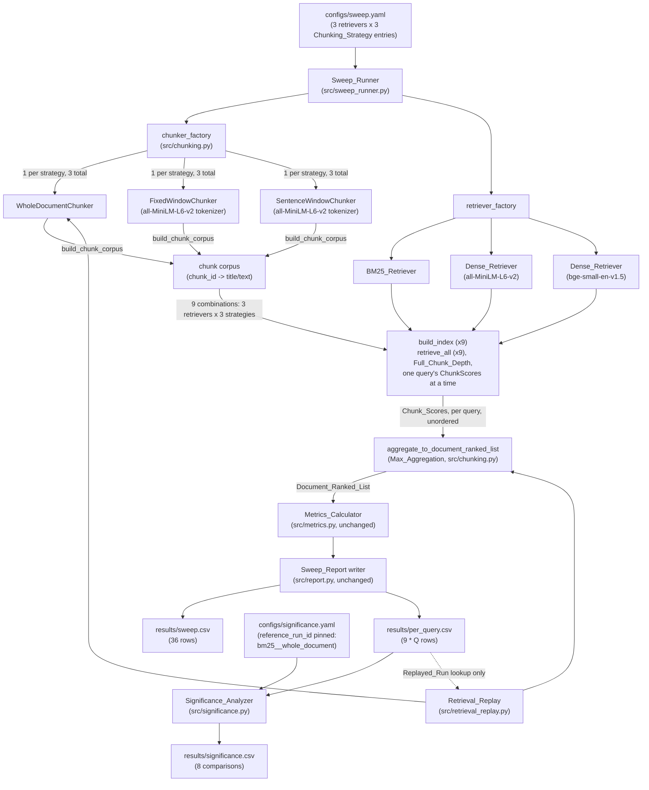

# Design Document: Full-Grid Chunking Sweep

## Overview

This design completes the retriever x top-k x chunking grid declared
in `docs/PROJECT_BRIEF.md`, building directly on the already-shipped
`session-1-baseline-sweep` and `significance-testing` specs. It adds a
third retriever as pure config data, a chunking abstraction with three
strategies (`whole_document`, `fixed_window`, `sentence_window`), a
chunk-to-document score aggregation rule, and re-runs the significance
analysis over the resulting 9-run grid with an explicitly pinned
reference run. It also updates the groundedness gate's frozen
retrieval path so it keeps working, unchanged in output, under the new
chunking-aware retriever contract.

The design is organized around one non-negotiable data flow, restated
in chunk terms from session-1's Requirement 5 ("index once, retrieve
once, slice four ways"):

**chunk once per strategy, index once per retriever x strategy,
retrieve once at full chunk depth, aggregate once by maximum, slice
four ways.**

Concretely:

- Each of the 3 declared `Chunking_Strategy` entries is applied to the
  whole corpus exactly once, producing one chunk corpus per strategy —
  3 chunk-corpus computations total, each reused by every retriever
  that shares that strategy. This reuse is an efficiency consequence of
  chunking depending only on the declared strategy, never on the
  retriever; it is not itself a requirement, and every retriever x
  Chunking_Strategy combination still independently builds its own
  index (Requirement 6.1/6.3).
- 3 retrievers x 3 Chunking_Strategy entries = 9 index builds and 9
  retrieval calls total, each retrieval call requesting
  `Full_Chunk_Depth` — every chunk in that run's chunk index, never a
  truncated top-N — because both `BM25Okapi.get_scores()` and the
  dense retriever's per-query similarity scoring (a mat-vec against
  the full chunk embedding matrix) already score every item before
  any aggregation, so requesting the full depth costs nothing beyond
  the single retrieve_all call session-1's Requirement 5 already
  established. That single call is a generator: it yields one query's
  `Chunk_Scores` at a time rather than holding every query's scores at
  once (see "Peak memory" under `src/retrievers/base.py`, below).
- For every query in turn, that retrieval call's `Chunk_Scores` (never
  sorted — see below) is reduced to a `Document_Ranked_List` by
  `Max_Aggregation` — grouping chunks by source document ID and taking
  the maximum score, tie-broken by the same `doc_id_sort_key` session-1
  already defines — with no additional retrieval call.
- That single `Document_Ranked_List` is sliced to each of the 4
  declared cutoffs, exactly as session-1's whole-document
  `Ranked_List` was sliced, to produce `results/sweep.csv`'s 36 rows
  (9 runs x 4 cutoffs).

Under `whole_document` chunking, every document has exactly one chunk,
so `Max_Aggregation` is mathematically the identity and this pipeline
must reproduce session-1's already-published whole-document numbers
bit-for-bit (Requirement 2.5) — this identity is also what makes the
`retrieval_replay.py` update output-preserving (Requirement 10).

Implementation language is Python, matching the pinned libraries
already in `requirements.txt`. This spec introduces exactly one new
dependency: `hypothesis` (the property-based testing library), pinned
to an exact version, for the chunking/aggregation properties described
below — everything else reuses `beir`, `rank_bm25`,
`sentence-transformers`, `transformers`, `numpy`, `pandas`, `PyYAML`,
and `pytest`, already pinned.

## Architecture

### Module layout

The `src/` tree keeps its session-1/significance-testing shape and
adds one new module (`src/chunking.py`), extends five existing modules
(`src/config.py`, `src/errors.py`, `src/sweep_runner.py`,
`src/significance_config.py`, `src/significance.py`,
`src/retrieval_replay.py`, `src/token_length_analysis.py`), and touches
the two retriever implementations plus the shared retriever protocol:

```
configs/
  sweep.yaml                  # EXTENDED: chunking_strategies list, 3rd retriever
  significance.yaml           # EXTENDED: reference_chunking_strategy field

src/
  chunking.py                 # NEW: Chunker protocol, WholeDocumentChunker,
                               #      FixedWindowChunker, SentenceWindowChunker,
                               #      make_chunk_id/parse_chunk_id,
                               #      build_chunk_corpus, load_chunking_tokenizer,
                               #      aggregate_to_document_ranked_list
  errors.py                   # EXTENDED: ChunkingError, ChunkingConfigError,
                               #           TokenizerLoadError reused (already exists)
  config.py                   # EXTENDED: chunking_strategies schema, 3-retriever
                               #           validation, cross-product run derivation
  corpus_loader.py            # unchanged
  metrics.py                  # unchanged -- operates on Document_Ranked_List exactly
                               #             as it always has
  report.py                   # unchanged (schema untouched; row count grows via
                               #            the caller's grid, not this module)
  per_query_report.py         # unchanged (schema untouched; row count grows via
                               #            the caller's grid, not this module)
  sweep_runner.py             # EXTENDED: chunker_factory injection seam, the
                               #           chunk-once/retrieve-once/aggregate-once
                               #           loop restructuring
  significance_config.py      # EXTENDED: reference_chunking_strategy field
  significance.py             # EXTENDED: explicit reference_run_id lookup,
                               #           replacing the sorted-first-bm25 rule
                               #           (paired_bootstrap/permutation_test/
                               #           holm_bonferroni bodies untouched)
  retrieval_replay.py         # EXTENDED: routes through WholeDocumentChunker +
                               #           trivial 1-chunk Max_Aggregation
  token_length_analysis.py    # EXTENDED: 6-cell report (3 strategies x 2 dense
                               #           models), each tokenizer's own
                               #           model_max_length read at run time
  retrievers/
    base.py                   # EXTENDED: ChunkScores dataclass, Retriever
                               #           .retrieve_all's generator return
                               #           contract (one (query_id, ChunkScores)
                               #           pair at a time, never sorted),
                               #           Full_Chunk_Depth, no top_k parameter
    bm25_retriever.py          # EXTENDED: retrieve_all yields every chunk
                               #            scored, never truncated, never sorted
    dense_retriever.py         # EXTENDED: same retrieve_all contract change;
                               #            used unchanged for both dense models

tests/
  test_chunking.py            # NEW: Hypothesis property tests for the three
                               #      Chunkers, chunk-id round trip,
                               #      aggregate_to_document_ranked_list, and the
                               #      BM25 Full_Chunk_Depth contract
  test_orchestration.py       # EXTENDED: chunking-strategy axis, multi-chunk
                               #           max-aggregation assertion
  test_data_layer.py          # NEW: Data_Layer_Tests + Real_Corpus_End_To_End_Tests,
                               #      skipped via pytest.mark.skipif on
                               #      Local_Cache_Availability
  test_significance.py        # unchanged (paired_bootstrap/permutation_test/
                               #            holm_bonferroni bodies untouched)
  test_token_length_analysis.py  # EXTENDED: compute_exceedance_stats already
                               #            covers the pure function; a
                               #            regression check ties the extended
                               #            report's whole_document cells to
                               #            the pre-existing single-model number

results/
  sweep.csv                   # 36 rows (was 8)
  per_query.csv               # 9 * Q rows (was 2 * Q; see Data Models)
  significance.csv            # 8 comparisons x 6 metrics = 48 rows (was 1 x 6 = 6)
  token_length_report.json    # EXTENDED: 6 cells (was 1)
  run_config.json             # EXTENDED: sweep_config now carries
                               #            chunking_strategies; significance
                               #            sub-object gains reference_run_id
```

### Component diagram



### Sequence: one retriever x strategy run, chunk once, retrieve once, aggregate once, slice four ways

```mermaid
sequenceDiagram
    participant R as Sweep_Runner
    participant C as Chunker (per strategy, shared across retrievers)
    participant Ret as Retriever (BM25 or Dense, x3)
    participant Agg as aggregate_to_document_ranked_list
    participant M as Metrics_Calculator

    Note over R,C: Chunking runs once per Chunking_Strategy (3 total),<br/>reused by every retriever sharing that strategy
    R->>C: build_chunk_corpus(corpus)  [once per strategy]
    C-->>R: chunk_corpus (chunk_id -> title/text)

    loop retriever in [bm25, all-MiniLM-L6-v2, bge-small-en-v1.5]
        R->>Ret: build_index(chunk_corpus)
        Ret-->>R: index_time
        R->>Ret: retrieve_all(queries)   [no top_k -- Full_Chunk_Depth always]
        Note over R,Ret: ONE retrieve_all call returns ONE generator;<br/>iterating it yields every query's<br/>ChunkScores one at a time (never all<br/>held at once, never sorted)
        loop (qid, chunk_scores) yielded by the single retrieve_all generator
            R->>Agg: aggregate_to_document_ranked_list(chunk_scores)
            Agg-->>R: document_ranked_list (Max_Aggregation, doc_id_sort_key tie-break)
            R->>M: ndcg_at_10 / mrr_at_10 (fixed cutoff 10, once per run_id)
            loop k in [1, 5, 10, 20]
                R->>R: sliced = document_ranked_list[:k]
                R->>M: recall_at_k(sliced, qrels, k)
                R->>R: append row(run_id={retriever}__{strategy}, k, ...)
            end
        end
        Ret-->>R: last_query_latency (summed, after the generator is exhausted)
    end
```

The single `build_chunk_corpus` call at the top of the diagram, outside
the retriever loop, is what keeps this a 3-computation chunking cost
instead of 9 — but every retriever still independently performs its
own single `build_index`/`retrieve_all` pair, so the "9 index builds,
9 retrieval calls" property (Requirement 6.3) holds regardless of this
reuse. This holds regardless of how many queries a single
`retrieve_all` call's generator is iterated over: one call that is
fully iterated to yield 300 queries' `Chunk_Scores` (session-1's own
reported query count) is one retrieval call, not 300 — the property
being counted is how many times `retrieve_all` itself is invoked per
run (exactly once), not how many `(query_id, ChunkScores)` pairs the
caller consumes from the single generator object that call returns.

## Components and Interfaces

### `src/chunking.py` — Chunker protocol, three strategies, chunk IDs, Max_Aggregation

This is the one new module. It has no dependency on any retriever
class; it depends only on `src.retrievers.base.doc_id_sort_key` (for
`Max_Aggregation`'s tie-break) and `src.retrievers.base.ChunkScores`
(the type `aggregate_to_document_ranked_list` consumes), and, for the
two token-aware strategies, a loaded Hugging Face tokenizer.

```python
CHUNK_ID_SEPARATOR = "::chunk"   # never occurs in a BEIR SciFact doc_id

@dataclass(frozen=True)
class Chunk:
    chunk_id: str      # make_chunk_id(doc_id, position)
    doc_id: str        # source document ID
    position: int       # 0-based position within doc_id's ordered chunk list
    text: str           # this Chunk's own text content

def make_chunk_id(doc_id: str, position: int) -> str:
    """doc_id + CHUNK_ID_SEPARATOR + position (Requirement 2.3): never
    equal to doc_id itself (the separator is always appended), and
    always parseable back via parse_chunk_id."""
    return f"{doc_id}{CHUNK_ID_SEPARATOR}{position}"

def parse_chunk_id(chunk_id: str) -> Tuple[str, int]:
    """Inverse of make_chunk_id. Splits on the LAST occurrence of
    CHUNK_ID_SEPARATOR (str.rpartition) rather than the first, so a
    doc_id that happens to contain the separator substring still
    parses correctly -- the separator we appended is always the
    rightmost occurrence in a string this module produced. Raises
    ValueError if chunk_id contains no separator or the trailing
    segment is not an integer (Requirement 2.3's "recoverable by
    parsing the identifier alone")."""
    doc_id, sep, position_str = chunk_id.rpartition(CHUNK_ID_SEPARATOR)
    if not sep:
        raise ValueError(f"not a well-formed chunk_id: {chunk_id!r}")
    return doc_id, int(position_str)


class Chunker(Protocol):
    strategy_name: str

    def chunk_document(self, doc_id: str, document: Dict[str, str]) -> List[Chunk]:
        """Splits one corpus document into an ordered, 0-indexed list
        of Chunks. Never returns an empty list for a Chunker
        implementation this spec defines (Requirement 2.6's guard
        exists for a hypothetically misbehaving Chunker, e.g. a test
        stub, not for any of the three below)."""
        ...


def build_chunk_corpus(
    chunker: Chunker, corpus: Dict[str, Dict[str, str]]
) -> Dict[str, Dict[str, str]]:
    """Applies `chunker` to every document in `corpus` (Requirement
    2.4 -- no document skipped), and returns a chunk corpus: chunk_id
    -> {"title": "", "text": chunk.text}. Every Chunk's own text is
    stored entirely in "text" with an empty "title", so BM25Retriever's
    _tokenize and DenseRetriever's format_document_text -- both of
    which concatenate title + " " + text -- consume a Chunk's content
    unchanged, with no retriever-side awareness that chunking happened
    at all.

    Raises ChunkingError, naming the offending doc_id and
    chunker.strategy_name, and does not proceed to build any index, if
    chunker.chunk_document returns an empty list for any document
    (Requirement 2.6)."""
    chunk_corpus: Dict[str, Dict[str, str]] = {}
    for doc_id, document in corpus.items():
        chunks = chunker.chunk_document(doc_id, document)
        if not chunks:
            raise ChunkingError(
                f"{chunker.strategy_name!r} produced zero Chunks for "
                f"document {doc_id!r}; halting before any index build"
            )
        for chunk in chunks:
            chunk_corpus[chunk.chunk_id] = {"title": "", "text": chunk.text}
    return chunk_corpus
```

**`WholeDocumentChunker`** (Requirement 2.2): a no-op wrapper of
session-1's existing behavior.

```python
class WholeDocumentChunker:
    strategy_name = "whole_document"

    def chunk_document(self, doc_id: str, document: Dict[str, str]) -> List[Chunk]:
        text = format_document_text(document)   # imported from dense_retriever.py
        return [Chunk(chunk_id=make_chunk_id(doc_id, 0), doc_id=doc_id, position=0, text=text)]
```

Reusing `format_document_text` (already extracted for
`token_length_analysis.py`) rather than re-deriving the
`title + " " + text` concatenation is what makes Requirement 2.2's "the
document's full, unmodified content" hold by construction: there is
exactly one implementation of that formatting, shared by three call
sites now (`DenseRetriever.build_index`, `token_length_analysis.py`,
and here).

**`FixedWindowChunker`** (Requirement 3):

```python
class FixedWindowChunker:
    strategy_name = "fixed_window"

    def __init__(self, tokenizer: "PreTrainedTokenizerBase", window_size: int, stride: int) -> None:
        self._tokenizer = tokenizer   # always the all-MiniLM-L6-v2 tokenizer
        self._window_size = window_size
        self._stride = stride

    def chunk_document(self, doc_id: str, document: Dict[str, str]) -> List[Chunk]:
        text = format_document_text(document)
        encoding = self._tokenizer(text, add_special_tokens=False, return_offsets_mapping=True, truncation=False)
        offsets = encoding["offset_mapping"]
        total_tokens = len(offsets)

        if total_tokens <= self._window_size:
            return [Chunk(make_chunk_id(doc_id, 0), doc_id, 0, text)]  # Requirement 3.4

        chunks: List[Chunk] = []
        start = 0
        while True:
            end = min(start + self._window_size, total_tokens)
            char_start, char_end = offsets[start][0], offsets[end - 1][1]
            candidate_text = text[char_start:char_end]
            candidate_text = self._shrink_to_token_budget(candidate_text)  # Requirement 3.3
            chunks.append(Chunk(make_chunk_id(doc_id, len(chunks)), doc_id, len(chunks), candidate_text))
            if end == total_tokens:
                break   # Requirement 3.5: last window always reaches the end
            start += self._stride
        return chunks

    def _shrink_to_token_budget(self, candidate_text: str) -> str:
        """Requirement 3.3: a window boundary landing mid-word can
        change subword segmentation when candidate_text is re-tokenized
        in isolation (a token that depended on adjacent context inside
        the full document may re-segment into more sub-tokens once
        isolated). Re-tokenizes candidate_text on its own; if the
        re-tokenized length exceeds window_size, repeatedly trims the
        *last* re-tokenized token's own character span off the end
        (using that re-tokenization's own offset mapping, not the
        original document's) and re-checks, until the length is at
        or under window_size. Guaranteed to terminate: each trim
        strictly shortens candidate_text, and a single character
        always tokenizes to <= window_size tokens for any
        window_size >= 1."""
        ...
```

Design notes on `_shrink_to_token_budget`: this is the concrete
mechanism that satisfies Requirement 3.3's independent-re-tokenization
guarantee. It never *grows* a chunk past its window boundary (only
trims), so it cannot violate Requirement 3.6's non-decreasing start
offsets or Requirement 3.5's coverage — coverage is preserved because
the *next* window's start position is still computed from the
*original* document's token offsets (`start += stride`), never from
the shrunk candidate's own length, so a shrink on one window never
skips document content the next window would have covered. Requirement
3.7 (exact, reconstructable text span) holds because `_shrink_to_token_budget`
only ever removes a trailing character range from `candidate_text` — it
never re-writes or paraphrases text — so the result is still an exact
substring of the source document.

**`SentenceWindowChunker`** (Requirement 4):

```python
class SentenceWindowChunker:
    strategy_name = "sentence_window"

    def __init__(self, tokenizer: "PreTrainedTokenizerBase", sentences_per_chunk: int, max_chunk_tokens: int) -> None:
        self._tokenizer = tokenizer
        self._sentences_per_chunk = sentences_per_chunk
        self._max_chunk_tokens = max_chunk_tokens

    def chunk_document(self, doc_id: str, document: Dict[str, str]) -> List[Chunk]:
        text = format_document_text(document)
        sentences = _split_into_sentences(text)   # reuses claim_segmenter._SENTENCE_BOUNDARY

        groups = _consecutive_groups(sentences, self._sentences_per_chunk)  # Requirement 4.3
        chunk_texts: List[str] = []
        for group in groups:
            chunk_texts.extend(self._split_group_to_budget(group))  # Requirement 4.4, 4.5
        return [
            Chunk(make_chunk_id(doc_id, i), doc_id, i, t)
            for i, t in enumerate(chunk_texts)
        ]

    def _split_group_to_budget(self, sentences: List[str]) -> List[str]:
        """Requirement 4.4: greedily packs `sentences` (already <=
        sentences_per_chunk long) into the maximum number of
        consecutive whole sentences whose combined token length is
        <= max_chunk_tokens, repeating for the remainder. Requirement
        4.5: if a single sentence's own token length still exceeds
        max_chunk_tokens, splits that one sentence's token sequence
        (via the tokenizer's offset mapping, the same mechanism
        FixedWindowChunker._shrink_to_token_budget uses) into
        consecutive, non-overlapping, max_chunk_tokens-sized pieces,
        covering it exactly once (Requirement 4.6). Every input
        sentence's text is covered exactly once across the returned
        list."""
        ...
```

`_split_into_sentences` reuses `src.claim_segmenter._SENTENCE_BOUNDARY`
directly (Requirement 4.1) rather than re-implementing a
sentence-boundary rule — the segmentation regex is imported, not
copied, so the two modules cannot drift. The single-oversized-sentence
fallback (Requirement 4.5) shares its token-level splitting logic with
`FixedWindowChunker._shrink_to_token_budget`'s trim mechanism (both
reduce to "slice a token-offset span, then verify"), refactored into a
shared private helper, `_split_text_by_token_budget(tokenizer, text,
max_tokens) -> List[str]`, used by both chunkers.

**`aggregate_to_document_ranked_list`** — the pure Max_Aggregation
function (Requirement 5). `ChunkScores` (below, under
`src/retrievers/base.py`) is never sorted, so this function is the
only sort in the whole chunk-to-cutoff path:

```python
def aggregate_to_document_ranked_list(
    chunk_scores: ChunkScores
) -> List[str]:
    """Groups chunk_scores.chunk_ids/scores by their source doc_id (via
    parse_chunk_id) and returns document IDs ordered by
    (-max_score, doc_id_sort_key(doc_id)) -- Max_Aggregation
    (Requirement 5.1), selected by score value, never by rank position
    -- chunk_scores carries no rank position at all, since it is never
    sorted. Ties among equal max scores are broken by ascending
    doc_id_sort_key, the same helper BM25Retriever/DenseRetriever
    already use at the chunk level (Requirement 5.5). For a
    whole_document run (exactly one chunk per document), this is the
    identity permutation of ranking documents directly by their own
    single score (Requirement 2.5, 10.2) -- max of a single-element set
    is that element.

    This function performs the only sort in the whole chunk-to-cutoff
    path: chunk-level scores are grouped by parsed doc_id and reduced
    to a per-doc maximum, tie-broken by ascending doc_id_sort_key --
    document-level ordering is produced here, for the first time,
    never earlier in the pipeline.

    Pure: no I/O, no retriever call, operates only on the single
    ChunkScores already yielded for one query by one retrieve_all call
    (Requirement 5.6)."""
    best_score_by_doc: Dict[str, float] = {}
    for chunk_id, score in zip(chunk_scores.chunk_ids, chunk_scores.scores):
        doc_id, _position = parse_chunk_id(chunk_id)
        if doc_id not in best_score_by_doc or score > best_score_by_doc[doc_id]:
            best_score_by_doc[doc_id] = score
    return sorted(
        best_score_by_doc,
        key=lambda doc_id: (-best_score_by_doc[doc_id], doc_id_sort_key(doc_id)),
    )
```

**`load_chunking_tokenizer`** — loads the all-MiniLM-L6-v2 tokenizer
used by both token-aware strategies, regardless of which retriever is
being run:

```python
def load_chunking_tokenizer(cache_folder: Path) -> "PreTrainedTokenizerBase":
    """Loads the all-MiniLM-L6-v2 tokenizer (the fixed tokenizer
    Requirement 3.1/4.1 name for windowing, independent of which
    retriever a given run declares) from cache_folder, allowing a
    network download on a first, uncached invocation -- unlike
    token_length_analysis.py's load_tokenizer_offline, this is not
    forced offline, because chunking is part of the ordinary sweep run
    that already permits a first-run download (session-1's
    Requirement 10.5 cache-pinning applies unchanged: cache_folder is
    always config.data_dir / "hf_cache")."""
    return AutoTokenizer.from_pretrained(
        "sentence-transformers/all-MiniLM-L6-v2", cache_dir=str(cache_folder)
    )
```

This is called at most once per `Sweep_Runner` invocation (memoized by
`make_default_chunker_factory`, below), regardless of whether 1, 2, or
both of `fixed_window`/`sentence_window` are declared — never inside
the per-strategy loop.

### `src/retrievers/base.py` — `ChunkScores`, and `Retriever.retrieve_all`'s streaming contract change

The `retrieve_all` signature drops `top_k` entirely, and changes from
returning one bundled `(Dict[str, ...], float)` result for every query
at once to a **generator** yielding one `(query_id, ChunkScores)` pair
at a time — this is the extended return contract Requirement 5.7
requires, applied identically to `BM25Retriever` and `DenseRetriever`
for both dense models. `ChunkScores` replaces the ordered-list-of-tuples
shape entirely: chunk-level scores are never sorted (see below), so
they are represented as a numpy array aligned to a stable, shared
chunk-id tuple rather than a list of `(chunk_id, score)` pairs:

```python
import numpy

@dataclass(frozen=True)
class ChunkScores:
    """One query's score against every chunk in a retriever's index.
    Never sorted: aggregate_to_document_ranked_list selects by score
    value, not rank position, so no chunk-level order is produced or
    needed. chunk_ids is fixed once at build_index time and the SAME
    tuple object is reused, unmodified, for every query a single
    retrieve_all call yields -- it is never rebuilt or copied per
    query."""
    chunk_ids: Tuple[str, ...]     # stable order; identical object across every yield in one run
    scores: numpy.ndarray           # shape (len(chunk_ids),); scores[i] is chunk_ids[i]'s score


class Retriever(Protocol):
    name: str
    last_query_latency: float   # populated once retrieve_all's generator is exhausted

    def build_index(self, corpus: Dict[str, Dict[str, str]]) -> float: ...

    def retrieve_all(self, queries: Dict[str, str]) -> Iterator[Tuple[str, ChunkScores]]:
        """A single call to retrieve_all(...) returns ONE generator object --
        this is what "exactly one retrieval call" (Requirement 6.3) means:
        the property counts how many times this method is invoked and how
        many times the retriever scores its corpus, not how many items the
        resulting generator produces when consumed. Fully iterating one
        generator over 300 queries is still the single call session-1's
        "index once, retrieve once" property already counted, restated in
        chunk terms -- not 300 separate calls.

        Yields exactly one (query_id, ChunkScores) pair per query in
        `queries`, in `queries`' own iteration order, lazily: each
        ChunkScores is computed against every chunk in the index
        (Full_Chunk_Depth, Requirement 6.1) one query at a time, so peak
        memory for consuming this call is one query's score vector, never
        every query's score vector held at once.

        There is still no top_k parameter (Requirement 6.4): streaming to
        bound peak memory is a decision about WHEN each query's scores are
        computed and held, not about HOW MANY chunks are scored per query
        -- every chunk is scored for every query regardless; nothing is
        truncated or dropped. Bounded memory is not the same as a caller
        shrinking retrieval depth.

        After the returned generator is fully exhausted, `last_query_latency`
        holds the summed wall-clock time actually spent scoring queries
        (excluding whatever time the caller spends between yields, e.g. in
        aggregation) -- the generator-based restatement of session-1's
        query_latency semantics."""
        ...
```

Removing `top_k` is a deliberate interface-level enforcement of
Requirement 6.1/6.4, not merely a documentation note: session-1's
retrievers already computed every item's score before truncating
(`BM25Okapi.get_scores()` scores the whole corpus; the dense retriever
scores the whole chunk set per query), so dropping the truncation step
is a strict simplification of both concrete implementations, not a new
computation. Likewise, dropping the chunk-level sort (below) is a
second, independent simplification of existing computation: the same
total arithmetic already happens either way (every query dotted
against every chunk embedding) — it is just performed as one mat-vec
per query, streamed, rather than one batched matmul held in full.
Neither simplification changes how many scores are computed, only
whether they are sorted and how many are held in memory at once.
`doc_id_sort_key` is unchanged and is now applied only once in the
whole pipeline, at the aggregation level (inside
`aggregate_to_document_ranked_list`) — chunk-level scores are never
sorted, per Requirement 5.5's tie-break now applying solely at the
document level.

`RetrievalRun` (previously slated for retyping to
`Dict[str, List[Tuple[str, float]]]` in an earlier draft of this
design) is **removed**: no retriever's `retrieve_all` returns one
bundled result for all queries at all anymore, so there is nothing left
for `RetrievalRun` to hold. Bundling every query's `ChunkScores` into a
single dataclass instance would defeat the point of streaming, so it is
deleted rather than retyped.

**Peak memory.** Before this correction, one `retrieve_all` call held
every query's full chunk-score collection at once — as either a
dict-of-lists-of-tuples (heavy per-object Python overhead: one tuple
and two Python objects per `(chunk_id, score)` pair) or a dense
`Q x C` matrix — an `O(Q x C)` footprint, where `Q` is the query count
and `C` is the run's total chunk count. After this correction, the
generator holds one query's score array (`O(C)`) at a time, plus the
single `chunk_ids` tuple shared, unmodified, across every yield for the
run's lifetime — an `O(C)` footprint, independent of `Q`.

Illustrative example (not a design requirement, just a concrete sense
of scale): `Q = 300`, session-1's own already-reported test query
count (`results/run_config.json`'s `corpus_load_report.num_queries`).
For `fixed_window` chunking, `C` is on the order of several times the
`whole_document` chunk count of 5183 (also read from
`results/run_config.json`) — illustrative only; the real count for any
given run is always read from that run's own built chunk corpus via
`len(chunk_corpus)`, never hard-coded. Taking an illustrative `C ≈
20,000` for `fixed_window`: the old `Q x C` dict-of-tuples shape is
`300 x 20,000 = 6,000,000` `(chunk_id, score)` pairs held at once,
easily hundreds of MB of Python object overhead; the new `O(C)` shape
holds one `20,000`-length float64 array (~160 KB) plus the one shared
`20,000`-entry `chunk_ids` tuple, at any point during consumption —
several orders of magnitude smaller, and independent of `Q`.

### `src/retrievers/bm25_retriever.py` / `dense_retriever.py` — full-depth, streamed, never sorted

Both retrievers' `retrieve_all` methods lose their
`effective_top_k = min(top_k, len(self._doc_ids))` line, the
`[:effective_top_k]` slice, **and** the `(-score, doc_id_sort_key(doc_id))`
sort — no chunk-level order is produced or needed, since
`aggregate_to_document_ranked_list` is the only sort in the whole
chunk-to-cutoff path. Both methods become thin generators, yielding one
`(query_id, ChunkScores)` pair at a time (where each `ChunkScores`'s
`chunk_ids` is now a tuple of chunk IDs, since both retrievers are
handed a chunk corpus by the Sweep_Runner — neither retriever class has
any awareness that chunking occurred; it just indexes and scores
whatever `Dict[str, Dict[str, str]]` it was given, exactly as before).

`BM25Retriever.retrieve_all` becomes a thin generator (no sort/slice
needed at all now that `rank_bm25.BM25Okapi.get_scores()` already
returns a numpy array aligned to the corpus's build order):

```python
def retrieve_all(self, queries: Dict[str, str]) -> Iterator[Tuple[str, ChunkScores]]:
    if self._bm25 is None:
        raise RuntimeError("build_index must be called before retrieve_all")
    chunk_id_index = tuple(self._doc_ids)   # fixed at build_index time; same
                                              # tuple object reused for every yield
    total_latency = 0.0
    for qid, query_text in queries.items():
        start = time.perf_counter()
        tokenized_query = self._tokenize(query_text)
        scores = self._bm25.get_scores(tokenized_query)   # numpy array, already
                                                              # aligned to chunk_id_index
        total_latency += time.perf_counter() - start
        yield qid, ChunkScores(chunk_ids=chunk_id_index, scores=scores)
    self.last_query_latency = total_latency
```

`DenseRetriever.retrieve_all` batch-encodes queries once (cheap:
`query_count x embedding_dim`, not the memory problem) but computes
each query's chunk-score vector one at a time via a single mat-vec,
never materializing the full query x chunk similarity matrix:

```python
def retrieve_all(self, queries: Dict[str, str]) -> Iterator[Tuple[str, ChunkScores]]:
    if self._doc_embeddings is None:
        raise RuntimeError("build_index must be called before retrieve_all")
    chunk_id_index = tuple(self._doc_ids)
    query_ids = list(queries.keys())
    query_texts = [queries[qid] for qid in query_ids]

    start = time.perf_counter()
    query_embeddings = self._model.encode(
        query_texts, batch_size=self._config.batch_size,
        convert_to_numpy=True, normalize_embeddings=True, show_progress_bar=False,
    )
    total_latency = time.perf_counter() - start

    for row_idx, qid in enumerate(query_ids):
        start = time.perf_counter()
        scores = self._doc_embeddings @ query_embeddings[row_idx]   # one query's
                                                                       # full chunk-score
                                                                       # vector; never the
                                                                       # full query x chunk matrix
        total_latency += time.perf_counter() - start
        yield qid, ChunkScores(chunk_ids=chunk_id_index, scores=scores)
    self.last_query_latency = total_latency
```

No other change to either class: tokenizer settings
(`BM25Retriever`), `device="cpu"` and the cache-path assertion
(`DenseRetriever`), and the `bm25.get_scores()`/per-query mat-vec
computation itself are all untouched — the same total arithmetic that
already happened before this correction (every query dotted against
every chunk embedding) still happens; only the batching (one mat-vec
per query instead of one batched matmul) and the removal of the
now-pointless sort are new.

### `src/config.py` — `chunking_strategies` schema and the 3-retriever cross product

```python
@dataclass(frozen=True)
class WholeDocumentChunkingConfig:
    name: str   # "whole_document"

@dataclass(frozen=True)
class FixedWindowChunkingConfig:
    name: str          # "fixed_window"
    window_size: int    # 200 (Requirement 3.2)
    stride: int          # 50 (Requirement 3.2)

@dataclass(frozen=True)
class SentenceWindowChunkingConfig:
    name: str                  # "sentence_window"
    sentences_per_chunk: int    # 3 (Requirement 4.2)
    max_chunk_tokens: int        # 256 (Requirement 4.2)

ChunkingStrategyConfig = Union[
    WholeDocumentChunkingConfig, FixedWindowChunkingConfig, SentenceWindowChunkingConfig
]

@dataclass(frozen=True)
class SweepConfig:
    seed: int
    chunking_strategies: Tuple[ChunkingStrategyConfig, ...]   # exactly 3, one of each
    cutoffs: Tuple[int, ...]
    retrievers: Tuple[RetrieverConfig, ...]                    # exactly 3
    data_dir: Path
    output_path: Path
```

`load_sweep_config` changes:

1. Reads `chunking_strategies` (a list) instead of the old singular
   `chunking_strategy` (a string). If the YAML declares the old
   singular field instead, this raises `ConfigError` naming it
   explicitly (Requirement 7.4) — it is not silently ignored or
   treated as "field not present."
2. Validates `chunking_strategies` has exactly 3 entries, one each
   named `whole_document`, `fixed_window`, `sentence_window` (no
   duplicates, no omissions, no unsupported name). Any other count or
   value set raises `ConfigError` naming the invalid declaration
   (Requirement 7.3).
3. Validates each entry's own required fields per its `name`
   (`fixed_window` requires `window_size`/`stride` as positive
   integers; `sentence_window` requires `sentences_per_chunk`/
   `max_chunk_tokens` as positive integers; `whole_document` requires
   only `name`) — `window_size`/`stride`/`sentences_per_chunk`/
   `max_chunk_tokens` are read from the YAML, never hard-coded in
   `src/` (Requirement 7.6).
4. Validates `retrievers` declares exactly 3 entries: exactly one
   `type: bm25`, and exactly two `type: dense` entries whose `name`
   fields are the case-sensitive strings `all-MiniLM-L6-v2` and
   `bge-small-en-v1.5` respectively (both entries), with no other
   count, type combination, or `name`/`model_name` value accepted
   (Requirement 1.1, 1.5). The `bge-small-en-v1.5` entry's
   `model_name` must equal `BAAI/bge-small-en-v1.5` and uses the
   identical `DenseRetrieverConfig` schema / `DenseRetriever` class
   the `all-MiniLM-L6-v2` entry already uses — no new retriever class,
   no query-prefix field (Requirement 1.2, 1.3: `DenseRetriever` never
   prepends a prefix to query text for either dense retriever).
5. The 9-run grid is derived as
   `itertools.product(config.retrievers, config.chunking_strategies)`
   inside `Sweep_Runner`, not stored as a materialized list on
   `SweepConfig` — `SweepConfig` keeps the two length-3 lists as data;
   the cross product is computed once, at orchestration time
   (Requirement 7.2).

### `src/sweep_runner.py` — the chunker-factory seam and the restructured loop

Mirroring the existing `retriever_factory` injection seam
(session-1's "The injection seam"), a second, parallel seam is added
for chunkers:

```python
ChunkerFactory = Callable[[ChunkingStrategyConfig], Chunker]

def make_default_chunker_factory(cache_folder: Path) -> ChunkerFactory:
    """Production factory used by main(). Loads the all-MiniLM-L6-v2
    tokenizer via load_chunking_tokenizer at most once (memoized in a
    closure variable), the first time a fixed_window or
    sentence_window config is actually requested -- never for
    whole_document, and never eagerly at factory-construction time, so
    a Sweep_Config declaring only whole_document (as in a stub-based
    test) never triggers a tokenizer load or network access."""
    tokenizer_cache: Dict[str, "PreTrainedTokenizerBase"] = {}

    def factory(chunking_config: ChunkingStrategyConfig) -> Chunker:
        if isinstance(chunking_config, WholeDocumentChunkingConfig):
            return WholeDocumentChunker()
        if "tokenizer" not in tokenizer_cache:
            tokenizer_cache["tokenizer"] = load_chunking_tokenizer(cache_folder)
        tokenizer = tokenizer_cache["tokenizer"]
        if isinstance(chunking_config, FixedWindowChunkingConfig):
            return FixedWindowChunker(tokenizer, chunking_config.window_size, chunking_config.stride)
        if isinstance(chunking_config, SentenceWindowChunkingConfig):
            return SentenceWindowChunker(
                tokenizer, chunking_config.sentences_per_chunk, chunking_config.max_chunk_tokens
            )
        raise ConfigError(f"unsupported chunking config type: {type(chunking_config)!r}")

    return factory
```

`run_sweep`'s signature gains a `chunker_factory: ChunkerFactory`
parameter (alongside the existing `retriever_factory`), and its loop
restructures to an **outer loop over `config.chunking_strategies`**
(3 iterations — one `build_chunk_corpus` call each, cached in a local
variable for the duration of that iteration) and an **inner loop over
`config.retrievers`** (3 iterations each, 9 total combinations):

```
for chunking_config in config.chunking_strategies:      # 3 iterations
    try:
        chunker = chunker_factory(chunking_config)
        chunk_corpus = build_chunk_corpus(chunker, bundle.corpus)
    except ChunkingError:
        # New failure tier (this spec): a chunk-corpus build failure is
        # scoped to every run_id sharing this chunking_config -- all 3
        # retrievers' 4 rows each (12 rows) get MISSING, the same
        # smallest-affected-unit principle session-1 already applies
        # to a single retriever's build_index/retrieve_all failure,
        # generalized to the new per-strategy failure boundary chunking
        # introduces. The other 2 chunking strategies' 24 rows are
        # unaffected and the run proceeds.
        for retriever_config in config.retrievers:
            run_id = f"{retriever_config.name}__{chunking_config.name}"
            <append 4 all-MISSING rows for run_id>
        continue

    for retriever_config in config.retrievers:            # 3 iterations, 9 total
        run_id = f"{retriever_config.name}__{chunking_config.name}"
        try:
            retriever = retriever_factory(retriever_config)
            index_time = retriever.build_index(chunk_corpus)
            document_ranked_lists: Dict[str, List[str]] = {}
            for qid, chunk_scores in retriever.retrieve_all(bundle.queries):
                document_ranked_lists[qid] = aggregate_to_document_ranked_list(chunk_scores)
            query_latency = retriever.last_query_latency
        except Exception:
            <append 4 all-MISSING rows for run_id, as session-1 already does>
            continue

        # everything from here on is IDENTICAL to session-1's existing
        # ndcg_at_10/mrr_at_10-once, recall_at_k-per-cutoff logic, now
        # operating on document_ranked_lists instead of the retriever's
        # own direct ranked_lists -- src/metrics.py is untouched. The
        # single retrieve_all(...) call above returns one generator;
        # the for-loop consuming it here is what "exactly one retrieval
        # call" (Requirement 6.3) counts -- not the 300 individual
        # (qid, chunk_scores) pairs the loop iterates over.
```

`emit_per_query_rows`'s cutoff-set check (unchanged from
significance-testing) still gates `PerQueryReportRow` emission on
`config.cutoffs == {1, 5, 10, 20}`; nothing about the chunking axis
changes that gate.

`main()`'s orchestration gains one line: `chunker_factory =
make_default_chunker_factory(config.data_dir / "hf_cache")`, passed
into `run_sweep` alongside the existing `retriever_factory`. Everything
else in `main()` (config load, `configure_caches`, `apply_seed`,
`load_scifact`, `write_run_config_record`, `write_sweep_report`,
`write_per_query_report`) is unchanged in shape; `write_run_config_record`
now serializes `sweep_config.chunking_strategies` (a list of 3 nested
dataclasses) instead of the old singular string field, via the same
`dataclasses.asdict` + `_json_default` path already in place.

### `src/significance_config.py` / `src/significance.py` — pinned `reference_run_id`

`SignificanceConfig` gains one field:

```python
@dataclass(frozen=True)
class SignificanceConfig:
    ...
    reference_retriever: str              # unchanged: "bm25"
    reference_chunking_strategy: str       # NEW: "whole_document"
    ...
```

`load_significance_config` requires `reference_chunking_strategy` as a
non-optional field (no default) — unlike `run_config_path`, this field
has no fallback, because an implicit default here would reintroduce
exactly the "silently pick a strategy" risk Requirement 9.3 rules out.
`reference_run_id = f"{reference_retriever}__{reference_chunking_strategy}"`
is computed once, at config-load time or immediately after, and used
verbatim as an exact-match lookup key.

`src/significance.py`'s `_find_reference_run_id` is replaced:

```python
def _find_reference_run_id(frame: pandas.DataFrame, reference_run_id: str) -> str:
    """Requirement 9.2/9.3: reference_run_id is pinned explicitly by
    the caller (reference_retriever + reference_chunking_strategy from
    the Bootstrap_Config) -- this function performs an EXACT match
    against frame['run_id'].unique() and nothing else. It no longer
    filters by retriever name and sorts; sorting-and-taking-the-first
    is exactly the implicit rule Requirement 9.3 prohibits, because
    with 3 chunking strategies now present it could silently select
    bm25__fixed_window instead of bm25__whole_document.

    Raises MissingReferenceRunError naming reference_run_id if it is
    not present in frame['run_id'] (Requirement 9.4) -- the same halt
    behavior significance-testing's Requirement 2.5 already defines,
    now keyed on the explicit pin."""
    if reference_run_id not in set(frame["run_id"].unique()):
        raise MissingReferenceRunError(
            f"the pinned Reference_Run {reference_run_id!r} is not present "
            f"in the per-query report; every comparison is defined relative "
            f"to the Reference_Run"
        )
    return reference_run_id
```

`main()`'s step 4 changes its call from
`_find_reference_run_id(per_query_frame, config.reference_retriever)`
to
`_find_reference_run_id(per_query_frame, f"{config.reference_retriever}__{config.reference_chunking_strategy}")`.
`_run_comparisons`, `_apply_holm_bonferroni`, `paired_bootstrap`,
`permutation_test`, and `holm_bonferroni` are **untouched** (Requirement
9.7) — `_run_comparisons` already derives `comparison_run_ids = sorted(rid
for rid in run_frames if rid != reference_run_id)`, which now naturally
yields 8 entries instead of 1 once `results/per_query.csv` contains 9
run_ids, with no code change needed there. `METRIC_ORDER`, the RNG
discipline (one generator, fixed comparison order, bootstrap-then-
permutation per comparison), and the two-sentinel (`MISSING`/
`NOT_APPLICABLE`) scheme all carry over unchanged, now iterated over 8
comparisons x 6 metrics = 48 rows instead of 1 x 6 = 6.

### `src/retrieval_replay.py` — routes through `WholeDocumentChunker` + trivial aggregation

`build_frozen_retriever` and `replay_retrieval` change to call the
chunking-aware retriever contract, using the exact same
`WholeDocumentChunker`/`build_chunk_corpus`/
`aggregate_to_document_ranked_list` functions the Sweep_Runner uses —
not a separately maintained copy:

```python
def build_frozen_retriever(
    sweep_config: SweepConfig,
    retriever_config: Union[BM25RetrieverConfig, DenseRetrieverConfig],
) -> Tuple[Retriever, CorpusBundle]:
    """... (config load, corpus load unchanged) ...

    NEW: chunks the loaded corpus with WholeDocumentChunker before
    calling build_index (Requirement 10.1) -- exactly one Chunk per
    document, containing that document's unmodified content, matching
    the Sweep_Runner's own no-op wrapping of session-1's whole-document
    behavior (Requirement 2.2)."""
    ...
    chunker = WholeDocumentChunker()
    chunk_corpus = build_chunk_corpus(chunker, bundle.corpus)
    retriever.build_index(chunk_corpus)
    return retriever, bundle


def replay_retrieval(
    retriever: Retriever,
    bundle: CorpusBundle,
    subset_query_ids: List[str],
    queries: Dict[str, str],
    replay_top_k: int,
) -> Dict[str, List[str]]:
    """Issues exactly ONE retrieve_all call (unchanged: Requirement
    3.1/3.5 of groundedness-gate), now over the chunk corpus, returning
    a generator of (query_id, ChunkScores) pairs at Full_Chunk_Depth,
    never sorted. NEW: consumes that generator, applying the trivial
    1-chunk-per-document Max_Aggregation (aggregate_to_document_ranked_list)
    to each query's ChunkScores as it arrives to reduce it to a
    Document_Ranked_List, THEN slices to replay_top_k (Requirement
    10.1) -- the slicing that retrieve_all's own top_k parameter used
    to perform now happens here, after aggregation, because
    retrieve_all no longer accepts a top_k at all.

    Because whole_document chunking produces exactly one Chunk per
    document, aggregate_to_document_ranked_list's per-document score is
    that one Chunk's own score verbatim, and the resulting document
    order is mathematically identical to ranking documents directly by
    that same score with the same doc_id_sort_key tie-break --
    Requirement 10.2's byte-for-byte/numeric equivalence claim, which
    is the n=1 case of aggregate_to_document_ranked_list's own general
    correctness property (see Correctness Properties, Property 2)."""
    subset_queries = {qid: queries[qid] for qid in subset_query_ids}
    retrieved_context: Dict[str, List[str]] = {}
    for qid, chunk_scores in retriever.retrieve_all(subset_queries):
        document_ranked_list = aggregate_to_document_ranked_list(chunk_scores)
        sliced = document_ranked_list[:replay_top_k]
        retrieved_context[qid] = [format_document_text(bundle.corpus[doc_id]) for doc_id in sliced]
    return retrieved_context
```

**Explicit, automatable acceptance check for Requirement 10.3/10.4.**
Two independent checks, together satisfying the requirement's demand
for "an explicit, automatable acceptance check ... rather than a prose
assertion alone":

1. **Automated (this spec's test surface):** Correctness Property 2
   below (`aggregate_to_document_ranked_list`'s general correctness,
   including its `n=1` corollary) is a `hypothesis`-driven property
   test that proves the identity mathematically, for generated
   single-chunk-per-document score assignments, independent of any
   real model or corpus. This is what makes the "identity transform"
   claim in Requirement 10.2 a tested fact about the aggregation
   function itself, not merely an assertion about this particular call
   site.
2. **Documented manual procedure (Requirement 10.3's real-corpus,
   real-model claim, which no automated test in this spec's scope
   reaches — consistent with `.kiro/steering/scope-guard.md`'s
   session-3 boundary and with `groundedness-gate`'s own
   "no automated end-to-end test" precedent):** re-run
   `python -m src.groundedness_runner` after this update, with the
   identical `configs/groundedness.yaml`, and diff every one of the
   five listed output files against their pre-update committed
   versions — byte-for-byte for the four CSV/Markdown files, and
   within `1e-9` for any floating-point CSV column. This procedure is
   recorded in `SPEC.md`'s design summary (see the documentation
   update plan below) so it is repeatable by a future maintainer, not
   only performed once by whoever ships this spec.

### `src/token_length_analysis.py` — 6-cell report (3 strategies x 2 dense models)

The single `MAX_SEQUENCE_LENGTH = 256` literal and the single
`model_name`/`load_tokenizer_offline` call are replaced by a loop over
the 6 `(Chunking_Strategy, dense model)` cells:

```python
_DENSE_MODEL_NAMES = ("sentence-transformers/all-MiniLM-L6-v2", "BAAI/bge-small-en-v1.5")

@dataclass(frozen=True)
class TokenLengthCell:
    """One of the 6 cells (Requirement 11.1)."""
    chunking_strategy: str
    model_name: str
    max_sequence_length: int    # read from THIS cell's own tokenizer.model_max_length
    num_documents_total: int     # actually "num Chunks total" for this strategy
    num_documents_exceeding: int
    fraction_exceeding: float

def compute_cell(
    chunker: Chunker, tokenizer: "PreTrainedTokenizerBase", corpus: Dict[str, Dict[str, str]]
) -> TokenLengthCell:
    """Chunk-level exceedance for one (strategy, model) cell
    (Requirement 11.4 -- including the whole_document cells, which
    remain numerically consistent with the pre-existing single-model
    report because whole_document chunking is a no-op: one Chunk per
    document, identical text to the pre-chunking measurement). Reads
    max_sequence_length from tokenizer.model_max_length at run time --
    never a hard-coded 256 or 512 (Requirement 11.2)."""
    chunk_corpus = build_chunk_corpus(chunker, corpus)
    token_counts = [count_tokens(tokenizer, chunk["text"]) for chunk in chunk_corpus.values()]
    max_sequence_length = int(tokenizer.model_max_length)
    stats = compute_exceedance_stats(token_counts, max_sequence_length)
    return TokenLengthCell(..., max_sequence_length=max_sequence_length, ...)
```

`compute_exceedance_stats` itself (the pure function, already
property-tested in the repo-writeup spec for order-independence and
boundary cases) is **unchanged** — this spec only adds the 6-cell
orchestration loop around it, each cell now built from a `chunk_corpus`
(via the same `build_chunk_corpus` the Sweep_Runner uses) rather than
the raw document corpus directly, and reading `max_sequence_length`
per-tokenizer rather than accepting a module-level constant.
`load_tokenizer_offline` (offline-forced, `local_files_only=True`) is
reused unchanged for loading each of the 2 dense-model tokenizers
(Requirement 11.5); the all-MiniLM-L6-v2 tokenizer used for
`fixed_window`/`sentence_window` windowing itself is loaded via the
same offline-forced path here too, since this analysis (unlike the
ordinary sweep) must never make a network call under any
circumstance. The output schema becomes a list of 6 `TokenLengthCell`
records under a `results/token_length_report.json` `"cells"` key
(Requirement 11.3), extending rather than replacing the existing
top-level file — the pre-existing single-cell fields are superseded by
the `whole_document` x `all-MiniLM-L6-v2` cell in the new list, which a
regression test asserts is numerically identical to the pre-existing
report's fraction (Requirement 11.4).

### Documentation and traceability update plan (Requirement 14)

`README.md`: the headline paragraph, results table, and "Reproducing
this sweep" section are re-derived from the new 36-row
`results/sweep.csv` and 8-comparison `results/significance.csv` —
every existing number is replaced by the number the corresponding
artifact actually holds after this spec's grid runs, never hand-edited
independently of the artifact. The results table gains rows/columns for
the two additional retrievers and (at minimum) the `whole_document`
slice used for the headline is called out explicitly as the slice being
reported, since 9 runs no longer collapse to one row per metric. Every
new number gets one new row in `docs/numeric_traceability.csv` (same
schema: `claim_id, document, location, stated_value, stated_precision,
source_artifact, source_fields, computation`) — no number is stated
without a ledger row resolvable by the existing, unmodified
`src/verify_writeup_numbers.py` Verification_Pass.

`SPEC.md`'s "Design summary" section gains: a description of the 3x4x3
grid and the 9 runs (replacing the "two retrievers... a single chunking
strategy" sentence); a new "Max_Aggregation convention" subsection,
alongside the existing "nDCG@10 convention" section, recording the
max-over-mean/sum justification (Requirement 5.4) and the fixed chunk
identifier scheme; and a statement of the pinned `Reference_Run`
(`bm25__whole_document`) replacing the implicit-selection description.
The existing "Threats to validity" section is extended, not replaced:
the token-length-truncation threat is rewritten to describe the 6-cell
measurement (Requirement 11) rather than the single whole-document/
single-model number, and a new threat item records the
`bge-small-en-v1.5` query-prefix omission (Requirement 1.4) as a
declared-in-advance limitation, together with the retrieval-replay
equivalence-verification procedure (Requirement 10.4) described above.
Both "Sparse qrels," "BM25 preprocessing sensitivity," and
"Single-corpus generalization" (the three steering-mandated items) are
retained verbatim, since nothing about this spec changes their content.

## Data Models

### `configs/sweep.yaml` schema (extended)

```yaml
seed: 42

chunking_strategies:
  - name: whole_document

  - name: fixed_window
    window_size: 200
    stride: 50

  - name: sentence_window
    sentences_per_chunk: 3
    max_chunk_tokens: 256

cutoffs: [1, 5, 10, 20]

retrievers:
  - name: bm25
    type: bm25
    k1: 1.5
    b: 0.75
    tokenizer: regex_word
    lowercase: true
    stopwords: none
    stemming: none

  - name: all-MiniLM-L6-v2
    type: dense
    model_name: sentence-transformers/all-MiniLM-L6-v2
    batch_size: 32

  - name: bge-small-en-v1.5
    type: dense
    model_name: BAAI/bge-small-en-v1.5
    batch_size: 32

data_dir: data
output_path: results/sweep.csv
```

| Field | Type | Constraint |
|---|---|---|
| `chunking_strategies` | list | exactly 3 entries: `whole_document`, `fixed_window`, `sentence_window` (Req 7.1, 7.3) |
| `chunking_strategies[fixed_window].window_size` | int | `200`, declared once (Req 3.2) |
| `chunking_strategies[fixed_window].stride` | int | `50`, declared once (Req 3.2) |
| `chunking_strategies[sentence_window].sentences_per_chunk` | int | `3`, declared once (Req 4.2) |
| `chunking_strategies[sentence_window].max_chunk_tokens` | int | `256`, declared once (Req 4.2) |
| `retrievers` | list | exactly 3 entries: 1 `bm25`, 2 `dense` (`all-MiniLM-L6-v2`, `bge-small-en-v1.5`) (Req 1.1) |
| `retrievers[bge-small-en-v1.5].model_name` | str | must equal `BAAI/bge-small-en-v1.5` (Req 1.2) |
| the old singular `chunking_strategy` field | — | now **rejected** with a `ConfigError` if present (Req 7.4) |

### `results/sweep.csv` — 36 rows

Schema (`SweepReportRow`) is **unchanged** from session-1/
significance-testing: `run_id, retriever, chunking_strategy, k,
recall_at_k, ndcg_at_10, mrr_at_10, index_time, query_latency,
num_queries_total, num_queries_scored`. Only the number of rows
changes: `3 retrievers x 3 Chunking_Strategy entries x 4 cutoffs = 36`
(Requirement 8.1), derived from `len(config.retrievers) *
len(config.chunking_strategies) * len(config.cutoffs)`, never a
literal `36` written anywhere in `src/`. `chunking_strategy` now takes
one of 3 distinct values across the file's rows, rather than always
being `"whole_document"`.

### `results/per_query.csv` — `9 * Q` rows

Schema (`PerQueryReportRow`) is **unchanged**:
`run_id, retriever, chunking_strategy, query_id, recall_at_1,
recall_at_5, recall_at_10, recall_at_20, ndcg_at_10, mrr_at_10,
num_judged_relevant`. Row count becomes `9 * Q` (Requirement 8.2),
where `Q` is `bundle.queries`'s own loaded count — the same
`scored_query_count`-derived value session-1 already refuses to
hard-code (Requirement 8.3), now multiplied by 9 run_ids instead of 2.

### `configs/significance.yaml` schema (extended)

```yaml
resample_count: 10000
permutation_count: 10000
bootstrap_seed: 20240
alpha: 0.05

reference_retriever: bm25
reference_chunking_strategy: whole_document   # NEW: explicit pin (Req 9.2, 9.3)

per_query_path: results/per_query.csv
output_path: results/significance.csv
run_config_path: results/run_config.json
```

| Field | Type | Constraint |
|---|---|---|
| `reference_chunking_strategy` | str | required, no default; combined with `reference_retriever` as `f"{reference_retriever}__{reference_chunking_strategy}"` (Req 9.2, 9.3) |

### `results/significance.csv` — 8 comparisons x 6 metrics = 48 rows

Schema (`SignificanceReportRow`) is **unchanged**. Row count grows from
`1 x 6 = 6` to `8 x 6 = 48` because `results/per_query.csv` now
contains 9 distinct `run_id`s instead of 2, and
`_run_comparisons`'s existing `sorted(rid for rid in run_frames if rid
!= reference_run_id)` naturally yields 8 non-reference run_ids with no
code change (Requirement 9.1). Every one of the 48 rows is retained
regardless of its result value (Requirement 9.8, restating
significance-testing's own Property 7).

### `results/token_length_report.json` — extended to 6 cells

```json
{
  "cells": [
    {"chunking_strategy": "whole_document", "model_name": "sentence-transformers/all-MiniLM-L6-v2", "max_sequence_length": 256, "num_documents_total": 5183, "num_documents_exceeding": 3682, "fraction_exceeding": 0.7102},
    {"chunking_strategy": "whole_document", "model_name": "BAAI/bge-small-en-v1.5", "max_sequence_length": 512, "num_documents_total": 5183, "num_documents_exceeding": "...", "fraction_exceeding": "..."},
    {"chunking_strategy": "fixed_window", "model_name": "sentence-transformers/all-MiniLM-L6-v2", "max_sequence_length": 256, "num_documents_total": "...", "num_documents_exceeding": 0, "fraction_exceeding": 0.0},
    {"chunking_strategy": "fixed_window", "model_name": "BAAI/bge-small-en-v1.5", "...": "..."},
    {"chunking_strategy": "sentence_window", "model_name": "sentence-transformers/all-MiniLM-L6-v2", "...": "..."},
    {"chunking_strategy": "sentence_window", "model_name": "BAAI/bge-small-en-v1.5", "...": "..."}
  ]
}
```

The `fixed_window` x `all-MiniLM-L6-v2` cell's `fraction_exceeding` is
expected (though not hard-asserted at design time, since it is
produced only by running the real analysis against the real corpus) to
be `0.0` by construction — Requirement 3.3 guarantees every
`fixed_window` chunk's independently re-tokenized length is `<=
window_size (200) < 256`, so no `fixed_window` chunk can exceed the
all-MiniLM-L6-v2 threshold. The `sentence_window` x
`all-MiniLM-L6-v2` cell is similarly expected at `0.0` because
`max_chunk_tokens (256)` equals that model's own threshold exactly (a
chunk at exactly 256 tokens does not exceed, per the existing "strictly
greater than" convention `compute_exceedance_stats` already
implements). Neither expectation is asserted as a requirement in this
spec; both fall out of the chunkers' own correctness properties below,
and the report simply records whatever the real measurement shows.

### `results/run_config.json` — extended `sweep_config` and `significance` sub-objects

`sweep_config.chunking_strategies` replaces the old
`sweep_config.chunking_strategy` string with the 3-entry nested list
(via the unchanged `dataclasses.asdict`/`_json_default` path).
`sweep_config.retrievers` grows to 3 entries. The `"significance"`
sub-object gains one new key, `reference_run_id` (the resolved
`f"{reference_retriever}__{reference_chunking_strategy}"` string),
recorded alongside the existing `bootstrap_seed`/`resample_count`/
`permutation_count`/`alpha` keys — every existing key from both the
sweep and significance merges is preserved unchanged, per the
non-destructive merge pattern both prior specs already established.

## Correctness Properties

*A property is a characteristic or behavior that should hold true
across all valid executions of a system — essentially, a formal
statement about what the system should do. Properties serve as the
bridge between human-readable specifications and machine-verifiable
correctness guarantees.*

Unlike `session-1-baseline-sweep` and `significance-testing` — both of
which deliberately declined property-based testing because their
formulas were closed-form conventions best checked against
hand-computed or `pytrec_eval`-cross-checked fixtures — this spec's
core new logic (the three `Chunker` implementations, chunk-ID
round-tripping, and `Max_Aggregation`) is exactly the kind of pure,
large-input-space, invariant-preserving code property-based testing is
built for: arbitrary document text of varying length and content,
arbitrary chunk-score assignments, and arbitrary corpora all exercise
the same small set of universal guarantees (coverage, no duplication,
a token budget, a maximum, a tie-break). This spec therefore introduces
`hypothesis` (pinned to an exact version) as a new, minimal test
dependency, used only for the properties below — it does not
retroactively apply to `paired_bootstrap`/`permutation_test`/
`holm_bonferroni`, which remain untouched and remain covered by their
existing hand-built fixture tests (Requirement 9.7).

Verification scope, stated up front: automated verification in this
spec covers `WholeDocumentChunker`, `FixedWindowChunker`,
`SentenceWindowChunker`, `make_chunk_id`/`parse_chunk_id`,
`build_chunk_corpus`, and `aggregate_to_document_ranked_list` (all pure
functions in `src/chunking.py`) via `hypothesis`-driven property tests
in `tests/test_chunking.py`; `BM25Retriever`'s Full_Chunk_Depth
contract via a property test that constructs an in-memory chunk
corpus (no model, no network); and the chunk-level "index once,
retrieve once, aggregate once, slice four ways" orchestration property
via an extended `tests/test_orchestration.py` (Requirement 13, using
`Stub_Retriever`/`Stub_Chunker` and an in-memory corpus). `DenseRetriever`'s
analogous Full_Chunk_Depth behavior is **not** independently
property-tested (it shares `BM25Retriever`'s exact
`ChunkScores`-yielding generator shape, and testing it would require a
real model, out of scope for a network-free pytest run — matching
session-1's own precedent of never property-testing either concrete
retriever class directly). Real-corpus, real-model end-to-end
behavior (the 36-row grid actually produced against BEIR SciFact, and
the groundedness gate's rerun-and-diff, Requirement 10.3) is out of
scope for automated verification in this spec, consistent with
`scope-guard.md`'s session boundaries; the Data_Layer_Tests and
Real_Corpus_End_To_End_Tests (Requirement 12) provide narrower,
skip-gated coverage of the real corpus specifically, not of every
property below.

### Property 1: Whole-document chunking preserves content exactly

For any corpus document (a `{"title": str, "text": str}` dict,
including empty strings and arbitrary Unicode content),
`WholeDocumentChunker.chunk_document` returns exactly one `Chunk` whose
`text` equals `format_document_text(document)` exactly, at position
`0`.

**Validates: Requirements 2.2**

### Property 2: Max_Aggregation is the true maximum, tie-broken by ascending document ID, and reduces to the identity for single-chunk documents

For any `ChunkScores` (an unordered chunk_ids/scores pair) whose
chunk_ids are grouped by their parsed source document ID,
`aggregate_to_document_ranked_list`'s implied score for each document
equals the true maximum of that document's chunk scores — never the
mean or the sum, which is directly falsifiable by generating documents
with 2+ chunks of differing scores and asserting the result diverges
from mean/sum whenever they would differ from max — and this holds
regardless of the order in which chunk_ids/scores are arranged in the
generated `ChunkScores`, since chunk-level order carries no meaning.
Documents with equal maximum scores appear in ascending
`doc_id_sort_key` order. As the `n = 1` corollary of this same
property (every document has exactly one chunk, so its maximum is that
one score), the resulting document order and scores are identical,
within floating-point equality, to ranking those documents directly by
their own single score with the same tie-break rule — the identity
transform Requirements 2.5 and 10.2 both depend on.

**Validates: Requirements 2.5, 5.1, 5.2, 5.5, 10.2**

### Property 3: Every Chunker produces a well-formed, fully-covering, non-duplicating chunk corpus

For any corpus (a dict of `doc_id -> {"title", "text"}`, including
single-document and multi-document cases) and any of the three
Chunker implementations, `build_chunk_corpus`'s output satisfies, all
at once: every produced `chunk_id` is parseable by `parse_chunk_id`
back to the exact `(doc_id, position)` pair it was constructed from;
all produced `chunk_id`s are pairwise distinct; no produced `chunk_id`
equals any input `doc_id`; and the set of `doc_id`s recovered by
parsing every produced `chunk_id` equals exactly the input corpus's
`doc_id` set (no document skipped, no document invented) — combining
Requirements 2.3, 2.4, and 2.6's chunk-corpus-level guarantees, since
2.4 and 2.6 are two sides of the same "every document contributes at
least one, and only its own, chunk" invariant. The zero-chunk halt
(Requirement 2.6) is exercised as the edge case of this same property,
using one deliberately-broken stub `Chunker` that returns an empty list
for a designated document, asserting `ChunkingError` is raised naming
that document before any further processing.

**Validates: Requirements 2.3, 2.4, 2.6**

### Property 4: `Fixed_Window_Chunker` produces a token-budgeted, fully-covering, order-preserving, text-faithful partition

For any document whose formatted text tokenizes (via the
all-MiniLM-L6-v2 tokenizer) to any number of tokens — including
lengths straddling the `window_size` boundary from both sides —
`FixedWindowChunker.chunk_document`'s output satisfies, all at once:
every produced Chunk's own text, independently re-tokenized in
isolation, has a token count `<= window_size` (Requirement 3.3); a
document at or under `window_size` tokens yields exactly one Chunk
containing its full text (Requirement 3.4); the union of Chunks' token
spans covers every token of the source document at least once
(Requirement 3.5); Chunks are produced in left-to-right order with
non-decreasing start offsets (Requirement 3.6); and every Chunk's text
is an exact, contiguous substring of the source document's formatted
text (Requirement 3.7).

**Validates: Requirements 3.3, 3.4, 3.5, 3.6, 3.7**

### Property 5: `Sentence_Window_Chunker` produces a token-budgeted partition that covers every sentence exactly once

For any document whose formatted text splits (via the shared
`_SENTENCE_BOUNDARY` rule) into any number of sentences of any
individual token length — including a generated sentence deliberately
longer than `max_chunk_tokens`, to exercise the token-level fallback —
`SentenceWindowChunker.chunk_document`'s output satisfies, all at
once: every produced Chunk of two or more sentences has a token length
`<= max_chunk_tokens` (Requirement 3.4's analogue for this chunker,
Requirement 4.4); a single oversized sentence is split into
consecutive, non-overlapping, `<= max_chunk_tokens`-sized pieces
covering its own token sequence exactly once, with no token dropped or
duplicated (Requirement 4.5); the concatenation of all produced
Chunks' text, in order, covers every sentence of the source document
exactly once (or, for a token-split sentence, that sentence's full
token sequence exactly once across its resulting Chunks) (Requirement
4.6); and a document with `<= sentences_per_chunk` sentences that also
fits under `max_chunk_tokens` yields exactly one Chunk (Requirement
4.7).

**Validates: Requirements 4.3, 4.4, 4.5, 4.6, 4.7**

### Property 6: `BM25Retriever.retrieve_all` yields every indexed chunk, scored, at Full_Chunk_Depth, unordered

For any in-memory chunk corpus (no model, no network) and any query
set, every `ChunkScores` yielded by `BM25Retriever.retrieve_all` has
every indexed `chunk_id` appearing exactly once in its `chunk_ids`
tuple — none truncated, none duplicated, in no particular order (every
chunk scored, and Full_Chunk_Depth requires no sort at the chunk
level) — and the same `chunk_ids` tuple object is reused, unmodified,
across every query's yield within one `retrieve_all` call.

**Validates: Requirements 5.7, 6.1**

### Property 7: The chunk-level orchestration loop indexes and retrieves exactly once per combination, and every cutoff's aggregation matches the true per-document maximum

For any Sweep_Config declaring 2 or more (retriever, Chunking_Strategy)
combinations and a hand-specified in-memory corpus in which at least
one document has more than one Chunk with differing scores (so
max-versus-mean/sum is actually exercised, not trivially satisfied):
`run_sweep` calls each combination's `build_index` exactly once and
`retrieve_all` exactly once (the chunk-terms restatement of
session-1's exactly-two-operations property, generalized from 2 to N
combinations, Requirement 6.3, 13.2); the aggregated per-document score
used to produce every one of that combination's 4 cutoffs' rows equals
the maximum score among that document's Chunks from that single
`retrieve_all` call (Requirement 13.3); and `index_time`/`query_latency`
are identical across all 4 rows sharing a `run_id`, while distinct
`run_id`s (distinct retriever x Chunking_Strategy pairs) never share a
value that should legitimately differ (Requirement 6.5, 8.5 — the
run-level-constancy property session-1 already established, restated
with the chunking axis present).

**Validates: Requirements 6.3, 6.5, 8.5, 13.2, 13.3**

### Consolidation notes

Several near-duplicate properties identified during prework were
merged before the list above was finalized:

- Requirement 2.5 ("whole-document chunking reproduces pre-abstraction
  metrics") and Requirement 10.2 ("Retrieval_Replay's updated path is
  numerically identical to its pre-update output") are the *same*
  mathematical fact — the `n = 1` case of `Max_Aggregation` — applied
  at two call sites. Rather than two properties, this is stated once,
  as a corollary of Property 2, and both requirements cite that single
  property.
- Requirements 2.3, 2.4, and 2.6 are three facets of one chunk-corpus
  invariant (identifier uniqueness/round-trip, no document skipped, no
  document contributing zero chunks) and are combined into Property 3
  rather than tested as three separate generation runs over the same
  kind of input.
- Requirement 5.1 ("max, not mean/sum") and Requirement 5.5 ("tie-break
  by ascending doc_id_sort_key") are both facets of the same
  `aggregate_to_document_ranked_list` function's output and are
  combined into Property 2, generated from the same corpus of
  chunk-score assignments (some of which are constructed to force
  ties).
- Requirement 6.5 and Requirement 8.5 both restate session-1's
  Property 3 ("run-level constancy") extended to the 9-run grid; rather
  than a third restatement, they are folded into Property 7's own
  assertions, which already need to construct a multi-run,
  multi-cutoff Sweep_Config to test the call-counting and aggregation
  claims.
- Requirement 6.1's "never truncated, Full_Chunk_Depth" claim and
  Requirement 5.7's "returns (chunk_id, score) pairs" claim are the
  same observable fact about `retrieve_all`'s contract, tested together
  in Property 6 rather than as two separate BM25-retriever properties.

## Error Handling

This extends session-1/significance-testing's existing tables; only
new rows and rows whose behavior changes are listed. Every row not
listed here (bad `SweepConfig` field, corpus load failure, seed
failure, a single retriever's `build_index`/`retrieve_all` failure,
metric computation failure, report write failure, bootstrap config
failure, missing `per_query.csv`, missing run_config, report write
failure) is unchanged from the two prior specs' tables.

| Failure | Detected by | Exception | Behavior | Requirement |
|---|---|---|---|---|
| `chunking_strategies` declares a count other than 3, or a name outside `{whole_document, fixed_window, sentence_window}` | `load_sweep_config` | `ConfigError` | Halt before any run step. No `sweep.csv` written. | 7.3 |
| The old singular `chunking_strategy` field is present instead of `chunking_strategies` | `load_sweep_config` | `ConfigError` | Halt, naming the stale field explicitly — never silently ignored or treated as "3 default strategies." | 7.4 |
| `retrievers` declares a count, type combination, or `name`/`model_name` other than exactly 1 `bm25` + `all-MiniLM-L6-v2` + `bge-small-en-v1.5` | `load_sweep_config` | `ConfigError` | Halt before any run step, naming the invalid declaration. | 1.5 |
| A `Chunker` produces zero Chunks for a document | `build_chunk_corpus`, called from `run_sweep`'s per-strategy loop | `ChunkingError` | Recover per-strategy: all 3 run_ids sharing that Chunking_Strategy (12 rows) get `MISSING`; the other 2 strategies' 24 rows are unaffected and the run proceeds. Full 36-row report still written; non-zero exit. **New failure tier this spec introduces** — see `src/sweep_runner.py` above for the rationale. | 2.6 |
| A retriever's `build_index`/`retrieve_all` fails for a given (retriever, Chunking_Strategy) combination | Sweep_Runner's per-combination `try/except` | `RetrievalError`-equivalent | Unchanged from session-1: that one `run_id`'s 4 rows get `MISSING`; other combinations unaffected. | 6.3 |
| `configs/significance.yaml` omits `reference_chunking_strategy` | `load_significance_config` | `BootstrapConfigError` | Halt before writing `significance.csv`. Error names the missing field — this field has no default, unlike `run_config_path`. | 9.3 |
| The pinned `reference_run_id` (`reference_retriever` + `reference_chunking_strategy`) is absent from `results/per_query.csv` | `_find_reference_run_id` | `MissingReferenceRunError` | Halt before writing `significance.csv`. Error names the pinned `run_id` exactly (not "no bm25 run found" — the pin is explicit, so the error is specific). | 9.4 |
| `results/token_length_report.json`'s 6-cell computation fails for any one cell (e.g. a tokenizer fails to load) | `token_length_analysis.py`'s per-cell loop | `TokenizerLoadError` / `TokenLengthReportError` | Halt the whole analysis before writing any partial report — this analysis has no per-cell recovery tier (unlike the sweep); a partial 6-cell report would misrepresent which cells were actually measured. | 11.3 |
| `retrieval_replay.build_frozen_retriever`'s `WholeDocumentChunker` application fails (should not happen in practice, since it never raises `ChunkingError` for a non-empty document, but the call path shares `build_chunk_corpus` with the sweep) | `build_frozen_retriever` | `ChunkingError`, wrapped as `FrozenRetrieverConfigError` | Halt the entire groundedness-gate run before any Generation_Subset query is processed — unchanged halt tier from the existing `FrozenRetrieverConfigError` contract. | 10.1 |

The dividing line is unchanged in spirit from both prior specs:
failures discovered before any output file is written halt outright;
failures discovered once retrieval is underway are scoped to the
smallest affected unit. This spec's one genuinely new tier is the
per-Chunking_Strategy scope for a chunk-corpus-build failure, which
sits between session-1's per-retriever scope and a whole-run halt,
because chunking (unlike retrieval) is shared across 3 retrievers per
strategy.

## Testing Strategy

**Property-based testing is used for this spec's new pure functions,
and only those** — a deliberate departure from session-1 and
significance-testing, both of which explicitly declined it. The
rationale is stated once, here: those two specs' formulas
(`recall_at_k`/`ndcg_at_10`/`mrr_at_10`, `paired_bootstrap`/
`permutation_test`/`holm_bonferroni`) are closed-form statistical
conventions with a small number of independently-verifiable expected
values (a `pytrec_eval` cross-check, or a hand-reasoned worked example)
— the correctness bar there is "matches the agreed formula," which
fixture testing verifies directly and which generation adds little to.
This spec's new functions (three Chunkers, chunk-ID codec,
`Max_Aggregation`) instead have universal invariants (coverage, no
duplication, a token budget, a maximum) that must hold over an
effectively unbounded space of document text and score assignments —
exactly the shape PBT is built for, and hand-picking a handful of
documents would systematically miss boundary interactions between
tokenization and window/sentence splitting that generation finds for
free.

`hypothesis` is added to `requirements.txt`, pinned to an exact
version (`hypothesis==6.167.1` at the time of writing; confirmed
compatible with Python 3.10–3.14 per the library's own published
compatibility matrix), as this spec's only new dependency. It is a
test-only dependency: no `src/` module imports `hypothesis`.

**Minimum 100 iterations per property test.** Every `@given(...)`-based
test in `tests/test_chunking.py` is run with
`@settings(max_examples=100)` or greater (Hypothesis's default of 100
examples already meets this without an explicit override, but the
setting is stated explicitly in each test module for auditability,
matching the workflow's own minimum). Each test is tagged with a
comment referencing the design property it verifies, in the form
`# Feature: full-grid-chunking-sweep, Property N: <property text>`.

### Scope

This spec adds two test modules (`tests/test_chunking.py`,
`tests/test_data_layer.py`) and extends two existing ones
(`tests/test_orchestration.py`, `tests/test_token_length_analysis.py`).
`tests/test_metrics.py`, `tests/test_significance.py`,
`tests/test_claim_segmenter.py`, and `tests/test_quarantine_rule.py`
are untouched, per Requirement 12.6.

### `tests/test_chunking.py` — Hypothesis property tests (Properties 1–6)

Strategy design, per property:

- **Property 1 (`WholeDocumentChunker`):** `hypothesis.strategies.text()`
  for `title`/`text` (including the empty string and non-ASCII
  content), composed into a `{"title": ..., "text": ...}` dict via
  `st.builds` or `st.fixed_dictionaries`, paired with `st.text()` for
  `doc_id` (non-empty, since a corpus never has an empty document ID
  in practice).
- **Property 2 (`aggregate_to_document_ranked_list`):** a custom
  strategy generating a list of documents, each assigned 1–5 chunks
  with `hypothesis.strategies.floats(allow_nan=False)` scores, some
  documents deliberately given 2+ chunks with distinct min/max/other
  scores (so mean and sum are guaranteed to diverge from max whenever
  the generated scores aren't all equal), and some documents
  deliberately given equal maximum scores across two or more documents
  to exercise the tie-break; the generated chunk_ids/scores are built
  via `make_chunk_id` and assembled into a `ChunkScores` instance
  (`chunk_ids` a tuple, `scores` a numpy array), with the strategy also
  free to shuffle the chunk_ids/scores order between runs of the same
  logical input — since `ChunkScores` carries no meaningful order, the
  property's result must not depend on it. This also exercises
  `parse_chunk_id` as an integration point without needing a separate
  strategy for it.
- **Property 3 (`build_chunk_corpus` invariants):** a strategy
  generating a small corpus (1–8 documents, `st.dictionaries` of
  `doc_id -> {"title", "text"}`), run against all three real Chunkers
  (`WholeDocumentChunker`, and `FixedWindowChunker`/`SentenceWindowChunker`
  constructed with a **real, once-loaded, module-scoped
  all-MiniLM-L6-v2 tokenizer fixture** — loaded once per test session
  via a `pytest` fixture with `session` scope, from the already-cached
  `data/hf_cache`, so `hypothesis`'s repeated example generation does
  not reload the tokenizer per example — see "Network access" below
  for why this fixture is itself skip-gated); the zero-chunk edge case
  additionally uses one hand-written stub `Chunker` returning `[]` for
  a designated `doc_id`, run once (not under `@given`, since it is a
  single deliberately-constructed case, not a property over varying
  input).
- **Properties 4 and 5 (`FixedWindowChunker`/`SentenceWindowChunker`):**
  `hypothesis.strategies.text()` composed into multi-paragraph-length
  document text (via `st.lists(st.text(min_size=1), min_size=1,
  max_size=50).map(" ".join)` or similar, so generated documents span
  both under- and over-`window_size`/`sentences_per_chunk` lengths
  without needing a separate "short document" and "long document"
  strategy), plus a dedicated strategy for Property 5's oversized-
  single-sentence case (a `st.text(min_size=2000)` with no embedded
  sentence-boundary punctuation, guaranteeing one sentence whose token
  length exceeds `max_chunk_tokens`). Both use the same session-scoped
  tokenizer fixture as Property 3.
- **Property 6 (`BM25Retriever` Full_Chunk_Depth):** a strategy
  generating a small in-memory chunk corpus (`st.dictionaries` of
  `chunk_id -> {"title", "text"}`, 1–10 entries) and a small query set
  (1–5 queries), run against a real `BM25Retriever` constructed with a
  fixed `BM25RetrieverConfig` — no model, no network, matching
  session-1's own precedent of constructing `BM25Retriever` directly in
  tests without mocking `rank_bm25`. The test asserts set-equality
  between each yielded `ChunkScores.chunk_ids` and the indexed corpus's
  chunk IDs (never sorted order — chunk-level order is not part of the
  contract), and that the `chunk_ids` tuple object is the same object
  (`is`, not just `==`) across every query's yield within one
  `retrieve_all` call.

**Network access.** Properties 3, 4, and 5 require a loaded
all-MiniLM-L6-v2 tokenizer. The shared `session`-scoped fixture that
provides it is itself gated by the same `Local_Cache_Availability`
`pytest.mark.skipif` condition Requirement 12 defines (checking for
`data/hf_cache/models--sentence-transformers--all-MiniLM-L6-v2` under
the repo's `data/` directory) — on a clean CI checkout with no cached
tokenizer, the three tests depending on this fixture are **skipped**,
not failed, exactly like the Data_Layer_Tests below; Properties 1, 2,
and 6, which need no tokenizer, always run in CI. This is the one place
this spec's property tests are not fully network-free by default —
documented here rather than silently varying CI behavior by machine.

### `tests/test_orchestration.py` — extended for the chunking axis (Property 7)

The existing `StubRetriever` is updated to match the new
generator-based `retrieve_all` contract (no `top_k`, yields
`(query_id, ChunkScores)` pairs one at a time instead of returning a
single `(Dict[str, List[str]], float)` tuple) — a mechanical update to
keep implementing the `Retriever` protocol, not a change to what the
stub is *for*: it still records every `build_index`/`retrieve_all`
call and its arguments, performs no real indexing or retrieval
computation, and its hand-specified scores are still fixed literals
regardless of arguments. A new `StubChunker` is added alongside it:

```python
@dataclass
class StubChunker:
    """Test-only Chunker. Returns a hand-specified, fixed list of
    Chunks per document, regardless of document content -- never a
    real tokenizer, never real text splitting."""
    strategy_name: str
    fixed_chunks_by_doc: Dict[str, List[Chunk]]

    def chunk_document(self, doc_id: str, document: Dict[str, str]) -> List[Chunk]:
        return self.fixed_chunks_by_doc[doc_id]
```

The extended test builds a hand-specified `In_Memory_Test_Corpus` in
which at least one document has 2+ Chunks with **different** stub
scores (so `aggregate_to_document_ranked_list`'s max-vs-mean/sum
distinction is genuinely exercised, per Requirement 13.3's own
wording), constructs a `SweepConfig` with 2 chunking-strategy stubs x 2
retriever stubs (4 combinations, generalizing session-1's 2-retriever
case), and asserts: each of the 4 combinations' `build_index` and
`retrieve_all` were each called exactly once; each row's aggregated
score matches the hand-computed true maximum of the relevant document's
stub chunk scores for that combination; and `index_time`/`query_latency`
are identical across all rows sharing a `run_id`. This directly
satisfies Requirement 13.1, 13.2, and 13.3, and, per Requirement 13.4,
is explicitly **not** treated as satisfying Requirement 12's
real-corpus tests below.

### `tests/test_data_layer.py` — Data_Layer_Tests and Real_Corpus_End_To_End_Tests (Requirement 12)

```python
def _local_cache_available() -> bool:
    """Local_Cache_Availability (Requirement 12.3): data/scifact and
    every data/hf_cache/models--* directory this spec's grid needs
    (bm25 needs none; all-MiniLM-L6-v2 and bge-small-en-v1.5 each need
    their own snapshot directory) are already present."""
    ...

pytestmark = pytest.mark.skipif(
    not _local_cache_available(),
    reason="requires a local BEIR SciFact + model weight cache; skipped on a clean checkout",
)

def test_load_scifact_against_real_cached_corpus():
    """Data_Layer_Test (Requirement 12.1): load_scifact against the
    real cached data/scifact, asserting non-zero counts and referential
    integrity -- exercising the real Corpus_Loader, not a stub."""
    ...

def test_sweep_runner_end_to_end_one_combination_against_real_corpus():
    """Real_Corpus_End_To_End_Test (Requirement 12.2): runs the
    Sweep_Runner (via run_sweep, with the production retriever_factory/
    chunker_factory, not stubs) against the real BEIR SciFact corpus for
    at least one full retriever x Chunking_Strategy combination (bm25 x
    whole_document, the cheapest combination -- no dense model load, no
    tokenizer download, fastest to run locally), asserting the resulting
    rows have the correct columns and every metric value is either a
    float in [0.0, 1.0] or MISSING."""
    ...
```

Both tests are skipped, not failed, when `_local_cache_available()` is
`False` — in particular on the GitHub Actions CI environment described
in `structure.md`, which never downloads a dataset or model weights
(Requirement 12.4); both execute and pass locally once the cache is
populated by a prior manual sweep run (Requirement 12.5). These tests
are additive to, and do not replace, every test module named in
Requirement 12.6.

### `tests/test_token_length_analysis.py` — extended with a whole-document regression check

One new test asserts that the extended 6-cell report's
`whole_document` x `all-MiniLM-L6-v2` cell's `fraction_exceeding`
matches the pre-existing (pre-this-spec) single-model
`results/token_length_report.json` value within `1e-9` — a targeted
regression check against a specific already-published number
(Requirement 11.4), not a generated property. `compute_exceedance_stats`
itself needs no new tests: its order-independence and boundary-case
coverage (already shipped in the repo-writeup spec) is unchanged and
still applies unchanged to every one of the 6 cells' token-count lists.

### What is explicitly not tested in this spec

- `DenseRetriever`'s Full_Chunk_Depth contract specifically (shares
  `BM25Retriever`'s `ChunkScores`-yielding generator shape; requires a
  real model to test meaningfully, out of scope for a network-free
  property test) — structural, matching session-1's own precedent.
- The real 36-row `results/sweep.csv` / `9 * Q`-row `results/per_query.csv`
  grid, and the real 8-comparison `results/significance.csv` re-run —
  both require the real corpus and (for the grid) real model weights;
  covered only by the skip-gated Real_Corpus_End_To_End_Test above for
  one combination, not the full grid.
- `retrieval_replay.py`'s Requirement 10.3 real-corpus, real-model,
  byte-for-byte artifact-diff claim — verified only by the documented
  manual rerun-and-diff procedure (see "Documentation and traceability
  update plan" above), consistent with `groundedness-gate`'s own
  precedent of not automating an end-to-end test of its orchestrating
  entry point.
- `src/significance.py`'s `main()` entry point end-to-end, and
  `load_significance_config`'s validation of `reference_chunking_strategy`
  specifically — no automated test in this spec, matching
  significance-testing's own precedent of scoping automated tests to
  the three pure statistical functions only, never the entry point.
- `README.md`/`SPEC.md`/`docs/numeric_traceability.csv`'s actual updated
  content — verified by the existing, unmodified
  `src/verify_writeup_numbers.py` Verification_Pass once those files
  are actually edited (a task for `tasks.md`, not this design), not by
  a new test this spec introduces.
