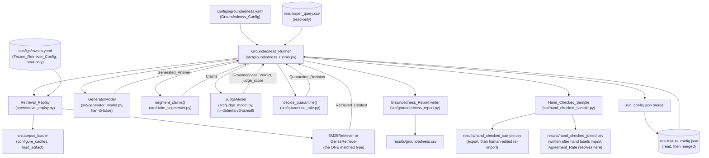
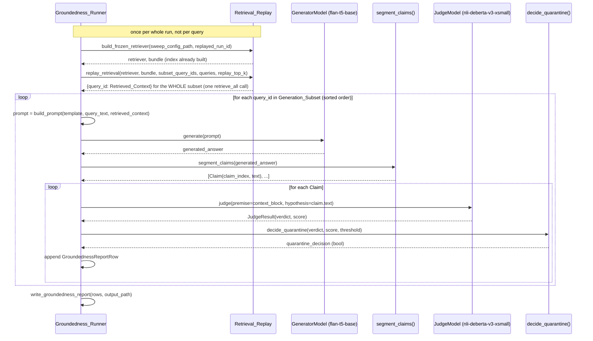

# Design Document: Groundedness Gate

## Overview

This design implements the session-3 stretch goal described in
`requirements.md`: a single entry point that replays one already-frozen
retriever from session 1 over a small, seeded subset of queries,
generates one answer per query with a small CPU-only instruction-tuned
model, splits each answer into claims at sentence boundaries, judges
every claim's support against the same retrieved context with a small
CPU-only NLI cross-encoder distinct from the generator, applies a
threshold-based quarantine rule, and writes one row per claim to
`results/groundedness.csv`. A fixed-size hand-checked sample is
selected independently of the judge's own output and exported for
manual labelling, so the judge's agreement with a human reviewer is
itself measurable rather than assumed.

The design is organized around one non-negotiable data flow: **replay
once, generate once per query, judge every claim, quarantine
deterministically.** Concretely:

- `configs/sweep.yaml`'s frozen retriever configuration is loaded and
  built into exactly one index, and queried in exactly one batched
  `retrieve_all` call scoped to the Generation_Subset's query IDs only
  — never once per query, and never a second retrieval experiment.
- Retrieved_Context, once obtained, is reused unchanged both to build
  the Generator_Model's prompt and as the Judge_Model's premise for
  every Claim in that query's answer.
- The Generator_Model (`google/flan-t5-base`) and the Judge_Model
  (`cross-encoder/nli-deberta-v3-xsmall`) are two distinct models,
  loaded once each, both CPU-only, both cached under `data/`.
- The Judge_Model's native 3-way NLI label is mapped to exactly one of
  `SUPPORTED` / `NOT_SUPPORTED` by a mapping that is a hard-coded
  module constant in code *and* a documented, cross-validated record in
  `configs/groundedness.yaml` — the two must agree at config-load time,
  or the run halts before generating anything.
- `results/groundedness.csv` gets exactly one row per (`query_id`,
  `claim_index`) pair, with no missing-value marker: a Claim's row is
  either fully computed or the whole run halts before writing anything
  (Requirement 8.5) — there is no per-cell degrade-to-`"NA"` path in
  this spec, unlike session 1's `Sweep_Runner`.

Implementation language is Python, matching the pinned libraries in
`requirements.txt` (`transformers`, `torch`, `PyYAML`, `pandas`,
`pytest`; `sentence-transformers` and `beir` are reused transitively
through `src.retrievers.dense_retriever` and `src.corpus_loader`, not
imported directly by any new module in this spec).

## Architecture

### Module layout

```
configs/
  sweep.yaml                    # session 1 (unchanged; read-only input)
  significance.yaml             # significance-testing spec (unchanged)
  groundedness.yaml             # NEW: Groundedness_Config

src/
  __init__.py
  errors.py                     # EXTENDED: new groundedness-gate exceptions
  config.py                     # session 1 (unchanged; reused for Sweep_Config)
  corpus_loader.py               # session 1 (unchanged; reused for configure_caches/load_scifact)
  retrievers/
    base.py                      # session 1 (unchanged)
    bm25_retriever.py             # session 1 (unchanged; reused directly)
    dense_retriever.py            # session 1 (unchanged; reused directly, incl. format_document_text)
  groundedness_labels.py         # NEW: NLI_LABEL_TO_VERDICT constant (dependency-light)
  claim_segmenter.py             # NEW: segment_claims() -- pure function (Requirement 5, 12)
  quarantine_rule.py             # NEW: decide_quarantine() -- pure function (Requirement 7, 12)
  groundedness_config.py         # NEW: GroundednessConfig schema + loader (Requirement 1)
  retrieval_replay.py            # NEW: Retrieval_Replay component (Requirement 3)
  generator_model.py             # NEW: GeneratorModel wrapper (Requirement 4)
  judge_model.py                 # NEW: JudgeModel wrapper (Requirement 6)
  groundedness_report.py         # NEW: GroundednessReportRow schema + writer (Requirement 8)
  hand_checked_sample.py         # NEW: selection + export (no judge output) + import + join + Agreement_Rate (Requirement 10)
  groundedness_runner.py         # NEW: orchestrating entry point, main() (Requirement 2, 9, 11)

tests/
  test_claim_segmenter.py        # NEW (Requirement 12)
  test_quarantine_rule.py        # NEW (Requirement 12)

results/
  groundedness.csv               # NEW artifact (Requirement 8)
  hand_checked_sample.csv        # NEW artifact (Requirement 10; export + re-import,
                                   # same file, ONLY query_id/claim_index/claim_text/
                                   # hand_label -- never the judge's verdict, score, or
                                   # quarantine decision, Requirement 10.8)
  hand_checked_joined.csv        # NEW artifact: written only after hand labels are
                                   # fully imported, by joining the imported
                                   # Hand_Label_Import to the already-computed
                                   # Groundedness_Verdicts; this is what Agreement_Rate
                                   # resolves against (Requirement 10)
  run_config.json                # EXTENDED: new "groundedness" sibling key (Requirement 9)

SPEC.md                           # UNCHANGED by this feature's code. Remains
                                   # hand-authored exactly as the repo-writeup spec
                                   # established for its own three sections; a human
                                   # adds this feature's own section manually -- see
                                   # "Documentation deliverables (manual, not code)"
                                   # below.

docs/
  numeric_traceability.csv        # EXTENDED (repo-writeup spec's ledger): gains new
                                   # Numeric_Claim rows, added by hand alongside this
                                   # feature's manually-authored SPEC.md section -- see
                                   # "Numeric traceability integration" below.

data/                             # gitignored; same hf_cache root session 1 already configures
```

This mirrors the significance-testing spec's split precedent:
`groundedness_labels.py`, `claim_segmenter.py`, and `quarantine_rule.py`
are kept dependency-light (standard library only, plus each other) so
`tests/test_claim_segmenter.py` and `tests/test_quarantine_rule.py` can
import them without pulling in `transformers`, `torch`,
`sentence-transformers`, `src.corpus_loader`, or any retriever module
-- the same reasoning that keeps `src/significance_config.py` and
`src/significance.py`'s two pure functions importable independently of
`src.corpus_loader`/`src.retrievers.*`.

### Component diagram



Note the deliberate absence of any edge from `QRELS` into this
diagram: the Judge_Model checks a Claim against Retrieved_Context
only, never against qrels (Requirement 6.4) -- qrels are the sole
ground truth for session 1/2's retrieval metrics and play no role in
this spec's groundedness judgment.

### Sequence: one Generation_Subset query, end to end



## Components and Interfaces

### `src/errors.py` — extended exception hierarchy

Follows the existing halt-before-partial-write vs. recover-per-cell
convention. This spec has no per-cell recovery path at all (unlike
session 1's `Sweep_Runner`): every one of these is a halt condition,
matching Requirement 8.5's "either fully computed or the whole run
halts" design decision stated in Overview above. `GroundednessConfigError`
subclasses `ConfigError`, matching how `UnsupportedPreprocessingError`
and `BootstrapConfigError` each subclass `ConfigError` for the same
reason: a uniform config-failure contract across every loader in the
repo. `RunConfigMergeError` (already defined, reused verbatim from the
significance-testing spec) is not repeated below.

```python
# --- added to src/errors.py, alongside the existing types ---

class GroundednessConfigError(ConfigError):
    """Groundedness_Config (configs/groundedness.yaml) missing,
    unparsable, or declaring a missing/invalid field (Requirement 1.5)."""


class LabelMappingMismatchError(GroundednessConfigError):
    """The Groundedness_Config's documented native-label-to-
    Groundedness_Verdict mapping record, or its documented score
    definition, disagrees with the corresponding hard-coded constant in
    src/groundedness_labels.py (Requirement 1.5, 6.3, 6.10). Raised at
    config-load time, before any answer is generated -- this is what
    makes "fixed before any Quarantine_Rate exists ... never revised"
    a structurally enforced property rather than a documentation
    promise alone."""


class GenerationSubsetInputError(Exception):
    """results/per_query.csv is absent, cannot be parsed, or lacks a
    run_id column or a query_id column (Requirement 2.1). Halts before
    the Generation_Subset is sampled."""


class ReplayedRunNotFoundError(Exception):
    """The Replayed_Run's run_id declared in the Groundedness_Config is
    not present in results/per_query.csv's run_id column (Requirement
    2.5). Halts before the Generation_Subset is sampled."""


class FrozenRetrieverConfigError(Exception):
    """The Frozen_Retriever_Config declared for the Replayed_Run could
    not be loaded from configs/sweep.yaml, or no retriever config
    entry's name matches the run_id's retriever-name prefix (Requirement
    3.6). Halts the entire run before any Generation_Subset query is
    processed."""


class RetrievalReplayError(Exception):
    """The replayed retriever failed to build its index, or failed to
    retrieve documents for a Generation_Subset query (Requirement 3.7).
    Halts the entire run; no Generated_Answer is produced for any
    remaining query."""


class GeneratorModelLoadError(Exception):
    """The Generator_Model's weights could not be downloaded to or
    loaded from the path under data/ (Requirement 4.7)."""


class GeneratorGenerationError(Exception):
    """The Generator_Model failed to produce a Generated_Answer for a
    Generation_Subset query after its weights had already loaded
    successfully (Requirement 4.8)."""


class JudgeModelLoadError(Exception):
    """The Judge_Model's weights could not be loaded from the path
    under data/, or the loaded model's id2label does not expose an
    'entailment' class (Requirement 6.12)."""


class JudgeVerdictError(Exception):
    """The Judge_Model failed to produce a Groundedness_Verdict for a
    Claim (Requirement 6.12)."""


class GroundednessReportWriteError(Exception):
    """results/groundedness.csv could not be written (Requirement 8.5).
    The groundedness-gate analogue of ReportWriteError."""


class HandCheckedSampleWriteError(Exception):
    """results/hand_checked_sample.csv could not be exported."""


class HandCheckedJoinedWriteError(Exception):
    """results/hand_checked_joined.csv could not be written after
    Hand_Label_Import succeeded (Requirement 10.5). The
    Groundedness_Runner's analogue of GroundednessReportWriteError for
    this third, fully-derived artifact -- never hand-edited, so a
    write failure here is always safe to retry on a later run."""
```

### `src/groundedness_labels.py` — the hard-coded label mapping constant

The single source of truth in *code* for Requirement 6 Criterion 2's
native-label-to-verdict mapping, and the value
`groundedness_config.py` cross-validates the YAML's documented record
against at load time. Standard library only -- no `transformers`
import here, so this module stays importable from a pure-function test
if ever needed, though Requirement 12 does not require a test of this
module directly (it has no branching logic to test; it is a literal).

```python
from __future__ import annotations

from typing import Dict, Literal

Verdict = Literal["SUPPORTED", "NOT_SUPPORTED"]

# The single hard-coded mapping from the Judge_Model's native 3-way NLI
# label to the Groundedness_Verdict (Requirement 6.2). This dict is the
# code-side half of the "declared once, cross-validated against the
# YAML's documented record, never revised after any Quarantine_Rate
# exists" contract (Requirement 6.3) -- see
# groundedness_config.py's _validate_label_mapping.
NLI_LABEL_TO_VERDICT: Dict[str, Verdict] = {
    "entailment": "SUPPORTED",
    "neutral": "NOT_SUPPORTED",
    "contradiction": "NOT_SUPPORTED",
}

# The native NLI label whose softmax probability is the Judge_Model
# score (Requirement 6.9) -- entailment probability, read back through
# the loaded model's own id2label at run time (never a hard-coded
# logit index; see judge_model.py).
ENTAILMENT_LABEL = "entailment"
```

### `src/claim_segmenter.py` — Claim_Segmenter (Requirement 5, 12)

A pure function of a `str`, no model, no network call, no corpus.
Standard library only (`re`).

```python
from __future__ import annotations

import re
from dataclasses import dataclass
from typing import List

# Any occurrence of . ! or ? immediately followed by one or more
# whitespace characters, or by the end of the text (Requirement 5.1).
# The trailing punctuation is captured so it stays attached to the
# preceding segment (Requirement 5.2's "including that segment's
# terminating sentence-boundary punctuation character when present").
_SENTENCE_BOUNDARY = re.compile(r"[.!?](?:\s+|$)")


@dataclass(frozen=True)
class Claim:
    """One sentence-boundary-delimited segment of a Generated_Answer
    (Requirement 5.2). `claim_index` is 0-based position within its
    answer's ordered list of Claims; `text` has leading/trailing
    whitespace removed and never carries a claim_index gap, since
    empty segments are dropped before indices are assigned."""

    claim_index: int
    text: str


def segment_claims(generated_answer: str) -> List[Claim]:
    """Splits `generated_answer` into an ordered list of `Claim`s at
    sentence boundaries (Requirement 5.1).

    Splitting is a crude heuristic, not a solved natural-language-
    processing problem (Requirement 5.4): `_SENTENCE_BOUNDARY` matches
    any of `.`/`!`/`?` followed by whitespace or end-of-string, so an
    abbreviation, a decimal number, or a quotation mark placed after
    the terminator can all mis-split a single intended sentence into
    more than one Claim, or fail to split where a human reader would.
    A mis-split sentence is a source of measurement error in what
    counts as one Claim, not a correctness bug in this function's
    contract -- the contract is exactly the boundary rule in
    Requirement 5.1, not "linguistically correct sentence
    segmentation."

    Segments are trimmed of leading/trailing whitespace; a segment
    that is empty after trimming is dropped and never receives a
    `claim_index` (Requirement 5.2) -- so `claim_index` values are
    always a contiguous 0..n-1 range with no gaps. If, after trimming
    the whole `generated_answer`, no sentence boundary is found (
    including when the trimmed text is the empty string), the entire
    trimmed text becomes a single Claim at `claim_index` 0, rather
    than raising (Requirement 5.5).
    """
    trimmed = generated_answer.strip()
    if not _SENTENCE_BOUNDARY.search(trimmed):
        return [Claim(claim_index=0, text=trimmed)]

    # re.split on a pattern with no capture group would drop the
    # matched boundary text itself, so segments are instead sliced out
    # by scanning match end-positions directly with finditer -- this
    # keeps each segment's terminating punctuation attached, per
    # Requirement 5.2.
    claims: List[Claim] = []
    start = 0
    for match in _SENTENCE_BOUNDARY.finditer(trimmed):
        segment = trimmed[start:match.end()].strip()
        if segment:
            claims.append(Claim(claim_index=len(claims), text=segment))
        start = match.end()
    tail = trimmed[start:].strip()
    if tail:
        claims.append(Claim(claim_index=len(claims), text=tail))
    return claims

### `src/quarantine_rule.py` — Quarantine_Rule (Requirement 7, 12)

A pure, deterministic function of exactly three inputs (Requirement
7.4): no corpus, no model, no file I/O, no other parameter. Standard
library only.

```python
from __future__ import annotations

from src.groundedness_labels import Verdict


def decide_quarantine(verdict: Verdict, score: float, threshold: float) -> bool:
    """Maps (Groundedness_Verdict, score, threshold) to a
    Quarantine_Decision (Requirement 7).

    Three-branch decision table, exhaustive over the two possible
    values of `verdict`:

    - `verdict == "NOT_SUPPORTED"` -> True, regardless of `score`
      (Requirement 7.1).
    - `verdict == "SUPPORTED"` and `score < threshold` -> True
      (Requirement 7.2).
    - `verdict == "SUPPORTED"` and `score >= threshold` -> False
      (Requirement 7.3).

    The `score < threshold` boundary is strict: a score numerically
    equal to `threshold` falls into the third branch (`quarantine ==
    False`), never the second -- this is the exact tie-break
    Requirement 12.4's test case (a) exercises. Same
    (verdict, score, threshold) tuple always returns the same result;
    no randomness, no hidden state.
    """
    if verdict == "NOT_SUPPORTED":
        return True
    return score < threshold
```

### `src/groundedness_config.py` — GroundednessConfig (Requirement 1)

Mirrors `src/significance_config.py`'s `load_significance_config`
shape: a frozen dataclass plus a `load_groundedness_config(path)`
validator raising a `ConfigError` subclass naming the missing/invalid
field. Imports only `PyYAML`, the standard library, and
`src.groundedness_labels` (for the cross-validation step) -- never
`transformers`, `torch`, `src.corpus_loader`, or any retriever module,
so the config can be loaded and validated without touching a model or
the corpus.

```python
from __future__ import annotations

from dataclasses import dataclass
from pathlib import Path
from typing import Any, Dict

import yaml

from src.errors import GroundednessConfigError, LabelMappingMismatchError
from src.groundedness_labels import ENTAILMENT_LABEL, NLI_LABEL_TO_VERDICT


@dataclass(frozen=True)
class GroundednessConfig:
    replayed_run_id: str            # e.g. "bm25__whole_document"
    replay_top_k: int               # single explicit positive int (Req 1.6)
    generation_subset_size: int      # single explicit positive int (Req 1.6)
    generation_subset_seed: int      # single explicit int, distinct from hand_checked_sample_seed (Req 1.2)
    generator_model_name: str        # "google/flan-t5-base"
    judge_model_name: str            # "cross-encoder/nli-deberta-v3-xsmall"
    prompt_template: str             # e.g. "Question: {query}\nContext:\n{context}\nAnswer:"
    quarantine_threshold: float      # single explicit numeric value (Req 1.7)
    hand_checked_sample_size: int    # single explicit positive int, default 50 (Req 1.4)
    hand_checked_sample_seed: int    # single explicit int, distinct from generation_subset_seed (Req 1.2)
    label_mapping: Dict[str, str]     # documented record, cross-validated (Req 1.1, 6.3)
    score_definition: str             # documented free-text record (Req 1.1, 6.10)
    sweep_config_path: Path           # default configs/sweep.yaml
    per_query_path: Path              # default results/per_query.csv
    run_config_path: Path             # default results/run_config.json
    output_path: Path                 # default results/groundedness.csv
    hand_checked_sample_path: Path    # default results/hand_checked_sample.csv
    hand_checked_joined_path: Path    # default results/hand_checked_joined.csv (written only after Hand_Label_Import succeeds)


def load_groundedness_config(path: Path) -> GroundednessConfig:
    """Reads and validates configs/groundedness.yaml.

    Raises `GroundednessConfigError` if the file is missing, is not
    valid YAML, or omits any field required by Requirement 1 Criterion
    1; if `generator_model_name == judge_model_name` (Requirement 1.3);
    if `replay_top_k` / `generation_subset_size` /
    `hand_checked_sample_size` is not a positive integer (Requirement
    1.5, 1.6); if `generation_subset_seed` or `hand_checked_sample_seed`
    is not an integer (Requirement 1.5); or if `quarantine_threshold` is
    not numeric (Requirement 1.5, 1.7). Raises
    `LabelMappingMismatchError` (a `GroundednessConfigError` subclass)
    if the YAML's `label_mapping` record disagrees with
    `NLI_LABEL_TO_VERDICT`, or if `score_definition` does not match the
    fixed expected text (Requirement 1.1, 6.3, 6.10) -- see
    `_validate_label_mapping` below. Never partially applies a config:
    the first violation raises and no `GroundednessConfig` is returned.
    """
    ...


def _validate_label_mapping(declared: Dict[str, Any], context: str) -> None:
    """Raises `LabelMappingMismatchError` unless `declared` is
    exactly equal to `NLI_LABEL_TO_VERDICT` (Requirement 6.3) --
    same keys (`entailment`, `neutral`, `contradiction`), same values
    (`SUPPORTED`/`NOT_SUPPORTED`), same `ENTAILMENT_LABEL` key present.
    Mirrors `src/config.py`'s `_load_bm25_config` validating
    `tokenizer`/`stopwords`/`stemming` against `SUPPORTED_BM25_*`
    module constants: the YAML is data, but data that must agree with
    a fixed code-side constant, not data the code blindly trusts.
    """
    ...
```

### `src/retrieval_replay.py` — Retrieval_Replay (Requirement 3)

Read-only reuse of session 1's own config loader, corpus loader, and
retriever classes -- this module adds no new retrieval logic. It
imports `src.config.load_sweep_config`, `src.corpus_loader.
configure_caches`/`load_scifact`, `src.retrievers.base.Retriever`, and
both concrete retriever classes, but constructs only the ONE retriever
type that matches the Replayed_Run's name -- never both, the same
"exactly one matched type" discipline `make_default_retriever_factory`
uses per-retriever-config in session 1, narrowed here to a single
lookup instead of a loop over two.

```python
from __future__ import annotations

from pathlib import Path
from typing import Dict, List, Tuple

from src.config import BM25RetrieverConfig, DenseRetrieverConfig, SweepConfig, load_sweep_config
from src.corpus_loader import CorpusBundle, configure_caches, load_scifact
from src.errors import ConfigError, CorpusLoadError, CorpusValidationError, FrozenRetrieverConfigError, RetrievalReplayError
from src.retrievers.base import Retriever
from src.retrievers.dense_retriever import format_document_text


def _retriever_name_from_run_id(run_id: str) -> str:
    """Extracts the retriever name prefix from a run_id formed as
    f"{retriever_config.name}__{chunking_strategy}" (the exact
    convention src/sweep_runner.py already uses). Splits on the first
    "__" only, since a retriever name itself never contains "__" in
    this repo's fixed grid."""
    return run_id.split("__", 1)[0]


def load_frozen_retriever_config(
    sweep_config_path: Path, replayed_run_id: str
) -> Tuple[SweepConfig, "BM25RetrieverConfig | DenseRetrieverConfig"]:
    """Loads configs/sweep.yaml via load_sweep_config, then returns the
    one retriever config entry whose `name` matches
    `replayed_run_id`'s prefix before "__" (Requirement 3.3: reused
    exactly as declared, no field modified).

    Raises `FrozenRetrieverConfigError` if configs/sweep.yaml cannot be
    loaded (wrapping the underlying `ConfigError`), or if no retriever
    config entry's `name` matches (Requirement 3.6).
    """
    try:
        sweep_config = load_sweep_config(sweep_config_path)
    except ConfigError as exc:
        raise FrozenRetrieverConfigError(
            f"failed to load the Frozen_Retriever_Config's source file "
            f"{sweep_config_path}: {exc}"
        ) from exc
    target_name = _retriever_name_from_run_id(replayed_run_id)
    for retriever_config in sweep_config.retrievers:
        if retriever_config.name == target_name:
            return sweep_config, retriever_config
    raise FrozenRetrieverConfigError(
        f"no retriever named {target_name!r} (parsed from replayed_run_id "
        f"{replayed_run_id!r}) is declared in {sweep_config_path}"
    )


def build_frozen_retriever(
    sweep_config: SweepConfig,
    retriever_config: "BM25RetrieverConfig | DenseRetrieverConfig",
) -> Tuple[Retriever, CorpusBundle]:
    """Constructs the ONE matched retriever type, loads the real
    corpus via configure_caches + load_scifact (a genuine, non-mocked
    corpus load -- the Frozen_Retriever_Config needs a real index to
    replay against), and builds that retriever's index exactly once
    over the full loaded corpus (Requirement 3.1).

    Raises `FrozenRetrieverConfigError` if the corpus fails to load
    (wrapping CorpusLoadError/CorpusValidationError). Raises
    `RetrievalReplayError` if index construction fails.
    """
    configure_caches(sweep_config.data_dir)
    try:
        bundle, _report = load_scifact(sweep_config.data_dir)
    except (CorpusLoadError, CorpusValidationError) as exc:
        raise FrozenRetrieverConfigError(
            f"Retrieval_Replay could not load the corpus needed to "
            f"rebuild the Frozen_Retriever_Config's index: {exc}"
        ) from exc

    if isinstance(retriever_config, BM25RetrieverConfig):
        from src.retrievers.bm25_retriever import BM25Retriever
        retriever: Retriever = BM25Retriever(retriever_config)
    else:
        from src.retrievers.dense_retriever import DenseRetriever
        retriever = DenseRetriever(
            retriever_config, cache_folder=sweep_config.data_dir / "hf_cache"
        )

    try:
        retriever.build_index(bundle.corpus)
    except Exception as exc:
        raise RetrievalReplayError(f"index construction failed for {retriever.name}: {exc}") from exc

    return retriever, bundle

def replay_retrieval(
    retriever: Retriever,
    bundle: CorpusBundle,
    subset_query_ids: List[str],
    queries: Dict[str, str],
    replay_top_k: int,
) -> Dict[str, List[str]]:
    """Issues exactly ONE `retrieve_all` call, with `queries` limited
    to `subset_query_ids` only (Requirement 3.5), at
    `top_k=replay_top_k`, and returns `{query_id: Retrieved_Context}`
    -- each Retrieved_Context is the ordered list of document texts
    (via `format_document_text`, preserving retrieval-rank order)
    corresponding to that query's ranked document IDs (Requirement
    3.2).

    Calling this once for the whole subset, rather than once per
    query_id, is what satisfies both Requirement 3.1 ("rather than
    rebuilding ... separately for each Generation_Subset query") and
    Requirement 3.5 ("SHALL NOT issue a retrieval call for any query
    outside the Generation_Subset") simultaneously: there is exactly
    one call, and its `queries` argument is pre-filtered to the subset
    before the call is made, not filtered from a larger result
    afterward.

    Raises `RetrievalReplayError` naming the failed query ID (best
    effort; the underlying retriever's `retrieve_all` does not fail
    per-query, so a raised exception here fails the entire subset) if
    retrieval fails.
    """
    subset_queries = {qid: queries[qid] for qid in subset_query_ids}
    try:
        ranked_lists, _query_latency = retriever.retrieve_all(subset_queries, top_k=replay_top_k)
    except Exception as exc:
        raise RetrievalReplayError(
            f"retrieval failed for the Generation_Subset ({len(subset_query_ids)} "
            f"queries) at replay_top_k={replay_top_k}: {exc}"
        ) from exc

    retrieved_context: Dict[str, List[str]] = {}
    for qid, doc_ids in ranked_lists.items():
        retrieved_context[qid] = [format_document_text(bundle.corpus[doc_id]) for doc_id in doc_ids]
    return retrieved_context
```

### `src/generator_model.py` — GeneratorModel (Requirement 4)

Loads `google/flan-t5-base` via `transformers.AutoTokenizer` +
`transformers.AutoModelForSeq2SeqLM` -- T5 is encoder-decoder, not
causal, so `AutoModelForCausalLM` would be the wrong class. `device`
is hard-coded to `"cpu"`, never conditional on CUDA availability,
mirroring `DenseRetriever.__init__`'s hard-coded `device="cpu"`
(Requirement 4.3). `cache_folder` is the same `data_dir / "hf_cache"`
root `configure_caches()` already points `HF_HOME`/`HF_HUB_CACHE` at
-- no second cache root is introduced.

```python
from __future__ import annotations

from pathlib import Path

from transformers import AutoModelForSeq2SeqLM, AutoTokenizer

from src.errors import GeneratorGenerationError, GeneratorModelLoadError


class GeneratorModel:
    """Wraps google/flan-t5-base for CPU-only, greedy-decoded answer
    generation (Requirement 4)."""

    def __init__(self, model_name: str, cache_folder: Path) -> None:
        try:
            self._tokenizer = AutoTokenizer.from_pretrained(
                model_name, cache_dir=str(cache_folder)
            )
            self._model = AutoModelForSeq2SeqLM.from_pretrained(
                model_name, cache_dir=str(cache_folder)
            ).to("cpu")
        except Exception as exc:
            raise GeneratorModelLoadError(
                f"failed to load Generator_Model {model_name!r} with "
                f"cache_folder {cache_folder}: {exc}"
            ) from exc

    def generate(self, prompt: str) -> str:
        """Produces exactly one Generated_Answer for `prompt`
        (Requirement 4.4).

        Uses greedy decoding (`do_sample=False`, `num_beams=1`) --
        deliberately, and exclusively, because greedy decoding is
        deterministic by construction: the same input_ids always
        produce the same output token sequence on the same model
        weights, with no sampling RNG involved anywhere in the decode
        loop. This is what satisfies Requirement 4.4's byte-for-byte-
        identical-rerun guarantee without introducing a third seed the
        requirements never declare (Generation_Subset_Seed and
        Hand_Checked_Sample_Seed are the only two seeds Requirement 1
        names) -- there is no generation-time randomness to seed in
        the first place.
        """
        try:
            inputs = self._tokenizer(prompt, return_tensors="pt", truncation=True)
            output_ids = self._model.generate(
                **inputs, do_sample=False, num_beams=1
            )
            return self._tokenizer.decode(output_ids[0], skip_special_tokens=True)
        except Exception as exc:
            raise GeneratorGenerationError(
                f"Generator_Model failed to produce a Generated_Answer: {exc}"
            ) from exc
```

`GeneratorGenerationError` is raised without a `query_id` at this
layer (the wrapper has no notion of which query it was called for);
`groundedness_runner.py` catches it and re-raises with the failing
query's `query_id` attached to the message, satisfying Requirement
4.8's "identifying that query's `query_id`" without duplicating that
context inside the model wrapper itself.

### `src/judge_model.py` — JudgeModel (Requirement 6)

Loads `cross-encoder/nli-deberta-v3-xsmall` directly via
`transformers.AutoTokenizer` + `transformers.AutoModelForSequenceClassification`
-- not `sentence_transformers.CrossEncoder` -- so the label-index
order is read from the loaded model's own `model.config.id2label` at
run time rather than assumed from `sentence_transformers`' own
softmax/label conventions, which the requirements never reference.
Same CPU-only, same `data/hf_cache` root as `GeneratorModel`.

```python
from __future__ import annotations

from dataclasses import dataclass
from pathlib import Path

import torch
from transformers import AutoModelForSequenceClassification, AutoTokenizer

from src.errors import JudgeModelLoadError, JudgeVerdictError
from src.groundedness_labels import ENTAILMENT_LABEL, NLI_LABEL_TO_VERDICT, Verdict


@dataclass(frozen=True)
class JudgeResult:
    verdict: Verdict
    score: float   # entailment probability, softmax over the 3 logits, in [0.0, 1.0]


class JudgeModel:
    """Wraps cross-encoder/nli-deberta-v3-xsmall for CPU-only NLI
    groundedness judging (Requirement 6)."""

    def __init__(self, model_name: str, cache_folder: Path) -> None:
        try:
            self._tokenizer = AutoTokenizer.from_pretrained(
                model_name, cache_dir=str(cache_folder)
            )
            self._model = AutoModelForSequenceClassification.from_pretrained(
                model_name, cache_dir=str(cache_folder)
            ).to("cpu")
            self._model.eval()
        except Exception as exc:
            raise JudgeModelLoadError(
                f"failed to load Judge_Model {model_name!r} with "
                f"cache_folder {cache_folder}: {exc}"
            ) from exc

        # id2label -> label2idx, read from the model's own config
        # rather than a hard-coded logit position (Requirement 6.9).
        id2label = {int(i): label.lower() for i, label in self._model.config.id2label.items()}
        self._label2idx = {label: i for i, label in id2label.items()}
        if ENTAILMENT_LABEL not in self._label2idx:
            raise JudgeModelLoadError(
                f"loaded Judge_Model {model_name!r}'s id2label does not "
                f"expose an {ENTAILMENT_LABEL!r} class: {id2label!r}"
            )

    def judge(self, premise: str, hypothesis: str) -> JudgeResult:
        """Scores whether `premise` (the query's Retrieved_Context,
        joined into one string) entails `hypothesis` (one Claim's
        text) -- the standard NLI direction for a support check: "does
        the context entail the claim" (Requirement 6.1).

        Tokenizes as a premise/hypothesis pair (the tokenizer's own
        pair-encoding, matching how this cross-encoder was trained),
        truncated to the tokenizer's own max length. Computes softmax
        over the 3 logits, reads the entailment class's probability
        via `self._label2idx[ENTAILMENT_LABEL]` as the Judge_Model
        score (Requirement 6.9), and determines the predicted native
        label via `argmax` over the same 3 logits (not re-derived from
        the softmax probabilities -- logits and their softmax share
        the same argmax, so this is equivalent but avoids a second,
        redundant computation), mapped to a Groundedness_Verdict via
        `NLI_LABEL_TO_VERDICT` (Requirement 6.2).
        """
        try:
            inputs = self._tokenizer(
                premise, hypothesis, return_tensors="pt", truncation=True
            )
            with torch.no_grad():
                logits = self._model(**inputs).logits[0]
            probabilities = torch.softmax(logits, dim=-1)
            predicted_idx = int(torch.argmax(logits).item())
            predicted_label = [
                label for label, idx in self._label2idx.items() if idx == predicted_idx
            ][0]
            verdict = NLI_LABEL_TO_VERDICT[predicted_label]
            score = float(probabilities[self._label2idx[ENTAILMENT_LABEL]].item())
            return JudgeResult(verdict=verdict, score=score)
        except Exception as exc:
            raise JudgeVerdictError(f"Judge_Model failed to produce a verdict: {exc}") from exc
```

As with `GeneratorGenerationError`, `JudgeVerdictError` is raised
without `query_id`/`claim_index` context at this layer;
`groundedness_runner.py` attaches that context when it catches the
exception, satisfying Requirement 6.12's "identifying the failing
Claim's `query_id` and `claim_index`."

**Retrieved_Context join format.** The `premise` string passed to
`JudgeModel.judge` is the query's Retrieved_Context document texts
joined with `"\n\n"` (a blank line between documents), in retrieval-
rank order, unmodified from the order `replay_retrieval` returned --
the same join format used to build the Generator_Model's prompt (see
`build_prompt` below), so the Judge_Model checks each Claim against
literally the same text block the Generator_Model was shown, not a
re-derived or re-ordered variant of it.

### `src/groundedness_report.py` — Groundedness_Report writer (Requirement 8)

Mirrors `src/per_query_report.py`'s shape exactly: a frozen dataclass
schema plus a writer reusing `src.report._atomic_write_text`.

```python
from __future__ import annotations

import dataclasses
from dataclasses import dataclass
from pathlib import Path
from typing import List

import pandas

from src.errors import GroundednessReportWriteError
from src.report import _atomic_write_text


@dataclass(frozen=True)
class GroundednessReportRow:
    """One row of results/groundedness.csv: exactly one (query_id,
    claim_index) pair (Requirement 8.1). Column names and order match
    Requirement 8 Criterion 2 exactly. None of these columns carries a
    missing-value marker -- a row is either fully computed or the
    whole run halts before this writer is ever called (Requirement
    8.5)."""

    query_id: str
    claim_index: int
    claim_text: str
    groundedness_verdict: str   # "SUPPORTED" or "NOT_SUPPORTED"
    judge_score: float          # entailment probability, [0.0, 1.0]
    quarantine_decision: bool


def write_groundedness_report(rows: List[GroundednessReportRow], output_path: Path) -> None:
    """Writes `rows` to `output_path` (default results/groundedness.csv)
    as a CSV, atomically, via src.report._atomic_write_text (temp file
    + os.replace, temp removed on failure). Columns fixed to
    GroundednessReportRow's field order; rows written in the order
    given (Requirement 8.1). Every produced Claim's row is retained
    regardless of its verdict or quarantine_decision -- this function
    never filters `rows` (Requirement 8.4). Raises
    GroundednessReportWriteError on any failure, leaving output_path
    either absent or byte-for-byte in its pre-run state (Requirement
    8.5).
    """
    output_path = Path(output_path)
    fieldnames = [f.name for f in dataclasses.fields(GroundednessReportRow)]
    try:
        frame = pandas.DataFrame(
            [dataclasses.asdict(row) for row in rows], columns=fieldnames
        )
        csv_text = frame.to_csv(index=False)
    except Exception as exc:
        raise GroundednessReportWriteError(
            f"failed to build groundedness report for {output_path}: {exc}"
        ) from exc
    try:
        _atomic_write_text(output_path, csv_text, failure_context="groundedness report")
    except Exception as exc:
        raise GroundednessReportWriteError(str(exc)) from exc
```

Note there is no `Quarantine_Rate` field or column anywhere in this
schema or writer (Requirement 8.3): `Quarantine_Rate` is always
`mean(rows["quarantine_decision"])`, computed by whoever reads
`results/groundedness.csv`, never stored as a literal in this repo.

### `src/hand_checked_sample.py` — Hand_Checked_Sample (Requirement 10)

Selection is computed from Claim identity alone (`query_id`,
`claim_index`), a canonical sort order, and the
`Hand_Checked_Sample_Seed` -- never from any `Groundedness_Verdict`,
`judge_score`, or `quarantine_decision` (Requirement 10.2). This is
enforced structurally by the function's argument list, not by
convention: `select_hand_checked_sample` below takes only `claim_ids`
(a list of `(query_id, claim_index)` tuples) and `seed`, so there is
no parameter through which a verdict, score, or quarantine decision
could reach the selection even by mistake.

The export file and the re-import file are the *same path*
(`results/hand_checked_sample.csv`), edited in place by a human between
runs (design decision noted in the requirements' Requirement 10
Criterion 7: "SHALL NOT overwrite that file ... leave the existing
Hand_Label values unmodified" only makes sense against one artifact
that is exported once and then re-read on every subsequent run).

```python
from __future__ import annotations

import dataclasses
import random
from dataclasses import dataclass
from pathlib import Path
from typing import Dict, List, Optional, Tuple

import pandas

from src.errors import HandCheckedJoinedWriteError, HandCheckedSampleWriteError
from src.report import _atomic_write_text

ClaimId = Tuple[str, int]   # (query_id, claim_index)


def select_hand_checked_sample(claim_ids: List[ClaimId], sample_size: int, seed: int) -> List[ClaimId]:
    """Draws `min(sample_size, len(claim_ids))` claim IDs uniformly at
    random, without replacement, from `claim_ids` sorted into
    canonical order (by query_id, then claim_index) before sampling,
    seeded with `seed` (Requirement 10.1, 10.3).

    Takes only `claim_ids` and `seed` as input -- no verdict, score, or
    quarantine_decision parameter exists on this function's signature,
    so Requirement 10.2's independence is a structural property of the
    call site, not a convention a future edit could quietly violate.
    """
    canonical_order = sorted(claim_ids)
    rng = random.Random(seed)
    k = min(sample_size, len(canonical_order))
    return rng.sample(canonical_order, k)

@dataclass(frozen=True)
class HandCheckedSampleRow:
    query_id: str
    claim_index: int
    claim_text: str
    hand_label: str   # blank ("") until a human fills it in


def export_hand_checked_sample(
    rows: List[HandCheckedSampleRow], output_path: Path
) -> None:
    """Writes `rows` to `output_path` (default
    results/hand_checked_sample.csv), atomically, with a blank
    `hand_label` field (Requirement 10.4). This export intentionally
    excludes the Claim's Groundedness_Verdict, Judge_Model score, and
    Quarantine_Decision (Requirement 10.8) -- a human labelling from
    this file must not see, or be anchored by, the judge's own
    determination for that Claim. This is also why Agreement_Rate
    cannot be resolved from this file alone; see
    `join_hand_labels_with_verdicts` / `write_hand_checked_joined`
    below for the derived artifact that carries both columns.

    If `output_path` already exists AND contains a non-blank
    `hand_label` for one or more of its rows, this function does
    NOT overwrite it -- it returns without writing, leaving the
    existing file and its Hand_Label values unmodified (Requirement
    10.7). "Non-blank" means neither an empty string nor a string
    containing only whitespace (matching Requirement 10.5/10.6's
    definition). Raises HandCheckedSampleWriteError if the write
    itself fails.
    """
    if output_path.is_file():
        existing = pandas.read_csv(output_path, dtype=str, keep_default_na=False)
        if "hand_label" in existing.columns and existing["hand_label"].str.strip().ne("").any():
            return
    try:
        frame = pandas.DataFrame([dataclasses.asdict(r) for r in rows])
        _atomic_write_text(output_path, frame.to_csv(index=False), failure_context="hand-checked sample export")
    except Exception as exc:
        raise HandCheckedSampleWriteError(str(exc)) from exc


def read_hand_label_import(
    path: Path, expected_claim_ids: List[ClaimId]
) -> Optional[Dict[ClaimId, str]]:
    """Reads `path` (the same results/hand_checked_sample.csv path) and
    returns `{(query_id, claim_index): hand_label}` ONLY if `path`
    exists, contains a row for every one of `expected_claim_ids`, and
    every one of those rows carries a non-blank `hand_label`
    (Requirement 10.5). Otherwise returns `None` (Requirement 10.6) --
    the caller leaves the file available for manual labelling and does
    not compute Agreement_Rate.
    """
    ...


def compute_agreement_rate(
    judge_verdicts: Dict[ClaimId, str], hand_labels: Dict[ClaimId, str]
) -> float:
    """Fraction of `hand_labels`' keys whose judge_verdicts[key] ==
    hand_labels[key] (Requirement 10.5's Agreement_Rate definition).
    Pure function of the two dicts; assumes read_hand_label_import
    already verified full coverage and non-blank labels.
    """
    matches = sum(1 for cid, label in hand_labels.items() if judge_verdicts.get(cid) == label)
    return matches / len(hand_labels) if hand_labels else 0.0


@dataclass(frozen=True)
class HandCheckedJoinedRow:
    """One row of results/hand_checked_joined.csv -- written ONLY
    after read_hand_label_import returns non-None (every Hand_Label
    present and non-blank), joining that Claim's already-computed
    Groundedness_Verdict (from the same run's judging step, never
    re-derived) to its Hand_Label. This is the ONE artifact that
    carries both columns side by side, and it exists specifically so
    Agreement_Rate can be resolved as a single-artifact aggregate at
    verification time without ever exposing the judge's verdict in the
    file a human actually labels from (results/hand_checked_sample.csv,
    Requirement 10.8)."""

    query_id: str
    claim_index: int
    judge_verdict: str
    hand_label: str


def join_hand_labels_with_verdicts(
    judge_verdicts: Dict[ClaimId, str], hand_labels: Dict[ClaimId, str]
) -> List[HandCheckedJoinedRow]:
    """Builds one HandCheckedJoinedRow per key of `hand_labels` (every
    Hand_Checked_Sample Claim with a non-blank Hand_Label), pairing it
    with that Claim's judge_verdicts[key] -- assumes
    read_hand_label_import already verified full coverage, so every
    key of hand_labels is guaranteed present in judge_verdicts."""
    return [
        HandCheckedJoinedRow(
            query_id=qid, claim_index=idx, judge_verdict=judge_verdicts[(qid, idx)], hand_label=label
        )
        for (qid, idx), label in sorted(hand_labels.items())
    ]


def write_hand_checked_joined(rows: List[HandCheckedJoinedRow], output_path: Path) -> None:
    """Writes `rows` to `output_path` (default
    results/hand_checked_joined.csv), atomically, via
    src.report._atomic_write_text. Unlike
    export_hand_checked_sample's `results/hand_checked_sample.csv`
    (which a human hand-edits and must never be overwritten once
    labelled -- Requirement 10.7), this file is fully derived and never
    hand-edited, so it is safe to overwrite unconditionally on every
    run that successfully reads back a complete Hand_Label_Import.
    Raises HandCheckedJoinedWriteError on any failure, leaving
    output_path either absent or byte-for-byte in its pre-run state.
    """
    try:
        frame = pandas.DataFrame([dataclasses.asdict(r) for r in rows])
        _atomic_write_text(output_path, frame.to_csv(index=False), failure_context="hand-checked joined export")
    except Exception as exc:
        raise HandCheckedJoinedWriteError(str(exc)) from exc
```

### `src/groundedness_runner.py` — Groundedness_Runner (entry point)

The orchestrating module. Imports everything above; is the only module
in this spec that imports both `src.generator_model` and
`src.judge_model` together (Requirement 6.5's "distinct from the
Generator_Model" is a config-load-time check per `groundedness_config.py`,
but this module is where both wrapper instances actually coexist at
run time).

```python
def build_prompt(template: str, query_text: str, retrieved_context: List[str]) -> str:
    """Combines `query_text` and `retrieved_context` into the
    Generator_Model's input text via `template.format(...)`
    (Requirement 4.1).

    `retrieved_context`'s documents are newline-joined in rank order
    (`"\n\n".join(retrieved_context)`) before substitution -- the exact
    same join format `JudgeModel.judge`'s `premise` argument uses (see
    judge_model.py), so the Generator_Model and the Judge_Model are
    always shown literally the same context block for a given query,
    never two independently-formatted variants of it. `template` is
    read once from the Groundedness_Config and never modified for the
    duration of a run (Requirement 4.2) -- there is no code path in
    this module that mutates `config.prompt_template` after the first
    generate() call.
    """
    context_block = "\n\n".join(retrieved_context)
    return template.format(query=query_text, context=context_block)


def main(argv: Optional[List[str]] = None) -> int:
    """CLI entry point: `python -m src.groundedness_runner [--config PATH]`.

    Orchestration, in order:

    1. Parse `--config` (default `configs/groundedness.yaml`); load via
       `load_groundedness_config`. On `GroundednessConfigError` (incl.
       `LabelMappingMismatchError`): print, return non-zero, write
       nothing (Requirement 1.5).
    2. Read `results/per_query.csv` (Requirement 2.1); determine the
       set of query IDs the Replayed_Run's run_id actually scored
       (Requirement 2.2). On `GenerationSubsetInputError` /
       `ReplayedRunNotFoundError`: print, return non-zero, write
       nothing (Requirement 2.1, 2.5).
    3. Sample the Generation_Subset via the same seeded,
       canonical-order draw pattern `select_hand_checked_sample` uses
       (sorted query IDs, `random.Random(generation_subset_seed).sample(...)`,
       capped at the identified set's size -- Requirement 2.3, 2.6).
    4. `load_frozen_retriever_config` + `build_frozen_retriever`
       (Requirement 3.1, 3.6). On `FrozenRetrieverConfigError`: print,
       return non-zero, write nothing.
    5. `replay_retrieval` over the whole Generation_Subset in one call
       (Requirement 3.2, 3.5). On `RetrievalReplayError`: print, return
       non-zero, write nothing (Requirement 3.7).
    6. Construct `GeneratorModel(config.generator_model_name, cache_folder)`
       and `JudgeModel(config.judge_model_name, cache_folder)` --
       `cache_folder = sweep_config.data_dir / "hf_cache"`, the same
       root `configure_caches` already pointed at in step 4. On
       `GeneratorModelLoadError` / `JudgeModelLoadError`: print, return
       non-zero, write nothing.
    7. For each query_id in the Generation_Subset, in sorted order:
       build the prompt, call `generator.generate(prompt)` (wrapping
       `GeneratorGenerationError` with that query_id attached --
       Requirement 4.8), call `segment_claims(generated_answer)`, then
       for each Claim call `judge_model.judge(context_block, claim.text)`
       (wrapping `JudgeVerdictError` with that query_id/claim_index
       attached -- Requirement 6.12) and `decide_quarantine(...)`, and
       append one `GroundednessReportRow`. Any exception in this loop
       halts the entire run before `write_groundedness_report` is ever
       called (Requirement 4.8, 6.12) -- there is no partial-answer or
       partial-report recovery path in this spec.
    8. `write_groundedness_report(rows, config.output_path)`. On
       `GroundednessReportWriteError`: print, return non-zero
       (Requirement 8.5).
    9. Select and export the Hand_Checked_Sample via
       `select_hand_checked_sample` + `export_hand_checked_sample`
       (Requirement 10.1, 10.4, 10.7 -- a no-op if the file already
       carries hand labels). Each exported `HandCheckedSampleRow`
       carries only `query_id`, `claim_index`, and `claim_text` plus a
       blank `hand_label` -- never that Claim's Groundedness_Verdict,
       judge_score, or Quarantine_Decision (Requirement 10.8), so a
       human labelling from this file is never anchored by the judge's
       own determination.
    10. Attempt `read_hand_label_import`; if it returns non-`None`
        (every Hand_Checked_Sample Claim has a non-blank Hand_Label),
        build the joined rows via `join_hand_labels_with_verdicts`,
        pairing each Claim's already-computed Groundedness_Verdict
        (from step 7's judging loop, never re-derived) with its
        Hand_Label, and write them via `write_hand_checked_joined(rows,
        config.hand_checked_joined_path)` (default
        `results/hand_checked_joined.csv`) -- the one artifact that
        carries both columns side by side, and the artifact
        Agreement_Rate resolves against at verification time. On
        `HandCheckedJoinedWriteError`: print, return non-zero. Also
        compute and print Agreement_Rate via `compute_agreement_rate`
        for the run's own stdout, purely informational -- this value is
        never written to any file as a stored literal; it remains
        derivable from `results/hand_checked_joined.csv` by whoever
        reads it, the same "no number without a receipt" discipline
        already applied to Quarantine_Rate (Requirement 8.3).
    11. Merge the `"groundedness"` sibling key into
        `results/run_config.json` (see Data Models below). On
        `RunConfigMergeError`: print, return non-zero (Requirement
        9.4, 9.5). Return 0.
    """
```

Note on step 11's merge, mirroring `src/significance.py`'s
`_merge_significance_into_run_config` exactly: read the existing
`results/run_config.json`, raise `RunConfigMergeError` if it is absent
or unparsable (never create a fresh record -- Requirement 9.4), set
`record["groundedness"] = {...}` (overwriting that sibling key if
already present from an earlier run -- Requirement 9.1), preserve every
other existing key unchanged (Requirement 9.2), serialize with the same
`json.dumps(..., indent=2, default=_json_default)` handler so any
nested `Path` stays POSIX-form, and write via
`src.report._atomic_write_text`, catching `ReportWriteError` and
re-raising as `RunConfigMergeError` (Requirement 9.5).

## Data Models

### `configs/groundedness.yaml` schema

```yaml
# Groundedness_Config for the groundedness-gate spec (rag-retrieval-sweep).
#
# Declares, as data, which frozen session-1 run to replay retrieval
# from, the generation subset and hand-checked sample sizes/seeds, both
# model identifiers, the prompt template, the quarantine threshold, and
# a documented, cross-validated record of the Judge_Model's native-
# label-to-Groundedness_Verdict mapping and score definition
# (Requirement 1.1, 6.3, 6.10). Fixed once, before any Quarantine_Rate
# exists; the label_mapping/score_definition fields below must agree
# with src/groundedness_labels.py's NLI_LABEL_TO_VERDICT or the run
# halts at config-load time.

replayed_run_id: bm25__whole_document

replay_top_k: 10

generation_subset_size: 30
generation_subset_seed: 4242

hand_checked_sample_size: 50
hand_checked_sample_seed: 777        # distinct from generation_subset_seed

generator_model_name: google/flan-t5-base
judge_model_name: cross-encoder/nli-deberta-v3-xsmall

prompt_template: |
  Question: {query}
  Context:
  {context}
  Answer:

quarantine_threshold: 0.5

# Documented record, cross-validated against
# src/groundedness_labels.py's NLI_LABEL_TO_VERDICT at config-load
# time (Requirement 6.3). The Judge_Model's native 3-way label maps to
# exactly one of SUPPORTED / NOT_SUPPORTED.
label_mapping:
  entailment: SUPPORTED
  neutral: NOT_SUPPORTED
  contradiction: NOT_SUPPORTED

# Documented record of what judge_score means (Requirement 6.10).
score_definition: >
  The entailment probability obtained by applying softmax to the
  Judge_Model's three logits (entailment, neutral, contradiction);
  a value in [0.0, 1.0] where a higher value indicates stronger
  support for the Claim by the Retrieved_Context.

sweep_config_path: configs/sweep.yaml
per_query_path: results/per_query.csv
run_config_path: results/run_config.json
output_path: results/groundedness.csv
hand_checked_sample_path: results/hand_checked_sample.csv
hand_checked_joined_path: results/hand_checked_joined.csv   # written only after Hand_Label_Import succeeds; Agreement_Rate resolves here
```

| Field | Type | Constraint |
|---|---|---|
| `replayed_run_id` | str | must be present in `results/per_query.csv`'s `run_id` column (Req 2.5) |
| `replay_top_k` | int | single explicit positive integer (Req 1.6) |
| `generation_subset_size` | int | single explicit positive integer (Req 1.6) |
| `generation_subset_seed` | int | single explicit integer, distinct from `hand_checked_sample_seed` (Req 1.2) |
| `hand_checked_sample_size` | int | single explicit positive integer, default 50 (Req 1.4) |
| `hand_checked_sample_seed` | int | single explicit integer, distinct from `generation_subset_seed` (Req 1.2) |
| `generator_model_name` | str | must differ from `judge_model_name` (Req 1.3) |
| `judge_model_name` | str | must differ from `generator_model_name` (Req 1.3) |
| `prompt_template` | str | non-empty; combines `{query}` and `{context}` |
| `quarantine_threshold` | float | single explicit numeric value (Req 1.7) |
| `label_mapping` | map[str, str] | must equal `src.groundedness_labels.NLI_LABEL_TO_VERDICT` exactly (Req 6.3) |
| `score_definition` | str | must equal the fixed expected text (Req 6.10) |
| `hand_checked_joined_path` | Path | default `results/hand_checked_joined.csv`; written only once Hand_Label_Import succeeds; the one artifact carrying both `judge_verdict` and `hand_label` (never `results/hand_checked_sample.csv`, which never carries the verdict -- Req 10.8) |

### `results/groundedness.csv` row schema

| Column | Type | Meaning |
|---|---|---|
| `query_id` | str | the Generation_Subset query this Claim belongs to |
| `claim_index` | int | 0-based position within that query's Generated_Answer's Claim list |
| `claim_text` | str | the Claim's text (Requirement 5.2) |
| `groundedness_verdict` | str | `SUPPORTED` or `NOT_SUPPORTED` |
| `judge_score` | float | entailment probability, `[0.0, 1.0]` |
| `quarantine_decision` | bool | `True` iff this Claim is withheld from the Served_Answer |

Exactly one row per (`query_id`, `claim_index`) pair produced for the
Generation_Subset (Requirement 8.1); no `MISSING`/`"NA"` sentinel
anywhere in this schema, since a row is either fully computed or the
whole run halts before this file is written (Requirement 8.5).
`Quarantine_Rate` is never a column or a separately stored value
(Requirement 8.3) -- it is `quarantine_decision.mean()` over this
file, computed by whoever reads it.

### `results/hand_checked_sample.csv` row schema

| Column | Type | Meaning |
|---|---|---|
| `query_id` | str | the sampled Claim's query |
| `claim_index` | int | the sampled Claim's index within that query |
| `claim_text` | str | the Claim's text, exported for a human reviewer to read |
| `hand_label` | str | blank at export time; a human fills in `SUPPORTED`/`NOT_SUPPORTED` before re-import |

One export, then repeated re-reads of the same path on every
subsequent run (Requirement 10.7) -- this file is never regenerated
once it carries a non-blank label. This file intentionally carries no
judge output at all -- no `groundedness_verdict`/`judge_verdict`,
`judge_score`, or `quarantine_decision` column exists in this schema
(Requirement 10.8) -- so a human reviewer's `hand_label` is assigned
independently of the judge's own determination. See
"`results/hand_checked_joined.csv` row schema" below for how
Agreement_Rate is actually resolved once labels are re-imported.

### `results/hand_checked_joined.csv` row schema

| Column | Type | Meaning |
|---|---|---|
| `query_id` | str | the sampled Claim's query |
| `claim_index` | int | the sampled Claim's index within that query |
| `judge_verdict` | str | that Claim's Groundedness_Verdict (`SUPPORTED`/`NOT_SUPPORTED`), from the same run's judging step |
| `hand_label` | str | that Claim's human-assigned label, from the completed Hand_Label_Import |

Written once, only after `read_hand_label_import` confirms every
Hand_Checked_Sample Claim has a non-blank Hand_Label. Safe to
regenerate/overwrite on every subsequent successful run -- unlike
`results/hand_checked_sample.csv`, which is never overwritten once
labelled (Requirement 10.7) -- because this file is fully derived and
never hand-edited. This is the file Agreement_Rate resolves against
(see "Numeric traceability integration" below); it is never the file a
human labels from.

### `results/run_config.json` after the groundedness merge

Mirrors the significance-testing spec's merge precedent exactly: every
existing top-level key (`seed`, `sweep_config`, `corpus_load_report`,
`installed_versions`, `significance`) is preserved unchanged, and one
new sibling key, `"groundedness"`, is added (or overwritten if already
present from an earlier run of the Groundedness_Runner):

```json
{
  "seed": 42,
  "sweep_config": { "...": "unchanged" },
  "corpus_load_report": { "...": "unchanged" },
  "installed_versions": { "...": "unchanged" },
  "significance": { "...": "unchanged" },
  "groundedness": {
    "replayed_run_id": "bm25__whole_document",
    "replay_top_k": 10,
    "generation_subset_size": 30,
    "generation_subset_seed": 4242,
    "generator_model_name": "google/flan-t5-base",
    "judge_model_name": "cross-encoder/nli-deberta-v3-xsmall",
    "quarantine_threshold": 0.5,
    "hand_checked_sample_size": 50,
    "hand_checked_sample_seed": 777
  }
}
```

Every value under `"groundedness"` is derived from the
`GroundednessConfig` value actually applied during the run (Requirement
9.3), never a literal written independently of it. Serialized with the
same `json.dumps(..., indent=2, default=_json_default)` handler
session 1 and the significance-testing spec both use, so any nested
`Path` value stays POSIX-form.

## Documentation deliverables (manual, not code)

SPEC.md remains hand-authored, exactly as the repo-writeup spec
established for its own three sections ("Design summary", "nDCG@10
convention", "Threats to validity") -- this feature does not write to
SPEC.md from code, and no `spec_section_writer.py`-equivalent module
exists in this design.

**Why this must stay manual.** `src/verify_writeup_numbers.py`'s
Verification_Pass (repo-writeup spec) checks a Numeric_Claim in
`SPEC.md` against the committed artifact it cites. That check is only
meaningful if the two sides of the comparison were produced
independently: a human reads a number out of a committed artifact and
types it into `SPEC.md`'s prose, and the Verification_Pass separately
re-derives that same number from the artifact and confirms the two
agree. If instead the same code path that computes a value (e.g.
Quarantine_Rate, from an in-memory `results/groundedness.csv` this
run just wrote) also renders that value directly into `SPEC.md`'s text
in the same run, the ledger row for that claim can never fail: the
stated value and the artifact value were the same in-memory float the
whole time, so the Verification_Pass would be comparing a number
against itself under two different names. The check would still print
`MATCH`, but it would no longer be verifying anything -- it would only
catch a transcription mistake if a human, not code, did the
transcribing. This is why this design does not introduce any
automated SPEC.md-writing step: the Verification_Pass's value depends
on the human transcription step actually happening.

**What a human does, once this feature's code has run at least once**
(mirroring the repo-writeup spec's own Task 8/9 precedent for its
three sections):

1. Hand-edit `SPEC.md` to add one new top-level section (e.g.
   `## Groundedness gate`) stating: the generator/judge separation and
   its rationale (Requirement 6.6, 6.11); the three-native-label-to-
   binary Groundedness_Verdict mapping, read from
   `configs/groundedness.yaml`'s `label_mapping` field (Requirement
   6.2, 6.3); the judge_score definition and the quarantine_threshold,
   read from `configs/groundedness.yaml`'s `score_definition` and
   `quarantine_threshold` fields (Requirement 6.9, 6.10, 7.2, 7.3); and
   Requirement 11's full trust account -- Quarantine_Rate reflects
   support against Retrieved_Context only and is distinct from
   retrieval relevance (Requirement 11.1); Quarantine_Rate is
   model-graded with no human ground truth, in explicit contrast to
   recall@k/nDCG@10/MRR@10, each computed against BEIR SciFact's
   qrels (Requirement 11.5); Agreement_Rate, read from
   `results/hand_checked_joined.csv`, is the only human anchor
   Quarantine_Rate has (Requirement 11.3, 11.5); and the
   Claim_Segmenter's sentence-boundary heuristic is a further
   limitation (Requirement 11.2). Any Quarantine_Rate value stated
   SHALL be accompanied, in the same location, by the Agreement_Rate
   and the model-graded/no-human-ground-truth statement (Requirement
   11.6) -- never presented alone.
2. For every Numeric_Claim added in step 1 -- at minimum
   Quarantine_Rate, Agreement_Rate, the `quarantine_threshold`, the
   `generation_subset_size`, the `hand_checked_sample_size`, and the
   `replay_top_k` -- add one corresponding row to
   `docs/numeric_traceability.csv`, `document=SPEC.md`, in the same
   edit (see "Numeric traceability integration" below for the
   `source_artifact`/`source_fields`/`computation` values each claim
   resolves against).
3. Re-run `python -m src.verify_writeup_numbers --repo-root .` and
   confirm every row reports `MATCH` -- both the pre-existing 52 rows
   already committed from the repo-writeup spec and every new row
   added in step 2. This becomes a task in this feature's own
   `tasks.md`, mirroring the repo-writeup spec's own Tasks 8-10
   exactly (author the section; add ledger rows; re-run the verifier
   over every row).

## Numeric traceability integration

This subsection covers how the SPEC.md prose a human adds per
"Documentation deliverables" above stays consistent with the
repo-writeup spec's Numeric_Claim ledger and
Verification_Pass mechanism (`docs/numeric_traceability.csv`,
`src/verify_writeup_numbers.py`), both owned by the repo-writeup spec
and extended, not duplicated, here.

### `docs/numeric_traceability.csv` gains new rows

Every Numeric_Claim the new SPEC.md section states (per "Documentation
deliverables" above) -- at minimum Quarantine_Rate, Agreement_Rate, the
`quarantine_threshold`, the `generation_subset_size`, the
`hand_checked_sample_size`, and the `replay_top_k` -- gets one ledger
row, `document=SPEC.md`, added in the same edit that adds that claim's
text to the section. This exactly mirrors the repo-writeup spec's own
Task 8/9 precedent: "For every Numeric_Claim added above, add one
corresponding row to `docs/numeric_traceability.csv` in the same
edit." Two illustrative example rows, for Quarantine_Rate and
Agreement_Rate specifically (using the `source_artifact`/
`source_fields`/`computation` values derived below):

```
groundedness-quarantine-rate,SPEC.md,"Groundedness gate, quarantine rate",0.2333,4dp,groundedness.csv,"quarantine_decision=True.__count__;all.__count__",ratio
groundedness-agreement-rate,SPEC.md,"Groundedness gate, agreement rate",0.9000,4dp,hand_checked_joined.csv,judge_verdict==hand_label,copy
```

(Values above are illustrative placeholders only, matching the
repo-writeup design's own placeholder convention for
`token_length_report.json` -- every real value in the committed ledger
is read from the actual `results/groundedness.csv` and
`results/hand_checked_joined.csv` produced by a real run, never typed
from memory.)

### `src/verify_writeup_numbers.py`'s `source_artifact` enum gains two filenames

Add `"groundedness.csv"` and `"hand_checked_joined.csv"` to the
existing `_CSV_ARTIFACTS` tuple (currently `("sweep.csv",
"significance.csv", "per_query.csv")`). No other change is needed to
make `load_artifact_values`/`_resolve_csv_reference` resolve an
ordinary `row_selector.field` reference against either new file, since
that resolution logic is already generic over any CSV.

Note the distinction between the two hand-checked-sample-adjacent
files: `results/hand_checked_sample.csv` is the human-facing
export/re-import file -- `query_id`/`claim_index`/`claim_text`/
`hand_label` only, never the judge's verdict, score, or quarantine
decision (Requirement 10.8) -- and is never cited by a ledger row.
`results/hand_checked_joined.csv` is the verifier-facing derived file
(`query_id`/`claim_index`/`judge_verdict`/`hand_label`), written only
after a complete Hand_Label_Import, and is the only one of the two
ever named as a ledger row's `source_artifact`.

### Extending the shared Verification_Pass module

Two new resolution primitives are needed in `load_artifact_values`/
`_resolve_csv_reference` -- but **no new `_ALLOWED_COMPUTATIONS`
member** is needed for either. Both are additive changes to the
existing `src/verify_writeup_numbers.py` module (owned by the
repo-writeup spec) that this feature's implementation must also make,
not a duplicate reimplementation living elsewhere.

- **A count-aggregate primitive, reusing the existing `ratio`
  computation for Quarantine_Rate.** `_resolve_csv_reference`
  currently requires its row selector to match exactly one row and
  returns that one row's field value. Add two small extensions: (i)
  if the row-selector portion of a reference is the literal string
  `all`, skip the per-`key=value`-pair filtering entirely and match
  every row (used when no filtering is needed); (ii) if the field
  portion of a reference is the literal sentinel `__count__`, skip the
  "must match exactly 1 row" check and return `float(len(matched))`
  (the count of matching rows) instead of reading a column value from
  a single row. Both extensions compose with the existing
  `row_selector.field` dot-split unchanged. This lets a ledger row
  express Quarantine_Rate as: `source_artifact=groundedness.csv`,
  `source_fields="quarantine_decision=True.__count__;all.__count__"`,
  `computation=ratio` -- resolving to `[count_of_quarantined_rows,
  total_row_count]`, and the EXISTING `ratio` computation (`numerator /
  denominator`) already in `_ALLOWED_COMPUTATIONS` produces exactly the
  quarantine rate. **No new computation enum member is needed for
  Quarantine_Rate** -- `ratio` already covers count/total.

- **A column-equality-aggregate primitive for Agreement_Rate**, which
  genuinely cannot be expressed as a single-artifact `row_selector.field`
  lookup: Agreement_Rate is the fraction of rows where two columns of
  the SAME artifact agree, not one cell's value. Rather than requiring
  a cross-artifact join at verification time (which would violate the
  repo-writeup design's "no value from any other artifact contributing
  to the computation" per-row traceability rule), this is resolved
  from `hand_checked_joined.csv` ALONE:
  - Agreement_Rate resolves against `results/hand_checked_joined.csv`
    (`HandCheckedJoinedRow` / `write_hand_checked_joined`, from "Components
    and Interfaces" above), which already carries `judge_verdict` and
    `hand_label` side by side in the same row for every Hand_Checked_Sample
    Claim once a complete Hand_Label_Import has been read back. No
    schema change to `HandCheckedSampleRow` is needed or wanted here:
    keeping `judge_verdict` off `results/hand_checked_sample.csv` is
    the entire point of Requirement 10.8, and `hand_checked_joined.csv`
    is precisely the derived, verifier-facing artifact that exists so
    that constraint never has to be relaxed.
  - In `load_artifact_values`, add one more resolution branch, checked
    before the row-selector/`__count__` path: if a reference contains
    the literal substring `==` (e.g. `judge_verdict==hand_label`),
    split on it into `col_a, col_b`; verify both are columns of the
    artifact (else `VerificationSourceError`); verify the artifact has
    at least 1 row (else `VerificationSourceError`, since a mean over
    zero rows is undefined); and resolve to
    `(frame[col_a].astype(str) == frame[col_b].astype(str)).mean()` as
    a single float -- the match fraction over the WHOLE file, no row
    selector needed since the whole hand-checked-joined file already
    is the population Agreement_Rate is defined over. A ledger row for
    Agreement_Rate then reads: `source_artifact=hand_checked_joined.csv`,
    `source_fields="judge_verdict==hand_label"`, `computation=copy`
    (the reference resolution already produced the final ratio; `copy`
    just passes it through, exactly as `copy` is already used
    elsewhere in the ledger for an already-fully-resolved value).
    **No new computation enum member is needed for Agreement_Rate
    either** -- the aggregation happens in the resolution layer
    (`load_artifact_values`), which the repo-writeup design already
    treats as distinct from the computation layer (`apply_computation`),
    and `copy` already covers "value is already fully resolved by its
    reference."

### A verification task must re-run the full ledger

This is now a manual task per "Documentation deliverables" above,
rather than a standalone note: before this feature is considered
complete, `python -m src.verify_writeup_numbers --repo-root .` must be
re-run against the fully updated `docs/numeric_traceability.csv`, and
every row must report `MATCH` -- both the pre-existing 52 rows already
committed from the repo-writeup spec and every new row this feature
adds -- mirroring the repo-writeup spec's own Task 10 precedent
exactly. This becomes a task in this feature's own `tasks.md` once
that document is generated; it is recorded here in the design so
`tasks.md` can pick it up later.

## Correctness Properties

*A property is a characteristic or behavior that should hold true
across all valid executions of a system — essentially, a formal
statement about what the system should do. Properties serve as the
bridge between human-readable specifications and machine-verifiable
correctness guarantees.*

Verification scope, stated up front: automated verification in this
spec covers exactly two pure functions — `segment_claims`
(`src/claim_segmenter.py`) and `decide_quarantine`
(`src/quarantine_rule.py`) — via Requirement 12's hand-built fixture
tests. Properties 1 and 2 below are exercised directly by those tests.
Properties 3 through 6 are structural/architectural properties of the
`Groundedness_Runner`, `groundedness_config.py`, `retrieval_replay.py`,
and `hand_checked_sample.py`; they are enforced by the shape of the
code (a validation step that raises before any model runs, a fixed
call count in a fixed orchestration order, a function signature that
structurally excludes a class of input, and reuse of the already-atomic
`_atomic_write_text` merge pattern) and are **not** covered by an
automated test in this spec — end-to-end `Groundedness_Runner` tests,
`Retrieval_Replay` tests against the real corpus, and the
`run_config.json` merge are deferred to manual verification, consistent
with this repo's established precedent (session-1 and
significance-testing each defer their own entry-point/orchestration
tests the same way).

### Property 1: Sentence-boundary segmentation is total and gap-free

For any string passed to `segment_claims`, the function returns an
ordered list of Claims whose `claim_index` values form a contiguous
`0..n-1` range with no gaps, whose boundaries are placed exactly where
Requirement 5.1's definition (`.`/`!`/`?` followed by whitespace or
end-of-string) says they are, and which never raises — including on
the empty string and on text containing no sentence boundary at all,
both of which yield a single Claim rather than an exception.

**Validates: Requirements 5.1, 5.2, 5.5**

Upheld by: `segment_claims`'s two-branch structure (no-boundary
short-circuit returning a single `claim_index=0` Claim; otherwise a
single linear scan via `finditer` that only ever appends a Claim when
the trimmed segment is non-empty, so `claim_index` is assigned by
`len(claims)` at append time and can never skip a value). Verified by
`tests/test_claim_segmenter.py` (Requirement 12.5's three required
cases: multi-sentence, single-sentence, no-punctuation).

### Property 2: Quarantine_Rule's three-branch decision table is exhaustive and deterministic

For any `(verdict, score, threshold)` tuple where `verdict` is one of
the two `Groundedness_Verdict` values, `decide_quarantine` returns
`True` if `verdict == "NOT_SUPPORTED"` regardless of `score`; returns
`True` if `verdict == "SUPPORTED"` and `score < threshold`; and returns
`False` if `verdict == "SUPPORTED"` and `score >= threshold` — every
possible `verdict` value reaches a defined branch, and the same input
tuple always yields the same output.

**Validates: Requirements 7.1, 7.2, 7.3, 7.4**

Upheld by: `decide_quarantine`'s two-statement body (`if verdict ==
"NOT_SUPPORTED": return True` — unconditional on `score` — followed
unconditionally by `return score < threshold`), which is exhaustive
over `Verdict`'s two-member `Literal` type and touches no state outside
its three parameters. Verified by `tests/test_quarantine_rule.py`
(Requirement 12.4's four required cases, including the `score ==
threshold` boundary landing in the "not quarantined" branch).

### Property 3: NLI label mapping is enforced consistent between code and config at load time

For any `configs/groundedness.yaml` file, `load_groundedness_config`
succeeds only if that file's `label_mapping` record is identical to
`src.groundedness_labels.NLI_LABEL_TO_VERDICT`, and raises
`LabelMappingMismatchError` before any Generation_Subset query is
processed otherwise — so no `Groundedness_Runner` run can ever proceed
with a config-declared mapping that disagrees with the mapping the
code actually applies when it maps a Judge_Model prediction to a
Groundedness_Verdict.

**Validates: Requirements 1.1, 6.2, 6.3, 6.10**

Upheld by: `load_groundedness_config`'s `_validate_label_mapping` call,
which runs during config loading — step 1 of `main()`'s orchestration,
before Retrieval_Replay, before either model is constructed, and before
any Claim is judged — comparing the YAML's `label_mapping` dict against
the imported `NLI_LABEL_TO_VERDICT` constant field-for-field. Not
covered by an automated test in this spec (deferred with the rest of
`groundedness_config.py`'s validation contract, matching how
`significance_config.py`'s `load_significance_config` is untested in
its own spec).

### Property 4: Retrieval_Replay issues exactly one build_index call and one retrieve_all call, scoped to the Generation_Subset only

For any Generation_Subset and any Frozen_Retriever_Config, a full run
of the `Groundedness_Runner` performs exactly one index build (via
`build_frozen_retriever`) and exactly one `retrieve_all` call (via
`replay_retrieval`), and that single `retrieve_all` call's `queries`
argument contains exactly the Generation_Subset's query IDs — never
more, never fewer, and never one call issued per query.

**Validates: Requirements 3.1, 3.2, 3.5**

Upheld by: `build_frozen_retriever` calling `retriever.build_index`
exactly once, and `replay_retrieval` pre-filtering `queries` to
`subset_query_ids` (`{qid: queries[qid] for qid in subset_query_ids}`)
*before* the single `retriever.retrieve_all(subset_queries, ...)` call
— there is no loop over individual query IDs anywhere in either
function, mirroring the structural guarantee session 1's `run_sweep`
gives Property 1 in its own design. Not covered by an automated test
in this spec: exercising it would require a real or stubbed retriever
plus a real or in-memory corpus, both out of Requirement 12's scope
(Claim_Segmenter and Quarantine_Rule only).

### Property 5: Hand_Checked_Sample selection and export are independent of, and never expose, judge output

For any set of Claims produced for a Generation_Subset, the
Hand_Checked_Sample `select_hand_checked_sample` returns depends only
on each Claim's `(query_id, claim_index)` identity, the canonical sort
order derived from that identity, and the Hand_Checked_Sample_Seed —
never on any Claim's Groundedness_Verdict, judge_score, or
Quarantine_Decision. Nor does the exported
`results/hand_checked_sample.csv` ever carry a Claim's
Groundedness_Verdict, judge_score, or Quarantine_Decision:
`HandCheckedSampleRow` has no field for any of the three, so there is
no way for `export_hand_checked_sample` to write one even by mistake.

**Validates: Requirements 10.1, 10.2, 10.3, 10.8**

Upheld by: `select_hand_checked_sample(claim_ids, sample_size, seed)`'s
signature, which structurally excludes a verdict/score/decision
parameter — there is no argument position through which that
information could reach the function, so this is a guarantee about the
call site's shape, not merely about what the function body happens to
ignore. Not covered by an automated test in this spec (Requirement 12
scopes tests to `Claim_Segmenter` and `Quarantine_Rule` only, not
`hand_checked_sample.py`). The same absence-of-a-field argument applies
to `HandCheckedSampleRow`'s fixed four columns (`query_id`,
`claim_index`, `claim_text`, `hand_label`) -- the judge's determination
has no column to occupy in the file a human actually labels from.

### Property 6: The run_config.json merge preserves every existing key

For any `results/run_config.json` record already containing `seed`,
`sweep_config`, `corpus_load_report`, `installed_versions`, and (if
present) `significance`, merging the `"groundedness"` sibling key
preserves every one of those existing keys' values unchanged, and the
merge either succeeds completely (the new key added or overwritten,
every other key intact) or leaves `results/run_config.json` exactly in
its pre-run state — never partially written.

**Validates: Requirements 9.1, 9.2, 9.4, 9.5**

Upheld by: reusing the identical `dict(existing_record)` -> set one
sibling key -> `json.dumps(..., default=_json_default)` ->
`_atomic_write_text` pipeline `src/significance.py`'s
`_merge_significance_into_run_config` already implements and this spec
copies verbatim in `groundedness_runner.py`'s step 11 — the same
temp-file-plus-`os.replace` atomicity that makes session 1's Property 7
("halt before partial write") hold. Not covered by an automated test in
this spec, matching the significance-testing design's own Property 6
("run_config.json merge ... structural, not runtime-checked").

## Error Handling

Unlike session 1's `Sweep_Runner` (which recovers per cell with the
`MISSING`/`"NA"` marker) and unlike the significance-testing spec's
`Significance_Analyzer` (which recovers exactly one case — a
zero-shared-queries comparison — by retaining a row with a missing
marker), this design has **no recoverable case at all**. As already
stated in "`src/errors.py` — extended exception hierarchy" above:
every one of these exceptions is a halt condition for the
`Groundedness_Runner`, never a per-cell degrade-to-marker recovery,
because a Claim's row is either fully computed or the whole run halts
before `results/groundedness.csv` is ever written (Requirement 8.5).
The dividing line is therefore simpler than either precedent spec's:
**any** failure anywhere in the orchestration halts the entire run,
leaves every output file either untouched or in its exact pre-run
state, and returns a non-zero exit status.

| Failure | Detected by | Exception | Groundedness_Runner behavior | Requirement |
|---|---|---|---|---|
| `configs/groundedness.yaml` missing, unparsable, omits a Criterion-1 declaration, declares `generator_model_name == judge_model_name`, declares `replay_top_k`/`generation_subset_size`/`hand_checked_sample_size` as anything other than a positive integer, declares `generation_subset_seed`/`hand_checked_sample_seed` as anything other than an integer, or declares `quarantine_threshold` as anything other than numeric | `load_groundedness_config` (step 1) | `GroundednessConfigError` | Halt before Retrieval_Replay, before either model loads, and before any Generation_Subset query is processed. No `results/groundedness.csv`, `results/hand_checked_sample.csv`, `SPEC.md`, or `results/run_config.json` change. Error names the missing/invalid/conflicting field. Non-zero exit. | 1.5 |
| `configs/groundedness.yaml`'s `label_mapping` or `score_definition` disagrees with `src.groundedness_labels.NLI_LABEL_TO_VERDICT` / the fixed expected text | `load_groundedness_config`'s `_validate_label_mapping` (step 1) | `LabelMappingMismatchError` (a `GroundednessConfigError`) | Same halt point and behavior as above — raised during the same config-load step, before any Generation_Subset query is processed. Non-zero exit. | 1.1, 6.3, 6.10 |
| `results/per_query.csv` is absent, cannot be parsed as a CSV, or lacks a `run_id` column or a `query_id` column | Groundedness_Runner step 2 | `GenerationSubsetInputError` | Halt before sampling the Generation_Subset. No `results/groundedness.csv` written. Error states whether the file is missing, unparsable, or missing an expected column. Non-zero exit. | 2.1 |
| The Replayed_Run's `run_id` declared in the Groundedness_Config is not present in `results/per_query.csv`'s `run_id` column | Groundedness_Runner step 2 | `ReplayedRunNotFoundError` | Halt before sampling the Generation_Subset. No `results/groundedness.csv` written. Error states that the declared `run_id` was not found. Non-zero exit. | 2.5 |
| The Frozen_Retriever_Config declared for the Replayed_Run cannot be loaded from `configs/sweep.yaml`, or no retriever config entry's `name` matches the run_id's retriever-name prefix | `load_frozen_retriever_config` (step 4) | `FrozenRetrieverConfigError` | Halt the entire run before any Generation_Subset query is processed. No `results/groundedness.csv` written. Error states that the declared Frozen_Retriever_Config could not be loaded. Non-zero exit. | 3.6 |
| The replayed retriever fails to build its index, or fails to retrieve documents for a Generation_Subset query | `build_frozen_retriever` / `replay_retrieval` (steps 4-5) | `RetrievalReplayError` | Halt the entire run; no Generated_Answer is produced for that query or any remaining Generation_Subset query. No `results/groundedness.csv` written. Error identifies the failed query ID, or states that index construction failed, together with a description of the failure. Non-zero exit. | 3.7 |
| The Generator_Model's weights cannot be downloaded to or loaded from the path under `data/` | `GeneratorModel.__init__` (step 6) | `GeneratorModelLoadError` | Halt before any Generated_Answer is produced. No `results/groundedness.csv` written. Non-zero exit. | 4.7 |
| The Judge_Model's weights cannot be loaded from the path under `data/`, or the loaded model's `id2label` does not expose an `entailment` class | `JudgeModel.__init__` (step 6) | `JudgeModelLoadError` | Halt before any Claim is judged. No `results/groundedness.csv` written. Non-zero exit. | 6.12 |
| The Generator_Model fails to produce a Generated_Answer for a Generation_Subset query, after its weights already loaded successfully | `GeneratorModel.generate`, caught and re-raised with `query_id` attached by Groundedness_Runner step 7 | `GeneratorGenerationError` | Halt the entire run before `write_groundedness_report` is ever called; no partial Generated_Answer for that query. Error identifies that query's `query_id` together with a description of the failure. Non-zero exit. | 4.8 |
| The Judge_Model fails to produce a Groundedness_Verdict for a Claim | `JudgeModel.judge`, caught and re-raised with `query_id`/`claim_index` attached by Groundedness_Runner step 7 | `JudgeVerdictError` | Halt the entire run before `write_groundedness_report` is ever called. Error identifies the failing Claim's `query_id` and `claim_index`. Non-zero exit. | 6.12 |
| `results/groundedness.csv` write fails (disk full, permissions, etc.) | `_atomic_write_text` via `write_groundedness_report` (step 8) | `GroundednessReportWriteError` | Halt. Temp file removed. `results/groundedness.csv` left absent or byte-for-byte in its pre-run state, never partially written. Non-zero exit. | 8.5 |
| `results/hand_checked_sample.csv` export fails (disk full, permissions, etc.) | `_atomic_write_text` via `export_hand_checked_sample` (step 9) | `HandCheckedSampleWriteError` | Halt before the `run_config.json` merge (step 11). `results/groundedness.csv` (already written in step 8) is unaffected; `results/hand_checked_sample.csv` left absent or byte-for-byte in its pre-run state. Non-zero exit. | design decision stated in `src/hand_checked_sample.py`'s `export_hand_checked_sample` docstring and the Overview's halt-condition dividing line |
| `results/hand_checked_joined.csv` write fails, after a complete Hand_Label_Import was read back | `_atomic_write_text` via `write_hand_checked_joined` (step 10) | `HandCheckedJoinedWriteError` | Halt before the `run_config.json` merge (step 11). `results/groundedness.csv` and `results/hand_checked_sample.csv` (already written) are unaffected; `results/hand_checked_joined.csv` left absent or byte-for-byte in its pre-run state. Non-zero exit. | design decision stated in `write_hand_checked_joined`'s docstring |
| `results/run_config.json` is absent or cannot be parsed | Groundedness_Runner step 11 | `RunConfigMergeError` | Halt. Error states that the existing run configuration record is missing or unreadable. Never creates a fresh record in place of the missing one. Non-zero exit. | 9.4 |
| Merging the `"groundedness"` sibling key into `results/run_config.json` fails for any reason | `_atomic_write_text` via the merge (step 11) | `RunConfigMergeError` | Halt. Temp file removed; the original `results/run_config.json` is left byte-for-byte in its pre-run state, never partially written. Non-zero exit. | 9.5 |

No row above degrades a single cell and continues: every row halts the
whole run. This is the direct consequence of Requirement 8.5's "either
fully computed or the whole run halts" design decision applying to
every stage of the pipeline, not only to `results/groundedness.csv`
itself — restated here as the property that makes the "exactly one row
per Claim, never a partial row" guarantee (`results/groundedness.csv`
row schema, Data Models) hold unconditionally: there is no code path
in this design that writes a `GroundednessReportRow` with a
missing-value sentinel, because there is no missing-value sentinel
defined anywhere in this schema (Data Models,
"`results/groundedness.csv` row schema").

## Testing Strategy

**Property-based testing is deliberately not used in this spec.**
Requirement 12 fixes the test method as hand-built fixture inputs —
literal strings for the Claim_Segmenter, literal
`(Groundedness_Verdict, score, threshold)` tuples for the
Quarantine_Rule — each with an independently reasoned expected output,
exercising `segment_claims` and `decide_quarantine` directly. The
required assertions — the three Claim_Segmenter cases (multi-sentence,
single-sentence, no-punctuation) and the four Quarantine_Rule cases
(the `score == threshold` boundary, `SUPPORTED` above threshold,
`SUPPORTED` below threshold, and `NOT_SUPPORTED` at two distinct
scores) — are specific, closed-form expectations about known inputs,
not universal properties to be discovered by generators. Introducing a
PBT library here would exceed Requirement 12's approved scope (which
explicitly limits the test surface to these two pure functions,
excludes the Groundedness_Runner entry point and Retrieval_Replay, and
forbids loading any model, any corpus, or making any network call)
without adding verification power. This follows the same precedent the
session-1 and significance-testing specs already established for their
own hand-built-fixture test surfaces.

### Scope

This spec adds two test modules, `tests/test_claim_segmenter.py` and
`tests/test_quarantine_rule.py` (Requirement 12). Together, these are
the entire automated test surface this spec introduces — no other test
module is added, and neither existing test module from session 1 or
the significance-testing spec (`tests/test_metrics.py`,
`tests/test_orchestration.py`, `tests/test_significance.py`) is
modified.

### `tests/test_claim_segmenter.py`

Imports only `src.claim_segmenter` (`segment_claims`, `Claim`). It does
not import the Groundedness_Runner entry point, `src.retrieval_replay`,
`src.generator_model`, `src.judge_model`, `src.corpus_loader`, or any
retriever module (Requirement 12.3). Makes no network call and loads
no model or corpus — every input is a Python string literal defined in
the test file (Requirement 12.2). Covers, at minimum, Requirement
12.5's three required cases:

```python
from src.claim_segmenter import segment_claims

def test_multi_sentence_answer_yields_one_claim_per_sentence():   # Req 12.5(a)
    answer = "BM25 is a strong baseline. Dense retrieval underperforms here."
    claims = segment_claims(answer)
    assert [c.text for c in claims] == [
        "BM25 is a strong baseline.",
        "Dense retrieval underperforms here.",
    ]
    assert [c.claim_index for c in claims] == list(range(len(claims)))

def test_single_sentence_answer_yields_exactly_one_claim():       # Req 12.5(b)
    answer = "BM25 is a strong baseline on SciFact."
    claims = segment_claims(answer)
    assert len(claims) == 1
    assert claims[0].claim_index == 0

def test_no_terminal_punctuation_yields_one_claim_of_full_text(): # Req 12.5(c)
    answer = "BM25 is a strong baseline on SciFact"   # no . ! or ?
    claims = segment_claims(answer)
    assert len(claims) == 1
    assert claims[0].text == answer
```

### `tests/test_quarantine_rule.py`

Imports only `src.quarantine_rule` (`decide_quarantine`) and
`src.groundedness_labels` (`Verdict`, for constructing literal
`"SUPPORTED"`/`"NOT_SUPPORTED"` inputs). It does not import the
Groundedness_Runner entry point, `src.judge_model`, or any model or
corpus-loading module (Requirement 12.3). Makes no network call and
loads no model or corpus (Requirement 12.2). Covers, at minimum,
Requirement 12.4's four required cases:

```python
from src.quarantine_rule import decide_quarantine

THRESHOLD = 0.5

def test_supported_score_equal_to_threshold_is_not_quarantined():  # Req 12.4(a)
    assert decide_quarantine("SUPPORTED", 0.5, THRESHOLD) is False

def test_supported_score_above_threshold_is_not_quarantined():     # Req 12.4(b)
    assert decide_quarantine("SUPPORTED", 0.9, THRESHOLD) is False

def test_supported_score_below_threshold_is_quarantined():         # Req 12.4(c)
    assert decide_quarantine("SUPPORTED", 0.1, THRESHOLD) is True

def test_not_supported_is_quarantined_regardless_of_score():       # Req 12.4(d)
    above = decide_quarantine("NOT_SUPPORTED", 0.9, THRESHOLD)
    below = decide_quarantine("NOT_SUPPORTED", 0.1, THRESHOLD)
    assert above is True
    assert below is True
```

These two test modules are the automated basis for Property 1 and
Property 2 in Correctness Properties above; no additional test module
is needed to exercise either property, since both `segment_claims` and
`decide_quarantine` are pure functions with no external dependency.

### What is explicitly not tested in this spec

- The `Groundedness_Runner` entry point (`src/groundedness_runner.py`)
  end-to-end — no automated test in this spec (Requirement 12.3 scopes
  tests to the Claim_Segmenter and Quarantine_Rule functions only);
  deferred to manual verification. This includes the config-load,
  Generation_Subset-sampling, model-load, generation/judging-loop,
  report-write, Hand_Checked_Sample-export, and `run_config.json`-merge
  paths covered by the Error Handling table above.
- `src/retrieval_replay.py`'s `build_frozen_retriever` and
  `replay_retrieval` against the real BEIR corpus and a real frozen
  retriever — no automated test in this spec; Property 4's "exactly one
  `build_index` call and one `retrieve_all` call, scoped to the
  Generation_Subset only" guarantee is structural, verified by code
  shape, not by a runtime-checked test, consistent with
  `.kiro/steering/scope-guard.md` deferring real-corpus end-to-end
  tests to a later spec.
- `src/groundedness_config.py`'s `load_groundedness_config` and its
  `_validate_label_mapping` cross-check — no automated test in this
  spec; its validation contract mirrors the significance-testing
  spec's `load_significance_config`, itself untested in its own spec,
  and is exercised only through the (untested, deferred)
  Groundedness_Runner entry point.
- `src/hand_checked_sample.py`'s `select_hand_checked_sample`,
  `export_hand_checked_sample`, `read_hand_label_import`,
  `compute_agreement_rate`, `join_hand_labels_with_verdicts`, and
  `write_hand_checked_joined` — no automated test in this spec
  (Requirement 12 scopes tests to the Claim_Segmenter and
  Quarantine_Rule only). Property 5's
  independence-from-judge-output-and-non-exposure guarantee
  (Requirement 10.8) is structural (the function's signature excludes
  a verdict/score/decision parameter, and `HandCheckedSampleRow` has
  no field for any of the three), not runtime-checked.
- The `results/run_config.json` merge (Requirement 9.1/9.2/9.4/9.5) —
  verified structurally (atomic write + preserve-existing-keys, the
  same pattern the significance-testing spec's own merge already
  uses), not by an automated test in this spec, matching Property 6's
  "not covered by an automated test in this spec" note above.
