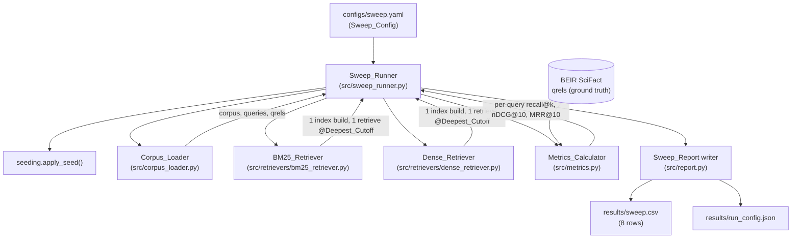
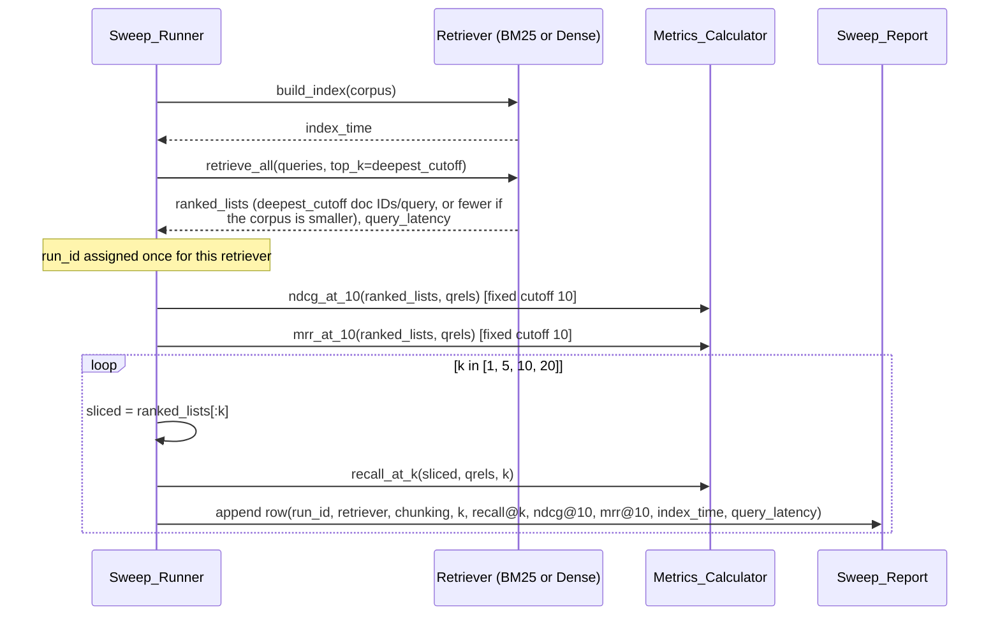

# Design Document: Session 1 Baseline Sweep

## Overview

This design implements the session-1 sweep described in
`requirements.md`: one CLI entry point that reads a YAML
`Sweep_Config`, loads BEIR SciFact (corpus, test queries, qrels),
builds exactly two indexes (BM25 and `all-MiniLM-L6-v2`), issues
exactly two retrieval runs (one per retriever, at the deepest declared
cutoff (Deepest_Cutoff)), computes recall@k / nDCG@10 / MRR@10 strictly against
qrels, and writes exactly 8 rows to `results/sweep.csv`.

The design is organized around one non-negotiable data flow: **index
once, retrieve once, slice four ways.** Every other component
(config, corpus loading, seeding, metrics, error handling) exists to
support that flow without violating it. Concretely:

- 2 retrievers x 1 index build each = 2 index builds, total.
- 2 retrievers x 1 retrieval run each (at Deepest_Cutoff) = 2
  retrieval runs, total.
- Each retrieval run produces one `Ranked_List` per query, containing
  Deepest_Cutoff document IDs (or all corpus documents if the corpus
  has fewer than Deepest_Cutoff documents — Requirement 5.2). That
  single `Ranked_List` is sliced to each declared cutoff k to produce
  the 4 rows for that retriever's `run_id`.
- `nDCG@10` and `MRR@10` are computed once per `run_id` (always at a
  fixed cutoff of 10) and copied across that `run_id`'s 4 rows.
  `recall@k` is recomputed per row from the same underlying
  `Ranked_List`, sliced to that row's `k`.

Implementation language is Python, matching the pinned libraries in
`requirements.txt` (`beir`, `rank_bm25`, `sentence-transformers`,
`numpy`, `pandas`, `PyYAML`, `pytest`, plus `pytrec-eval-terrier` for
the Requirement 11 cross-check).

## Architecture

### Module layout

```
configs/
  sweep.yaml                  # the one Sweep_Config for session 1

src/
  __init__.py
  errors.py                   # exception types shared across modules
  config.py                   # Sweep_Config schema, YAML load + validation
  seeding.py                  # apply_seed()
  corpus_loader.py            # Corpus_Loader: load + validate + count report
  metrics.py                  # Metrics_Calculator: recall_at_k, ndcg_at_10, mrr_at_10
  report.py                   # SweepReportRow, write_sweep_report(), run config record
  sweep_runner.py             # Sweep_Runner: run_sweep() orchestration loop + main() CLI entry point
  retrievers/
    __init__.py
    base.py                   # Retriever protocol, RetrievalRun dataclass
    bm25_retriever.py          # BM25_Retriever
    dense_retriever.py         # Dense_Retriever

tests/
  test_metrics.py             # Requirement 11 fixture tests + pytrec_eval cross-check
  test_orchestration.py       # Requirement 12 call-counting / slice test (Stub_Retriever)

results/
  sweep.csv                   # generated artifact (Sweep_Report)
  run_config.json             # generated artifact (Requirement 8.3 run record)

data/                          # gitignored; BEIR + HF cache root
```

This matches the structure steering directly: `configs/` holds the
grid as data, `src/` holds loading/retrievers/metrics/entry point,
`tests/` holds the Requirement 11 metric tests and the Requirement 12
orchestration-loop test.

### Component diagram



### Sequence: single retrieval sliced to four cutoffs



The loop makes explicit that `ndcg_at_10`/`mrr_at_10` are computed
**once** outside the k-loop and copied into all 4 rows (Requirement
6.6), while `recall_at_k` is recomputed per iteration from a slice of
the same `ranked_lists` object — no additional call to `Ret` occurs
inside the loop (Requirement 5.4).

## Components and Interfaces

### `src/errors.py`

Exception types shared across components, so the Sweep_Runner can
distinguish "halt the whole pipeline" from "recover with a
missing-value marker" (see Error Handling):

```python
class ConfigError(Exception):
    """Sweep_Config missing, unparsable, or declares something unsupported."""

class UnsupportedPreprocessingError(ConfigError):
    """BM25 preprocessing setting not supported by BM25_Retriever."""

class CorpusLoadError(Exception):
    """Corpus, queries, or qrels failed to load, or loaded empty."""

class CorpusValidationError(Exception):
    """Qrels reference a document ID or query ID not present in the loaded data."""

class SeedApplicationError(Exception):
    """Applying the fixed seed to random/numpy/torch failed."""

class ModelLoadError(Exception):
    """Dense retriever model weights failed to load."""

class RetrievalError(Exception):
    """A specific retriever's index build or retrieval run failed."""

class MetricComputationError(Exception):
    """A specific metric computation failed for a specific row."""

class ZeroQualifyingQueriesError(Exception):
    """No loaded query has at least one Qrels-judged relevant document,
    so a mean over qualifying queries has no defined value anywhere in
    the run. No longer a MetricComputationError subclass: this is a
    pre-indexing halt condition, detected once in Sweep_Runner step 5
    from corpus/qrels data alone (the same tier as Requirement 1.5's
    empty-corpus/empty-qrels check), not a per-cell recoverable failure
    — a run with this condition never reaches the retriever loop, so
    there is no run_id or row to mark "NA"."""

class ReportWriteError(Exception):
    """results/sweep.csv could not be written."""
```

### `src/config.py` — Sweep_Config

```python
@dataclass(frozen=True)
class BM25RetrieverConfig:
    name: str                 # "bm25"
    k1: float
    b: float
    tokenizer: str             # supported: "regex_word"
    lowercase: bool
    stopwords: str             # supported: "none"
    stemming: str              # supported: "none"

@dataclass(frozen=True)
class DenseRetrieverConfig:
    name: str                 # "all-MiniLM-L6-v2"
    model_name: str            # "sentence-transformers/all-MiniLM-L6-v2"
    batch_size: int

@dataclass(frozen=True)
class SweepConfig:
    seed: int
    chunking_strategy: str            # supported: "whole_document"
    cutoffs: Tuple[int, ...]          # must be exactly (1, 5, 10, 20)
    retrievers: Tuple[BM25RetrieverConfig | DenseRetrieverConfig, ...]  # exactly 2
    data_dir: Path                    # e.g. Path("data")
    output_path: Path                 # e.g. Path("results/sweep.csv")

def load_sweep_config(path: Path) -> SweepConfig: ...
```

`load_sweep_config`:
1. Reads the YAML file at `path`. Missing file or a YAML parse error
   raises `ConfigError` naming the path and the underlying cause
   (Requirement 2.6).
2. Validates every required field is present (`seed`, `chunking_strategy`,
   `cutoffs`, `retrievers`, and for the BM25 entry: `tokenizer`,
   `stopwords`, `stemming`, `lowercase`/case-handling). A missing field
   raises `ConfigError` naming the missing field (Requirement 2.6).
3. Validates `retrievers` declares exactly one BM25 entry and exactly
   one dense entry (by `name`/`type` discriminator), `cutoffs` is
   exactly `{1, 5, 10, 20}`, and `chunking_strategy` equals
   `"whole_document"`. Any other declared value raises `ConfigError`
   naming the unsupported declaration (Requirement 2.6) — this is the
   Sweep_Runner's fixed "supported set" for session 1.
4. Validates the BM25 preprocessing fields against the supported set
   (`tokenizer == "regex_word"`, `stopwords == "none"`,
   `stemming == "none"`). This is deliberately validated **here**,
   at config-load time, rather than deferred to `BM25_Retriever`,
   because Requirement 2.3/2.6 treats preprocessing as declared once
   and validated before any run starts, not as a per-run recoverable
   failure. An unsupported value raises `UnsupportedPreprocessingError`
   (a `ConfigError` subclass) naming the offending setting — this is
   the single implementation point for Requirement 3.7.

`Deepest_Cutoff` is simply `max(config.cutoffs)` (= 20 for the fixed
grid), computed by the Sweep_Runner, not stored redundantly in the
config.

### `src/seeding.py`

```python
def apply_seed(seed: int) -> None: ...
```

Sets, in order: `random.seed(seed)`, `numpy.random.seed(seed)`, and
`torch.manual_seed(seed)` (torch is a transitive dependency of
`sentence-transformers`, already pinned per Requirement 9.3). The
torch seed covers the Dense_Retriever's embedding batch ordering,
since `sentence_transformers.SentenceTransformer.encode()` consumes
the ambient torch RNG state for internal batching/padding operations.
Any exception from these three calls is caught and re-raised as
`SeedApplicationError`; the Sweep_Runner calls `apply_seed` before
touching the corpus, the config's own directories, or any
retriever, and aborts on failure without writing `results/sweep.csv`
(Requirement 8.5).

### `src/corpus_loader.py` — Corpus_Loader

```python
@dataclass(frozen=True)
class CorpusBundle:
    corpus: Dict[str, Dict[str, str]]      # doc_id -> {"title": ..., "text": ...}
    queries: Dict[str, str]                 # query_id -> query text
    qrels: Dict[str, Dict[str, int]]        # query_id -> {doc_id: relevance}

@dataclass(frozen=True)
class CorpusLoadReport:
    num_documents: int
    num_queries: int
    num_qrel_pairs: int

    def as_log_line(self) -> str:
        return (f"CORPUS_LOAD_REPORT documents={self.num_documents} "
                f"queries={self.num_queries} qrel_pairs={self.num_qrel_pairs}")

def load_scifact(data_dir: Path) -> Tuple[CorpusBundle, CorpusLoadReport]: ...
```

`load_scifact`:
1. Downloads (if not already cached) and unzips BEIR SciFact under
   `data_dir` via `beir.util.download_and_unzip`, then loads it via
   `beir.datasets.data_loader.GenericDataLoader(...).load(split="test")`.
   Any exception during download/load is caught and re-raised as
   `CorpusLoadError`, naming which of corpus/queries/qrels failed
   (Requirement 1.4). Partial counts for whatever *did* load
   successfully may be attached to the exception message, but this is
   explicitly not the count report from step 3 (Requirement 1.7).
2. If `corpus`, `queries`, or `qrels` is loaded but empty, raises
   `CorpusLoadError` naming which of the three was empty
   (Requirement 1.5); the count report is not emitted in this case.
3. Derives `num_documents = len(corpus)`, `num_queries = len(queries)`,
   `num_qrel_pairs = sum(len(v) for v in qrels.values())` directly
   from the loaded dict structures — never a literal (Requirement
   1.3) — and returns them as a `CorpusLoadReport`. The Sweep_Runner
   prints `report.as_log_line()` to stdout, giving one deterministic,
   machine-parsable `key=value` line (Requirement 1.2).
4. Validates referential integrity: every `doc_id` appearing in any
   `qrels[query_id]` must be a key in `corpus`; every `query_id` key
   in `qrels` must be a key in `queries`. If either check fails,
   raises `CorpusValidationError` reporting the count of unresolved
   document-ID references and the count of unresolved query-ID
   references (Requirement 1.6). This check runs after the empty
   check and before the count report is trusted for the run — if
   validation fails, the Sweep_Runner halts without writing
   `results/sweep.csv`.
5. If loading, emptiness-checking, and validation all succeed but
   deriving/printing the count report itself raises (e.g. an I/O
   error writing to a log file), `load_scifact` re-raises that
   failure as `CorpusLoadError`, and the Sweep_Runner aborts the run
   before building any index and does not write `results/sweep.csv`
   (Requirement 1.8, reversed from an earlier draft) — the count
   report is the only detector of a silent truncation or partial
   download, so this failure is fatal, consistent with Requirement
   8.5's seed-failure abort.

Setting `HF_HOME`/`HF_HUB_CACHE` inside `load_scifact` would be too
late: `beir`, `sentence-transformers`, and `huggingface_hub` are
imported at module top in `src/corpus_loader.py` and
`src/retrievers/dense_retriever.py`, and `huggingface_hub` reads these
environment variables once at its own import time — so setting them
inside a function body, after those modules are already imported,
would have no effect. Instead, a dedicated function:

```python
def configure_caches(data_dir: Path) -> None:
    """Sets HF_HOME and HF_HUB_CACHE to data_dir / "hf_cache" before
    any huggingface_hub-importing module is imported. TRANSFORMERS_CACHE
    is deprecated by huggingface_hub in favor of HF_HUB_CACHE and is
    intentionally not set."""
    cache_dir = data_dir / "hf_cache"
    os.environ["HF_HOME"] = str(cache_dir)
    os.environ["HF_HUB_CACHE"] = str(cache_dir)
```

lives in `src/sweep_runner.py` and is called with `config.data_dir` —
never a hard-coded path — immediately after `load_sweep_config`
returns a validated `Sweep_Config` (Sweep_Runner orchestration step 2
below), and before `src.corpus_loader` or `src.retrievers.dense_retriever`
are imported anywhere in `sweep_runner.py`. Config parsing is safe to
run first because `load_sweep_config` imports only `PyYAML` and the
standard library — nothing that touches `huggingface_hub` — so the
cache root is always resolved from the actual config contents, never
from a provisional or hard-coded default. In practice this means
`sweep_runner.py` uses deferred (function-local) imports for
`src.corpus_loader` and `src.retrievers.dense_retriever`, placed after
`configure_caches` runs, rather than importing them at its own module
top. This guarantees every BEIR dataset download and every Hugging
Face model weight download in the run lands under `config.data_dir`
(Requirement 10.5). Import ordering alone is a code-organization
convention, not something the interpreter enforces, so it is treated
as defense in depth rather than the sole guarantee — see
`DenseRetriever.__init__`'s cache-path assertion below, which
independently verifies at run time that the ordering actually took
effect.

### `src/retrievers/base.py` — Retriever interface

```python
@dataclass(frozen=True)
class RetrievalRun:
    run_id: str
    retriever_name: str
    ranked_lists: Dict[str, List[str]]   # query_id -> ordered doc IDs, len == top_k
    index_time: float                     # seconds
    query_latency: float                  # seconds

class Retriever(Protocol):
    name: str

    def build_index(self, corpus: Dict[str, Dict[str, str]]) -> float:
        """Builds the index once. Returns index_time in seconds."""

    def retrieve_all(
        self, queries: Dict[str, str], top_k: int
    ) -> Tuple[Dict[str, List[str]], float]:
        """Runs retrieval once for all queries at top_k. Returns
        (ranked_lists, query_latency_seconds); each Ranked_List
        contains min(top_k, corpus size) document IDs, so a corpus
        smaller than top_k yields all corpus documents rather than
        raising or padding (Requirement 5.2)."""
```

Both retrievers rank by `(-score, doc_id_sort_key(doc_id))`, where
`doc_id_sort_key` is a single shared helper defined in this module so
the comparison type is uniform in both retrievers and a numeric ID is
never compared against a string ID:

```python
def doc_id_sort_key(doc_id: str) -> Tuple[int, int | str]:
    """Sort key for the ascending-document-ID tie-break (Requirement
    3.4, 4.8). Numeric IDs (SciFact's normal case) sort before
    non-numeric IDs, and within each group the comparison is uniform
    — int-to-int or str-to-str, never int-to-str — so mixing a numeric
    and a non-numeric ID in the same corpus can never raise TypeError."""
    try:
        return (0, int(doc_id))
    except ValueError:
        return (1, doc_id)
```

Both `BM25_Retriever` and `Dense_Retriever` implement this same
protocol so the Sweep_Runner's orchestration code (see below) is
retriever-agnostic — it never issues more than one `build_index` call
and one `retrieve_all` call per retriever, which is what makes "2
index builds, 2 retrieval runs total" a structural property of the
orchestration loop rather than something enforced by convention.

### `src/retrievers/bm25_retriever.py` — BM25_Retriever

```python
class BM25Retriever:
    def __init__(self, config: BM25RetrieverConfig) -> None: ...
    def build_index(self, corpus: Dict[str, Dict[str, str]]) -> float: ...
    def retrieve_all(self, queries: Dict[str, str], top_k: int) -> Tuple[Dict[str, List[str]], float]: ...
```

- Text normalization (`_tokenize(text: str) -> List[str]`): applies
  the config's `tokenizer` (`"regex_word"` — split on `\w+` via
  `re.findall`), then lowercases if `lowercase` is true. `stopwords`
  and `stemming` are validated to be `"none"` at config-load time (see
  `config.py`), so no filtering/stemming step exists in this
  implementation — this keeps `requirements.txt` free of an
  additional stopword/stemming dependency. The **same** `_tokenize`
  function is applied to every document (`title + " " + text`) and to
  every query (Requirement 3.2, 3.3).
- `build_index`: tokenizes the whole corpus once, constructs exactly
  one `rank_bm25.BM25Okapi(tokenized_corpus, k1=config.k1, b=config.b)`,
  and times the whole operation with `time.perf_counter()` to produce
  `index_time` (Requirement 3.1, 3.5).
- `retrieve_all`: for each query, tokenizes it, calls
  `bm25.get_scores(tokenized_query)` to get one score per corpus
  document, then ranks by `(-score, doc_id_sort_key(doc_id))`, using
  the shared `doc_id_sort_key` helper defined once in
  `src/retrievers/base.py` (see below) — this is the deterministic
  ascending-document-ID tie-break required by Requirement 3.4. Takes
  the top `top_k` document IDs as the `Ranked_List`. Times the entire
  per-query loop once to produce `query_latency` (Requirement 3.6).

### `src/retrievers/dense_retriever.py` — Dense_Retriever

```python
class DenseRetriever:
    def __init__(self, config: DenseRetrieverConfig, cache_folder: Path) -> None: ...
    def build_index(self, corpus: Dict[str, Dict[str, str]]) -> float: ...
    def retrieve_all(self, queries: Dict[str, str], top_k: int) -> Tuple[Dict[str, List[str]], float]: ...
```

- `__init__` loads `SentenceTransformer(config.model_name,
  cache_folder=str(cache_folder), device="cpu")` — `device="cpu"` is
  hard-coded, never conditional on CUDA availability (Requirement
  4.2). `cache_folder` is `data_dir / "hf_cache"`, the same path
  `configure_caches()` (in `src/sweep_runner.py`) points
  `HF_HOME`/`HF_HUB_CACHE` at (Requirement 4.3). Immediately after the
  model loads, `__init__` verifies that ordering actually took effect
  by reading back `huggingface_hub.constants.HF_HUB_CACHE` — a module
  constant `huggingface_hub` resolves once, at its own import time,
  from the `HF_HUB_CACHE`/`HF_HOME` environment variables — and raises
  `ModelLoadError` if it does not resolve to `cache_folder`:

  ```python
  import huggingface_hub
  resolved_cache = Path(huggingface_hub.constants.HF_HUB_CACHE).resolve()
  if resolved_cache != Path(cache_folder).resolve():
      raise ModelLoadError(
          f"huggingface_hub resolved its cache to {resolved_cache}, "
          f"expected {cache_folder}; configure_caches() either ran "
          f"too late (after huggingface_hub's own import) or was "
          f"called with the wrong data_dir (Requirement 10.5)"
      )
  ```

  This check exists because `configure_caches()`'s deferred-import
  ordering (Sweep_Runner step 2) is a code-organization convention
  enforced by where `import` statements are physically placed in
  `sweep_runner.py`, not something the interpreter guarantees — a
  future edit that adds an eager top-level `import huggingface_hub`
  (or an eager top-level import of any module that itself eagerly
  imports it) anywhere above `configure_caches()`'s call site would
  silently defeat the ordering. This runtime assertion is the second,
  independent layer of defense in depth for Requirement 10.5, not the
  sole enforcement mechanism — the design relies on both the import
  ordering *and* this check together. Any exception here, or from the
  model load itself (network failure, disk failure, corrupt cache), is
  caught and re-raised as `ModelLoadError` (Requirement 4.7); no
  `Ranked_List` is produced in that case.
- `build_index`: encodes `title + " " + text` for every corpus
  document in one `model.encode(..., batch_size=config.batch_size,
  convert_to_numpy=True, normalize_embeddings=True)` call, timed with
  `time.perf_counter()` to produce `index_time`, excluding any query
  encoding (Requirement 4.1, 4.5). Embeddings are stored
  L2-normalized so cosine similarity reduces to a dot product.
- `retrieve_all`: encodes all queries in one batched `model.encode(...,
  normalize_embeddings=True)` call, then computes the full
  `query_embeddings @ corpus_embeddings.T` similarity matrix with
  `numpy` (brute-force, exact, no ANN index — Requirement 4.4), and
  for each query row takes `top_k` documents ranked by
  `(-similarity, doc_id_sort_key(doc_id))`, using the same shared
  `doc_id_sort_key` helper from `src/retrievers/base.py` that
  `BM25_Retriever` uses — the same ascending-document-ID tie-break
  rule (Requirement 3.4), required for the Dense_Retriever as well
  (Requirement 4.8). Times query encoding + similarity computation
  together to produce `query_latency` (Requirement 4.6).

### `src/metrics.py` — Metrics_Calculator

All three functions are pure, take a single query's `Ranked_List` and
that query's qrels row, and are the sole units under test for
Requirement 11.

```python
QueryRelevance = Dict[str, int]   # doc_id -> graded relevance score from qrels

def judged_relevant_docs(qrels_for_query: QueryRelevance) -> Set[str]:
    """Doc IDs with relevance score > 0. Qrels are the only source of truth
    (Requirement 6.4): absent or <=0 entries are never relevant."""
    return {doc_id for doc_id, score in qrels_for_query.items() if score > 0}

def recall_at_k(ranked_list: List[str], qrels_for_query: QueryRelevance, k: int) -> float:
    """Fraction of judged-relevant docs for this query appearing in the
    top-k of ranked_list. Returns 0.0 if the query has zero judged-relevant
    docs (a defined edge case for this function; exclusion of such queries
    from the *mean* across queries is applied by the caller, not here)."""

def ndcg_at_10(ranked_list: List[str], qrels_for_query: QueryRelevance) -> float:
    """DCG@10 / IDCG@10, fixed cutoff of 10 regardless of k. Returns 0.0
    when IDCG@10 is 0. Graded relevance taken directly from qrels for
    documents at ranks 1-10 of ranked_list (0 if unjudged/absent)."""

def mrr_at_10(ranked_list: List[str], qrels_for_query: QueryRelevance) -> float:
    """Reciprocal rank of the first judged-relevant doc within the top 10
    of ranked_list, else 0.0. Independent of any row's k."""
```

`ndcg_at_10` implementation detail (this is the canonical formula
referenced by Requirement 6.2 and later echoed in `SPEC.md`):

```python
def _dcg(relevances: List[int]) -> float:
    # relevances[i] is the graded relevance of the document at rank i+1
    return sum(rel / math.log2(i + 2) for i, rel in enumerate(relevances))

def ndcg_at_10(ranked_list, qrels_for_query):
    top10 = ranked_list[:10]
    gains = [qrels_for_query.get(doc_id, 0) for doc_id in top10]
    dcg = _dcg(gains)
    ideal_gains = sorted(
        (score for score in qrels_for_query.values() if score > 0),
        reverse=True,
    )[:10]
    idcg = _dcg(ideal_gains)
    return 0.0 if idcg == 0.0 else dcg / idcg
```

Note `log2(i + 2)` for a 0-indexed `i` is exactly `log2(rank + 1)` for
the 1-indexed rank, matching Requirement 6.2's `rel_i / log2(i + 1)`
convention.

Aggregation across queries (mean, restricted to queries with at least
one judged-relevant document per Requirement 6.1/6.2/6.3) is a thin
helper used by the Sweep_Runner, not part of the Requirement 11 test
surface:

A query loaded by the Corpus_Loader but absent from `qrels` (no
judged documents at all, not even a zero-relevance entry) is not an
error at the lookup level — `qrels.get(qid, {})` treats it the same as
a query with an empty judged set, which `judged_relevant_docs` then
correctly excludes from `qualifying`.

```python
def mean_over_qualifying_queries(
    per_query_values: Dict[str, float], qrels: Dict[str, QueryRelevance]
) -> float:
    qualifying = [
        v for qid, v in per_query_values.items()
        if judged_relevant_docs(qrels.get(qid, {}))
    ]
    if not qualifying:
        # Defensive only: Sweep_Runner step 5 already halts the whole
        # run before the retriever loop when num_queries_scored == 0,
        # and `qualifying` is filtered by that same
        # judged_relevant_docs condition over the same qrels — so this
        # branch should be unreachable once step 5 has run. Retained
        # as a belt-and-suspenders invariant check, not the primary
        # enforcement point for this condition (see step 5).
        raise ZeroQualifyingQueriesError(
            "no loaded query has a Qrels-judged relevant document; "
            "Sweep_Runner step 5 should have halted before this "
            "function was ever called"
        )
    return statistics.fmean(qualifying)
```

`Requirement 6.7` requires the denominator of each mean to be visible
alongside it. A second thin helper, also used by the Sweep_Runner and
not part of the Requirement 11 test surface, exposes it:

```python
def scored_query_count(
    all_query_ids: Iterable[str], qrels: Dict[str, QueryRelevance]
) -> Tuple[int, int]:
    """Returns (num_queries_total, num_queries_scored):
    num_queries_total is len(bundle.queries) — every query the
    Corpus_Loader loaded, not merely the queries a particular
    retriever happened to score (Requirement 7.3's "total number of
    test queries loaded"); num_queries_scored is the subset with at
    least one Qrels-judged relevant document — the actual denominator
    consumed by mean_over_qualifying_queries."""
    all_query_ids = list(all_query_ids)
    num_queries_total = len(all_query_ids)
    num_queries_scored = sum(
        1 for qid in all_query_ids if judged_relevant_docs(qrels.get(qid, {}))
    )
    return num_queries_total, num_queries_scored
```

### `src/sweep_runner.py` — Sweep_Runner (entry point)

```python
def main(argv: List[str] | None = None) -> int:
    """CLI entry point. `python -m src.sweep_runner [--config PATH]`."""
```

Orchestration, in order:

1. Parse `--config` (default `configs/sweep.yaml`) and call
   `config = load_sweep_config(path)`. This step imports only
   `PyYAML` and the standard library — it does not import `beir`,
   `sentence-transformers`, or `huggingface_hub` — so it is safe to
   run before any cache directory is configured. On `ConfigError`,
   print the error, return non-zero, write nothing (Requirement 2.6,
   10.4).
2. `configure_caches(config.data_dir)` — called immediately after
   `config` is loaded and validated, using `config.data_dir` directly
   as the cache root (never a hard-coded fallback path), and before
   `src.corpus_loader` or `src.retrievers.dense_retriever` are
   imported anywhere in `sweep_runner.py`. In practice this means
   `sweep_runner.py` imports those two modules with deferred,
   function-local `import` statements placed after this line, rather
   than at its own module top, so that `huggingface_hub` (imported
   transitively by both) reads `HF_HOME`/`HF_HUB_CACHE` from the
   environment only after this function has set them.
3. `apply_seed(config.seed)` — on `SeedApplicationError`, print the
   error, return non-zero, write nothing (Requirement 8.5). Write
   `results/run_config.json` capturing the fixed seed, the fully
   resolved `Sweep_Config` contents (as loaded and validated by
   `load_sweep_config`), and the installed version of each of `beir`,
   `rank_bm25`, `sentence-transformers`, `torch`, and `numpy` — read
   via `importlib.metadata.version(...)` at run time, never
   hard-coded — as the single accompanying run configuration record
   (Requirement 8.3).
4. `bundle, report = load_scifact(config.data_dir)` (deferred import,
   per step 2) — on `CorpusLoadError` / `CorpusValidationError`, print
   the error, return non-zero, write nothing (Requirement 1.4, 1.5,
   1.6, 1.8 — a failed count report is one of the `CorpusLoadError`
   cases covered by this same halt path, per the reversed Requirement
   1.8). Print `report.as_log_line()` (Requirement 1.2) — reaching
   this line means the report was successfully produced, since
   `load_scifact` never returns without one.

**The injection seam (Requirement 12).** Steps 5-7 below are
implemented in a separate function, `run_sweep`, factored out of
`main()` specifically so the orchestration loop can be driven
directly by a test — with an in-memory `CorpusBundle` and without a
real `BM25Retriever`/`DenseRetriever` — instead of only through the
full `main()` path (config parsing, cache configuration, seeding, and
a real BEIR load). `main()` never constructs `BM25Retriever` or
`DenseRetriever` directly; it constructs a retriever *factory* and
passes that factory into `run_sweep`, which is the only place in
production code that calls a retriever's constructor:

```python
RetrieverFactory = Callable[[Union[BM25RetrieverConfig, DenseRetrieverConfig]], Retriever]

def make_default_retriever_factory(cache_folder: Path) -> RetrieverFactory:
    """Production factory used by main(). Closes over cache_folder
    (config.data_dir / "hf_cache") so DenseRetriever always receives
    the same cache path configure_caches() pointed HF_HOME/HF_HUB_CACHE
    at. BM25Retriever and DenseRetriever are imported inside this
    function body (BM25Retriever eagerly available; DenseRetriever via
    the same deferred, post-configure_caches import discipline as step
    2), so importing sweep_runner.py itself never imports either
    retriever module at top level."""
    def factory(retriever_config: BM25RetrieverConfig | DenseRetrieverConfig) -> Retriever:
        if isinstance(retriever_config, BM25RetrieverConfig):
            from src.retrievers.bm25_retriever import BM25Retriever
            return BM25Retriever(retriever_config)
        if isinstance(retriever_config, DenseRetrieverConfig):
            from src.retrievers.dense_retriever import DenseRetriever
            return DenseRetriever(retriever_config, cache_folder=cache_folder)
        raise ConfigError(f"unsupported retriever config type: {type(retriever_config)!r}")
    return factory

def run_sweep(
    config: SweepConfig,
    bundle: CorpusBundle,
    retriever_factory: RetrieverFactory,
) -> Tuple[List[SweepReportRow], bool]:
    """Steps 5-7: the retriever loop, metric computation, and row
    assembly. Never imports beir, sentence-transformers, or
    huggingface_hub itself, and never constructs a retriever except by
    calling `retriever_factory(retriever_config)` — this is what makes
    it possible for tests/test_orchestration.py (Requirement 12) to
    call run_sweep with an in-memory bundle and a factory that returns
    Stub_Retriever instances, exercising the exact same loop `main()`
    runs in production, with no config file, no cache setup, no seed,
    and no network access anywhere on the call path. Returns
    (rows, all_succeeded) so main() (step 8) can derive its exit
    status without recomputing anything."""
```

`main()` calls `run_sweep(config, bundle,
retriever_factory=make_default_retriever_factory(config.data_dir /
"hf_cache"))`. `tests/test_orchestration.py` instead calls `run_sweep`
directly with a hand-built `SweepConfig`, a hand-built `CorpusBundle`
of at most 5 documents, and a `retriever_factory` that returns one
`Stub_Retriever` per retriever name declared in that `SweepConfig` —
skipping `main()`'s steps 1-4 entirely (no YAML file, no
`configure_caches`, no `apply_seed`, no `load_scifact`), since
Requirement 12 scopes the test to the orchestration loop itself, not
to config parsing or corpus loading. See Testing Strategy below for
the test's full shape.

5. `deepest_cutoff = max(config.cutoffs)`. Passed to each retriever's
   `retrieve_all` unmodified as `top_k=deepest_cutoff`; the retriever
   itself returns `min(top_k, corpus size)` document IDs per query
   (see `src/retrievers/base.py`), satisfying Requirement 5.2's
   fallback for a corpus smaller than `deepest_cutoff`. Also computes
   `num_queries_total, num_queries_scored =
   scored_query_count(bundle.queries.keys(), bundle.qrels)` exactly
   once here, before the retriever loop — these two counts depend
   only on `bundle.queries`/`bundle.qrels` (Requirement 6.7), never on
   which retriever succeeds or fails. Immediately after computing
   them: **if `num_queries_scored == 0`**, raise
   `ZeroQualifyingQueriesError`, print the error, return non-zero, and
   write no `results/sweep.csv` — halting before any index build, the
   same tier as Requirement 1.5's empty-corpus/empty-qrels check,
   rather than deferring to a per-metric `"NA"` recovery inside the
   retriever loop, because every retriever would hit the identical
   zero-denominator condition (the qualifying-query set depends only
   on `bundle.qrels`, never on a retriever's output, so there is
   nothing retriever-specific to recover). Otherwise, this step
   guarantees `num_queries_total`/`num_queries_scored` populate every
   one of the 8 rows, including all 4 rows of a retriever that later
   fails in step 6, matching the sweep.csv schema's "never missing"
   claim for these two columns.
6. For each of the 2 retriever configs (this loop body executes
   exactly twice, structurally, because `config.retrievers` is
   validated to length 2 in step 1):
   - `run_id = f"{retriever_config.name}__{config.chunking_strategy}"`
     (Requirement 7.4 — same `run_id` iff same retriever + chunking
     strategy; here that's equivalent to retriever identity, per the
     glossary). Computed before the `try` block below, since `run_id`
     itself never fails and every row of this iteration — including
     an all-`"NA"` row on total failure — needs it.
   - `try:` construct the retriever via `retriever =
     retriever_factory(retriever_config)` (never `BM25Retriever(...)`
     or `DenseRetriever(...)` called directly in this loop — see "The
     injection seam" above), then call `retriever.build_index(...)`,
     then call `retriever.retrieve_all(queries, top_k=deepest_cutoff)`
     — all three calls inside one `try/except` block. Retriever
     construction is inside this block, not before it, specifically so
     that `DenseRetriever.__init__`'s `ModelLoadError` (Requirement
     4.7, including the cache-path assertion described in
     `src/retrievers/dense_retriever.py` above) is caught here and
     degrades only this run_id's 4 rows to `"NA"`, the same as a
     `build_index`/`retrieve_all` failure, rather than propagating up
     and halting the whole run — this is what the Error Handling
     table's "Dense model weights fail to download/load" row already
     claims. On success, this yields exactly one `RetrievalRun` per
     retriever (2 total across the whole run — Requirement 5.5). This
     is also the exact call shape `tests/test_orchestration.py`
     exercises against a `Stub_Retriever`, since `retriever_factory`
     is the only construction path and is fully swappable
     (Requirement 12.1, 12.4).
   - On failure of that block: catch, wrap as `RetrievalError`, and
     record that **this run_id's 4 rows** get the missing-value
     marker for `index_time`/`query_latency`/`recall@k`/`ndcg@10`/
     `mrr@10` (see Error Handling) — the pipeline does not halt
     (Requirement 10.4), it proceeds to the next retriever and to
     writing the report.
   - On success: compute `ndcg_at_10` and `mrr_at_10` once per query
     (fixed cutoff 10) from the full `ranked_lists`, then average with
     `mean_over_qualifying_queries` — this happens **once per run_id**,
     not once per row (Requirement 6.6). Wrap in
     `try/except -> MetricComputationError` so a failure here only
     marks the `ndcg@10`/`mrr@10` cells missing, not `recall@k` or
     timing, for that run_id's rows. `num_queries_total`/
     `num_queries_scored` (computed once in step 5, not here) are
     copied into every row of this run_id unchanged, the same as
     every other run_id's rows — see step 5 (Requirement 6.7, 7.3).
   - For each `k in config.cutoffs` (4 iterations): slice
     `ranked_lists[qid][:k]` for every query, compute `recall_at_k` per
     query and average with `mean_over_qualifying_queries`, wrapped in
     its own `try/except -> MetricComputationError` so a failure at one
     `k` only marks that row's `recall@k` cell missing, leaving the
     other 3 rows' `recall@k` (and this run's `ndcg@10`/`mrr@10`)
     intact. Append one `SweepReportRow` per iteration.
7. `write_sweep_report(rows, config.output_path)` — on `ReportWriteError`,
   print the error, return non-zero, and ensure no partial file is
   left at `config.output_path` (Requirement 10.4).
8. Return 0 only if every `SweepReportRow` written in step 6 has no
   `MISSING` cell in any column. If any row carries a `MISSING` marker
   (a per-run_id or per-row recovery path was taken in step 6), the
   full 8-row `results/sweep.csv` is still written in step 7, but
   `main` returns a non-zero exit status — per the reversed
   Requirement 10.3/10.4, a run in which any declared combination
   failed is not a successful run, even though the Sweep_Report
   artifact itself is complete.

### `src/report.py` — Sweep_Report writer

```python
MISSING = "NA"   # sentinel written for any metric/timing value that could
                  # not be computed; never emitted for a legitimate 0.0

@dataclass(frozen=True)
class SweepReportRow:
    run_id: str
    retriever: str
    chunking_strategy: str
    k: int
    recall_at_k: float | str      # float, or MISSING
    ndcg_at_10: float | str        # float, or MISSING
    mrr_at_10: float | str         # float, or MISSING
    index_time: float | str        # seconds, or MISSING
    query_latency: float | str     # seconds, or MISSING
    num_queries_total: int          # len(bundle.queries); never MISSING
    num_queries_scored: int         # queries with >=1 judged-relevant doc; never MISSING

def write_sweep_report(rows: List[SweepReportRow], output_path: Path) -> None: ...
def write_run_config_record(config: SweepConfig, output_path: Path) -> None: ...
```

`write_sweep_report` builds a `pandas.DataFrame` from `rows` in
declared-grid order and writes it to a temp file in the same
directory (`output_path.with_suffix(".csv.tmp")`), then
`os.replace(tmp, output_path)` for an atomic swap. If any step raises,
the temp file is removed and `ReportWriteError` is raised — this is
what guarantees `results/sweep.csv` is never left partially written or
corrupted (Requirement 10.4).

## Data Models

### Sweep_Config YAML schema (`configs/sweep.yaml`)

```yaml
seed: 42

chunking_strategy: whole_document

cutoffs: [1, 5, 10, 20]

retrievers:
  - name: bm25
    type: bm25
    k1: 1.5
    b: 0.75
    tokenizer: regex_word     # only supported value
    lowercase: true
    stopwords: none            # explicit "none": intentionally not applied
    stemming: none              # explicit "none": intentionally not applied

  - name: all-MiniLM-L6-v2
    type: dense
    model_name: sentence-transformers/all-MiniLM-L6-v2
    batch_size: 32

data_dir: data
output_path: results/sweep.csv
```

| Field | Type | Constraint |
|---|---|---|
| `seed` | int | single explicit integer (Req 2.4, 8.1) |
| `chunking_strategy` | str | must equal `whole_document` (Req 2.2) |
| `cutoffs` | list[int] | must equal `{1, 5, 10, 20}` (Req 2.2) |
| `retrievers` | list | exactly 2 entries: one `type: bm25`, one `type: dense` (Req 2.2) |
| `retrievers[bm25].tokenizer` | str | must equal `regex_word` (Req 2.3, 3.7) |
| `retrievers[bm25].stopwords` | str | must equal `none` (Req 2.3, 3.7) |
| `retrievers[bm25].stemming` | str | must equal `none` (Req 2.3, 3.7) |
| `retrievers[bm25].lowercase` | bool | case-handling setting (Req 2.3) |
| `retrievers[dense].model_name` | str | HF model ID, loaded via `sentence-transformers` |
| `data_dir` | path | download/cache root, always under `data/` (Req 10.5) |
| `output_path` | path | always `results/sweep.csv` for this spec |

### `results/sweep.csv` row schema

| Column | Type | Meaning | Missing marker? |
|---|---|---|---|
| `run_id` | str | `{retriever}__{chunking_strategy}`; identical for all 4 rows of one retriever's run | never missing — assigned even on retrieval failure |
| `retriever` | str | `bm25` or `all-MiniLM-L6-v2` | never missing |
| `chunking_strategy` | str | always `whole_document` in this spec | never missing |
| `k` | int | evaluation cutoff for this row: 1, 5, 10, or 20 | never missing |
| `recall_at_k` | float or `"NA"` | recall at this row's `k`, computed by slicing the run's single Ranked_List | `"NA"` on per-row metric failure |
| `ndcg_at_10` | float or `"NA"` | fixed-cutoff-10 nDCG, identical across the run's 4 rows | `"NA"` on run-level failure |
| `mrr_at_10` | float or `"NA"` | fixed-cutoff-10 MRR, identical across the run's 4 rows | `"NA"` on run-level failure |
| `index_time` | float (seconds) or `"NA"` | identical across the run's 4 rows | `"NA"` on run-level (retrieval) failure |
| `query_latency` | float (seconds) or `"NA"` | identical across the run's 4 rows | `"NA"` on run-level (retrieval) failure |
| `num_queries_total` | int | total test queries loaded, from `bundle.queries` | never missing |
| `num_queries_scored` | int | of those, the count with >=1 Qrels-judged relevant document — the denominator of recall@k/nDCG@10/MRR@10 for this row | never missing |

Exactly 8 rows: `2 retrievers x 4 cutoffs` (Requirement 7.2). The
`"NA"` sentinel is a literal string, never emitted for a legitimately
computed `0.0` — a legitimate zero is always written as the float
`0.0`, so the two are distinguishable both visually and by
`str`-vs-`float` type when the CSV is re-parsed (Requirement 7.8).
`num_queries_total` and `num_queries_scored` are derived from
`bundle.queries`/`bundle.qrels` alone (Requirement 6.7), computed once
in step 5 of the Sweep_Runner before the retriever loop runs —
independent of which retriever or cutoff a row belongs to, and
independent of whether any retriever fails — so they are identical
across all 8 rows of every run, including a run where one or both
retrievers fail entirely.

### `results/run_config.json` (Requirement 8.3 record)

```json
{
  "seed": 42,
  "sweep_config": {
    "seed": 42,
    "chunking_strategy": "whole_document",
    "cutoffs": [1, 5, 10, 20],
    "retrievers": [
      {"name": "bm25", "k1": 1.5, "b": 0.75, "tokenizer": "regex_word", "lowercase": true, "stopwords": "none", "stemming": "none"},
      {"name": "all-MiniLM-L6-v2", "model_name": "sentence-transformers/all-MiniLM-L6-v2", "batch_size": 32}
    ],
    "data_dir": "data",
    "output_path": "results/sweep.csv"
  },
  "installed_versions": {
    "beir": "2.2.0",
    "rank_bm25": "0.2.2",
    "sentence-transformers": "3.0.1",
    "torch": "2.3.1",
    "numpy": "1.26.4"
  }
}
```

`installed_versions` values are read via
`importlib.metadata.version(...)` at run time — the values above are
illustrative only, never hard-coded (Requirement 8.3). Written once
per run, alongside `results/sweep.csv`, and used for the manual
rerun-identity diff described in Requirement 8.4 (rerun the entry
point, diff both `sweep.csv` files cell-by-cell excluding
`index_time`/`query_latency`, and confirm `sweep_config` and
`installed_versions` in both `run_config.json` files are identical).

## Correctness Properties

*A property is a characteristic or behavior that should hold true
across all valid executions of a system — essentially, a formal
statement about what the system should do. Properties serve as the
bridge between human-readable specifications and machine-verifiable
correctness guarantees.*

Verification scope, stated up front: automated verification in this
spec covers the `Metrics_Calculator` formulas (`recall_at_k`,
`ndcg_at_10`, `mrr_at_10`) via Requirement 11's hand-built fixture
tests plus the `pytrec_eval` differential cross-check, and it covers
the `Sweep_Runner` orchestration loop's call-count and slicing
behavior via Requirement 12's `tests/test_orchestration.py` (see
Testing Strategy below). Properties 1 and 2 are exercised directly by
`tests/test_orchestration.py`, using a `Stub_Retriever` and an
in-memory corpus, so they carry both a structural basis (the shape of
`run_sweep`'s loop, described in "Components and Interfaces") and an
automated-test basis. Properties 3, 5, and 7 remain
structural/architectural properties of the `Sweep_Runner`, enforced by
the shape of the code rather than by a runtime assertion, and are
**not** covered by an automated test in this spec — end-to-end
`Sweep_Runner` tests over the real corpus, and tests of the
missing-value-marker recovery paths specifically, remain deferred per
Requirement 11.4, consistent with the "What is explicitly not tested in
this spec" list at the end of Testing Strategy. Properties 4 and 6 each
have a metric-level aspect that Requirement 11's fixture/`pytrec_eval`
tests do exercise, noted per property below, alongside a structural
aspect that does not.

### Property 1: Exactly-two-operations

For any Sweep_Config declaring exactly 2 retrievers and any set of
declared cutoffs, a full run of the Sweep_Runner performs exactly 2
index builds and exactly 2 retrieval runs in total — exactly one index
build and one retrieval run per retriever — regardless of how many
cutoffs are declared.

**Validates: Requirements 5.1, 5.5, 12.4**

Upheld by: `run_sweep`'s per-retriever loop (`src/sweep_runner.py`
step 6 in Components and Interfaces), which calls
`retriever.build_index` and `retriever.retrieve_all` exactly once per
retriever config, on whatever `Retriever` the injected
`retriever_factory` returns. Verified by
`tests/test_orchestration.py` (Requirement 12), which drives
`run_sweep` with one `Stub_Retriever` per declared retriever and
asserts each stub's recorded call count is exactly one `build_index`
call and exactly one `retrieve_all` call (see Testing Strategy below)
— this is now an automated-test-verified property, not merely a
shape-of-the-loop guarantee inferred from code review.

### Property 2: Slice-not-reretrieve

For any retriever and any query, the Ranked_List used to score every
one of the 4 declared cutoffs k is a prefix slice of that retriever's
single Deepest_Cutoff Ranked_List for that query — that is,
`ranked_list_used_for(k) == full_ranked_list[:k]` for every declared
k — and no additional retrieval call is issued to the retriever for
any cutoff.

**Validates: Requirements 5.2, 5.3, 5.4, 12.5, 12.6**

Upheld by: `run_sweep`'s k-loop (`src/sweep_runner.py` step 6, and the
"Sequence: single retrieval sliced to four cutoffs" diagram in
Architecture), which slices the one `ranked_lists` object returned by
`retrieve_all` and never calls the retriever again inside the loop.
Verified by `tests/test_orchestration.py` (Requirement 12), which
asserts, for every declared cutoff k and every query in the
`In_Memory_Test_Corpus`'s query set, that the row-level ranked list
used for that cutoff equals `full_ranked_list[:k]`, and that a
`Stub_Retriever`'s single recorded `retrieve_all` call was made with
`top_k=deepest_cutoff` with no further `retrieve_all` call recorded
for any other cutoff — this is now an automated-test-verified
property.

### Property 3: Run-level constancy

For any run_id, the values of index_time, query_latency, ndcg_at_10,
and mrr_at_10 are each a single computed value copied unchanged into
all 4 Sweep_Report rows sharing that run_id — none of these four
values varies across a run_id's rows.

**Validates: Requirements 5.6, 5.7, 6.6, 7.7**

Upheld by: the Sweep_Runner computing `index_time`/`query_latency` once
per retriever (from `build_index`/`retrieve_all`) and `ndcg_at_10`/
`mrr_at_10` once per run_id, outside the k-loop (`src/sweep_runner.py`
step 6), then assigning those same four values into each of the 4
`SweepReportRow` instances appended inside the k-loop. Structural, not
runtime-checked, and not covered by an automated test in this spec
(Sweep_Runner tests deferred per Requirement 11.4).

### Property 4: Qrels-is-sole-ground-truth

For any query-document pair, the relevance of that pair as used by
`recall_at_k`, `ndcg_at_10`, and `mrr_at_10` depends only on the qrels
entry for that pair — absent from qrels, or present with a score
<= 0, is always treated as not relevant — never on any similarity or
ranking score a retriever produced.

**Validates: Requirements 6.4**

Upheld by: `Metrics_Calculator` (`src/metrics.py`) — `judged_relevant_docs`,
`recall_at_k`, `ndcg_at_10`, and `mrr_at_10` read relevance exclusively
via `qrels_for_query.get(doc_id, 0)` / `score > 0` checks, and accept a
`Ranked_List` of document IDs only, never a score (`src/retrievers/base.py`'s
`RetrievalRun.ranked_lists` typing is `Dict[str, List[str]]`, doc IDs
only). That doc-ID-only signature is what makes it structurally
impossible for a retriever's score to reach the metric functions. The
metric-level aspect of this property — that unjudged or <=0 pairs
compute as non-relevant — is exercised by the Requirement 11 fixture
tests' "no judged-relevant document" scenario and by the `pytrec_eval`
cross-check; the architectural aspect, that no score ever flows into
the metric layer in the first place, is a structural property of the
`Retriever`/`Metrics_Calculator` interfaces and is not separately
runtime-checked.

### Property 5: Row-count invariant

For any run of the Sweep_Runner, regardless of whether any individual
retrieval or metric computation fails, `results/sweep.csv` contains
exactly 8 rows — one per declared (retriever, cutoff) combination —
with failures degrading individual cells to the `"NA"` marker rather
than causing a row to be omitted.

**Validates: Requirements 7.2, 7.6, 7.8**

Upheld by: the Sweep_Runner's per-retriever and per-cutoff
`try`/`except` scoping (`src/sweep_runner.py` step 6, and the Error
Handling table below), which catches `RetrievalError`/
`MetricComputationError` at the smallest affected unit and still
appends a `SweepReportRow` for every declared combination, substituting
`"NA"` only for the cell(s) that failed. Structural, not
runtime-checked, and not covered by an automated test in this spec
(Sweep_Runner tests deferred per Requirement 11.4).

### Property 6: Missing-value distinguishability

For any Sweep_Report cell, the value written is either a legitimately
computed value or the `"NA"` marker, and the two are always
distinguishable by type/literal — `"NA"` is never emitted for a value
that was actually computed, and a legitimately computed `0.0` is never
rendered as `"NA"`.

**Validates: Requirements 7.8**

Upheld by: `src/report.py`'s `MISSING = "NA"` sentinel and the
`SweepReportRow` field types (`float | str`), combined with the
Sweep_Runner only ever writing `MISSING` on the exception path of a
`try`/`except` block and only ever writing a function's actual float
return value on the success path — a `0.0` returned by
`Metrics_Calculator` is written as the float `0.0`, never coerced to
the string sentinel. The `Metrics_Calculator` half of this property —
that the metric functions correctly return float `0.0`, not some other
value, for the "no relevant doc" / "empty ranked list" edge cases — is
exercised by the Requirement 11 fixture tests; the report-writing half,
that `Sweep_Runner`/`report.py` never confuse the two, is structural
and not separately runtime-checked in this spec.

### Property 7: Halt-before-partial-write

For any run of the Sweep_Runner that encounters a failure classified as
"outright" in the Error Handling table below — bad Sweep_Config,
bad/empty/unresolvable corpus data, a failed count report, zero
qualifying queries, seed application failure, or report-write failure
— no `results/sweep.csv` is written at all; a partial or corrupted
file is never left in place.

**Validates: Requirements 1.5, 1.6, 1.8, 2.6, 6.1, 6.2, 6.3, 8.5, 10.4**

Upheld by: the Sweep_Runner's ordering of steps (`src/sweep_runner.py`
steps 2-4 and 7 in Components and Interfaces) — config loading, seed
application, and corpus loading/validation all halt and return before
the report-writing step is ever reached — and `write_sweep_report`'s
temp-file-plus-atomic-`os.replace` approach (`src/report.py`), where a
failure during writing removes the temp file rather than leaving a
partial file at `output_path`. Structural, not runtime-checked, and not
covered by an automated test in this spec (Sweep_Runner tests deferred
per Requirement 11.4).

## Error Handling

| Failure | Detected by | Exception | Sweep_Runner behavior | Requirement |
|---|---|---|---|---|
| Corpus/queries/qrels fail to load | `load_scifact` | `CorpusLoadError` | Halt. No `sweep.csv` written. | 1.4 |
| Corpus/queries/qrels load empty | `load_scifact` | `CorpusLoadError` | Halt. No `sweep.csv` written. | 1.5 |
| Qrels reference unresolved doc/query ID | `load_scifact` | `CorpusValidationError` | Halt. No `sweep.csv` written. | 1.6 |
| Zero queries qualify (no loaded query has any Qrels-judged relevant document, computed once from corpus/qrels data alone) | Sweep_Runner step 5, via `scored_query_count` | `ZeroQualifyingQueriesError` | Halt before any index build. No `sweep.csv` written. | 6.1, 6.2, 6.3, 10.4 |
| Count report itself fails to derive/emit after successful load | `load_scifact` (isolated step) | `CorpusLoadError` | Halt before any index build. No `sweep.csv` written. | 1.8 |
| Sweep_Config missing/unparsable/missing a required field | `load_sweep_config` | `ConfigError` | Halt before any run step. No `sweep.csv` written. | 2.6 |
| Sweep_Config declares unsupported retriever/cutoff/chunking strategy | `load_sweep_config` | `ConfigError` | Halt before any run step. No `sweep.csv` written. | 2.6 |
| Sweep_Config declares unsupported BM25 preprocessing setting | `load_sweep_config` | `UnsupportedPreprocessingError` | Halt before any run step (validated at config time, not per-retriever-run). No `sweep.csv` written. | 3.7, 2.6 |
| Dense model weights fail to download/load | `DenseRetriever.__init__` | `ModelLoadError` | Caught by Sweep_Runner's per-retriever `try/except`. That retriever's `run_id` gets all 4 rows written with `"NA"` for `index_time`, `query_latency`, `recall@k`, `ndcg@10`, `mrr@10`. Other retriever's rows unaffected. Full 8-row report still written; run terminates with a non-zero exit status. | 4.7, 7.8, 10.3, 10.4 |
| A retriever's `build_index` or `retrieve_all` raises for any other reason | Sweep_Runner's per-retriever `try/except` | `RetrievalError` | Same recovery as above: that `run_id`'s 4 rows marked `"NA"`; full report still written; run terminates with a non-zero exit status. | 7.8, 10.3, 10.4 |
| A specific metric computation raises for a specific row/run | Sweep_Runner's per-metric `try/except` | `MetricComputationError` | Only the affected cell(s) — `recall@k` for one row, or `ndcg@10`/`mrr@10` for the whole run_id — get `"NA"`; everything else for that run_id is unaffected. Full report still written; run terminates with a non-zero exit status. | 6.6, 7.8, 10.3, 10.4 |
| Applying the fixed seed fails | `apply_seed` | `SeedApplicationError` | Halt before any embedding/evaluation step. No `sweep.csv` written. | 8.5 |
| `results/sweep.csv` write fails (disk full, permissions, etc.) | `write_sweep_report` | `ReportWriteError` | Halt. Temp file removed. No partial/corrupted file left at `results/sweep.csv`. | 10.4 |
| `requirements.txt` has an unpinned or duplicate dependency | N/A — not a runtime check | N/A | Enforced by construction when the file is authored (every entry uses `==`, no duplicates); this is a repo-hygiene property of a static file, not something `Sweep_Runner` validates at run time. | 9.2, 9.4, 9.5 |

The dividing line throughout is: **failures discovered before any
index build starts** (bad config, bad/empty/unresolvable corpus data,
a failed count report, zero qualifying queries, bad seed) always halt
outright with no `sweep.csv`, because at that point nothing has been
computed and a partial file would be misleading. **Failures discovered once retrieval
or metric computation is underway** are scoped to the smallest
affected unit (one `run_id`'s 4 rows, or one row's one cell) via the
`"NA"` marker, because Requirement 7's row-count guarantee (exactly 8
rows, always) takes priority over any single retriever's success —
but completeness of the artifact and success of the exit code are now
decoupled: the report is always complete, while the exit status still
signals non-zero whenever any row required an `"NA"` marker
(Requirement 10.3/10.4).

## Testing Strategy

**Property-based testing is deliberately not used in this spec.**
Requirement 11 fixes the test method as hand-built fixtures (≤10
documents) with independently hand-computed expected values, plus a
differential cross-check against `pytrec_eval` — a model-based
testing approach (comparing against an independent reference
implementation) rather than generated-input property testing. The
`ndcg_at_10`/`recall_at_k`/`mrr_at_10` formulas are exact, previously
agreed-upon conventions (Requirement 6.2), not general behavioral
properties to be discovered by generators; the correctness bar is
"matches the canonical formula and matches `pytrec_eval`," which
fixture + differential testing verifies directly. Introducing a PBT
library here would exceed Requirement 11's approved scope (which
explicitly excludes data-layer and runner tests and limits fixtures to
hand-built, ≤10-document cases) without adding verification power that
the `pytrec_eval` cross-check doesn't already provide. Universal
properties (e.g., recall@k monotonically non-decreasing in k) are
legitimate future work but are out of scope for this spec.

### Scope

This spec has two test modules, `tests/test_metrics.py` (Requirement
11) and `tests/test_orchestration.py` (Requirement 12), together
forming the entire test surface for this spec.

`tests/test_metrics.py` covers only the `Metrics_Calculator`
functions. It:
- Imports only `src.metrics` (`recall_at_k`, `ndcg_at_10`,
  `mrr_at_10`, `judged_relevant_docs`). It does not import
  `src.corpus_loader`, `src.sweep_runner`, or any retriever module
  (Requirement 11.4).
- Makes no network call and downloads nothing — all fixtures are
  Python literals defined in the test file (Requirement 11.3).
- Compares floats with a `1e-6` tolerance (`pytest.approx(expected,
  abs=1e-6)`) throughout (Requirement 11.2).

`tests/test_orchestration.py` covers only the `Sweep_Runner`'s
orchestration loop (`run_sweep`), against a `Stub_Retriever` and an
in-memory corpus, not the real `BM25_Retriever`/`Dense_Retriever` and
not the real BEIR corpus. See "Orchestration loop test
(`tests/test_orchestration.py`, Requirement 12)" below for its full
shape; it is a distinct test surface from `test_metrics.py` and the
two modules do not share fixtures or imports beyond `src.sweep_runner`
and `src.retrievers.base` (`Retriever`, `RetrievalRun`).

### Fixture design

Fixtures are small, literal, hand-built `Ranked_List` + qrels pairs,
each ≤10 documents (Requirement 11.2), covering — for **each** of the
three functions — the four required scenarios (Requirement 11.1):

1. **No judged-relevant document for the query**: `qrels_for_query =
   {}` or all-zero scores. Expected: `recall_at_k == 0.0`,
   `ndcg_at_10 == 0.0` (IDCG = 0), `mrr_at_10 == 0.0`.
2. **At least one relevant document ranked outside the top-k cutoff**:
   e.g. a relevant doc at rank 15 with `k=10`. Expected values computed
   by hand from the formula (e.g. `recall_at_10` excludes it;
   `mrr_at_10 == 0.0` if it's the only relevant doc and it's outside
   rank 10).
3. **Perfect ranking** (all relevant documents occupy the top
   positions): expected `recall_at_k == 1.0` for `k >=` relevant count,
   `ndcg_at_10 == 1.0` (DCG == IDCG by construction), `mrr_at_10 ==
   1.0`.
4. **Empty ranked list** (`ranked_list == []`): expected `0.0` for all
   three functions, verifying no `IndexError`/`ZeroDivisionError`.

Example fixture and test shape:

```python
def test_ndcg_at_10_perfect_ranking():
    ranked_list = ["d1", "d2", "d3"] + [f"filler{i}" for i in range(7)]
    qrels_for_query = {"d1": 2, "d2": 1}   # graded relevance, sorted desc == ranking order
    expected = 1.0   # DCG over this ranking == IDCG by construction
    assert ndcg_at_10(ranked_list, qrels_for_query) == pytest.approx(expected, abs=1e-6)

def test_recall_at_k_relevant_doc_outside_cutoff():
    ranked_list = [f"d{i}" for i in range(1, 11)]  # 10 docs, "d10" is rank 10
    qrels_for_query = {"d10": 1, "d_not_ranked": 1}  # one in list (rank10), one never retrieved
    # recall@5 sees neither -> 0/2; hand-computed expected = 0.0
    assert recall_at_k(ranked_list, qrels_for_query, k=5) == pytest.approx(0.0, abs=1e-6)
```

### `pytrec_eval` cross-check

For each fixture, in addition to the hand-computed expected value, the
same `ranked_list`/`qrels_for_query` pair is fed to
`pytrec_eval.RelevanceEvaluator` (imported from the
`pytrec-eval-terrier` package) configured with the matching trec_eval
measure (`recall.<k>`, `ndcg_cut.10`, `recip_rank`), and the
per-query result `pytrec_eval` returns for that query ID is asserted
equal to the `Metrics_Calculator` function's return value within
`1e-6` (Requirement 11.5):

```python
def test_recall_at_k_matches_pytrec_eval():
    ranked_list = [...]
    qrels_for_query = {...}
    k = 10
    ours = recall_at_k(ranked_list, qrels_for_query, k)

    qrels = {"q1": qrels_for_query}
    run = {"q1": {doc_id: float(len(ranked_list) - i) for i, doc_id in enumerate(ranked_list)}}
    evaluator = pytrec_eval.RelevanceEvaluator(qrels, {f"recall.{k}"})
    theirs = evaluator.evaluate(run)["q1"][f"recall_{k}"]

    assert ours == pytest.approx(theirs, abs=1e-6)
```

(The `run` dict passed to `pytrec_eval` uses descending synthetic
scores derived from rank position, since `pytrec_eval` re-sorts by
score rather than accepting a pre-ranked list — this reproduces the
same ranking `ranked_list` already encodes.)

For the MRR@10 comparison specifically, the `ranked_list` passed to
`pytrec_eval` must first be truncated to its top 10 documents, because
`pytrec_eval`'s `recip_rank` measure scans the entire submitted ranking
rather than applying a fixed cutoff — passing an untruncated
Deepest_Cutoff-length list would let `pytrec_eval` find a relevant
document beyond rank 10 that `mrr_at_10` correctly ignores, producing
a false mismatch. The `ndcg_cut_10` and `recall_<k>` comparisons pass
the full `ranked_list` unmodified, since those `pytrec_eval` measures
already apply their own cutoff internally (Requirement 11.5):

```python
def test_mrr_at_10_matches_pytrec_eval():
    ranked_list = [...]  # may be longer than 10, e.g. Deepest_Cutoff-length
    qrels_for_query = {...}
    ours = mrr_at_10(ranked_list, qrels_for_query)

    truncated = ranked_list[:10]   # required: recip_rank has no built-in cutoff
    qrels = {"q1": qrels_for_query}
    run = {"q1": {doc_id: float(len(truncated) - i) for i, doc_id in enumerate(truncated)}}
    evaluator = pytrec_eval.RelevanceEvaluator(qrels, {"recip_rank"})
    theirs = evaluator.evaluate(run)["q1"]["recip_rank"]

    assert ours == pytest.approx(theirs, abs=1e-6)
```

`pytrec_eval` is added to `requirements.txt` as the
`pytrec-eval-terrier` package, pinned to an exact version, per
Requirement 9/11.5 (it is a transitive dependency surface of `beir`'s
evaluation utilities and is the package that provides the
`pytrec_eval` import).

### Orchestration loop test (`tests/test_orchestration.py`, Requirement 12)

This test exercises `run_sweep` (see "The injection seam" in `src/sweep_runner.py`
above) directly, bypassing `main()`'s config-parsing, cache-configuration,
seeding, and real-BEIR-loading steps entirely. It makes no network
call, loads no model, and never imports `beir` or
`sentence-transformers`.

**`Stub_Retriever`** lives in the test module (or a small fixtures
module imported only by tests) and implements the `Retriever` protocol
from `src/retrievers/base.py`:

```python
class StubRetriever:
    """Requirement 12 test double. Implements the Retriever protocol.
    Records every build_index/retrieve_all call for later assertion;
    performs no real computation, downloads no model, makes no
    network call."""

    def __init__(self, name: str, fixed_ranked_lists: Dict[str, List[str]]) -> None:
        self.name = name
        self._fixed_ranked_lists = fixed_ranked_lists   # query_id -> hand-specified doc IDs
        self.build_index_calls: List[Dict[str, Dict[str, str]]] = []
        self.retrieve_all_calls: List[Tuple[Dict[str, str], int]] = []

    def build_index(self, corpus: Dict[str, Dict[str, str]]) -> float:
        self.build_index_calls.append(corpus)
        return 0.0   # index_time; value is irrelevant to this test

    def retrieve_all(
        self, queries: Dict[str, str], top_k: int
    ) -> Tuple[Dict[str, List[str]], float]:
        self.retrieve_all_calls.append((queries, top_k))
        ranked_lists = {
            qid: self._fixed_ranked_lists[qid][:top_k] for qid in queries
        }
        return ranked_lists, 0.0   # query_latency; value is irrelevant to this test
```

**`In_Memory_Test_Corpus`** is a handful of Python literals defined in
the test module, satisfying Requirement 12.3's ≤5-document limit:

```python
TEST_CORPUS = {
    "1": {"title": "t1", "text": "doc one"},
    "2": {"title": "t2", "text": "doc two"},
    "3": {"title": "t3", "text": "doc three"},
}
TEST_QUERIES = {"q1": "query one", "q2": "query two"}
TEST_QRELS = {"q1": {"1": 1}, "q2": {"2": 1}}
```

**Test shape.** A hand-built `SweepConfig` declares two retrievers
(e.g. `"stub-a"`, `"stub-b"`) so the test also exercises the "exactly
2 index builds, exactly 2 retrieval runs across the whole run"
property (Requirement 5.5) with a multi-retriever grid, not just a
single stub. Each `Stub_Retriever` instance is given a fixed
`Deepest_Cutoff`-length `Ranked_List` per query, longer than every
declared cutoff, so the prefix-slice assertion (Requirement 12.6) has
something non-trivial to check at every `k`:

```python
def test_run_sweep_calls_each_retriever_exactly_once():
    stub_a = StubRetriever("stub-a", fixed_ranked_lists={
        "q1": ["3", "1", "2"], "q2": ["1", "2", "3"],
    })
    stub_b = StubRetriever("stub-b", fixed_ranked_lists={
        "q1": ["2", "3", "1"], "q2": ["3", "1", "2"],
    })
    factory_calls = iter([stub_a, stub_b])
    config = make_test_sweep_config(retriever_names=["stub-a", "stub-b"],
                                     cutoffs=(1, 2, 3))
    bundle = CorpusBundle(corpus=TEST_CORPUS, queries=TEST_QUERIES, qrels=TEST_QRELS)

    rows, all_succeeded = run_sweep(
        config, bundle, retriever_factory=lambda _rc: next(factory_calls)
    )

    deepest_cutoff = max(config.cutoffs)   # 3
    for stub in (stub_a, stub_b):
        # Requirement 12.4: exactly one build_index, one retrieve_all
        assert len(stub.build_index_calls) == 1
        assert len(stub.retrieve_all_calls) == 1
        # Requirement 12.5: the single retrieve_all call requested Deepest_Cutoff
        _queries_arg, top_k_arg = stub.retrieve_all_calls[0]
        assert top_k_arg == deepest_cutoff

    # Requirement 12.6: every row's ranked list is a prefix slice of the
    # single deepest-cutoff list, for every declared k and every query.
    for stub in (stub_a, stub_b):
        full = stub._fixed_ranked_lists   # the single retrieve_all response, per query
        for k in config.cutoffs:
            row_ranked_lists = ranked_lists_used_for_row(rows, retriever=stub.name, k=k)
            for qid, sliced in row_ranked_lists.items():
                assert sliced == full[qid][:k]

    assert all_succeeded is True
```

(`make_test_sweep_config` and `ranked_lists_used_for_row` are small
test-only helpers; `ranked_lists_used_for_row` recovers, from the
`SweepReportRow`/`recall_at_k` computation path, which document IDs
were actually scored for a given row — in practice this is exposed by
having `run_sweep` retain the sliced list alongside each row during
the k-loop rather than discarding it after computing `recall_at_k`,
so the test can assert against it directly instead of reverse-engineering
it from the recall value.)

This single test body covers Requirement 12.1 (Stub_Retriever
implements the protocol and records calls), 12.2 (no real computation,
no model, no network — the stub's `retrieve_all` returns only from
`fixed_ranked_lists`), 12.3 (≤5-document in-memory corpus), 12.4
(exactly one call each), 12.5 (Deepest_Cutoff requested, no per-cutoff
call), and 12.6 (prefix-slice equality per cutoff per query). A second,
smaller test asserts the analogous "no relevant document reachable"
edge case is not needed here — Requirement 12 does not require metric
edge-case coverage, only call-count and slicing behavior — so no
additional fixture variants are required beyond this one multi-retriever,
multi-cutoff case.

### What is explicitly not tested in this spec

- `src/corpus_loader.py` (Corpus_Loader) — no tests in this spec
  (Requirement 11.4); deferred to a later spec.
- `src/sweep_runner.py` (Sweep_Runner) end-to-end against the real BEIR
  corpus, and the missing-value-marker recovery paths (Requirement 7.8
  / the Error Handling table) specifically — no automated tests in
  this spec; deferred to a later spec. The orchestration loop itself
  (single-retrieval-sliced-to-four-cutoffs call counting and slicing,
  Properties 1 and 2) now *does* have automated coverage in this spec
  via `tests/test_orchestration.py` (Requirement 12), using a
  `Stub_Retriever` and an in-memory corpus — this is narrower than a
  real end-to-end test and does not exercise `main()`, `load_scifact`,
  `configure_caches`, `apply_seed`, or either real retriever
  implementation.
- `src/retrievers/*` (BM25_Retriever, Dense_Retriever) — no automated
  tests in this spec; not named in Requirement 11 or Requirement 12's
  scope. `Requirement 12` tests only the `Retriever` protocol boundary
  via `Stub_Retriever`, not either concrete implementation.
- Rerun-identity (Requirement 8.4) — verified manually for session 1
  by running the entry point twice and diffing `results/sweep.csv`
  cell-by-cell (excluding `index_time`/`query_latency`), not by an
  automated pytest test.
