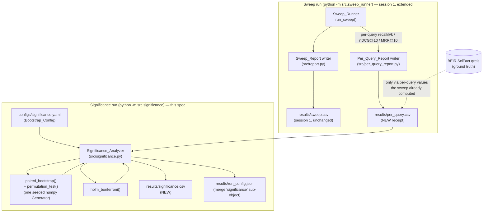
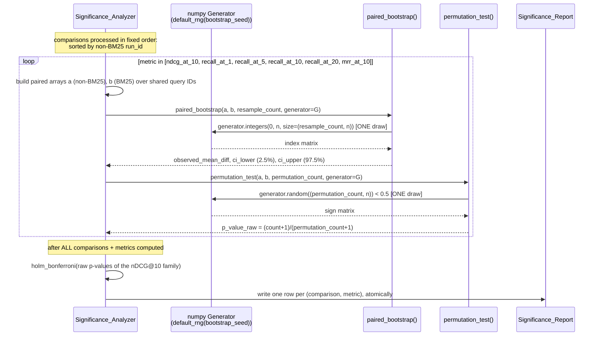

# Design Document: Significance Testing

## Overview

This design implements the significance analysis described in
`requirements.md`: it makes the honest headline of `rag-retrieval-sweep`
statable by adding a per-query receipt and a paired significance test
over that receipt. It touches two entry points and adds one new module,
without ever re-running retrieval, re-encoding the corpus, or
re-touching BEIR SciFact or any model.

The design is organized around one non-negotiable data flow: **score
once, persist per-query, re-analyse cheaply.** Concretely:

- The session-1 `Sweep_Runner` (`src/sweep_runner.py`) already computes
  per-query `recall@k`/`nDCG@10`/`MRR@10` values internally on the way
  to forming each run's aggregate mean. This spec extends the same run
  to *also* write those per-query values to `results/per_query.csv` —
  no recomputation, no second retrieval, no extra model load
  (Requirement 1).
- A new, separate entry point, the `Significance_Analyzer`
  (`python -m src.significance`), reads `results/per_query.csv` and
  writes `results/significance.csv`. It performs no corpus loading, no
  index building, no retrieval, no query encoding, no model loading,
  and makes no network call (Requirement 2). Every per-query value it
  uses is read from the committed `Per_Query_Report`, which in turn came
  only from the qrels — so qrels remain the sole judge, carried through
  by construction.
- For each non-BM25 run, the analyzer computes a **paired bootstrap**
  over per-query metric differences against the BM25 `Reference_Run`
  (the observed mean difference and a 95% confidence interval), and a
  **paired permutation test** for the two-sided p-value (Requirement 3).
  It applies a `Holm_Bonferroni_Adjustment` over the nDCG@10 comparison
  family (Requirement 5), reports the same bootstrap for the secondary
  metrics (Requirement 6), and merges its own two seeds and counts into
  the existing `results/run_config.json` (Requirement 4).

Implementation language is Python, matching the pinned libraries in
`requirements.txt`. This spec adds no new runtime dependency: it uses
`numpy` (already pinned, for the vectorized bootstrap and permutation),
`pandas` (already pinned, for reading and writing the CSVs), `PyYAML`
(already pinned, for the new `Bootstrap_Config`), and `pytest` (already
pinned, for the Requirement 7 tests).

The central correctness property, stated up front: the significance
analysis is a **pure re-analysis of a committed artifact**. Given the
same `results/per_query.csv` and the same `Bootstrap_Config`
(resample count, permutation count, and `Bootstrap_Seed`), it produces
bit-identical `results/significance.csv` numbers across reruns on the
same machine (Requirement 3.7) — because it re-reads a file rather than
re-deriving anything from the corpus, and because it owns a single
seeded random generator whose consumption order is fully fixed (see
"RNG discipline" below).

## Architecture

### Module layout

The session-1 `src/` tree is unchanged in shape; this spec adds one
config file, one analyzer module, and one test module, and extends two
existing files (`src/errors.py`, `src/sweep_runner.py`):

```
configs/
  sweep.yaml                  # session 1's Sweep_Config (unchanged)
  significance.yaml           # NEW: the Bootstrap_Config (this spec)

src/
  __init__.py
  errors.py                   # EXTENDED: new analyzer/writer exceptions (this spec)
  config.py                   # session 1's Sweep_Config loader (unchanged)
  significance_config.py      # NEW: SignificanceConfig schema + load_significance_config
  seeding.py                  # session 1's apply_seed (unchanged, and NOT used here)
  corpus_loader.py            # session 1 (unchanged; NOT imported by the analyzer)
  metrics.py                  # session 1's Metrics_Calculator (unchanged)
  report.py                   # session 1's Sweep_Report writer + _atomic_write_text
  per_query_report.py         # NEW: PerQueryReportRow schema + writer (sweep side)
  significance.py             # NEW: bootstrap+permutation fns + Significance_Analyzer main()
  sweep_runner.py             # EXTENDED: also emits results/per_query.csv in the same run
  retrievers/
    __init__.py
    base.py                   # session 1 (unchanged)
    bm25_retriever.py          # session 1 (unchanged)
    dense_retriever.py         # session 1 (unchanged)

tests/
  test_metrics.py             # session 1 (unchanged)
  test_orchestration.py       # session 1 (unchanged)
  test_significance.py        # NEW: bootstrap+permutation function tests (Requirement 7)

results/
  sweep.csv                   # session 1 artifact (unchanged)
  per_query.csv               # NEW artifact (this spec, Requirement 1)
  significance.csv            # NEW artifact (this spec, Requirement 2/3/5/6)
  run_config.json             # session 1 artifact, EXTENDED with a "significance" sub-object

data/                          # gitignored; BEIR + HF cache root (untouched by the analyzer)
```

This matches the structure steering directly: `configs/` holds both
the sweep grid and the bootstrap parameters as data (never hard-coded
loops or literals); `src/` holds the new analysis entry point alongside
the existing loading/retrievers/metrics/entry point; `tests/` holds the
Requirement 7 bootstrap tests alongside session 1's metric and
orchestration tests.

### Two-entry-point split of work

This spec deliberately keeps two independent command-line entry points,
so the analysis never depends on the sweep's retrieval machinery:

- **`python -m src.sweep_runner`** (session 1's entry point, extended):
  runs the full sweep and, in the *same run*, writes both
  `results/sweep.csv` (as before) and `results/per_query.csv` (new). The
  touch is minimal — `run_sweep` already builds the per-query
  `recall@k`/`nDCG@10`/`MRR@10` dictionaries it averages into each mean;
  this spec captures those same per-query values and hands them to a new
  `per_query_report.py` writer. No new retrieval run, no second index
  build, no recomputation from the corpus (Requirement 1.1).
- **`python -m src.significance`** (new): the `Significance_Analyzer`.
  Reads `results/per_query.csv`, computes the bootstrap and permutation
  results, and writes `results/significance.csv`. Imports only `numpy`,
  `pandas`, `PyYAML`, `src.significance_config`, `src.errors`, and (for
  the atomic writer) `src.report` — never `src.corpus_loader`,
  `src.retrievers.*`, `beir`, or `sentence-transformers`, and never
  `src.seeding` (it owns a *local* generator; see "RNG discipline")
  (Requirement 2.2, 2.3).

The two entry points share no run-time state: the sweep writes a file,
the analyzer reads it. That file (and the qrels behind it) is the only
channel between them.

### Component diagram



The dotted qrels edge is deliberate: the analyzer never touches qrels
directly. Every per-query value it consumes traces back to the qrels
*only* through `results/per_query.csv`, which the sweep computed against
the qrels in session 1's metric layer. There is no second relevance
judgment anywhere in this spec.

### Sequence: one comparison, bootstrap-then-permutation



The single `G` participant, drawn from exactly once per procedure per
metric per comparison, in this fixed order, is what makes Requirement
3.7's bit-identical reruns hold. See "RNG discipline" below for why the
order matters and what breaks if it changes.

## Components and Interfaces

### `src/errors.py` — extended exception hierarchy

This spec reuses session 1's `errors.py` and adds new exception types
in the same style, following the same "halt-before-partial-write" vs
"recover-per-cell" dividing line. `BootstrapConfigError` subclasses the
existing `ConfigError` so the config-failure contract is identical to
session 1's (a `ConfigError` subclass naming the missing/invalid
field). The rest are top-level `Exception` subclasses, matching how
session 1 names its halt conditions (`CorpusLoadError`,
`ReportWriteError`, etc.):

```python
# --- added to src/errors.py, alongside the session-1 types ---

class PerQueryReportError(Exception):
    """results/per_query.csv could not be written by the Sweep_Runner.
    The sweep-side analogue of ReportWriteError: a halt condition for
    the sweep run (Requirement 1.8), never a per-cell recovery."""


class BootstrapConfigError(ConfigError):
    """Bootstrap_Config (configs/significance.yaml) missing, unparsable,
    or declaring a missing / non-integer resample_count,
    permutation_count, or bootstrap_seed, or an invalid alpha /
    reference retriever / path (Requirement 4.5). A ConfigError subclass
    so the Significance_Analyzer's config-failure contract matches
    load_sweep_config's."""


class SignificanceInputError(Exception):
    """results/per_query.csv is missing, cannot be parsed, or lacks a
    column required by Requirement 1.3 (Requirement 2.4). Halts the
    analyzer before it writes results/significance.csv."""


class MissingReferenceRunError(Exception):
    """The Per_Query_Report contains no run identified as the BM25
    Reference_Run (Requirement 2.5). Every comparison is defined
    relative to the Reference_Run, so the analyzer halts."""


class RunConfigMergeError(Exception):
    """results/run_config.json is absent, unparsable, or could not be
    re-written after merging the 'significance' sub-object (Requirement
    4.6). The analyzer halts rather than creating a fresh record that
    would lack the Sweep_Runner's own keys."""


class SignificanceWriteError(Exception):
    """results/significance.csv could not be written (Requirement 2.7).
    The analyzer's analogue of ReportWriteError."""
```

### `src/per_query_report.py` — Per_Query_Report writer (sweep side)

The sweep-side schema and writer. `PerQueryReportRow` is the wide-on-cutoff
row the extended `Sweep_Runner` constructs from the per-query values it
already computes; `write_per_query_report` writes them to
`results/per_query.csv` atomically, reusing session 1's
`_atomic_write_text` helper from `src/report.py` (temp file +
`os.replace`, temp removed on any failure — Requirement 1.8):

```python
from dataclasses import dataclass
from pathlib import Path
from typing import List, Union

@dataclass(frozen=True)
class PerQueryReportRow:
    """One row of results/per_query.csv: exactly one (run_id, query_id)
    pair (Requirement 1.2). Wide on cutoff — the four recall cutoffs are
    four separate columns on a single row, so no per-query value is
    duplicated across rows (Requirement 1.4). Every metric column is a
    real float in [0.0, 1.0] (Requirement 1.6); num_judged_relevant is a
    non-negative int (Requirement 1.5). None of these columns carries a
    missing marker: a per-query value is always computable from the
    ranked list and qrels for a scored query."""

    run_id: str
    retriever: str
    chunking_strategy: str
    query_id: str
    recall_at_1: float
    recall_at_5: float
    recall_at_10: float
    recall_at_20: float
    ndcg_at_10: float
    mrr_at_10: float
    num_judged_relevant: int

def write_per_query_report(rows: List[PerQueryReportRow], output_path: Path) -> None:
    """Writes rows to output_path (results/per_query.csv) as CSV,
    atomically, via src.report._atomic_write_text. Columns are fixed to
    PerQueryReportRow's field order. Raises PerQueryReportError on any
    failure, leaving output_path either absent or byte-for-byte in its
    pre-run state, never partially written (Requirement 1.8)."""
```

`num_judged_relevant` for each row is the count of that query's
qrels-judged relevant documents (relevance score > 0), reusing session
1's `metrics.judged_relevant_docs(qrels_for_query)` — derived from the
loaded qrels, never from any retriever output (Requirement 1.5).

### `src/sweep_runner.py` — the minimal Requirement 1 extension

`run_sweep` already builds, per retriever, three per-query dictionaries
on its way to each mean:

- `per_query_ndcg: Dict[str, float]` (computed once per run_id),
- `per_query_mrr: Dict[str, float]` (computed once per run_id),
- `per_query_recall: Dict[str, float]` (computed once per cutoff `k`).

This spec captures those exact values — no new call to any retriever,
no recomputation from the corpus — and assembles one `PerQueryReportRow`
per (run_id, query_id). The recall values for the four cutoffs become
the four `recall_at_*` columns on a single row (wide on cutoff,
Requirement 1.4). The change to `run_sweep`'s signature is additive: it
returns the per-query rows alongside the existing sweep rows, and
`main()` writes them via `write_per_query_report` in the same run,
after `write_sweep_report`:

```python
# run_sweep now also accumulates, per (run_id, query_id):
#   recall_at_1/5/10/20  (from the same per_query_recall dicts it averages)
#   ndcg_at_10, mrr_at_10 (from the same per_query_ndcg/per_query_mrr dicts)
#   num_judged_relevant  (len(judged_relevant_docs(qrels.get(qid, {}))))
# and returns (sweep_rows, per_query_rows, all_succeeded).

# main() step 8, unchanged path plus one line:
#   write_sweep_report(sweep_rows, config.output_path)
#   write_per_query_report(per_query_rows, config.output_path.parent / "per_query.csv")
# On PerQueryReportError: print to stderr, return non-zero (Requirement 1.8).
```

Requirement 1.9's reconciliation (per-query means equal the
Sweep_Report aggregate to within 1e-9) holds *by construction*: the
Per_Query_Report rows carry the identical per-query float values that
`mean_over_qualifying_queries` averaged into `results/sweep.csv`, so a
mean recomputed over them reproduces the same aggregate (the same floats
summed in the same order). Requirement 1.10's rerun-identity holds for
the same reason session 1's metric columns are reproducible: the
per-query values are deterministic functions of the seeded retrieval
output and the qrels, and this writer copies them verbatim.

Requirement 1.7's joinability is automatic: each `PerQueryReportRow`
carries the same `run_id`, `retriever`, and `chunking_strategy` values
that identify the run in `results/sweep.csv`
(`run_id == f"{retriever}__{chunking_strategy}"`), so a per-query row
joins to its sweep run unambiguously — and BM25's `run_id`
(`bm25__whole_document`) is the `Reference_Run` the analyzer keys on.

### `src/significance_config.py` — SignificanceConfig (Bootstrap_Config)

Mirrors session 1's `load_sweep_config`: a frozen dataclass plus a
`load_significance_config(path)` validator that raises a `ConfigError`
subclass (`BootstrapConfigError`) naming the missing / invalid /
non-integer field (Requirement 4.5). See "Where the Bootstrap_Config
lives" under Data Models for why this is a *separate* file from
`configs/sweep.yaml`.

```python
from dataclasses import dataclass
from pathlib import Path

@dataclass(frozen=True)
class SignificanceConfig:
    resample_count: int        # bootstrap resamples; single explicit int (Req 4.1)
    permutation_count: int     # permutation iterations; single explicit int (Req 4.1)
    bootstrap_seed: int        # the Bootstrap_Seed; single explicit int (Req 4.1)
    alpha: float               # significance threshold, fixed at 0.05 (Req 6.4)
    reference_retriever: str   # "bm25" — identifies the Reference_Run's run_id
    per_query_path: Path       # results/per_query.csv (input)
    output_path: Path          # results/significance.csv (output)
    run_config_path: Path      # results/run_config.json (merge target; configurable)

def load_significance_config(path: Path) -> SignificanceConfig:
    """Reads and validates configs/significance.yaml.

    Raises BootstrapConfigError (a ConfigError subclass) if the file is
    missing, is not valid YAML, omits resample_count / permutation_count
    / bootstrap_seed / alpha / reference_retriever / per_query_path /
    output_path / run_config_path (run_config_path is a required field
    that defaults to results/run_config.json when not overridden in the
    YAML), declares resample_count / permutation_count /
    bootstrap_seed as anything other than an integer, or declares alpha
    as anything other than the fixed value 0.05 (Alpha is declared in
    advance and never revised after results are seen — Requirement 6.4).
    Never partially applies a config: the first violation raises and no
    SignificanceConfig is returned. Imports only PyYAML and the standard
    library, so the analyzer can load its config without importing any
    retrieval or model code."""
```

The `Bootstrap_Seed` is validated as an integer distinct from the sweep
seed; because it lives in its own file, it can never be conflated with
or derived from `configs/sweep.yaml`'s `seed` (Requirement 4.2).

### `src/significance.py` — bootstrap + permutation functions

These two functions are the sole unit-under-test surface for
Requirement 7. Both are pure: they take numpy arrays and a generator,
and return floats. Neither reads a file, touches global RNG state, or
imports any retrieval/model code.

```python
from typing import Tuple
import numpy as np

def paired_bootstrap(
    a: np.ndarray,          # non-BM25 run per-query values, shape (n,)
    b: np.ndarray,          # BM25 Reference_Run per-query values, shape (n,), paired by query
    resample_count: int,
    generator: np.random.Generator,
) -> Tuple[float, float, float]:
    """Paired bootstrap of (a - b) over the shared queries.

    Computes the per-query difference vector ONCE, then resamples it:
      d = a - b                                  # shape (n,), computed once
      idx = generator.integers(0, n, size=(resample_count, n))   # one draw
      resampled_means = d[idx].mean(axis=1)      # shape (resample_count,)
      ci_lower, ci_upper = np.percentile(resampled_means, [2.5, 97.5])
      observed_mean_diff = float(d.mean())
    and returns (observed_mean_diff, ci_lower, ci_upper), where ci_lower /
    ci_upper are the 2.5th / 97.5th percentiles of the resampled mean
    differences (Requirement 3.3).

    Resampling d directly is mathematically identical to
    (a[idx] - b[idx]).mean(axis=1) because indexing is elementwise, but
    it uses one temporary array instead of two and makes it structurally
    impossible to accidentally unpair a and b in a later edit — there is
    only one array to resample, so every resample stays paired by
    construction (Requirement 3.2). No Python-level per-resample loop is
    used."""

def permutation_test(
    a: np.ndarray,          # shape (n,)
    b: np.ndarray,          # shape (n,), paired with a
    permutation_count: int,
    generator: np.random.Generator,
) -> float:
    """Paired permutation test for the two-sided p-value of (a - b).

    Let d = a - b (the per-query difference vector, shape (n,)) and
    observed = float(d.mean()). Draws ONE sign matrix of shape
    (permutation_count, n): signs = np.where(
        generator.random((permutation_count, n)) < 0.5, -1.0, 1.0).
    Computes permuted mean differences as (signs * d).mean(axis=1), a
    length-permutation_count vector, then counts the exceedances and
    applies the add-one correction:
        count = int((np.abs(permuted) >= abs(observed)).sum())
        p = (count + 1) / (permutation_count + 1)
    where count is the number of permuted mean differences whose
    absolute value is >= the absolute observed mean difference
    (Requirement 3.4). The add-one correction means the smallest
    achievable p-value is 1 / (permutation_count + 1); a finite
    permutation sample cannot justify an exact zero, and the observed
    sign assignment is itself a valid draw under the null, so it is
    counted in both the numerator and the denominator. No Python-level
    per-permutation loop is used."""
```

#### RNG discipline (Requirement 3.5, 3.7)

The analyzer constructs **exactly one** numpy generator for the whole
run:

```python
generator = np.random.default_rng(config.bootstrap_seed)
```

and threads that single `generator` instance through every
`paired_bootstrap` and `permutation_test` call. It does **not** call
`np.random.seed(...)` or touch any global RNG — this is the deliberate
contrast with session 1's `apply_seed`, which seeded global
`random`/`numpy`/`torch` state for the sweep. The analyzer owns a local
`Generator` instance and leaves process-global RNG state untouched, so
running the analyzer never perturbs any other numpy consumer and cannot
be perturbed by one.

**The consumption order is fixed and explicit.** Randomness is consumed
in exactly this order:

1. Comparisons are processed in a **fixed order: sorted ascending by the
   non-BM25 run's `run_id`.** (The `Reference_Run` is never a comparison
   against itself.)
2. Within each comparison, metrics are processed in a **fixed order**:
   `ndcg_at_10`, then `recall_at_1`, `recall_at_5`, `recall_at_10`,
   `recall_at_20`, then `mrr_at_10`.
3. Within each (comparison, metric), the **bootstrap draw happens first**
   (the single `generator.integers(...)` call for all `resample_count`
   resamples), **then the permutation draw** (the single
   `generator.random(...)` call for all `permutation_count`
   permutations).

Requirement 3.7's guarantee — that every mean difference, CI bound, and
p-value is bit-identical across reruns on the same machine — holds
**only because** (a) there is exactly one generator, seeded once from
`bootstrap_seed`; (b) comparisons are visited in a deterministic sorted
order; and (c) within each comparison the bootstrap-then-permutation
consumption order is fixed. A single `Generator` is a stateful stream:
each `.integers(...)` / `.random(...)` call advances its internal state
by exactly the number of variates drawn, so the *next* call's variates
depend on every draw before it.

**What breaks if the order changes.** If the two procedures were
reordered (permutation before bootstrap), or if comparisons were visited
in a nondeterministic order (e.g. Python `dict` insertion order that
varies with input row order, or a set iteration), the generator's state
at each draw would differ, so every downstream resample and permutation
would draw different variates. The resulting CI bounds and p-values
would still be *statistically valid* — a bootstrap CI and a permutation
p-value are correct regardless of which pseudo-random draws produced
them — but they would differ run to run. That is a **silent
reproducibility break**: no assertion about statistical correctness
(the CI covers, the p-value is calibrated) would catch it, because the
numbers are still correct, just not *the same*. The fixed order is
therefore load-bearing for Requirement 3.7 specifically, independent of
statistical validity, and is stated here as the interface contract, not
left to incidental iteration order.

#### Vectorization (interface contract, not an optimization)

Both functions are specified as numpy array operations over the whole
resample/permutation dimension, never per-resample Python loops. For a
comparison with `n` shared query IDs:

- **Bootstrap:** the per-query difference vector `d = a - b` is computed
  once (shape `(n,)`); one
  `generator.integers(0, n, size=(resample_count, n))` draw produces the
  full `(resample_count, n)` index matrix; `d[idx]` is a
  `(resample_count, n)` fancy-indexed array; `d[idx].mean(axis=1)` is the
  length-`resample_count` vector of resampled mean differences;
  `np.percentile(that, [2.5, 97.5])` gives the CI. Resampling `d`
  directly is mathematically identical to `(a[idx] - b[idx]).mean(axis=1)`
  because indexing is elementwise, but it uses one temporary array
  instead of two and makes it structurally impossible to accidentally
  unpair `a` and `b` in a later edit — there is only one array to
  resample, so every resample pairs the two runs on the same resampled
  query IDs by construction (Requirement 3.2).
- **Permutation:** one `generator.random((permutation_count, n)) < 0.5`
  draw, mapped to `{-1.0, +1.0}` signs, produces the full
  `(permutation_count, n)` sign matrix; `(signs * d).mean(axis=1)` is
  the length-`permutation_count` vector of permuted mean differences;
  the exceedances are counted and the add-one correction applied,
  `count = int((np.abs(permuted) >= abs(observed)).sum())` then
  `p = (count + 1) / (permutation_count + 1)` — so the p-value has a
  floor of `1 / (permutation_count + 1)` and is never exactly zero.

This vectorized shape is the **interface contract**: the functions
accept the full resample/permutation counts and return the aggregate
results, so growing the grid from 1 comparison x 1 metric to 8
comparisons x 6 metrics never requires a per-resample-loop rewrite —
it is the same two calls, invoked more times, each still one
draw-and-reduce. Memory is modest and grows linearly with
`resample_count`: the bootstrap's transient allocation is
`resample_count x n` float64 for `d[idx]` plus a same-shaped
`resample_count x n` int64 index matrix — at `10_000 x ~300` that is
about 24 MB for the float64 value matrix plus a like-sized (~24 MB)
int64 index matrix, both freed after each comparison; the permutation
matrix is the same order of magnitude. Raising `resample_count`
therefore raises transient memory linearly.

### `src/significance.py` — Significance_Analyzer entry point

```python
def main(argv: Optional[List[str]] = None) -> int:
    """CLI entry point: python -m src.significance [--config PATH].

    Orchestration, in order:

    1. Parse --config (default configs/significance.yaml), load via
       load_significance_config. On BootstrapConfigError: print to
       stderr, return non-zero, write nothing and alter nothing
       (Requirement 4.5).
    2. Read the run_config_path declared in the SignificanceConfig
       (default results/run_config.json). If absent or unparsable: raise
       RunConfigMergeError, print to stderr ("the sweep's run
       configuration record is missing or unreadable"), return
       non-zero, and do NOT create a fresh file (Requirement 4.6).
    3. Read config.per_query_path (results/per_query.csv) via pandas.
       If missing, unparsable, or lacking any column required by
       Requirement 1.3: raise SignificanceInputError naming the file /
       parse failure / missing column, print to stderr, return
       non-zero, write no results/significance.csv (Requirement 2.4).
    4. Identify the Reference_Run row group by
       run_id == f"{config.reference_retriever}__{chunking_strategy}"
       (BM25). If no such run is present: raise MissingReferenceRunError,
       print to stderr, return non-zero, write nothing (Requirement 2.5).
    5. Build the fixed comparison order (non-BM25 run_ids, sorted
       ascending). Construct the single generator =
       np.random.default_rng(config.bootstrap_seed). For each comparison
       (fixed order), for each metric (fixed order), compute
       paired_bootstrap then permutation_test (see RNG discipline).
       A comparison with zero shared query IDs records the missing
       marker for its mean_diff / ci_lower / ci_upper / p_value_raw /
       p_value_adjusted / verdict and retains its row (Requirement 3.8).
    6. Apply holm_bonferroni over the nDCG@10 Comparison_Family's raw
       p-values (Requirement 5). Secondary-metric rows get the
       NOT_APPLICABLE sentinel for p_value_adjusted and verdict
       (Requirements 5.1, 6.3).
    7. Determine each nDCG@10 row's verdict from p_value_adjusted vs
       Alpha (Requirement 6.4).
    8. Write results/significance.csv atomically (Requirement 2.6, 2.7).
    9. Merge the 'significance' sub-object into the run_config_path
       declared in the SignificanceConfig (default
       results/run_config.json) atomically, preserving all existing keys
       (Requirement 4.3), then
       return 0. On SignificanceWriteError / RunConfigMergeError: print
       to stderr, return non-zero (Requirement 2.7, 4.6)."""
```

#### Holm-Bonferroni adjustment

A pure function of the family's raw p-values and family size
(Requirement 5.4), independent of input order (Requirement 5.5), and
reducing to the identity for a single comparison (Requirement 5.6):

```python
def holm_bonferroni(raw_p_values: List[float]) -> List[float]:
    """Holm-Bonferroni step-down adjustment over the Comparison_Family.

    Family size m = len(raw_p_values). Sorts the raw p-values ascending;
    multiplies the p-value at ascending rank index i (from 0) by (m - i);
    enforces monotonic non-decrease across the ascending order (each
    adjusted value := running max of itself and all lower-ranked adjusted
    values); clamps every adjusted value to [0.0, 1.0]; returns the
    adjusted values mapped back to the family's original input order.
    Ties in the raw p-values receive equal adjusted values, so the result
    does not depend on the input order of tied comparisons (Requirement
    5.5). For m == 1 the multiplier (m - 0) == 1, so the adjusted value
    equals the raw value clamped to [0,1] — the identity (Requirement
    5.6)."""
```

#### run_config.json merge (Requirements 4.3, 4.5, 4.6)

The analyzer reads the existing run_config file at the `run_config_path`
declared in the `SignificanceConfig` (default `results/run_config.json`),
merges in a `"significance"` sub-object, and re-writes the whole record
atomically via session 1's `_atomic_write_text` (temp `.json.tmp` +
`os.replace`, temp removed on failure — so a merge failure never
corrupts the sweep's record):

```python
# 1. Read the run_config_path declared in the SignificanceConfig
#    (default results/run_config.json). If absent / unparsable:
#    raise RunConfigMergeError (Requirement 4.6) — never create a fresh file.
# 2. record["significance"] = {
#        "bootstrap_seed": config.bootstrap_seed,      # from the value actually applied
#        "resample_count": config.resample_count,      #   (Requirement 4.4)
#        "permutation_count": config.permutation_count,
#        "alpha": config.alpha,
#    }
#    All existing keys — "seed", "sweep_config", "corpus_load_report",
#    "installed_versions" — are preserved unchanged (Requirement 4.3).
#    The Bootstrap_Seed lives under "significance", separate from the
#    top-level sweep "seed": two named fields, neither derived from the
#    other (Requirement 4.2).
# 3. Serialize with the same json.dumps(..., indent=2, default=...)
#    handler session 1 uses, so any Path value nested in the preserved
#    sweep_config still renders in POSIX form (forward slashes),
#    keeping the record byte-for-byte portable across machines.
# 4. Write via _atomic_write_text(run_config_path, json_text,
#    failure_context="run config record (significance merge)"), which
#    raises ReportWriteError on failure; the analyzer catches and
#    re-raises as RunConfigMergeError so the merge-failure contract is
#    named distinctly (Requirement 4.6).
```

The recorded `bootstrap_seed`, `resample_count`, and
`permutation_count` are taken from the `SignificanceConfig` values the
run actually applied (Requirement 4.4), not from a literal written
independently.

## Data Models

### Where the Bootstrap_Config lives — `configs/significance.yaml` (a separate file)

**Decision: the `Bootstrap_Config` is a separate `configs/significance.yaml`,
not a section inside `configs/sweep.yaml`.**

Justification. The `Significance_Analyzer` must run without the
`Sweep_Runner` and must not require a valid sweep grid to be declared
(Requirement 2): it never re-runs retrieval. If the bootstrap parameters
lived inside `configs/sweep.yaml`, loading them would force the analyzer
to parse and validate a retriever grid (`load_sweep_config`'s
exactly-2-retrievers / cutoffs-must-equal-{1,5,10,20} /
BM25-preprocessing checks) that it never uses — coupling the analysis
entry point to retrieval config it has no business depending on, and
making the analyzer fail whenever the sweep grid happened to be edited
mid-analysis. A separate file keeps the two entry points independently
loadable. It also keeps the two seeds in two separate files, physically
reinforcing Requirement 4.2's "never conflated": there is no single
document in which `seed` and `bootstrap_seed` could be mistaken for one
another or accidentally cross-referenced.

`configs/significance.yaml` schema:

```yaml
resample_count: 10000        # bootstrap resamples (single explicit integer)
permutation_count: 10000     # permutation iterations (single explicit integer)
bootstrap_seed: 20240        # the Bootstrap_Seed (single explicit integer,
                             #   distinct from configs/sweep.yaml's seed: 42)
alpha: 0.05                  # significance threshold, fixed in advance (Req 6.4)
reference_retriever: bm25    # identifies the Reference_Run's run_id prefix
per_query_path: results/per_query.csv     # input the analyzer reads
output_path: results/significance.csv     # output the analyzer writes
run_config_path: results/run_config.json  # merge target for the significance sub-object (configurable)
```

| Field | Type | Constraint |
|---|---|---|
| `resample_count` | int | single explicit integer (Req 4.1) |
| `permutation_count` | int | single explicit integer (Req 4.1) |
| `bootstrap_seed` | int | single explicit integer, distinct from the sweep seed (Req 4.1, 4.2) |
| `alpha` | float | must equal `0.05`, declared in advance (Req 6.4) |
| `reference_retriever` | str | `bm25`; the Reference_Run identity |
| `per_query_path` | path | `results/per_query.csv` (input) |
| `output_path` | path | `results/significance.csv` (output) |
| `run_config_path` | path | run_config.json merge target (default `results/run_config.json`) |

`resample_count` also governs the bootstrap's transient memory: each
comparison allocates a `resample_count x n` float64 matrix for `d[idx]`
plus a same-shaped `resample_count x n` int64 index matrix, so raising
`resample_count` raises transient memory linearly (e.g.
`10000 x 300` float64 ≈ 24 MB, plus a like-sized int64 index matrix),
both freed after each comparison.

### `results/per_query.csv` row schema (Requirement 1.3)

Exactly one row per (run_id, query_id) pair, for every test query
loaded and every run_id executed (Requirement 1.2). Wide on cutoff:
the four recall cutoffs are four columns on one row, so no per-query
value is duplicated (Requirement 1.4). No column carries a missing
marker — a per-query metric value is always computable for a scored
query from its ranked list and qrels.

| Column | Type | Meaning | Missing marker? |
|---|---|---|---|
| `run_id` | str | `{retriever}__{chunking_strategy}`; joins to `sweep.csv` (Req 1.7) | never missing |
| `retriever` | str | `bm25` or `all-MiniLM-L6-v2` (Req 1.7) | never missing |
| `chunking_strategy` | str | `whole_document` (Req 1.7) | never missing |
| `query_id` | str | BEIR SciFact test query ID | never missing |
| `recall_at_1` | float | per-query recall@1, in [0.0, 1.0] (Req 1.6) | never missing |
| `recall_at_5` | float | per-query recall@5, in [0.0, 1.0] (Req 1.6) | never missing |
| `recall_at_10` | float | per-query recall@10, in [0.0, 1.0] (Req 1.6) | never missing |
| `recall_at_20` | float | per-query recall@20, in [0.0, 1.0] (Req 1.6) | never missing |
| `ndcg_at_10` | float | per-query nDCG@10, in [0.0, 1.0] (Req 1.6) | never missing |
| `mrr_at_10` | float | per-query MRR@10, in [0.0, 1.0] (Req 1.6) | never missing |
| `num_judged_relevant` | int | count of this query's qrels-relevant docs (score > 0), from qrels only (Req 1.5) | never missing |

### `results/significance.csv` row schema — two distinct sentinels

Exactly one row per (comparison, metric): one comparison per non-BM25
run against the `Reference_Run`, times the six metrics (nDCG@10 primary,
recall@{1,5,10,20} and MRR@10 secondary). Every computed row stays in
the file — no row is dropped for being unflattering (Requirement 6.5).

This schema uses **two distinct sentinels**, which must never be
confused:

- **`MISSING = "NA"`** — session 1's marker, reused here with the same
  meaning: *a value that could not be computed*. In this report it
  appears only in the zero-shared-queries case of Requirement 3.8 (a
  comparison whose non-BM25 run and the `Reference_Run` share no query
  IDs), where the bootstrap/permutation are undefined.
- **`NOT_APPLICABLE = "n/a"`** — a *new*, distinct sentinel meaning
  *this correction legitimately does not apply to this row*. It appears
  in `p_value_adjusted` and `verdict` for every secondary-metric row,
  because the `Holm_Bonferroni_Adjustment` and the headline verdict are
  defined over the nDCG@10 `Comparison_Family` alone (Requirements 5.1,
  6.3). This is not a computation failure — the secondary metrics'
  bootstrap and raw p-value *are* computed and reported; only the
  family-level adjustment and headline verdict do not apply to them.

`"NA"` (could-not-compute) and `"n/a"` (does-not-apply) are distinct
string literals, distinguishable both visually and on re-parse, exactly
as session 1 keeps `"NA"` distinguishable from a legitimate float `0.0`.

| Column | Type | Meaning | Sentinels that can appear |
|---|---|---|---|
| `run_id` | str | the non-BM25 run being compared (e.g. `all-MiniLM-L6-v2__whole_document`) | none |
| `retriever` | str | the non-BM25 retriever name | none |
| `reference_run_id` | str | the BM25 `Reference_Run`'s run_id (`bm25__whole_document`) | none |
| `metric` | str | one of `ndcg_at_10`, `recall_at_1`, `recall_at_5`, `recall_at_10`, `recall_at_20`, `mrr_at_10` | none |
| `is_primary` | bool | `True` only for `ndcg_at_10` (the pre-declared Primary_Metric, Req 6.1) | none |
| `mean_diff` | float or `"NA"` | observed mean per-query difference, non-BM25 minus BM25 (a delta, Req 3.6) | `"NA"` (zero shared queries, Req 3.8) |
| `ci_lower` | float or `"NA"` | 2.5th percentile of resampled mean differences (Req 3.3) | `"NA"` (zero shared queries) |
| `ci_upper` | float or `"NA"` | 97.5th percentile of resampled mean differences (Req 3.3) | `"NA"` (zero shared queries) |
| `p_value_raw` | float or `"NA"` | two-sided add-one permutation p-value, `(count + 1) / (permutation_count + 1)`, with a floor of `1 / (permutation_count + 1)` so it is never exactly `0` (Req 3.4) | `"NA"` (zero shared queries) |
| `p_value_adjusted` | float, `"n/a"`, or `"NA"` | Holm-Bonferroni adjusted p-value — **THREE states**: a real float for nDCG@10 family rows; `"n/a"` for secondary-metric rows (correction does not apply, Req 5.1/6.3); `"NA"` for a zero-shared-queries nDCG@10 row (could not compute, Req 3.8) | `"n/a"` (does-not-apply) and `"NA"` (could-not-compute) |
| `n_shared_queries` | int | count of query IDs present for both runs (the paired `n`) | none — `0` is a legitimate value, and the row is retained (Req 3.8) |
| `verdict` | str | `significant` / `indistinguishable` for nDCG@10 family rows (per `p_value_adjusted` vs Alpha, Req 6.4); `"n/a"` for secondary rows; `"NA"` for a zero-shared-queries nDCG@10 row | `"n/a"` (secondary rows, headline is nDCG@10 only) and `"NA"` (zero shared queries) |

`verdict` for an nDCG@10 family row is `significant` when
`p_value_adjusted < Alpha` (0.05) and `indistinguishable` when
`p_value_adjusted >= Alpha` — determined by the adjusted p-value, not by
whether the CI includes zero (the CI conveys magnitude and direction of
the uncertainty; the verdict is the p-value decision, Requirement 6.4).
An `indistinguishable` verdict is never reported as a win for either
side. Secondary-metric rows carry the `NOT_APPLICABLE` verdict sentinel
because the headline is nDCG@10 alone (Requirement 6.3).

### `results/run_config.json` after the significance merge

The merge target is whatever `run_config_path` the `SignificanceConfig`
declares (default `results/run_config.json`); the JSON shape below is
identical regardless of that path. The analyzer preserves session 1's
four top-level keys verbatim and adds one sibling key, `"significance"`:

```json
{
  "seed": 42,
  "sweep_config": { "...": "unchanged — every key the Sweep_Runner wrote" },
  "corpus_load_report": { "num_documents": 5183, "num_queries": 300, "num_qrel_pairs": 339 },
  "installed_versions": { "...": "unchanged" },
  "significance": {
    "bootstrap_seed": 20240,
    "resample_count": 10000,
    "permutation_count": 10000,
    "alpha": 0.05
  }
}
```

The top-level `"seed"` (42, the sweep seed) and
`"significance"."bootstrap_seed"` (20240) are two separate named
fields, neither derived from the other (Requirement 4.2). Any `Path`
value nested under the preserved `sweep_config` still serializes in
POSIX form (forward slashes) via session 1's `json.dumps` `default=`
handler, so the merged record stays byte-for-byte portable across
machines.

## Correctness Properties

*A property is a characteristic or behavior that should hold true
across all valid executions of a system — essentially, a formal
statement about what the system should do. Properties serve as the
bridge between human-readable specifications and machine-verifiable
correctness guarantees.*

Verification scope, stated up front: automated verification in this
spec covers the pure `paired_bootstrap`, `permutation_test`, and
`holm_bonferroni` functions in `src/significance.py`, via Requirement
7's hand-built synthetic-numpy-vector tests in
`tests/test_significance.py`. Properties 1, 2, and 3 below are exercised
directly by those tests, and Property 5 (Holm-Bonferroni monotonicity
and single-comparison identity) is now also exercised by an automated
test. Properties 4, 6, 7, and 8 are structural/architectural properties
of the `Significance_Analyzer` entry point, the `Per_Query_Report`
writer, and the `run_config.json` merge; they are enforced by the shape
of the code (atomic writes, halt ordering, the
read-only-from-per_query.csv data path) and are **not** covered by an
automated test in this spec — significance-entry-point end-to-end tests,
the per-query writer against the real corpus, and the run_config merge
are deferred to a later spec, consistent with the "What is explicitly
not tested in this spec" list at the end of Testing Strategy.

### Property 1: Self-comparison is exactly zero, p-value symmetric

For any per-query value vector compared against itself (`a == b` of
equal, non-zero length), the paired bootstrap reports a mean difference
of exactly `0.0`, and the paired permutation test reports a two-sided
p-value of exactly `1.0`. Because the per-query difference vector
`d = a - b` is all zeros, every sign-flip leaves it unchanged, so every
permuted mean difference is `0.0`, whose absolute value is `>=` the
absolute observed `0.0`. Every permutation is therefore an exceedance,
so `count == permutation_count`, and under the add-one form
`p = (count + 1) / (permutation_count + 1) =
(permutation_count + 1) / (permutation_count + 1) = 1.0` exactly. This
is why the permutation null (symmetric sign-flips of `d`, centered at
zero) does **not** collapse to `0.5`: it measures how extreme the
observed mean is under sign-symmetry of the *differences*, not the
distance of a bootstrap distribution from zero.

**Validates: Requirements 3.1, 3.4, 7.1, 7.3**

Upheld by: `paired_bootstrap`'s `observed_mean_diff = float((a - b).mean())`
(exactly `0.0` when `a == b`) and `permutation_test`'s
`(signs * d).mean(axis=1)` over `d == 0` (all permuted means `0.0`, so
`count == permutation_count` and the add-one p-value is
`(permutation_count + 1) / (permutation_count + 1) == 1.0`). Verified by
`tests/test_significance.py` (Requirement 7.1 asserts exact-zero mean
difference; Requirement 7.3 asserts p ≈ 1.0 within 1e-6).

### Property 2: Constant offset yields a sign-consistent CI excluding zero and a tiny p-value

For any pair of per-query value vectors of equal, non-zero length whose
values differ by the same non-zero constant offset `c` for every query
(`a - b == c` elementwise), the bootstrap's 95% confidence interval
excludes zero and lies entirely on the side of zero matching the sign of
`c`, and the permutation p-value is below `0.01`. Every resample of a
constant vector has mean exactly `c`, so all resampled mean differences
equal `c` and both CI percentiles equal `c` (same sign as `c`, never
spanning zero); and no sign-flip pattern of a constant-magnitude `d` can
produce a permuted mean whose absolute value exceeds `|c|` unless it
reproduces the all-same-sign case, making the tail proportion vanishingly
small. Under the add-one form this p < 0.01 claim requires
`permutation_count` large enough that the floor
`1 / (permutation_count + 1) < 0.01` (i.e. `permutation_count >= 100`);
since `configs/significance.yaml` declares `permutation_count = 10000`,
the floor is ~`1e-4`, well below `0.01`.

**Validates: Requirements 3.3, 3.4, 7.2, 7.4**

Upheld by: `paired_bootstrap`'s percentile CI over resampled means of a
constant difference vector, and `permutation_test`'s tail proportion
over sign-flipped constant differences. Verified by
`tests/test_significance.py` (Requirement 7.2 asserts the CI excludes
zero and matches the offset's sign; Requirement 7.4 asserts p < 0.01).

### Property 3: Same seed reproduces identical confidence-interval bounds

For any fixed inputs, `Bootstrap_Seed`, and resample count, two runs of
`paired_bootstrap` driven by generators seeded identically
(`np.random.default_rng(seed)`) produce confidence-interval bounds that
are exactly equal. This is the function-level basis for Requirement
3.7's whole-report bit-identical-rerun guarantee: with one generator
seeded once, a fixed comparison order, and a fixed
bootstrap-then-permutation consumption order, every draw in the run is
determined, so every CI bound and p-value is reproduced exactly.

**Validates: Requirements 3.5, 3.7, 7.5**

Upheld by: `paired_bootstrap` drawing all randomness from the injected
`generator` and nowhere else (no global RNG), so identical seeds produce
identical index matrices, hence identical resampled means and
percentiles. Verified by `tests/test_significance.py` (Requirement 7.5
asserts exact equality of CI bounds across two same-seed runs). The
whole-report extension of this property (fixed comparison order,
bootstrap-then-permutation order across all comparisons and metrics) is
the RNG-discipline contract in Components and Interfaces — structural,
not separately runtime-checked in this spec.

### Property 4: Paired resampling integrity

For any comparison, the per-query difference vector `d = a - b` is
formed *before* any resampling, so the single resampled query-index set
indexes that one combined `d` — every resample compares the two runs on
the identical resampled queries, and the comparison cannot become
unpaired because there is no longer any separate `a` and `b` to index
with different matrices.

**Validates: Requirements 3.1, 3.2**

Upheld by: `paired_bootstrap` combining `a` and `b` into a single
difference vector `d = a - b` before resampling, then drawing one index
matrix `idx` and computing `d[idx].mean(axis=1)` — the single `d[idx]`
is the structural guarantee, stronger than a single `idx` applied to two
separate arrays, because there is only one array to resample. The
self-comparison test (Property 1) exercises this indirectly (independent
resampling of `a == b` would still give zero, so it is not a direct
check); the structural single-`d[idx]` shape is the primary guarantee
and is not separately runtime-checked.

### Property 5: Holm-Bonferroni monotonicity and single-comparison identity

For any nDCG@10 `Comparison_Family` of raw two-sided p-values, the
adjusted p-values are a pure function of those raw values and the family
size: non-decreasing across the ascending raw-p order, clamped to
`[0.0, 1.0]`, equal for tied raw p-values (order-independent), and equal
to the raw value (clamped) when the family has exactly one comparison.

**Validates: Requirements 5.3, 5.4, 5.5, 5.6, 7.6, 7.7, 7.8**

Upheld by: `holm_bonferroni`'s sort → multiply-by-`(m - i)` →
running-maximum → clamp → map-back-to-input-order pipeline, which
depends only on the raw p-values and `m`. Verified by
`tests/test_significance.py` (Requirement 7): the single-comparison
identity (`holm_bonferroni([0.03]) == [0.03]`, Requirement 5.6); the
order-preserving worked example
`holm_bonferroni([0.04, 0.01, 0.03]) == [0.06, 0.03, 0.06]`, whose input
order differs from sorted order specifically to confirm adjusted values
are mapped back to the family's input order — catching the commonest
Holm bug where the sorted-order values are returned unmapped; and the
tie case (equal raw p-values → equal adjusted p-values, Requirement
5.5). The full multi-size behavior (up to nine comparisons, Requirement
5.3) is enforced by the size-parameterised function shape and is now
partially covered by these hand-built cases rather than wholly
structural; the session-1 Comparison_Family here is a single comparison,
for which the adjustment is the identity (Requirement 5.6).

### Property 6: Qrels remain the sole ground truth

For any per-query value the `Significance_Analyzer` uses, that value is
read from `results/per_query.csv` and never recomputed from the corpus,
the qrels, or any retriever output — and the per-query values in
`results/per_query.csv` were themselves computed strictly against the
qrels by session 1's `Metrics_Calculator`. No relevance judgment, and no
metric recomputation, occurs anywhere in this spec.

**Validates: Requirements 2.3**

This also carries forward the evaluation-integrity 'qrels are the only judge' rule. Upheld by: the `Significance_Analyzer` importing neither
`src.corpus_loader` nor `src.metrics` nor any retriever, and consuming
only the columns of `results/per_query.csv`; and the sweep-side writer
copying per-query values verbatim from the dictionaries
`mean_over_qualifying_queries` already averaged (themselves computed by
`metrics.py` against the qrels). Structural, not runtime-checked in this
spec.

### Property 7: No computed row is ever dropped, and every number has a receipt

For any run of the `Significance_Analyzer`, every comparison in the
`Comparison_Family` and every secondary-metric comparison it computes
produces exactly one retained row in `results/significance.csv`
(including a zero-shared-queries comparison, which is retained with the
missing marker rather than omitted), and every numeric value written is
recomputable to within 1e-9 from the committed `results/per_query.csv`
together with the recorded `Bootstrap_Config`.

**Validates: Requirements 3.8, 6.5, 6.6**

Upheld by: the analyzer appending one row per (comparison, metric)
unconditionally — substituting the `MISSING` marker for a
zero-shared-queries comparison's cells rather than skipping the row
(Requirement 3.8) — and never filtering a row on its result value
(Requirement 6.5); plus the `run_config.json` merge recording the exact
`bootstrap_seed`/`resample_count`/`permutation_count` applied, so a
reader can reproduce every number from committed artifacts (Requirement
6.6). Structural, not runtime-checked in this spec.

### Property 8: Halt before partial write

For any run of either entry point that encounters a failure classified
as "outright" in the Error Handling table below — a bad or unparsable
`Bootstrap_Config`; a missing, unparsable, or column-short
`results/per_query.csv`; an absent `Reference_Run`; an absent or
unparsable `results/run_config.json`; or a failure writing
`results/per_query.csv`, `results/significance.csv`, or the merged
`results/run_config.json` — the corresponding output file is never left
partially written or corrupted: `results/per_query.csv` is left absent
or in its pre-run state, `results/significance.csv` is never created,
and `results/run_config.json` retains the sweep's original record.

**Validates: Requirements 1.8, 2.4, 2.5, 2.7, 4.5, 4.6**

Upheld by: the analyzer's halt ordering (config load → run_config read →
per_query read → reference-run check all occur, and return non-zero,
before any output file is written) and the reuse of session 1's
`_atomic_write_text` (temp file + `os.replace`, temp removed on failure)
for all three of `results/per_query.csv`, `results/significance.csv`,
and the `results/run_config.json` rewrite. Structural, not
runtime-checked in this spec.

## Error Handling

| Failure | Detected by | Exception | Entry-point behavior | Requirement |
|---|---|---|---|---|
| `configs/significance.yaml` missing/unparsable/missing or non-integer `resample_count`/`permutation_count`/`bootstrap_seed`, or invalid `alpha`/`reference_retriever`/path | `load_significance_config` | `BootstrapConfigError` (a `ConfigError`) | Halt before writing `significance.csv` or altering `run_config.json`. Error names the missing/invalid field. Non-zero exit. | 4.5 |
| the configured `run_config_path` (default `results/run_config.json`) absent or unparsable | `Significance_Analyzer` step 2 | `RunConfigMergeError` | Halt before writing `significance.csv`. Stderr states the sweep's run configuration record is missing/unreadable. Non-zero exit. Never creates a fresh record. | 4.6 |
| `results/per_query.csv` missing, unparsable, or lacking a Requirement 1.3 column | `Significance_Analyzer` step 3 | `SignificanceInputError` | Halt before writing `significance.csv`. Stderr names the file / parse failure / missing column. Non-zero exit. No partial `significance.csv`. | 2.4 |
| No BM25 `Reference_Run` present in the `Per_Query_Report` | `Significance_Analyzer` step 4 | `MissingReferenceRunError` | Halt before writing `significance.csv`. Stderr states the Reference_Run is absent. Non-zero exit. No partial `significance.csv`. | 2.5 |
| A comparison has zero query IDs shared with the `Reference_Run` | `Significance_Analyzer` step 5 | (no exception) | Recover per-row: record the `MISSING` (`"NA"`) marker for that comparison's `mean_diff`/`ci_lower`/`ci_upper`/`p_value_raw`/`p_value_adjusted`/`verdict`, and *retain* the row rather than omitting it. Run continues. | 3.8 |
| `results/significance.csv` write fails (disk full, permissions, etc.) | `_atomic_write_text` via `write_significance_report` | `SignificanceWriteError` | Halt. Temp file removed. No partial/corrupted `significance.csv`. Non-zero exit. | 2.7 |
| `results/run_config.json` re-write fails after a successful `significance.csv` write | `_atomic_write_text` via the merge | `RunConfigMergeError` | Halt. Temp file removed; the original `run_config.json` is untouched. Non-zero exit. | 4.6 |
| `results/per_query.csv` write fails during the sweep run | `write_per_query_report` (sweep side) | `PerQueryReportError` | Halt the sweep run. Temp file removed; `per_query.csv` left absent or byte-for-byte in its pre-run state. Non-zero exit. | 1.8 |
| `configs/significance.yaml` has an unpinned/duplicate dependency need | N/A — this spec adds no new runtime dependency | N/A | `numpy`/`pandas`/`PyYAML`/`pytest` are already pinned in `requirements.txt`; no new entry is added. Repo-hygiene property of the static file, not a runtime check. | tech.md pinning rule |

The dividing line matches session 1's: **failures discovered before any
output file is written** (bad config, missing/unreadable inputs, absent
reference run) halt outright with no output file, because a partial file
would be misleading. The **one recoverable case** — a comparison with
zero shared queries — is scoped to that single comparison's row via the
`MISSING` marker, because Requirement 6.5's no-row-dropped guarantee
takes priority over any single comparison's computability, exactly as
session 1's row-count guarantee takes priority over any single
retriever's success. Note that the `NOT_APPLICABLE` (`"n/a"`) sentinel
is **not** a failure at all: secondary-metric rows carry it in
`p_value_adjusted`/`verdict` by design (the family-level correction and
headline verdict apply to nDCG@10 only), so it never appears in this
table.

## Testing Strategy

**Property-based testing is deliberately not used in this spec.**
Requirement 7 fixes the test method as hand-built synthetic numpy
vectors with independently reasoned expected values, exercising the
`paired_bootstrap`, `permutation_test`, and `holm_bonferroni` functions
directly. The required assertions — self-comparison mean difference
exactly `0.0` and p ≈ `1.0`; large constant offset → CI excludes `0` and
p < `0.01`; same seed → identical CI bounds; and, for
`holm_bonferroni`, the single-comparison identity, the order-preserving
worked example `holm_bonferroni([0.04, 0.01, 0.03]) == [0.06, 0.03,
0.06]`, and the tie case — are specific, closed-form expectations about
known inputs, not universal properties to be discovered by generators. The correctness bar is "these exact synthetic inputs produce
these exact (or exactly-bounded) outputs," which fixture testing
verifies directly. Introducing a PBT library here would exceed
Requirement 7's approved scope (which explicitly limits the surface to
the bootstrap function, excludes the analyzer entry point and the sweep
runner, and forbids any network call or dataset/model load) without
adding verification power. Universal properties (e.g. CI width
monotonically shrinking as `resample_count` grows) are legitimate future
work but are out of scope for this spec.

### Scope

This spec adds one test module, `tests/test_significance.py`
(Requirement 7). It is the entire test surface this spec introduces;
session 1's `tests/test_metrics.py` and `tests/test_orchestration.py`
are unchanged.

### How the test suite resolves the `src` package

`tests/test_significance.py` imports `src.significance`
(`paired_bootstrap`, `permutation_test`, `holm_bonferroni`). The `pyproject.toml`
`[tool.pytest.ini_options]` `pythonpath = ["."]` / `testpaths =
["tests"]` configuration already added in session 1 resolves this the
same way it resolves `import src.metrics` — bare `pytest` from the repo
root prepends the rootdir to `sys.path` before collection, so
`import src.significance` resolves the same `src/` package `python -m
src.significance` resolves. No new pytest configuration is needed for
this spec.

### `tests/test_significance.py`

It:
- Imports only `src.significance` (`paired_bootstrap`,
  `permutation_test`, and `holm_bonferroni` — which `src.significance`
  now exposes as a tested function alongside the other two), `numpy`,
  and `pytest` (for `pytest.approx`). It
  does **not** import the `src.significance`
  `main`/`Significance_Analyzer` entry point,
  `src.sweep_runner`, `src.corpus_loader`, `src.metrics`, or any
  retriever module (Requirement 7.6).
- Makes no network call and loads no dataset or model — all inputs are
  numpy arrays built from Python literals in the test file (Requirement
  7.7).
- Constructs each `generator` locally as
  `np.random.default_rng(<fixed seed>)`, never touching global RNG.
- Uses the Requirement 7.8 tolerances: **exact** equality only for the
  properties that are exact (the zero mean difference of Requirement 7.1
  and the reproduced CI bounds of Requirement 7.5); a numeric tolerance
  of `1e-6` (or a threshold) for everything else (the p-value assertions
  of Requirement 7.3 and 7.4, which are tolerance- or threshold-based).

Test shapes (one per Requirement 7 criterion):

```python
import numpy as np
import pytest
from src.significance import paired_bootstrap, permutation_test, holm_bonferroni

def test_self_comparison_mean_diff_is_exactly_zero():          # Req 7.1
    a = np.array([0.2, 0.5, 0.9, 0.1, 0.7])
    gen = np.random.default_rng(20240)
    mean_diff, _lo, _hi = paired_bootstrap(a, a.copy(), resample_count=1000, generator=gen)
    assert mean_diff == 0.0                                     # exact

def test_self_comparison_p_value_is_one():                     # Req 7.3
    a = np.array([0.2, 0.5, 0.9, 0.1, 0.7])
    gen = np.random.default_rng(20240)
    p = permutation_test(a, a.copy(), permutation_count=1000, generator=gen)
    assert p == pytest.approx(1.0, abs=1e-6)

def test_constant_offset_ci_excludes_zero_with_matching_sign():  # Req 7.2
    b = np.array([0.1, 0.3, 0.5, 0.2, 0.4])
    a = b + 0.25                                               # positive constant offset
    gen = np.random.default_rng(20240)
    _mean_diff, lo, hi = paired_bootstrap(a, b, resample_count=2000, generator=gen)
    assert lo > 0.0 and hi > 0.0                               # excludes zero, positive side

def test_constant_offset_p_value_below_threshold():            # Req 7.4
    b = np.array([0.1, 0.3, 0.5, 0.2, 0.4])
    a = b + 0.25
    gen = np.random.default_rng(20240)
    # add-one floor here is 1/(2000+1) ≈ 5e-4, well below the 0.01 threshold
    p = permutation_test(a, b, permutation_count=2000, generator=gen)
    assert p < 0.01                                            # threshold

def test_same_seed_reproduces_identical_ci_bounds():           # Req 7.5
    b = np.array([0.1, 0.3, 0.5, 0.2, 0.4])
    a = np.array([0.2, 0.2, 0.8, 0.1, 0.6])
    _m1, lo1, hi1 = paired_bootstrap(a, b, resample_count=2000, generator=np.random.default_rng(7))
    _m2, lo2, hi2 = paired_bootstrap(a, b, resample_count=2000, generator=np.random.default_rng(7))
    assert (lo1, hi1) == (lo2, hi2)                            # exact

def test_holm_bonferroni_single_comparison_identity():         # Req 7.6
    # family of one: multiplier (m - 0) == 1, so the adjusted value is
    # the raw value clamped — the identity
    assert holm_bonferroni([0.03]) == pytest.approx([0.03], abs=1e-9)

def test_holm_bonferroni_preserves_input_order():              # Req 7.7
    # input order [0.04, 0.01, 0.03] differs from sorted order
    # [0.01, 0.03, 0.04] specifically to catch the map-back-to-input-order
    # bug (returning sorted-order values unmapped)
    assert holm_bonferroni([0.04, 0.01, 0.03]) == pytest.approx(
        [0.06, 0.03, 0.06], abs=1e-9)

def test_holm_bonferroni_ties_get_equal_adjusted_values():     # Req 7.8
    # equal raw p-values must receive equal adjusted p-values,
    # independent of tied-comparison input order
    adjusted = holm_bonferroni([0.02, 0.02])
    assert adjusted[0] == pytest.approx(adjusted[1], abs=1e-9)
```

### What is explicitly not tested in this spec

- `src/significance.py`'s `main()` / `Significance_Analyzer` entry point
  end-to-end — no automated test in this spec (Requirement 7.6 scopes
  tests to the bootstrap and permutation functions only); deferred to a
  later spec. This includes the config-load, run_config-read,
  per_query-read, reference-run-check, CSV-write, and run_config-merge
  paths (the Error Handling table's halt conditions).
- `src/per_query_report.py` and the extended `src/sweep_runner.py`
  against the real BEIR corpus — no automated test in this spec; the
  per-query writer's real-corpus behavior and the sweep's
  Requirement 1.9/1.10 reconciliation and rerun-identity are verified
  structurally and (as in session 1) by manual rerun-and-diff, not by an
  automated pytest test. Real-corpus end-to-end tests and data-layer
  tests remain deferred, consistent with `.kiro/steering/scope-guard.md`.
- `src/significance_config.py`'s `load_significance_config` — no
  automated test in this spec; its validation contract mirrors session
  1's `load_sweep_config` and is exercised only through the (untested,
  deferred) entry point.
- The `run_config.json` merge (Requirement 4.3/4.6) — verified
  structurally (atomic write + preserve-existing-keys), not by an
  automated test in this spec.
